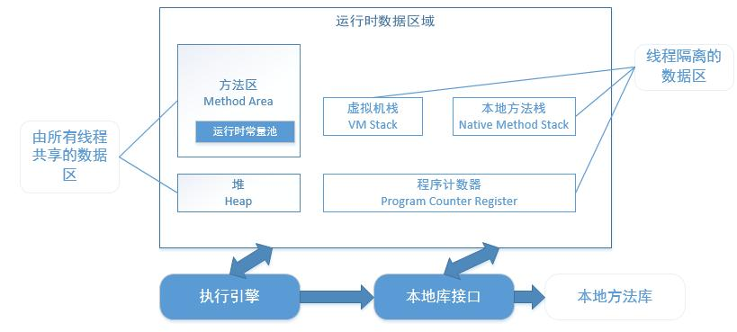
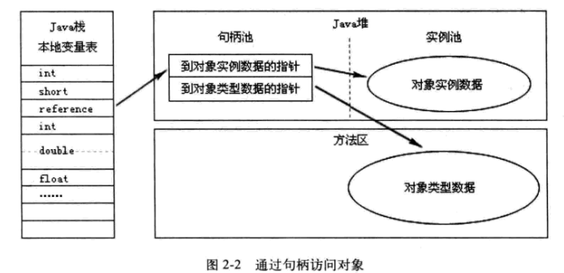
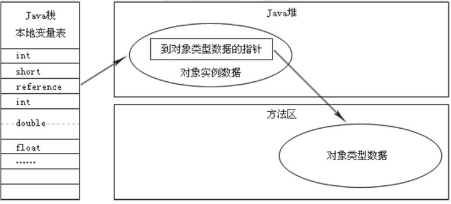
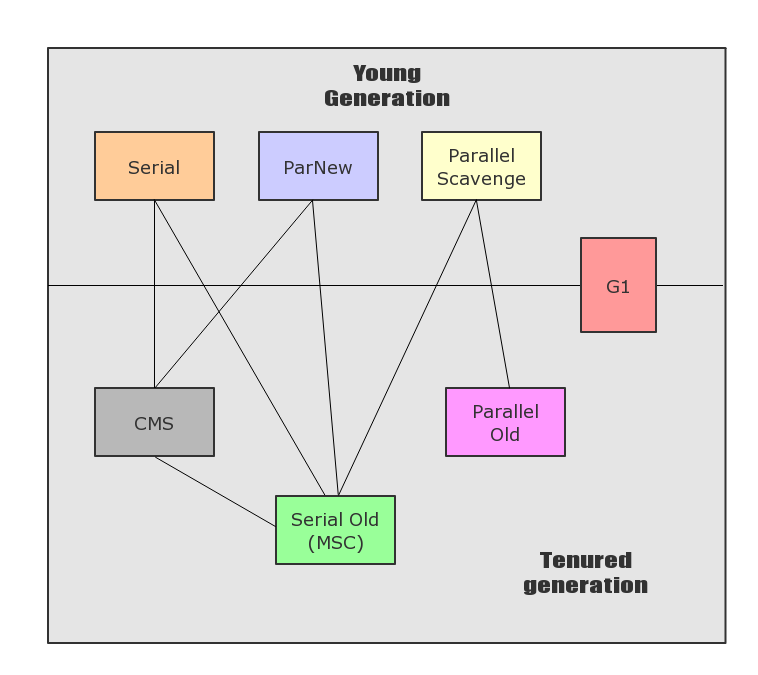
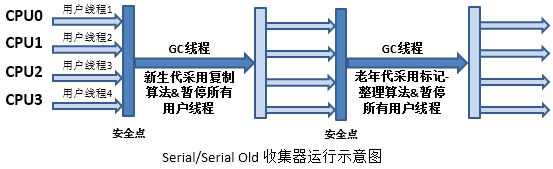
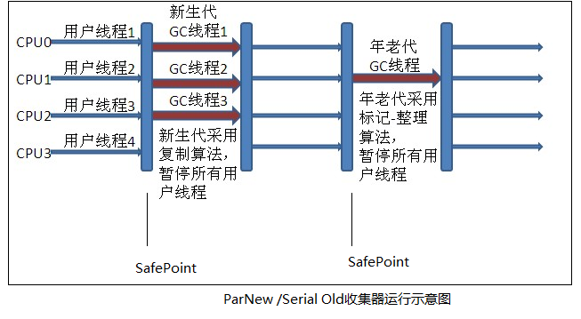
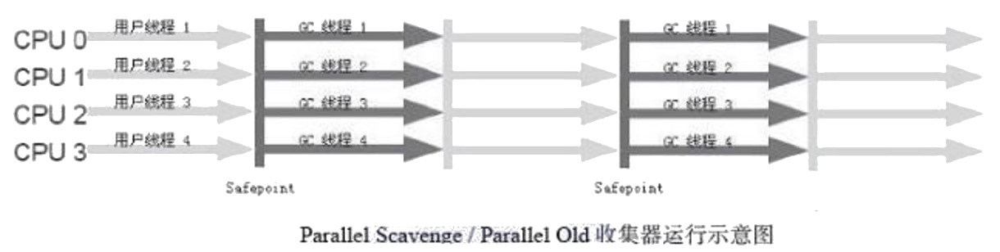
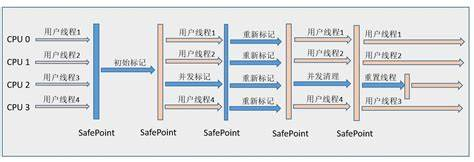
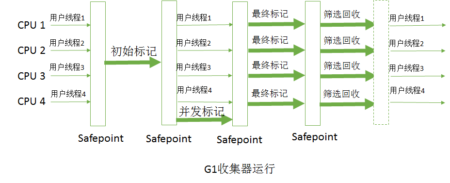

# 1_2自动内存管理机制

**第一部分： 第一章：走近java**

两个概念

准确式内存管理：即虚拟机可以知道内存中某个位置的数据具体是什么类型。

Java技术的未来：混合编程，能运行在java虚拟机上的语言数量在迅速膨胀，（jython）；

---

**第二部分：自动内存管理机制**

**第二章：java内存区域与内存溢出异常**

2.1运行时数据区：

根据《java虚拟机规范》的规定，java虚拟机所管理的内存将会包括 5 个运行时数据区域。

* **方法区（Method Area）**、

* **堆（Heap）**、

* **虚拟机栈（VM Stack)**、

* **本地方法栈（Native Method Stack）**、

* **程序计数器（Program Counter Register）**。

**2.1.1程序计数器（Program Counter Register）：**

* 一块较小的内存空间， 在虚拟机概念模型里（仅概念模型） ，字节码解释器过改变这个计数器的值来选取下一条需要执行的字节码指令。

* 每条线程都需要有一个独立的程序计数器， 各条线程之间计数器互不影响， 独立存储，称为“线程私有”的内存。

* 如果线程正在执行一个Java方法， 记录的是正在执行的字节码指令地址；如果是Native方法， 计数器值为空（Undefined） 。

* 此内存区域是唯一一个在Java虚拟机规范中没有规定任何OutOfMemoryError情况的区域。

**2.1.2Java虚拟机栈(Java Virtual Machine Stack）**

* 线程私有，生命周期与线程相同。

* 是Java方法执行的内存模型：每个方法在执行的同时都会创建一个栈帧（Stack Frame[1]）用于存储**局部变量表、操作数栈、动态链接、方法出口**等信息。每个方法从调用直至执行完成的过程，对应着一个栈帧在虚拟机栈中入栈到出栈的过程。

* 在Java虚拟机规范中，规定了两种异常状况：如果线程请求的栈深度大于虚拟机所允许的深度，将抛出StackOverflowError异常；如果虚拟机栈可以动态扩展（大部分如此），且扩展时无法申请到足够的内存，抛OutOfMemoryError异常。

**2.1.3本地方法栈（Native Method Stack）**

* 与虚拟机栈作用相似，区别在于前者为执行Java方法（字节码）服务，本地方法栈为执行Native方法服务。

* 虚拟机规范对本地方法栈的实现没有强制规定，Sun HotSpot虚拟机直接把本地方法栈和虚拟机栈合而为一。会抛出StackOverflowError和OutOfMemoryError异常。

**2.1.4Java堆（Java Heap）**

* 是Java虚拟机所管理的内存中最大的一块。

* 所有线程共享，在虚拟机启动时创建。唯一目的就是存放对象实例，几乎所有的对象实例都在这里分配内存。这一点在Java虚拟机规范中的描述是：所有的对象实例以及数组都要在堆上分配[1]，但是随着JIT编译器的发展与逃逸分析技术逐渐成熟，栈上分配、标量替换[2]优化技术将会导致一些微妙的变化发生，所有的对象都分配在堆上也渐渐变得不是那么“绝对”了。

* 垃圾收集器管理的主要区域。**从内存回收的角度，现在收集器基本都采用分代收集算法，所以Java堆中还可以细分为：新生代和老年代；再细致一点的有Eden空间、From Survivor空间、To Survivor空间等。**

* 从内存分配的角度： **线程共享的Java堆中可能划分出多个线程私有的分配缓冲区（Thread Local Allocation Buffer,TLAB）**。进一步划分的目的是为了更好地回收内存，或者更快地分配内存。Java堆可以处于物理上不连续的内存空间中，只要逻辑上是连续的即可。实现上，既可以是固定大小的，也可以是可扩展的，当前主流的虚拟机都是按照可扩展来实现的（**通过-Xmx和-Xms控制**）。如果在堆中没有内存完成实例分配，并且堆也无法再扩展时，将会抛出OutOfMemoryError异常。

**2.1.5方法区（Method Area）**

* 线程共享，用于存储已被虚拟机加载的类信息、常量、静态变量、即时编译器编译后的代码等数据。物理内存可以不连续，可以选择固定或者可扩展大小。

* 垃圾收集行为在这个区域比较少出现但是必要，主要是针对常量池的回收和类型的卸载，。一般来说回收“成绩”难以令人满意，尤其是类型的卸载，条件相当苛刻---------

* Java虚拟机规范的规定，此区域可以选择不实现垃圾收集，当无法满足内存分配需求时，抛OutOfMemoryError异常。

**2.1.6运行时常量池**

方法区的一部分。Java虚拟机规范没有做任何细节的要求，一般来说：存放   

* Class文件常量池中的编译期生成的各种字面量和符号引用

* 翻译出来的直接引用。

* 运行期间也可能将新的常量放入池中，例：String类的intern（）方法。

是方法区的一部分，受方法区内存的限制，当常量池无法再申请到内存时抛OutOfMemoryError异常。

**2.1.7直接内存（Direct Memory）**

----不是虚拟机运行时数据区的一部分，也不是Java虚拟机规范中定义的内存区域。

**由来：**NIO（New Input/Output）类，引入了基于通道（Channel）与缓冲区（Buffer）的I/O方式，它可以使用Native函数库直接分配堆外内存，然后通过一个存储在Java堆中的DirectByteBuffer对象作为这块内存的引用进行操作。这些堆外内存称为直接内存。

**作用：**能在一些场景中显著提高性能，因为避免了在Java堆和Native堆中来回复制数据。本机直接内存的分配不受Java堆大小的限制，但是**会受到本机总内存**（包括RAM以及SWAP区或者分页文件）大小以及处理器寻址空间的限制。在配置虚拟机参数时，忽略直接内存，可能使得各个内存区域总和大于物理内存限制（包括物理的和操作系统级的限制），从而导致动态扩展时出现OutOfMemoryError异常

**2.2虚拟机对象探秘**

2.2.1对象的创建

虚拟机遇到一条new指令时，

1. 首先去在常量池中定位一个类的符号引用，并进行类加载验证。

2. 接下来为新生对象分配内存。（对象所需内存的大小在类加载完成后便可完全确定）为对象分配空间等同于把一块确定大小的内存从Java堆中划分出来。分配方式有  指针碰撞法  和空闲列表法。选择取决于堆是否规整

------当Java堆中内存规整，所有用过的内存都放在一边，空闲的内存放在另一边，中间一个指针作为分界点的指示器，分配内存就是把那个指针向空闲那边挪动与对象大小相等的一段距离，这种分配方式称为“指针碰撞”（Bump the Pointer）。

------如果Java堆内存不规整，已使用和空闲内存相互交错，虚拟机须维护一个列表，记录哪些内存块是可用的，在分配的时候找一块足够大的空间分给对象实例，并更新列表上的记录，这种分配方式称为“空闲列表”（Free List）。

------java堆是否规整又由所采用的垃圾收集器是否带有压缩整理功能决定。

在使用Serial、ParNew等带Compact过程的收集器时，系统采用的分配算法是指针碰撞，而使用CMS这种基于Mark-Sweep算法的收集器时，通常采用空闲列表。

1. 还有分配内存的线程安全问题。两种解决方案：

-------一种是对分配动作进行同步处理——实际上虚拟机采用**CAS配上失败重试**的方式保证更新操作的原子性；

-------另一种是把内存分配的动作按照线程划分在不同的空间之中进行，每个线程在Java堆中预先分配一小块内存，称为**本地线程分配缓冲（Thread Local Allocation Buffer,TLAB）**。哪个线程要分配内存，就在哪个线程的TLAB上分配，只有TLAB用完并分配新的TLAB时，才需要同步锁定。虚拟机是否使用TLAB，可以通过-XX：+/-UseTLAB参数来设定。

1.  内存分配完成后，虚拟机将分配到的**内存空间都初始化为零值**（不包括对象头），如果使用TLAB，这一工作过程也可以提前至TLAB分配时进行。这一步操作保证了对象的实例字段在Java代码中可以不赋初始值就直接使用，程序能访问到这些字段的数据类型所对应的零值。

2.  接下来，虚拟机要对对象进行必要的设置，例如这个对象是哪个类的实例、如何才能找到类的元数据信息、对象的哈希码、对象的GC分代年龄等信息。这些信息存放在对象的对象头（Object Header）之中。根据虚拟机当前的运行状态的不同，如是否启用偏向锁等，对象头会有不同的设置方式。关于对象头的具体内容，稍后再做详细介绍。

在上面工作都完成之后，从虚拟机的视角来看，一个新的对象已经产生了，但从Java程序的视角来看，对象创建才刚刚开始——＜init＞方法还没有执行，所有的字段都还为零。所以，一般来说（由字节码中是否跟随invokespecial指令所决定），执行new指令之后会接着执行＜init＞方法，把对象按照程序员的意愿进行初始化，这样一个真正可用的对象才算完全产生出来。

### 2.2.2对象的内存布局

在HotSpot虚拟机中，对象在内存中存储的布局可以分为3块区域：

**对象头（Header）**、**实例数据（Instance Data）**和**对齐填充（Padding）**。

**对象头**：HotSpot虚拟机的对象头包括两部分信息，

* 第一部分用于存储对象自身的运行时数据，如哈希码（HashCode）、GC分代年龄、锁状态标志、线程持有的锁、偏向线程ID、偏向时间戳等，官方称为“Mark Word”。Mark Word被设计成一个非固定的数据结构以便在极小的空间内存储尽量多的信息，它会根据对象的状态复用自己的存储空间。

* 对象头另外一部分是类型指针，即对象指向它的类元数据的指针，虚拟机通过这个指针来确定这个对象是哪个类的实例。如果对象是一个Java数组，那在对象头中还必须有一块用于记录数组长度的数据，因为虚拟机可以通过普通Java对象的元数据信息确定Java对象的大小，但是从数组的元数据中却无法确定数组的大小。

**实例数据**：接下来的实例数据部分是对象真正存储的有效信息，也是在程序代码中所定义的各种类型的字段内容。无论是从父类继承下来的，还是在子类中定义的，都需要记录起来。这部分的存储顺序会受到虚拟机分配策略参数（FieldsAllocationStyle）和字段在Java源码中定义顺序的影响。HotSpot虚拟机默认的分配策略为longs/doubles、ints、shorts/chars、bytes/booleans、oops（Ordinary Object Pointers），从分配策略中可以看出，相同宽度的字段总是被分配到一起。在满足这个前提条件的情况下，在父类中定义的变量会出现在子类之前。如果CompactFields参数值为true（默认为true），那么子类之中较窄的变量也可能

会插入到父类变量的空隙之中。

**第三部分对齐填充**并不是必然存在的，也没有特别的含义，它仅仅起着占位符的作用。由于HotSpot VM的自动内存管理系统要求对象起始地址必须是8字节的整数倍，换句话说，就是对象的大小必须是8字节的整倍。而对象头部分正好是8字节的倍数（1倍或者2倍），因此，当对象实例数据部分没有对齐时，就需要通过对齐填充来补全。

2.2.3 对象的访问定位

java程序通过栈上的reference数据来操作堆上的具体对象。目前主流的访问方式有使用句柄和直接指针两种。

* 使用句柄的访问：堆中将会划分出一块内存来作为句柄池，reference中存储的就是对象的句柄地址，而句柄中包含了对象实例数据与类型数据各自的具体地址信息

* 使用直接指针访问：那么Java堆对象的布局中就必须考虑如何放置访问类型数据的相关信息，而reference中存储的直接就是对象地址，

各有优势，

使用句柄reference中存储的是稳定的句柄地址，在对象被移动（垃圾收集时移动对象是非常普遍的行为）时只会改变句柄中的实例数据指针，而reference本身不需要修改。

使用直接指针访问速度快，它节省了一次指针定位的时间开销，由于对象的访问在Java中非常频繁，因此这类开销积少成多后也是一项非常可观的执行成本。就本书讨论的主要虚拟机Sun HotSpot而言，它是使用第二种方式进行对象访问的，但从整个软件开发的范围来看，各种语言和框架使用句柄来访问的情况也十分常见。

**2.3 实战：OutOfMemoryError异常**

### 2.3.1Java堆溢出

Java堆内存溢出时，异常堆栈信息“java.lang.OutOfMemoryError”会跟着进一步提示“Java heap space”。一般的手段是先通过内存映像分析工具（如Eclipse Memory Analyzer）对Dump出来的堆转储快照进行分析，重点是确认内存中的对象是否是必要的，也就是要先分清楚到底是出现了内存泄漏（Memory Leak）还是内存溢出（Memory Overflow）。

如果是内存泄露，可进一步通过工具查看泄露对象到GC Roots的引用链。于是就能找到泄露对象是通过怎样的路径与GC Roots相关联并导致垃圾收集器无法自动回收它们的。掌握了泄露对象的类型信息及GC Roots引用链的信息，就可以比较准确地定位出泄露代码的位置。

如果不存在泄露，换句话说，就是内存中的对象确实都还必须存活着，那就应当检查虚拟机的堆参数（-Xmx与-Xms），与机器物理内存对比看是否还可以调大，从代码上检查是否存在某些对象生命周期过长、持有状态时间过长的情况，尝试减少程序运行期的内存消耗。

### 2.3.2虚拟机栈和本地方法栈溢出

在单个线程下，无论是由于栈帧太大还是虚拟机栈容量太小，当内存无法分配的时候，虚拟机抛出的都是StackOverflowError异常

### 2.3.3方法区和运行时常量池溢出

由于运行时常量池是方法区的一部分，测试：String.intern（）是一个Native方法，它的作用是：如果字符串常量池中已经包含一个等于此String对象的字符串，则返回代表池中这个字符串的String对象；否则，将此String对象包含的字符串添加到常量池中，并且返回此String对象的引用。

方法区溢出也是一种常见的内存溢出异常，一个类要被垃圾收集器回收掉，判定条件是比较苛刻的。在经常动态生成大量Class的应用中，需要特别注意类的回收状况。这类场景除了上面提到的程序使用了CGLib字节码增强和动态语言之外，常见的还有：大量JSP或动态产生JSP文件的应用（JSP第一次运行时需要编译为Java类）、基于OSGi的应用（即使是同一个类文件，被不同的加载器加载也会视为不同的类）等。

### 2.3.4本机直接内存溢出

DirectMemory容量可通过-XX：MaxDirectMemorySize指定，如果不指定，则默认与Java堆最大值（-Xmx指定）一样，由DirectMemory导致的内存溢出，一个明显的特征是在Heap Dump文件中不会看见明显的异常，如果读者发现OOM之后Dump文件很小，而程序中又直接或间接使用了NIO，那就可以考虑检查一下是不是这方面的原因。

---

**第三章：垃圾收集器与内存分配策略**

哪些内存？什么时候？怎么回收？-------

**3.1对象是否死亡的判断**

**3.1.1 引用计数算法** ：给对象添加一个引用计数器，每当有一个地方引用它时，计数器值加一，引用失效时，计数器值减1，任何时刻计数器为0的对象就是不可能再被使用的。 优点是判定效率很高。但是在主流java虚拟机里没有选用，因为这种方法很难解决对象之间相互循环引用。

**3.1.2可达性分析算法 ：**主流商用程序语言 java C# 都是采用可达性分析来判定对象是否存活。 从GC Root开始向下搜索，所走过的路径称为引用链，所达到的对象都是可达对象，其余都是不可达对象， 可作为GC Root的对象包括四种

1. **虚拟机栈中引用的对象**

2. **方法区中类静态属性引用的对象**

3. **方法区中常量引用的对象**

4. **本地方法栈JNI（即一般说的Native方法）引用的对象**

 3.1.3再谈引用 强引用，软引用，弱引用，虚引用

为什么要分类？：判定对象是否存活都与引用有关，如果没有引用，那么就是垃圾，就要被回收，这样，内存中的对象要不就是还有引用，要不就是垃圾，但是我们希望描述这样一类对象，在内存还很充足的时候，希望它继续留在内存中，当内存空间在进行垃圾回收后还是很紧张，则抛弃这些对象。 很多系统的缓存功能都符合这样的场景。

1. 强引用：就是代码中普遍存在的引用，只要强引用还在，被引用的对象永远不会被回收。

2. 软引用：描述还有用但并非必须的对象，对于软引用关联着的对象，在系统将要发生内存溢出异常之前，将会把这些对象列入回收范围进行第二次回收。如果这次回收还没有足够内存，就抛OOM异常。SoftReference类来实现软引用。

3. 弱引用： 也是用来描述非必须对象，但是它的强度更弱，被弱引用关联的对象只能生存到下一次垃圾收集发生之前。通过WeakReference类来实现

4. 虚引用： 也成为幽灵引用或幻影引用，是最弱的一种引用关系，一个对象有无徐引用的存在，不会对其生存时间有任何影响，为一个对象设置一个虚引用的唯一目的就是能在这个对象被收集器回首时受到一个系统通知。 PhantomReference类来实现。

**3.1.4存还是死亡（宣告对象死亡的过程）**

**在可达性分析算法中不可达的对象也并非是非死不可**，宣告一个对象死亡需要至少两次的标记过程：

1. 在可达性分析后对于没有引用链相关联的对象被第一次标记，然后进行第一次筛选： 只有已经覆盖过Finalize()方法，且finalize（）方法尚未被虚拟机调用过的对象，虚拟机去触发他们的finalize（）方法。这些对象被放置在F-Queue队列中，并在稍后由一个虚拟机自动建立的、低优先级的Finalizer线程去触发它。

2. 触发完之后，GC 对F-Queue中的对象进行小规模的第二次标记，如果在finalize（）方法中成功和引用链上的对象建立关联，即可成功拯救自己，不然则真的被回收掉。所以finalize（）方法是对象逃脱死亡的最后一次机会。且这种方法只会奏效一次，因为一个对象的finalize（）方法最多只会被系统自调用一次。

finalize（）方法说了半天，这个方法已经再尽量避免使用，这个方法不确定性大，无法保证各个对象调用的顺序，finalize（）方法能做的所有工作使用try-finallly或者其他方式都可以做的更好，因此笔者建议可以完全忘掉这个方法。

**回收方法区**：**在这里主要回收两部分内容 废弃常量和无用类**。废弃常量的判断与java堆中的对象类似，判断无用类则比较苛刻，满足下面条件才可以被回收，  Xnoclassgc参数控制是否回收。 在大量使用反射，动态代理，CGLib等ByteCode框架，动态生成jsp以及OSGi这类频繁自定义ClassLoader场景需要具备类卸载功能。

* **！该类所有的实例都已经被回收，**

* **！加载该类的ClassLoader已经被回收**

* **！该类对应的java.lang.Class对象没有在任何地方被引用，无法在任何地方通过反射访问该类的方法**。

**3.2 垃圾回收算法**

**3.2.1  标记清除算法**，最基础的算法，两个不足：一是标记和清除的效率都不高，二是标记清除之后会产生大量不连续的内存碎片。

**3.2.2  复制算法：**为了解决效率问题，将可用内存分为i两块，每次只使用其中一块，但这一块内存用完了，就把还存活的对象复制到另外一块上面，然后在把使用过的一块全部清除。优点简单高效，缺点：将可用内存缩小了，在对象存活率较高的时候需要进行较多的复制操作，效率降低。现在商用虚拟机都是采用这种收集算法回收新生代。因为新生代中98%的对象是朝生夕死，因此新生代内存划分为Eden Fromsurvivor  Tosurvivor 8:1:1  划分成三块，保证每次都是可以用复制算法，如果两块的话，survivor区没法用复制算法。这样只有10%的内存浪费，又因为98%是一般场景下的数据，一次需要内存分配担保（老年代）。

**3.2.3  标记-整理算法******标记操作完成后，所有存活的对象向一端移动。然后清理掉边界以外的内存。

**   3.2.4  分代收集算法**：当前的商业虚拟机都使用“分代收集”算法。新生代采用复制算法，因为每次存活量少，复制代价小，且有老年代作为内存担保。 老年代采用标记-清除  或 标记-整理算法，因为对象存活率高且五额外空间对它进行内存分配担保。

**3.3 HotSpot的算法实现**

**3.3.1****枚举根结点****** 因为**进行可达性分析这个过程必须在一个能确保一致性的快照中进行**，意指不能在分析过程中对象引用关系还在不断变化。这点是导致Stop The World的原因. 目前主流虚拟机使用准确式GC（虚拟机知道在内存中某个为主存放的数据类型）在HotSpot中，使用一组成为**OopMap**的数据结构来达到这个目的，在类加载的时候，HopSpot就把对象内什么偏移量上是什么类型的数据计算出来，在JIT编译过程中也会在特定的位置上记录下栈和寄存器中哪些位置是引用，这样GC在扫描时就可以直接得知这些信息了。减少可达性分析的过程。

**3.3.2 安全点 Safepoint** 有了OopMap的协助可以快速完成GC Root枚举，但程序仍然不是在任何地方都可以停下来开始GC，只有在安全点 Safepoint 才能暂停。SafePoint太多则过分增大运行时负荷，太少则GC要等待的时间变长。“长时间执行”的指令（循环跳转，异常跳转，方法调用）适合作为安全点。

    至于怎样让线程跑到安全点停下来，两种方法，抢先式中断和主动式中断，抢先式中断不需要线程的执行代码主动配合，就直接把你停下来，然后让没有执行到安全点的线程走到安全点，现在几乎没有虚拟机采用这种方式

   主动式中断是GC 需要中断时，不直接对线程操作，仅仅简单设置一个标志，各个线程在执行时主动轮询这个标志，发现标志为真的时候就自己中断挂起，轮询标志的地方和安全点时重合的，

**3.3.3 安全区域，SafeRegion**。安全点保证了线程可以在不太长的时间内走到安全点，但是如果程序不执行（如sleep）则无法走到安全点，则无法相应中断，于是引入安全区：在一段代码中，引用关系不会发生变化，在这段区域中从任意地方开始GC 都是安全的。

**3.4垃圾收集器**

**3.4.1 Serial 收集器**

    Serial收集器是最基本、发展历史最悠久的收集器，这个收集器是一个单线程的收集器，只会使用一个CPU或一条收集线程去完成垃圾收集工作，它进行垃圾收集时，必须暂停其他所有的工作线程，直到它收集结束。“Stop The World”　 

**优点：简单高效**（与其他收集器的单线程比），对于限定单个CPU的环境来说，Serial收集器由于没有

线程交互的开销，专心做垃圾收集自然可以获得最高的单线程收集效率。在用户的桌面应用场景中，分

配给虚拟机管理的内存一般来说不会很大，收集几十兆甚至一两百兆的新生代（仅仅是新生代使用的内

存，桌面应用基本上不会再大了），停顿时间完全可以控制在几十毫秒最多一百多毫秒以内，只要不是

频繁发生，这点停顿是可以接受的。所以，Serial收集器对于运行在Client模式下的虚拟机来说是一个很

好的选择。

---

**3.4.2 ParNew收集器**

ParNew收集器其实就是Serial收集器的多线程版本，除了使用多条线程进行垃圾收集之外，其余行为

包括Serial收集器可用的所有控制参数（例如：-XX：SurvivorRatio、-XX：PretenureSizeThreshold、-

XX：HandlePromotionFailure等）、收集算法、Stop The World、对象分配规则、回收策略等都与Serial收集器完全一样，在实现上，这两种收集器也共用了相当多的代码。ParNew收集器的工作过程如图3-7所

示。

ParNew收集器除了多线程收集之外，其他与Serial收集器相比并没有太多创新之处，但它却是许多运行在Server模式下的虚拟机中首选的新生代收集器，其中有一个与性能无关但很重要的原因是，**除了Serial收集器外，目前只有它能与CMS收集器配合工作**。CMS作为老年代的收集器，却无法与JDK 1.4.0中已经存在的新生代收集器Parallel Scavenge配合工作，所以在JDK 1.5中使用CMS来收集老年代的时候，新生代只能选择ParNew或者Serial收集器中的一个。ParNew收集器也是使用-XX：+UseConcMarkSweepGC选项后的默认新生代收集器，也可以使用-XX：+UseParNewGC选项来强制指定它。

**ParNew收集器在单CPU的环境中绝对不会有比Serial收集器更好的效果，甚至由于存在线程交互的开**

**销，该收集器在通过超线程技术实现的两个CPU的环境中都不能百分之百地保证可以超越Serial收集器**。

当然，随着可以使用的CPU的数量的增加，它对于GC时系统资源的有效利用还是很有好处的。它默认开启的收集线程数与CPU的数量相同，在CPU非常多（譬如32个，现在CPU动辄就4核加超线程，服务器超过32个逻辑CPU的情况越来越多了）的环境下，可以使用-XX：ParallelGCThreads参数来限制垃圾收集的线程数。

**·并行（Parallel）**：指多条垃圾收集线程并行工作，但此时用户线程仍然处于等待状态。

**·****并发（Concurrent）**：指用户线程与垃圾收集线程同时执行（但不一定是并行的，可能会交替执

行），用户程序在继续运行，而垃圾收集程序运行于另一个CPU上

3.4.3Parallel Scavenge收集器

Parallel Scavenge收集器是一个新生代收集器，它也是使用复制算法的收集器，又是并行的多线程收

集器……看上去和ParNew都一样，那它有什么特别之处呢？

Parallel Scavenge收集器的特点是它的关注点与其他收集器不同，CMS等收集器的关注点是尽可能地

缩短垃圾收集时用户线程的停顿时间，而Parallel Scavenge收集器的目标则是达到一个可控制的吞吐量

（Throughput）。所谓吞吐量就是CPU用于运行用户代码的时间与CPU总消耗时间的比值，即吞吐量=运行用户代码时间/（运行用户代码时间+垃圾收集时间），虚拟机总共运行了100分钟，其中垃圾收集花掉

1分钟，那吞吐量就是99%。

停顿时间越短就越适合需要与用户交互的程序，良好的响应速度能提升用户体验，而高吞吐量则可以高效率地利用CPU时间，尽快完成程序的运算任务，主要适合在后台运算而不需要太多交互的任务。Parallel Scavenge收集器提供了两个参数用于精确控制吞吐量，分别是控制最大垃圾收集停顿时间的-XX：MaxGCPauseMillis参数以及直接设置吞吐量大小的-XX：GCTimeRatio参数。MaxGCPauseMillis参数允许的值是一个大于0的毫秒数，收集器将尽可能地保证内存回收花费的时间不超过设定值。不过大家不要认为如果把这个参数的值设置得稍小一点就能使得系统的垃圾收集速度变得更快，GC停顿时间缩短是以牺牲吞吐量和新生代空间来换取的：系统把新生代调小一些，收集300MB新生代肯定比收集500MB快吧，这也直接导致垃圾收集发生得更频繁一些，原来10秒收集一次、每次停顿100毫秒，现在变成5秒收集一次、每次停顿70毫秒。停顿时间的确在下降，但吞吐量也降下来了。

GCTimeRatio参数的值应当是一个大于0且小于100的整数，也就是垃圾收集时间占总时间的比率，相当于是吞吐量的倒数。如果把此参数设置为19，那允许的最大GC时间就占总时间的5%（即1/（1+19）），默认值为99，就是允许最大1%（即1/（1+99））的垃圾收集时间。由于与吞吐量关系密切，Parallel Scavenge收集器也经常称为“吞吐量优先”收集器。除上述两个参数之外，Parallel Scavenge收集器还有一个参数-XX：+UseAdaptiveSizePolicy值得关注。这是一个开关参数，当这个参数打开之后，就不需要手工指定新生代的大小（-Xmn）、Eden与Survivor区的比例（-XX：SurvivorRatio）、晋升老年代对象年龄（-XX：PretenureSizeThreshold）等细节参数了，虚拟机会根据当前系统的运行情况收集性能监控信息，动态调整这些参数以提供最合适的停顿时间或者最大的吞吐量，这种调节方式称为GC自适应的调节策略（GC Ergonomics）。如果读者对于收集器运作原来不太了解，手工优化存在困难的时候，使用Parallel Scavenge收集器配合自适应调节策略，把内存管理的调优任务交给虚拟机去完成将是一个不错的选择。只需要把基本的内存数据设置好（如-Xmx设置最大堆），然后使用MaxGCPauseMillis参数（更关注最大停顿时间）或GCTimeRatio（更关注吞吐量）参数给虚拟机设立一个优化目标，那具体细节参数的调节工作就由虚拟机完成了。自适应调节策略也是Parallel Scavenge收集器与ParNew收集器的一个重要区别。

3.4.4 Serial Old收集器

Serial Old是Serial收集器的老年代版本，它同样是一个单线程收集器，使用“标记-整理”算法。这个收集器的主要意义也是在于给Client模式下的虚拟机使用。如果在Server模式下，那么它主要还有两大用途：一种用途是在JDK 1.5以及之前的版本中与Parallel Scavenge收集器搭配使用，另一种用途就是作为CMS收集器的后备预案，在并发收集发生Concurrent Mode Failure时使用。这两点都将在后面的内容中详细讲解。Serial Old收集器的工作过程如图3-8所示。

3.4.5 Parallel Old收集器

Parallel Old是Parallel Scavenge收集器的老年代版本，使用多线程和“标记-整理”算法。这个收集器是

在JDK 1.6中才开始提供的，在此之前，新生代的Parallel Scavenge收集器一直处于比较尴尬的状态。原因

是，如果新生代选择了Parallel Scavenge收集器，老年代除了Serial Old（PS MarkSweep）收集器外别无选择（还记得上面说过Parallel Scavenge收集器无法与CMS收集器配合工作吗？）。由于老年代Serial Old收集器在服务端应用性能上的“拖累”，使用了Parallel Scavenge收集器也未必能在整体应用上获得吞吐量最

大化的效果，由于单线程的老年代收集中无法充分利用服务器多CPU的处理能力，在老年代很大而且硬

件比较高级的环境中，这种组合的吞吐量甚至还不一定有ParNew加CMS的组合“给力”。

直到Parallel Old收集器出现后，“吞吐量优先”收集器终于有了比较名副其实的应用组合，在注重吞吐量以及CPU资源敏感的场合，都可以优先考虑Parallel Scavenge加Parallel Old收集器。Parallel Old收集器的工作过程如图所示。

---

3.4.6 CMS（Concurrent Mark Sweep）收集器

是一种以获取最短回收停顿时间为目标的收集器。目前很大一部分的Java应用集中在互联网站或者B/S系统的服务端上，这类应用尤其重视服务的响应速度，希望系统停顿时间最短，以给用户带来较好的体验。CMS收集器就非常符合这类应用的需求。

从名字（包含“Mark Sweep”）上就可以看出，CMS收集器是基于“标记—清除”算法实现的，它的运作过程相对于前面几种收集器来说更复杂一些，整个过程分为4个步骤，包括：

* 初始标记（CMS initial mark）

* 并发标记（CMS concurrent mark）

* 重新标记（CMS remark）

* 并发清除（CMS concurrent sweep）

其中，初始标记、重新标记这两个步骤仍然需要“Stop The World”。初始标记仅仅只是标记一下GC

Roots能直接关联到的对象，速度很快，并发标记阶段就是进行GC RootsTracing的过程，而重新标记阶段

则是为了修正并发标记期间因用户程序继续运作而导致标记产生变动的那一部分对象的标记记录，这个

阶段的停顿时间一般会比初始标记阶段稍长一些，但远比并发标记的时间短。

**由于整个过程中耗时最长的并发标记和并发清除过程收集器线程都可以与用户线程一起工作**，所

以，从总体上来说，CMS收集器的内存回收过程是与用户线程一起并发执行的。通过下图可以比较清

楚地看到CMS收集器的运作步骤中并发和需要停顿的时间。

CMS是一款优秀的收集器，它的主要优点在名字上已经体现出来了：并发收集、低停顿，Sun公司的一些官方文档中也称之为并发低停顿收集器（Concurrent Low Pause Collector）。但是CMS还远达不到完美的程度，它有以下3个明显的缺点：

1. CMS收集器对CPU资源非常敏感。其实，面向并发设计的程序都对CPU资源比较敏感。在并发阶段，它虽然不会导致用户线程停顿，但是会因为占用了一部分线程（或者说CPU资源）而导致应用程序变慢，总吞吐量会降低。CMS默认启动的回收线程数是（CPU数量+3）/4，也就是当CPU在4个以上时，并发回收时垃圾收集线程不少于25%的CPU资源，并且随着CPU数量的增加而下降。但是当CPU不足4个（譬如2个）时，CMS对用户程序的影响就可能变得很大，如果本来CPU负载就比较大，还分出一半的运算能力去执行收集器线程，就可能导致用户程序的执行速度忽然降低了50%，其实也让人无法接受。为了应付这种情况，虚拟机提供了一种称为“增量式并发收集器”（Incremental Concurrent MarkSweep/i-CMS）的CMS收集器变种，所做的事情和单CPU年代PC机操作系统使用抢占式来模拟多任务机制的思想一样，就是在并发标记、清理的时候让GC线程、用户线程交替运行，尽量减少GC线程的独占资源的时间，这样整个垃圾收集的过程会更长，但对用户程序的影响就会显得少一些，也就是速度下降没有那么明显。实践证明，增量时的CMS收集器效果很一般，在目前版本中，i-CMS已经被声明为“deprecated”，即不再提倡用户使用。

2. CMS收集器无法处理浮动垃圾（Floating Garbage），可能出现“Concurrent Mode Failure”失败而导致另一次Full GC的产生。由于CMS并发清理阶段用户线程还在运行着，伴随程序运行自然就还会有新的垃圾不断产生，这一部分垃圾出现在标记过程之后，CMS无法在当次收集中处理掉它们，只好留待下一次GC时再清理掉。这一部分垃圾就称为“浮动垃圾”。也是由于在垃圾收集阶段用户线程还需要运行，那也就还需要预留有足够的内存空间给用户线程使用，因此CMS收集器不能像其他收集器那样等到老年代几乎完全被填满了再进行收集，需要预留一部分空间提供并发收集时的程序运作使用。在JDK 1.5的默认设置下，CMS收集器当老年代使用了68%的空间后就会被激活，这是一个偏保守的设置，如果在应用中老年代增长不是太快，可以适当调高参数-XX：CMSInitiatingOccupancyFraction的值来提高触发百分比，以便降低内存回收次数从而获取更好的性能，在JDK 1.6中，CMS收集器的启动阈值已经提升至92%。要是CMS运行期间预留的内存无法满足程序需要，就会出现一次“Concurrent Mode Failure”失败，这时虚拟机将启动后备预案：临时启用Serial Old收集器来重新进行老年代的垃圾收集，这样停顿时间就很长了。所以说参数-XX：CM SInitiatingOccupancyFraction设置得太高很容易导致大量“Concurrent ModeFailure”失败，性能反而降低。

3. CMS是一款基于“标记—清除”算法实现的收集器，如果读者对前面这种算法介绍还有印象的话，就可能想到这意味着收集结束时会有大量空间碎片产生。空间碎片过多时，将会给大对象分配带来很大麻烦，往往会出现老年代还有很大空间剩余，但是无法找到足够大的连续空间来分配当前对象，不得不提前触发一次Full GC。为了解决这个问题，CMS收集器提供了一个-XX：+UseCMSCompactAtFullCollection开关参数（默认就是开启的），用于在CMS收集器顶不住要进行FullGC时开启内存碎片的合并整理过程，内存整理的过程是无法并发的，空间碎片问题没有了，但停顿时间不得不变长。虚拟机设计者还提供了另外一个参数-XX：CMSFullGCsBeforeCompaction，这个参数是用于设置执行多少次不压缩的Full GC后，跟着来一次带压缩的（默认值为0，表示每次进入FullGC时都进行碎片整理）。

---

3.4.7 G1收集器

G1（Garbage-First）收集器是当今收集器技术发展的最前沿成果之一是一款面向服务端应用的垃圾收集器。HotSpot开发团队赋予它的使命是（在比较长期的）未来可以替换掉JDK 1.5中发布的CMS收集器。与其他GC收集器相比，G1具备如下特点。

* 并行与并发：G1能充分利用多CPU、多核环境下的硬件优势，使用多个CPU（CPU或者CPU核心）

来缩短Stop-The-World停顿的时间，部分其他收集器原本需要停顿Java线程执行的GC动作，G1收集器仍

然可以通过并发的方式让Java程序继续执行。

* 分代收集：与其他收集器一样，分代概念在G1中依然得以保留。虽然G1可以不需要其他收集器配

合就能独立管理整个GC堆，但它能够采用不同的方式去处理新创建的对象和已经存活了一段时间、熬过

多次GC的旧对象以获取更好的收集效果。

* 空间整合：与CMS的“标记—清理”算法不同，G1从整体来看是基于“标记—整理”算法实现的收集

器，从局部（两个Region之间）上来看是基于“复制”算法实现的，但无论如何，这两种算法都意味着G1

运作期间不会产生内存空间碎片，收集后能提供规整的可用内存。这种特性有利于程序长时间运行，分

配大对象时不会因为无法找到连续内存空间而提前触发下一次GC。

* 可预测的停顿：这是G1相对于CMS的另一大优势，降低停顿时间是G1和CMS共同的关注点，但G1

除了追求低停顿外，还能建立可预测的停顿时间模型，能让使用者明确指定在一个长度为M毫秒的时间片段内，消耗在垃圾收集上的时间不得超过N毫秒，这几乎已经是实时Java（RTSJ）的垃圾收集器的特征了。

使用G1收集器时，Java堆的内存布局就与其他收集器有很大差别，它将整个Java堆划分为多个大小相等的独立区域（Region），虽然还保留有新生代和老年代的概念，但新生代和老年代不再是物理隔离的了，它们都是一部分Region（不需要连续）的集合。

G1收集器之所以能建立可预测的停顿时间模型，是因为它可以有计划地避免在整个Java堆中进行全区域的垃圾收集。G1跟踪各个Region里面的垃圾堆积的价值大小（回收所获得的空间大小以及回收所需时间的经验值），在后台维护一个优先列表，每次根据允许的收集时间，优先回收价值最大的Region（这也就是Garbage-First名称的来由）。这种使用Region划分内存空间以及有优先级的区域回收方式，保证了G1收集器在有限的时间内可以获取尽可能高的收集效率。

在G1收集器中，Region之间的对象引用以及其他收集器中的新生代与老年代之间的对象引用，虚拟机都是使用Remembered Set来避免全堆扫描的。G1中每个Region都有一个与之对应的Remembered Set，虚拟机发现程序在对Reference类型的数据进行写操作时，会产生一个Write Barrier暂时中断写操作，检查

Reference引用的对象是否处于不同的Region之中（在分代的例子中就是检查是否老年代中的对象引用了新生代中的对象），如果是，便通过CardTable把相关引用信息记录到被引用对象所属的Region的Remembered Set之中。当进行内存回收时，在GC根节点的枚举范围中加入Remembered Set即可保证不对全堆扫描也不会有遗漏。

如果不计算维护Remembered Set的操作，G1收集器的运作大致可划分为以下几个步骤：

1. 初始标记（Initial Marking）

2. 并发标记（Concurrent Marking）

3. 最终标记（Final Marking）

4. 筛选回收（Live Data Counting and Evacuation）

对CMS收集器运作过程熟悉的读者，一定已经发现G1的前几个步骤的运作过程和CMS有很多相似之处。初始标记阶段仅仅只是标记一下GC Roots能直接关联到的对象，并且修改TAMS（Next Top at Mark Start）的值，让下一阶段用户程序并发运行时，能在正确可用的Region中创建新对象，这阶段需要停顿线程，但耗时很短。并发标记阶段是从GC Root开始对堆中对象进行可达性分析，找出存活的对象，这阶段耗时较长，但可与用户程序并发执行。而最终标记阶段则是为了修正在并发标记期间因用户程序继续运作而导致标记产生变动的那一部分标记记录，虚拟机将这段时间对象变化记录在线程Remembered Set Logs里面，最终标记阶段需要把Remembered Set Logs的数据合并到Remembered Set中，这阶段需要停顿线程，但是可并行执行。最后在筛选回收阶段首先对各个Region的回收价值和成本进行排序，根据用户所期望的GC停顿时间来制定回收计划，从Sun公司透露出来的信息来看，这个阶段其实也可以做到与用户程序一起并发执行，但是因为只回收一部分Region，时间是用户可控制的，而且停顿用户线程将大幅提高收集效率。通过图3-11可以比较清楚地看到G1收集器的运作步骤中并发和需要停顿的阶段。

如果你现在采用的收集器没有出现问题，

那就没有任何理由现在去选择G1，如果你的应用追求低停顿，那G1现在已经可以作为一个可尝试的选

择，如果你的应用追求吞吐量，那G1并不会为你带来什么特别的好处”

---

**3.5内存分配与回收策略：**

1. 对象优先在Eden分配

2. 大对象直接进入老年代，大对象对虚拟机来的内存分配来说hi一个坏消息，（更坏的的是一群朝生夕灭的大对象，写程序的时候应当避免）

3. 长期存活的对象直接进入老年代：虚拟机给每个对象定义一个对象年龄计数器，在熬过第一次minor GC，并移入sruvivor区之后，年龄设置为1，此后每熬过一次minor GC后年龄加一，当年龄到达一定程度（默认15，可以调节）置入老年代。

4. 动态对象年龄判定，并不是永远地要求对象的年龄必须达到最大年龄才能晋升老年代，如果在Survivor空间中相同年龄所有对象大小的总和大于Survivor空间的一半，年龄大于或等于该年龄的对象就可以直接进入老年代，无须等到MaxTenuringThreshold中要求的年龄--最大年龄

5. 空间分配担保，在发生Minor GC之前，虚拟机会先检查老年代最大可用的连续空间是否大于新生代所有对象总空间，如果这个条件成立，那么Minor GC可以确保是安全的。如果不成立，则虚拟机会查看HandlePromotionFailure设置值是否允许担保失败。如果允许，那么会继续检查老年代最大可用的连续空间是否大于历次晋升到老年代对象的平均大小，如果大于，将尝试着进行一次Minor GC，尽管这次Minor GC是有风险的；如果小于，或者HandlePromotionFailure设置不允许冒险，那这时也要改为进行一次Full GC。如果出现了HandlePromotionFailure失败，那就只好在失败后重新发起一次Full GC。虽然担保失败时绕的圈子是最大的，但大部分情况下都还是会将HandlePromotionFailure开关打开，避免Full GC过于频繁

---

**第四章：虚拟机性能监控与故障处理工具**

4.1JDK 命令行工具（Java实现，为了跨平台）：jps, jinfo, jmap, jhat, jstack, HSDIS

jsp：显示指定系统内所有hotspot虚拟机进程 和进程id

常用可以啥都不加， jps -v 输出虚拟机进程启动时jvm参数

jstat：用于收集hotspot虚拟机啊各方面的运行数据。

jstat -gc\-class  进程id

jinfo：实时查看和调整虚拟机各项参数

jmap：内存映像工具 jmap -heap 进程id 显示堆详细信息。

jhat：使用jhat 配合jmap，分析dump文件，实际工作中除非真的没有别的工具可用，

jstack：生成当前时刻的线程快照，用来定位线程出现长时间停顿的原因，查看和分析没有相应的线程到底在后台做什么。

HSDIS：是一个Sun官方推荐的HotSpot虚拟机JIT编译代码的反汇编插件，它包含在HotSpot虚拟机的源码之中，但没有提供编译后的程序

**

**

**4.2JDK 可视化工具：**

JConsole（监视与管理控制台）：JDK/bin目录下的一个应用工具

VisualVM（多合一故障处理工具）：JDK/bin目录下的一个执行脚本

---

**第五章 调优案例分析与实践**
