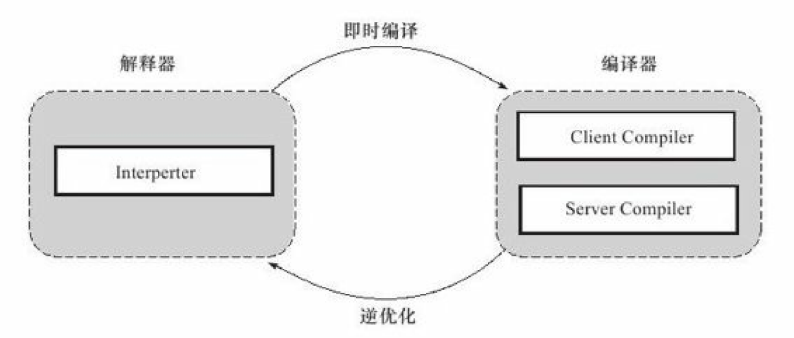
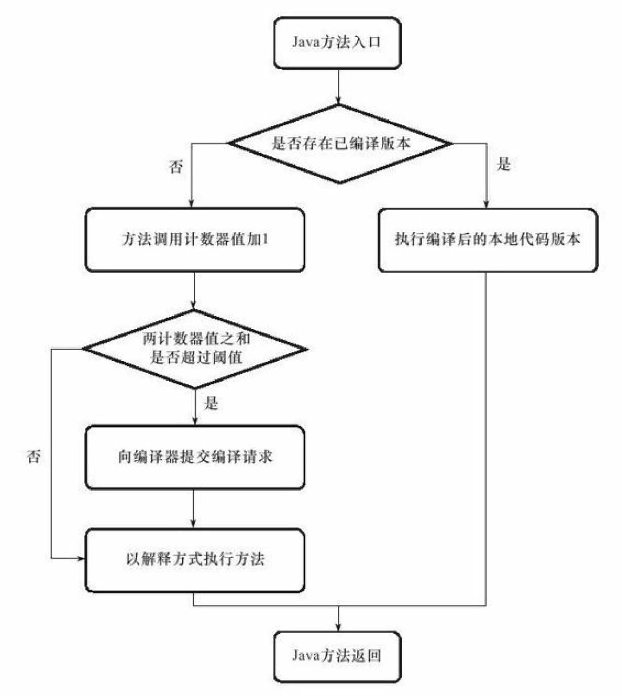
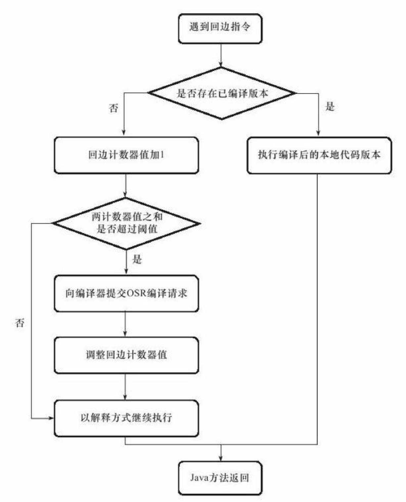

# JVM-第4部分-程序编译与代码优化

第10章 早期（编译期）优化

概述

Java语言的“编译期”其实是一段“不确定”的操作过程

* 它可能是指一个前端编译器（其实叫“编译器的前端”更准确一些）把*.java文件转变成*.class文件的过程---前端编译器：Sun的Javac

* 也可能是指虚拟机的后端运行期编译器（JIT编译器，Just In Time Compiler）把字节码转变成机器码的过程---JIT编译器：HotSpot VM的C1、C2编译器。

* 还可能是指使用静态提前编译器（AOT编译器，Ahead Of Time Compiler）直接把*.java文件编译成本地机器代码的过程。-----AOT编译器：GNU Compiler for the Java（GCJ）

Javac这类编译器对代码的运行效率几乎没有任何优化措施，这样可以让那些不是由Javac产生的Class文件（如JRuby、Groovy等语言的Class文件）也同样能享受到编译器优化所带来的好处。相当多新生的Java语法特性，都是靠编译器的“语法糖”来实现，而不是依赖虚拟机的底层改进来支持，可以说，Java中即时编译器在运行期的优化过程对于程序运行来说更重要，而前端编译器在编译期的优化过程对于程序编码来说关系更加密切

---

javac是一个由java语言编写的程序。

---

3.Java语法糖

3.1 泛型与类型擦除 

泛型的本质是参数化类型的应用，所操作的数据类型被指定为一个参数，这种参数可以用在类、接口、和方法的创建中，分别称为泛型类、泛型接口、泛型方法。

C#中的泛型是一种真泛型，java语言中的泛型则是 只在程序源码中存在，在编译后的字节码中，就已经替换为原来的原生类型了，并且在相应的地方加入了强制类型转换代码。对于运行期的Java语言来说ArrayList<String> 和ArrayList<Integer>是同一个类，所以泛型技术实际上是Java语言的一颗语法糖，Java语言中的泛型实现方法称为类型擦除，基于这种方法实现的泛型称为伪泛型。

---

当泛型遇见重载1

public class GenericTypes {

    public static void method（List＜String＞list）{

        System.out.println（"invoke method（List＜String＞list）"）；

    }

    public static void method（List＜Integer＞list）{

        System.out.println（"invoke method（List＜Integer＞list）"）；

    }

}

这段代码不能被编译，因为参数List＜Integer＞和List＜String＞编译之后都被擦除了，变成了一样的原生类型List＜E＞，擦除动作导致这两种方法的特征签名变得一模一样。

但是只能说，泛型擦除成相同的原生类型只是无法重载的其中一部分原因，当泛型遇见重载2

public class GenericTypes {

    public static String method（List＜String＞list）{

        System.out.println（"invoke method（List＜String＞list）"）；

        return ""；

    }

    public static int method（List＜Integer＞list）{

        System.out.println（"invoke method（List＜Integer＞list）"）；

        return 1；

    }

    public static void main（String[] args）{

        method（new ArrayList＜String＞（））；

        method（new ArrayList＜Integer＞（））；

    }

}

/*

执行结果：

        invoke method（List＜String＞list）

        invoke method（List＜Integer＞list）*/

Java语言中返回值不参与重载选择

之所以这次能编译和执行成功，是因为两个method（）方法加入了不同的返回值后才能共存在一个Class文件之中。在Class文件格式之中，只要描述符不是完全一致的两个方法就可以共存。也就是说，两个方法如果有相同的名称和特征签名，但返回值不同，那它们也是可以合法地共存于一个Class文件中的。

从Signature属性的出现我们还可以得出结论，擦除法所谓的擦除，仅仅是对方法的Code属性中的字节码进行擦除，实际上元数据中还是保留了泛型信息，这也是我们能通过反射手段取得参数化类型的根本依据。

其他语法糖：自动装箱/拆箱/遍历循环/条件编译

---

第11章 晚期（运行期）优化

2.hotspot虚拟机内的即时编译器

2.1解释器与编译器

部分的商用虚拟机（Sun HotSpot、IBM J9）中，Java程序最初是通过解释器（Interpreter）进行解释执行的，当虚拟机发现某个方法或代码块的运行特别频繁时，就会把这些代码认定为“热点代码”（Hot Spot Code），虚拟机将会把这些代码编译成与本地平台相关的机器码，并进行各种层次的优化，完成这个任务的编译器称为即时编译器（Just In Time Compiler，简称JIT编译器）。

解释器与编译器两者各有优势：

1.解释器：可以省去编译时间让程序迅速启动和执行；在嵌入式系统等内存资源限制较大的环境中可以用解释执行节约内存；可以作为编译器“激进优化”的逃生门。

2.编译器：把热点代码编译成本地代码之后获取更高的执行效率。可以对字节码进行编译优化。

在整个虚拟机执行架构中，解释器与编译器经常配合工作

HotSpot虚拟机中内置了两个即时编译器:

Client Compiler和Server Compiler，或者简称为：C1编译器和C2编译器

HotSpot虚拟机中，默认采用解释器与其中一个编译器直接配合的方式工作，程序使用的编译器是Client Compiler还是Server Compiler，取决于虚拟机运行的是client还是sever模式；不管哪种，解释器与编译器搭配使用的方式在虚拟机中称为“混合模式”（Mixed Mode）

为了在程序启动响应速度与运行效率之间达到最佳平衡，HotSpot虚拟机还会逐渐启用分层编译（Tiered Compilation）的策略，分层编译根据编译器编译、优化的规模与耗时，划分出不同的编译层次，其中包括：

1. 第0层，程序解释执行，解释器不开启性能监控功能（Profiling），可触发第1层编译。

2. 第1层，也称为C1编译，将字节码编译为本地代码，进行简单、可靠的优化，如有必要将加入性能监控的逻辑。

3. 第2层（或2层以上），也称为C2编译，也是将字节码编译为本地代码，但是会启用一些编译耗时较长的优化，甚至会根据性能监控信息进行一些不可靠的激进优化。

实施分层编译后，Client Compiler和Server Compiler将会同时工作，许多代码都可能会被多次编译，用Client Compiler获取更高的编译速度，用Server Compiler来获取更好的编译质量，在解释执行的时候也

无须再承担收集性能监控信息的任务。

---

**2.2编译对象与触发条件**

在运行过程中会被即时编译器编译的“热点代码”有两类，即：

1. **被多次调用的方法**。 一个方法被调用得多了，方法体内代码执行的次数自然就多，成为“热点代码”。以整个方法作为编译对象。是虚拟机中标准的JIT编译方式。

2. **被多次执行的循环体**。一个方法只被调用过一次或少量的几次，但是方法体内部存在循环次数较多的循环体，也认为是“热点代码”。依然以整个方法作为编译对象。这种编译方式因为编译发生在方法执行过程之中，因此形象地称之为栈上替换（On Stack Replacement，简称为OSR编译，即方法栈帧还在栈上，方法就被替换了）。

**热点探测（Hot Spot Detection）**：判断一段代码是不是热点代码，目前主要的热点探测判定方式有两种

1. **基于采样的热点探测（Sample Based Hot Spot Detection）**：虚拟机周期性地检查各个线程的栈顶，如果发现某个方法经常出现在栈顶，那这个方法就是“热点方法”。**好处**是实现简单、高效，还可以很容易地获取方法调用关系（将调用堆栈展开即可），**缺点**是很难精确地确认一个方法的热度，容易因为受到线程阻塞或别的外界因素的影响而扰乱热点探测。

2. **基于计数器的热点探测（Counter Based Hot Spot Detection）**：虚拟机会为每个方法（甚至是代码块）建立计数器，统计方法的执行次数，如果执行次数超过一定的阈值就认为它是“热点方法”。   **缺点**：统计方法实现起来麻烦一些，需要为每个方法建立并维护计数器，且不能直接获取到方法的调用关系，**优点**：统计结果相对来说更加精确和严谨。

在HotSpot虚拟机中使用的是第二种——基于计数器的热点探测方法它为每个方法准备了两类计数器：

* **方法调用计数器（Invocation Counter）**

* **回边计数器（Back Edge Counter）**

方法调用计数器。

用于统计方法被调用的次数，默认阈值Client模式下1500次，Server模式下10 000次，可以设置。方法调用计数器统计的不是方法被调用的绝对次数，而是一个相对的执行频率，即一段时间之内方法被调用的次数。统计过程中有一个热度衰减的动作。：（当超过一定的时间限度，如果方法的调用次数仍然不足以让它提交给即时编译器编译，那这个方法的调用计数器就会被减少一半，可以关闭和设置若关闭，可以想见一段时期后全编译了）

1. 检查是否有JIT编译过的版本。当一个方法被调用时，会先检查该方法是否存在被JIT编译过的版本，有，则优先使用编译后的本地代码来执行。无则第2步：

2. 此方法的调用计数器加1。将此方法的调用计数器值加1，然后判断方法调用计数器与回边计数器值**之和**是否超过方法调用计数器的阈值。

3. 如果已超过阈值，那么将会向即时编译器提交一个该方法的代码编译请求。默认情况下执行引擎不等待编译请求完成，而是继续进入解释器按照解释方式执行字节码，直到提交的请求被编译器编译完成（可设置）。编译工作完成之后，这个方法的调用入口地址就会被系统自动改写成新的，下一次调用该方法时就会使用已编译的版本。

整个JIT编译的交互过程如图

回边计数器。

统计一个方法中循环体代码执行的次数。在字节码中遇到控制流向后跳转的指令称为“回边”（Back Edge）。关于回边计数器的阈值，有一个计算公式（记不住了，总之通过参数控制会计算出一个阈值）回边计数器没有计数热度衰减的过程，因此统计的就是该方法循环执行的绝对次数。当计数器溢出的时候，它还会把方法计数器的值也调整到溢出状态，这样下次再进入该方法的时候就会执行标准编译过程。

当解释器遇到一条回边指令时，

1. 会先查找将要执行的代码片段是否有已经编译好的版本，如果有，它将会优先执行已编译的代码，

2. 否则就把回边计数器的值加1，然后判断方法调用计数器与回边计数器值之和是否超过回边计数器的阈值。

3. 当超过阈值的时候，将会提交一个OSR编译请求，并且把回边计数器的值降低一些，以便继续在解释器中执循环，等待编译器输出编译结果，整个执行过程如图所示。

---

C1：Client Compiler来说，主要的关注点在于局部性的优化，而放弃了许多耗时较长的全局优化手段。

C2：Server Compiler则是专门面向服务端的典型应用并为服务端的性能配置特别调整过的编译器，也是一个充分优化过的高级编译器，它会执行几乎所有经典的优化动作。

* 无用代码消除（Dead Code Elimination）、

* 循环展开（Loop Unrolling）、

* 循环表达式外提（Loop Expression Hoisting）、

* 消除公共子表达式（Common Subexpression Elimination）、

* 常量传播（Constant Propagation）、

* 基本块重排序（Basic Block Reordering）等，

* 还有一些与Java语言特性密切相关的优化技术，如范围检查消除（Range Check Elimination）、空值检查消除（Null CheckElimination，

还可能根据解释器或Client Compiler提供的性能监控信息，进行一些不稳定的激进优化，如守护内联（Guarded Inlining）、分支频率预测（Branch Frequency Prediction）。

---

查看及分析即时编译结果 略

---

编译优化技术---简略

语言无关的经典优化技术之一：**公共子表达式消除。**

语言相关的经典优化技术之一：**数组范围检查消除**。

最重要的优化技术之一：**方法内联**。

最前沿的优化技术之一：**逃逸分析**。

逃逸分析

逃逸分析（Escape Analysis）是目前Java虚拟机中比较前沿的优化技术，它并不是直接优化代码的手段，而是为其他优化手段提供依据的分析技术。

**逃逸分析的基本行为就是分析对象动态作用域**：方法逃逸/线程逃逸

当变量（或者对象）在方法中被定义后，有可能会被其他方法或者线程所访问到，这种现象称作方法逃逸或线程逃逸。

如果能证明一个对象不会逃逸到方法或线程之外，也就是别的方法或线程无法通过任何途径访问到这个对象，则可能为这个变量进行一些高效的优化，

* 栈上分配（Stack Allocation）：如果确定一个对象不会逃逸出方法之外，那让这个对象在栈上分配内存，对象所占用的内存空间就可以随栈帧出栈而销毁。在一般应用中，不会逃逸的局部对象所占的比例很大，如果能使用栈上分配，那大量的对象就会随着方法的结束而自动销毁了，**垃圾收集系统的压力将会小很多。**

* 同步消除（Synchronization Elimination）：如果逃逸分析能够确定一个变量不会逃逸出线程，无法被其他线程访问，那这个变量的读写肯定就不会有竞争，对这个变量实施的同步措施也就可以消除掉。

* 标量替换（Scalar Replacement）：**标量（Scalar）是指一个数据已经无法再分解成更小的数据来表示了**，Java虚拟机中的原始数据类型（int、long等数值类型以及reference类型等）都不能再进一步分解，它们就可以称为标量。相对的，**如果一个数据可以继续分解，那它就称作聚合量（Aggregate）**，Java中的**对象就是最典型的聚合量**。**如果把一个Java对象拆散，根据程序访问的情况，将其使用到的成员变量恢复原始类型来访问就叫做标量替换**。如果逃逸分析证明一个对象不会被外部访问，并且这个对象可以被拆散的话，那程序真正执行的时候将可能不创建这个对象，而改为直接创建它的若干个被这个方法使用到的成员变量来代替。将对象拆分后，除了可以让对象的成员变量在栈上（栈上存储的数据，有很大的概率会被虚拟机分配至物理机器的高速寄存器中存储）分配和读写之外，还可以为后续进一步的优化手段创建条件。

尽管目前逃逸分析的技术仍不是十分成熟，但是它却是即时编译器优化技术的一个重要的发展方向，在今后的虚拟机中，逃逸分析技术肯定会支撑起一系列实用有效的优化技术

---

**Java与C++编译器对比**

哪种语言的性能更高，除了它们自身的API库实现得好坏以外，其余的比较就成了一场“拼编译器”和“拼输出代码质量”的游戏

Java虚拟机的即时编译器与C/C++的静态优化编译器相比，可能会由于下列这些原因而导致输出的本地代码有一些劣势（下面列举的也包括一些虚拟机执行子系统的性能劣势）：

* 第一，因为即时编译器运行占用的是用户程序的运行时间，具有很大的时间压力，它能提供的优化手段也严重受制于编译成本。如果编译速度不能达到要求，那用户将在启动程序或程序的某部分察觉到重大延迟，这点使得即时编译器不敢随便引入大规模的优化技术，而编译的时间成本在静态优化编译器中并不是主要的关注点。

* 第二，Java语言是动态的类型安全语言，这就意味着需要由虚拟机来确保程序不会违反语言语义或访问非结构化内存。从实现层面上看，这就意味着虚拟机必须频繁地进行动态检查，如实例方法访问时检查空指针、数组元素访问时检查上下界范围、类型转换时检查继承关系等。对于这类程序代码没有明确写出的检查行为，尽管编译器会努力进行优化，但是总体上仍然要消耗不少的运行时间。

* 第三，Java语言中虽然没有virtual关键字，但是使用虚方法的频率却远远大于C/C++语言，这意味着运行时对方法接收者进行多态选择的频率要远远大于C/C++语言，也意味着即时编译器在进行一些优化（如前面提到的方法内联）时的难度要远大于C/C++的静态优化编译器。

* 第四，Java语言是可以动态扩展的语言，运行时加载新的类可能改变程序类型的继承关系，这使得很多全局的优化都难以进行，因为编译器无法看见程序的全貌，许多全局的优化措施都只能以激进优化的方式来完成，编译器不得不时刻注意并随着类型的变化而在运行时撤销或重新进行一些优化。

* 第五，Java语言中对象的内存分配都是堆上进行的，只有方法中的局部变量才能在栈上分配。而C/C++的对象则有多种内存分配方式，既可能在堆上分配，又可能在栈上分配，如果可以在栈上分配线程私有的对象，将减轻内存回收的压力。另外，C/C++中主要由用户程序代码来回收分配的内存，这就不存在无用对象筛选的过程，因此效率上（仅指运行效率，排除了开发效率）也比垃圾收集机制要高。

Java语言的这些性能上的劣势都是为了换取开发效率上的优势而付出的代价，动态安全、动态扩展、垃圾回收这些“拖后腿”的特性都为Java语言的开发效率做出了很大贡献。

还有许多优化是Java的即时编译器能做而C/C++的静态优化编译器不能做或者不好做的。

它的动态性所带来的，由于C/C++编译器所有优化都在编译期完成，以运行期性能监控为基础的优化措施它都无法进行，如调用频率预测（Call Frequency Prediction）、分支频率预测（Branch Frequency Prediction）、裁剪未被选择的分支（Untaken Branch Pruning）等，这些都会成为Java语言独有的性能优势。
