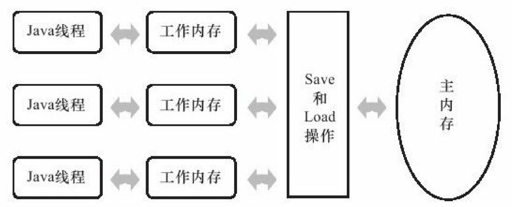

# JVM-第5部分-高效并发

**第12章 java内存模型与线程**

**内存模型**：在特定的操作协议下，对特定的内存或高速缓存进行读写访问的过程抽象

问题怎么来的？

1. 缓存一致性 问题（Cache Coherence）。在多处理器系统中，每个处理器都有自己的高速缓存，而它们又共享同一主内存（Main Memory）当多个处理器的运算任务都涉及同一块主内存区域时，将可能导致各自的缓存数据不一致为了解决一致性的问题，处理器硬件有一些他们的协议缓存一致性协议。

2. 乱序执行（Out-Of-Order Execution）优化，Java虚拟机的即时编译器中也有类似的指令重排序（Instruction Reorder）优化。

---

**Java内存模型**

Java虚拟机规范中试图定义一种**Java内存模型（Java Memory Model,JMM）来屏蔽掉各种硬件和操作系统的内存访问差异，以实现让Java程序在各种平台下都能达到一致的内存访问效果**。

**1.主内存和工作内存**

java内存模型规定了所有的变量都存储在主内存（Main Memory）中。每条线程还有自己的工作内存。线程的工作内存中保存了被该线程使用到的变量的主内存副本拷贝，线程对变量的所有操作（读取、赋值等）都必须在工作内存中进行，而不能直接读写主内存中的变量。不同的线程之间也无法直接访问对方工作内存中的变量，线程间变量值的传递均需要通过主内存来完成

**2.内存间的交互操作**

Java内存模型中定义了以下8种操作，虚拟机实现时必须保证下面提及的每一种操作都是原子的、不可再分的（double和long例外）

1. lock（锁定）：作用于主内存的变量，它把一个变量标识为一条线程独占的状态。

2. unlock（解锁）：作用于主内存的变量，它把一个处于锁定状态的变量释放出来，释放后的变量才可以被其他线程锁定。

3. read（读取）：作用于主内存的变量，它把一个变量的值从主内存传输到线程的工作内存中，以便随后的load动作使用。

4. load（载入）：作用于工作内存的变量，它把read操作从主内存中得到的变量值放入工作内存的变量副本中。

5. use（使用）：作用于工作内存的变量，它把工作内存中一个变量的值传递给执行引擎，每当虚拟机遇到一个需要使用到变量的值的字节码指令时将会执行这个操作。

6. assign（赋值）：作用于工作内存的变量，它把一个从执行引擎接收到的值赋给工作内存的变量，每当虚拟机遇到一个给变量赋值的字节码指令时执行这个操作。

7. store（存储）：作用于工作内存的变量，它把工作内存中一个变量的值传送到主内存中，以便随后的write操作使用。

8. write（写入）：作用于主内存的变量，它把store操作从工作内存中得到的变量的值放入主内存的变量中。

在执行上述8种基本操作时必须满足如下规则：

不允许read和load、store和write操作之一单独出现。

不允许一个线程丢弃它的最近的assign操作，即变量在工作内存中改变了之后必须把该变化同步回主内存。

不允许一个线程无原因地（没有发生过任何assign操作）把数据从线程的工作内存同步回主内存中。

一个新的变量只能在主内存中“诞生”，不允许在工作内存中直接使用一个未被初始化（load或assign）的变量，换句话说，就是对一个变量实施use、store操作之前，必须先执行过了assign和load操作。

一个变量在同一个时刻只允许一条线程对其进行lock操作，但lock操作可以被同一条线程重复执行多次，多次执行lock后，只有执行相同次数的unlock操作，变量才会被解锁。

如果对一个变量执行lock操作，那将会清空工作内存中此变量的值，在执行引擎使用这个变量前，需要重新执行load或assign操作初始化变量的值。

如果一个变量事先没有被lock操作锁定，那就不允许对它执行unlock操作，也不允许去unlock一个被其他线程锁定住的变量。

对一个变量执行unlock操作之前，必须先把此变量同步回主内存中（执行store、write操作）。

这8种内存访问操作以及上述规则限定，再加上稍后介绍的对volatile的一些特殊规定，就已经完全确定了Java程序中哪些内存访问操作在并发下是安全的。由于这种定义相当严谨但又十分烦琐，实践起来很麻烦，所以在12.3.6节中笔者将介绍这种定义的一个等效判断原则——先行发生原则，用来确定一个访问在并发环境下是否安全。

---

**3.对volatile型变量的特殊规则**

关键字volatile可以说是Java虚拟机提供的最轻量级的同步机制

当一个变量定义为volatile之后，它将具备两种特性：

第一是保证此变量对所有线程的可见性，这里的“可见性”是指当一条线程修改了这个变量的值，新值对于其他线程来说是可以立即得知的。而普通变量不能做到这一点，普通变量的值在线程间传递均需要通过主内存来完成，例如，线程A修改一个普通变量的值，然后向主内存进行回写，另外一条线程B在线程A回写完成了之后再从主内存进行读取操作，新变量值才会对线程B可见。

volatile变量在各个线程的工作内存中不存在一致性问题（在各个线程的工作内存中，volatile变量也可以存在不一致的情况，但由于每次使用之前都要先刷新，执行引擎看不到不一致的情况，因此可以认为不存在一致性问题），但是Java里面的运算并非原子操作，导致volatile变量的运算在并发下一样是不安全的

假设race被volatile修饰，但是race++在多线程下并不安全因为race++并不是院子操作（可能出现类似数据库丢失修改的冲突）

由于volatile变量只能保证可见性，在不符合以下两条规则的运算场景中，我们仍然要通过加锁（使用synchronized或java.util.concurrent中的原子类）来保证原子性。

1. 运算结果并不依赖变量的当前值，或者能够确保只有单一的线程修改变量的值。

2. 变量不需要与其他的状态变量共同参与不变约束。

使用volatile变量的第二个语义是禁止指令重排序优化，普通的变量仅仅会保证在该方法的执行过程中所有依赖赋值结果的地方都能获取到正确的结果，而不能保证变量赋值操作的顺序与程序代码中的执行顺序一致。

volatile 通过“内存屏障”（Memory Barrier或Memory Fence，使得，指令重排序时不能把后面的指令重排序到内存屏障之前的位置

我们在volatile与锁之中选择的唯一依据仅仅是volatile的语义能否满足使用场景的需求。

在本节的最后，我们回头看一下Java内存模型中对volatile变量定义的特殊规则。假定T表示一个线程，V和W分别表示两个volatile型变量，那么在进行read、load、use、assign、store和write操作时需要满足如下规则：

1. 只有当线程T对变量V执行的前一个动作是load的时候，线程T才能对变量V执行use动作；并且，只有当线程T对变量V执行的后一个动作是use的时候，线程T才能对变量V执行load动作。线程T对变量V的use动作可以认为是和线程T对变量V的load、read动作相关联，必须连续一起出现（这条规则要求在工作内存中，每次使用V前都必须先从主内存刷新最新的值，用于保证能看见其他线程对变量V所做的修改后的值）。

2. 只有当线程T对变量V执行的前一个动作是assign的时候，线程T才能对变量V执行store动作；并且，只有当线程T对变量V执行的后一个动作是store的时候，线程T才能对变量V执行assign动作。线程T对变量V的assign动作可以认为是和线程T对变量V的store、write动作相关联，必须连续一起出现（这条规则要求在工作内存中，每次修改V后都必须立刻同步回主内存中，用于保证其他线程可以看到自己对变量V所做的修改）。

3. 假定动作A是线程T对变量V实施的use或assign动作，假定动作F是和动作A相关联的load或store动作，假定动作P是和动作F相应的对变量V的read或write动作；类似的，假定动作B是线程T对变量W实施的use或assign动作，假定动作G是和动作B相关联的load或store动作，假定动作Q是和动作G相应的对变量W的read或write动作。如果A先于B，那么P先于Q（这条规则要求volatile修饰的变量不会被指令重排序优化，保证代码的执行顺序与程序的顺序相同）

---

对long和double变量的特殊规则

Java内存模型要求lock、unlock、read、load、assign、use、store、write这8个操作都具有原子性，但是对于64位的数据类型（long和double），在模型中特别定义了一条相对宽松的规定：允许虚拟机将没有被volatile修饰的64位数据的读写操作划分为两次32位的操作来进行，即允许虚拟机实现选择可以不保证64位数据类型的load、store、read和write这4个操作的原子性，这点就是所谓的long和double的非原子性协定（Nonatomic Treatment ofdouble and long Variables）

---

**原子性、可见性、有序性**

java内存模型是围绕着在并发过程中如何处理原子性、可见性和有序性这3个特征来建立的

* 原子性（Atomicity）：由Java内存模型来直接保证的原子性变量操作包括read、load、assign、use、store和write，我们大致可以认为基本数据类型的访问读写是具备原子性的（例外就是long和double的非原子性协定，读者只要知道这件事情就可以了，无须太过在意这些几乎不会发生的例外情况）。如果应用场景需要一个更大范围的原子性保证（经常会遇到），Java内存模型还提供了lock和unlock操作来满足这种需求，尽管虚拟机未把lock和unlock操作直接开放给用户使用，但是却提供了更高层次的字节码指令monitorenter和monitorexit来隐式地使用这两个操作，这两个字节码指令反映到Java代码中就是同步块——synchronized关键字，因此在synchronized块之间的操作也具备原子性。

* 可见性（Visibility）：可见性是指当一个线程修改了共享变量的值，其他线程能够立即得知这个修改。上文在讲解volatile变量的时候我们已详细讨论过这一点。Java内存模型是通过在变量修改后将新值同步回主内存，在变量读取前从主内存刷新变量值这种依赖主内存作为传递媒介的方式来实现可见性的，无论是普通变量还是volatile变量都是如此，普通变量与volatile变量的区别是，volatile的特殊规则保证了新值能立即同步到主内存，以及每次使用前立即从主内存刷新。因此，可以说volatile保证了多线程操作时变量的可见性，而普通变量则不能保证这一点。除了volatile之外，Java还有两个关键字能实现可见性，即synchronized和final。同步块的可见性是由“对一个变量执行unlock操作之前，必须先把此变量同步回主内存中（执行store、write操作）”这条规则获得的，而final关键字的可见性是指：被final修饰的字段在构造器中一旦初始化完成，并且构造器没有把“this”的引用传递出去（this引用逃逸是一件很危险的事情，其他线程有可能通过这个引用访问到“初始化了一半”的对象），那在其他线程中就能看见final字段的值。如代码清单12-7所示，变量i与j都具备可见性，它们无须同步就能被其他线程正确访问

* 有序性（Ordering）：Java内存模型的有序性在前面讲解volatile时也详细地讨论过了，Java程序中天然的有序性可以总结为一句话：如果在本线程内观察，所有的操作都是有序的；如果在一个线程中观察另一个线程，所有的操作都是无序的。前半句是指“线程内表现为串行的语义”（Within-Thread As-If-Serial Semantics），后半句是指“指令重排序”现象和“工作内存与主内存同步延迟”现象。Java语言提供了volatile和synchronized两个关键字来保证线程之间操作的有序性，volatile关键字本身就包含了禁止指令重排序的语义，而synchronized则是由“一个变量在同一个时刻只允许一条线程对其进行lock操作”这条规则获得的，这条规则决定了持有同一个锁的两个同步块只能串行地进入。

**先行发生原则（happens-before）**指：先行发生是Java内存模型中定义的两项操作之间的偏序关系，如果说操作A先行发生于操作B，其实就是说在发生操作B之前，操作A产生的影响能被操作B观察到，“影响”包括修改了内存中共享变量的值、发送了消息、调用了方法等

1. **程序次序规则（Program Order Rule）**：在一个线程内，按照程序代码顺序，书写在前面的操作先行发生于书写在后面的操作。准确地说，应该是控制流顺序而不是程序代码顺序，因为要考虑分支、循环等结构。

2. **管程锁定规则（Monitor Lock Rule**）：一个unlock操作先行发生于后面对同一个锁的lock操作。这里必须强调的是同一个锁，而“后面”是指时间上的先后顺序。

3. **volatile变量规则（Volatile Variable Rule）**：对一个volatile变量的写操作先行发生于后面对这个变量的读操作，这里的“后面”同样是指时间上的先后顺序。

4. **线程启动规则（Thread Start Rule）**：Thread对象的start（）方法先行发生于此线程的每一个动作。

5. **线程终止规则（Thread Termination Rule）**：线程中的所有操作都先行发生于对此线程的终止检测，我们可以通过Thread.join（）方法结束、Thread.isAlive（）的返回值等手段检测到线程已经终止执行。

6. **线程中断规则（Thread Interruption Rule）**：对线程interrupt（）方法的调用先行发生于被中断线程的代码检测到中断事件的发生，可以通过Thread.interrupted（）方法检测到是否有中断发生。

7. **对象终结规则（Finalizer Rule）**：一个对象的初始化完成（构造函数执行结束）先行发生于它的finalize（）方法的开始。

8. **传递性（Transitivity）**：如果操作A先行发生于操作B，操作B先行发生于操作C，那就可以得出操作A先行发生于操作C的结论。

时间先后顺序与先行发生原则之间基本没有太大的关系，所以我们衡量并发安全问题的时候不要受到时间顺序的干扰，一切必须以先行发生原则为准。

---

**Java与线程**

Java线程：Java语言则提供了在不同硬件和操作系统平台下对线程操作的统一处理，每个已经执行start（）且还未结束的java.lang.Thread类的实例就代表了一个线程。

Thread类与大部分的Java API有显著的差别，它的所有关键方法都是声明为Native的。在Java API中，一个Native方法往往意味着这个方法没有使用或无法使用平台无关的手段来实现（当然也可能是为了执行效率而使用Native方法，不过，通常最高效率的手段也就是平台相关的手段）。

实现线程主要有3种方式：使用内核线程实现、使用用户线程实现和使用用户线程加轻量级进程混合实现。

**1.使用内核线程实现**

内核线程（Kernel-Level Thread,KLT）就是直接由操作系统内核（Kernel，下称内核）支持的线程，这种线程由内核来完成线程切换，内核通过操纵调度器（Scheduler）对线程进行调度，并负责将线程的任务映射到各个处理器上。每个内核线程可以视为内核的一个分身，这样操作系统就有能力同时处理多件事情，支持多线程的内核就叫做多线程内核（Multi-Threads Kernel）。程序一般不会直接去使用内核线程，而是去使用内核线程的一种高级接口——**轻量级进程**（LightWeight Process,LWP），轻量级进程就是我们通常意义上所讲的线程，由于每个轻量级进程都由一个内核线程支持，因此只有先支持内核线程，才能有轻量级进程。这种轻量级进程与内核线程之间1:1的关系称为一对一的线程模型，如图12-3所示。

图　12-3　轻量级进程与内核线程之间1:1的关系

优点：

每个轻量级进程都成为一个独立的调度单元，即使有一个轻量级进程在系统调用中阻塞了，也不会影响整个进程继续工作。

局限性: 

1. 由于是基于内核线程实现的，所以各种线程操作，如创建、析构及同步，都需要进行系统调用。而系统调用的代价相对较高，需要在用户态（User Mode）和内核态（Kernel Mode）中来回切换。

2. 其次，每个轻量级进程都需要有一个内核线程的支持，因此轻量级进程要消耗一定的内核资源（如内核线程的栈空间），因此一个系统支持轻量级进程的数量是有限的。

**2.使用用户线程实现**

从广义上来讲，一个线程只要不是内核线程，就可以认为是用户线程（User Thread,UT），因此，从这个定义上来讲，轻量级进程也属于用户线程，但轻量级进程的实现始终是建立在内核之上的，许多操作都要进行系统调用，效率会受到限制。而狭义上的用户线程指的是完全建立在用户空间的线程库上，系统内核不能感知线程存在的实现。用户线程的建立、同步、销毁和调度完全在用户态中完成，不需要内核的帮助。如果程序实现得当，这种线程不需要切换到内核态，因此操作可以是非常快速且低消耗的，也可以支持规模更大的线程数量，部分高性能数据库中的多线程就是由用户线程实现的。这种进程与用户线程之间1：N的关系称为一对多的线程模型，如图12-4所示。

图　12-4　进程与用户线程之间1：N的关系

使用用户线程的优势在于不需要系统内核支援，劣势也在于没有系统内核的支援，所有的线程操作都需要用户程序自己处理。线程的创建、切换和调度都是需要考虑的问题，而且由于操作系统只把处理器资源分配到进程，那诸如“阻塞如何处理”、“多处理器系统中如何将线程映射到其他处理器上”这类问题解决起来将会异常困难，甚至不可能完成。因而使用用户线程实现的程序一般都比较复杂，除了以前在不支持多线程的操作系统中（如DOS）的多线程程序与少数有特殊需求的程序外，现在使用用户线程的程序越来越少了，Java、Ruby等语言都曾经使用过用户线程，最终又都放弃使用它。

**3.使用用户线程加轻量级进程混合实现**

线程除了依赖内核线程实现和完全由用户程序自己实现之外，还有一种将内核线程与用户线程一起使用的实现方式。在这种混合实现下，既存在用户线程，也存在轻量级进程。用户线程还是完全建立在用户空间中，因此用户线程的创建、切换、析构等操作依然廉价，并且可以支持大规模的用户线程并发。而操作系统提供支持的轻量级进程则作为用户线程和内核线程之间的桥梁，这样可以使用内核提供的线程调度功能及处理器映射，并且用户线程的系统调用要通过轻量级线程来完成，大大降低了整个进程被完全阻塞的风险。在这种混合模式中，用户线程与轻量级进程的数量比是不定的，即为N：M的关系，如图12-5所示，这种就是多对多的线程模型。

许多UNIX系列的操作系统，如Solaris、HP-UX等都提供了N：M的线程模型实现。

4.Java线程的实现

操作系统支持怎样的线程模型，在很大程度上决定了Java虚拟机的线程是怎样映射的，这点在不同的平台上没有办法达成一致，虚拟机规范中也并未限定Java线程需要使用哪种线程模型来实现。线程模型只对线程的并发规模和操作成本产生影响，对Java程序的编码和运行过程来说，这些差异都是透明的。

**对于Sun JDK来说，它的Windows版与Linux版都是使用一对一的线程模型实现的，一条Java线程就映射到一条轻量级进程之中，因为Windows和Linux系统提供的线程模型就是一对一的**

---

**Java线程调度**

主要调度方式有两种，分别是协同式线程调度（Cooperative Threads-Scheduling）和抢占式线程调度（Preemptive Threads-Scheduling）

**协同式调度：**

线程的执行时间由线程本身来控制，线程执行完，主动通知系统切换到另一个线程。

好处：实现简单，没有什么线程同步的问题。

坏处：线程执行时间不可控制

**抢占式调度**

由系统来分配执行时间，线程的切换不由线程本身来决定（在Java中，Thread.yield（）可以让出执行时间，但是要获取执行时间的话，线程本身是没有什么办法的）。

优点：线程的执行时间是系统可控的，也不会有一个线程导致整个进程阻塞的问题，Java使用的线程调度方式就是抢占式调度

------通过设置线程优先级可以影响线程分配的时间。Java语言一共设置了10个级别的线程优先级，在两个线程同时处于Ready状态时，优先级越高的线程越容易被系统选择执行。但优先级并不是太靠谱，因为Java线程最终是通过映射到系统的原生线程上来实现的，线程调度最终还是取决于操作系统，不仅仅是在一些平台上不同的优先级实际会变得相同/或不同，而且优先级可能会被操作系统自行改变。

---

**线程状态转换**

Java语言定义了5种线程状态，在任意一个时间点，一个线程只能有且只有其中的一种状态，

1. **新建（New**）：创建后 但是还没有调用start方法的线程处于这种状态。

2. **运行（Runable）**：Runable包括了操作系统线程状态中的Running和Ready，

3. **无限期等待（Waiting）**：不会被分配CPU执行时间，要等待被其他线程显式地唤醒。（1）没有设置Timeout参数的Object.wait（）方法。（2）没有设置Timeout参数的Thread.join（）方法。（3）LockSupport.park（）方法。

4. **限期等待（Timed Waiting**）：不会被分配CPU执行时间，无须显式地唤醒，一定时间之后由系统自动唤醒。（1）Thread.sleep（）方法。（2）设置了Timeout参数的Object.wait（）方法。（3）设置了Timeout参数的Thread.join（）方法。（4）LockSupport.parkNanos（）方法。（5）LockSupport.parkUntil（）方法。

5. **阻塞（Blocked）**：“阻塞状态”与“等待状态”的区别是：“阻塞状态”在等待着获取到一个排他锁，这个事件将在另外一个线程放弃这个锁的时候发生；而“等待状态”则是在等待一段时间，或者唤醒动作的发生。在程序等待进入同步区域的时候，线程将进入这种状态。（简言之，等待是已经获取锁了，阻塞是没有获取锁）

6. 结束（Terminated）：已终止线程的线程状态，线程已经结束执行。

---

---

---

**第十三章 线程安全与锁优化**

**线程安全一个比较恰当的定义：**当多个线程访问一个对象时，如果不用考虑这些线程在运行时环境下的调度和交替执行，也不需要进行额外的同步，或者在调用方进行任何其他的协调操作，调用这个对象的行为都可以获得正确的结果，那这个对象是线程安全的”

**1.Java语言中的线程安全**

按照线程安全的“安全程度”由强至弱来排序，分为以下5类：**不可变**、**绝对线程安全**、**相对线程安全**、**线程兼容**和**线程对立**。

**1.不可变**

在Java语言中，不可变（Immutable）的对象一定是线程安全的

基本数据类型，只要在定义时使用final关键字修饰就可以保证。

如果是一个对象，需要保证对象的行为不会对其状态产生任何影响。例如： String类 枚举类型

**2.绝对线程安全**

完全满足上面的定义，这个定义很严格，很难达到。在Java API中标注自己是线程安全的类，大多数都不是绝对的线程安全。

**3.相对线程安全**

就是我们通常意义上所讲的线程安全，它需要保证**对这个对象单独的操作是线程安全的**，我们在调用的时候不需要做额外的保障措施，**但是对于一些特定顺序的连续调用，可能需要在调用端使用额外的同步手段来保证正确性**。Java中，大部分的线程安全类都属于这种类型，例如Vector、HashTable、Collections的synchronizedCollection（）方法包装的集合等。

**4.线程兼容**

**指对象本身并不是线程安全的，但是可以通过在调用端正确地使用同步手段来保证对象在并发环境中可以安全地使用**。平常说一个类不是线程安全的，绝大多数时候指的是这一种情况。Java API中大部分的类都是属于线程兼容的，如与前面的Vector和HashTable相对应的集合类ArrayList和HashMap等。

**5.线程对立**

**指无论调用端是否采取了同步措施，都无法在多线程环境中并发使用的代码。很少出现，而且通常都是有害的，应当尽量避免。**

一个线程对立的例子是Thread类的suspend（）和resume（）方法，如果有两个线程同时持有一个线程对象，一个尝试去中断线程，另一个尝试去恢复线程，如果并发进行的话，无论调用时是否进行了同步，目标线程都是存在死锁风险的，如果suspend（）中断的线程就是即将要执行resume（）的那个线程，那就肯定要产生死锁了。也正是由于这个原因，suspend（）和resume（）方法已经被JDK声明废了@Deprecated了。

**2.线程安全的实现方法**

**1.互斥同步**

**同步**是指在多个线程并发访问共享数据时，保证共享数据在同一个时刻只被一个（或者是一些，使用信号量的时候）线程使用。**互斥是实现同步的一种手段**，临界区（Critical Section）、互斥量（Mutex）和信号量（Semaphore）都是主要的互斥实现方式。互斥是方法，同步是目的。

* 最基本的互斥同步手段就是synchronized关键字，synchronized关键字经过编译之后，会在同步块的前后分别形成monitorenter和monitorexit这两个字节码指令，这两个字节码都需要一个reference类型的参数来指明要锁定和解锁的对象。如果Java程序中的synchronized明确指定了对象参数，那就是这个对象的reference；如果没有明确指定，那就根据synchronized修饰的是实例方法还是类方法，去取对应的对象实例或Class对象来作为锁对象。

1. synchronized同步块对同一条线程来说是**可重入**的，不会出现自己把自己锁死的问题同步块在已进入的线程执行完之前，会阻塞后面其他线程的进入。

2. synchronized是Java语言中一个重量级（Heavyweight）的操作，在确实必要的情况下才使用这种操作。而虚拟机本身也会对锁进行一些优化

* 还可以使用java.util.concurrent（下文称J.U.C）包中的重入锁（ReentrantLock）来实现同步，在基本用法上，ReentrantLock与synchronized很相似，他们都具备一样的线程重入特性，只是代码写法上有点区别，一个表现为API层面的互斥锁（lock（）和unlock（）方法配合try/finally语句块来完成），另一个表现为原生语法层面的互斥锁。相比synchronized, ReentrantLock 增加了一些高级功能，3项：等待可中断、可实现公平锁，以及锁可以绑定多个条件。

1. **等待可中断**是指当持有锁的线程长期不释放锁的时候，正在等待的线程可以选择放弃等待，改为处理其他事情，可中断特性对处理执行时间非常长的同步块很有帮助。

2. **公平锁**是指多个线程在等待同一个锁时，必须按照申请锁的时间顺序来依次获得锁；而非公平锁则不保证这一点，在锁被释放时，任何一个等待锁的线程都有机会获得锁**。synchronized中的锁是非公平的****，ReentrantLock默认情况下也是非公平的**，但可以通过带布尔值的构造函数要求使用公平锁。

3. **锁绑定多个条件**是指一个ReentrantLock对象可以同时绑定多个Condition对象，而在synchronized中，锁对象的wait（）和notify（）或notifyAll（）方法可以实现一个隐含的条件，如果要和多于一个的条件关联的时候，就不得不额外地添加一个锁，而ReentrantLock则无须这样做，只需要多次调用newCondition（）方法即可。

如果需要使用上述功能，选用ReentrantLock是一个很好的选择，那如果是基于性能考虑呢？

synchronized与ReentrantLock的性能基本上是完全持平了。synchronized 比ReentrantLock稍弱一点。虚拟机在未来的性能改进中肯定也会更加偏向于原生的synchronized，所以还是提倡在synchronized能实现需求的情况下，优先考虑使用synchronized来进行同步。

---

**2.非阻塞同步**

互斥同步最主要的问题就是进行线程阻塞和唤醒所带来的性能问题，因此这种同步也称为阻塞同步（Blocking Synchronization）。

随着硬件指令集的发展，我们有了另外一个选择：基于冲突检测的乐观并发策略，通俗地说，就是先进行操作，如果没有其他线程争用共享数据，那操作就成功了；如果共享数据有争用，产生了冲突，那就再采取其他的补偿措施（最常见的补偿措施就是不断地重试，直到成功为止），这种乐观的并发策略的许多实现都不需要把线程挂起，因此这种同步操作称为非阻塞同步（Non-Blocking Synchronization）。

为什么需要“硬件指令集的发展”才能进行呢？因为我们需要操作和冲突检测这两个步骤具备原子性，只能靠硬件来完成这件事情，硬件保证一个从语义上看起来需要多次操作的行为只通过一条处理器指令就能完成，这类指令常用的有：

====测试并设置（Test-and-Set）。

====获取并增加（Fetch-and-Increment）。

====交换（Swap）。

====比较并交换（Compare-and-Swap。下文称CAS。

====加载链接/条件存储（Load-Linked/Store-Conditional，下文称LL/SC）。

其中，前面的3条是20世纪就已经存在于大多数指令集之中的处理器指令，后面的两条是现代处理器新增的，而且这两条指令的目的和功能是类似的。

* CAS指令需要有3个操作数，分别是**内存位置**（在Java中可以简单理解为变量的内存地址，用V表示）、**旧的预期值**（用A表示）和**新值**（用B表示）。CAS指令执行时，当且仅当V符合旧预期值A时，处理器用新值B更新V的值，否则它就不执行更新，但是无论是否更新了V的值，都会返回V的旧值，上述的处理过程是一个原子操作。在JDK 1.5之后，Java程序中才可以使用CAS操作，该操作由sun.misc.Unsafe类里面的compareAndSwapInt（）和 compareAndSwapLong（）等几个方法包装提供，虚拟机在内部对这些方法做了特殊处理，即时编译出来的结果就是一条平台相关的处理器CAS指令，没有方法调用的过程，或者可以认为是无条件内联进去了。

CAS从语义上来说并不是完美的，存在这样的一个逻辑漏洞：CAS操作的“ABA”问题。J.U.C包为了解决这个问题，提供了一个带有标记的原子引用类“AtomicStampedReference”，它可以通过控制变量值的版本来保证CAS的正确性。不过目前来说这个类比较“鸡肋”，大部分情况下ABA问题不会影响程序并发的正确性，如果需要解决ABA问题，改用传统的互斥同步可能会比原子类更高效。

---

**3.无同步方案**

有一些代码天生就是线程安全的，笔者简单地介绍其中的两类。

1. **可重入代码（Reentrant Code）**：这种代码也叫做纯代码（Pure Code），可以在代码执行的任何时刻中断它，转而去执行另外一段代码（包括递归调用它本身），而在控制权返回后，原来的程序不会出现任何错误。所有的可重入的代码都是线程安全的，但是并非所有的线程安全的代码都是可重入的。如果一个方法，它的返回结果是可以预测的，只要输入了相同的数据，就都能返回相同的结果，那它就满足可重入性的要求，当然也就是线程安全的。

2. **线程本地存储（Thread Local Storage）**：如果一段代码中所需要的数据必须与其他代码共享，那就看看这些共享数据的代码是否能保证在同一个线程中执行？如果能保证，我们就可以把共享数据的可见范围限制在同一个线程之内，这样，无须同步也能保证线程之间不出现数据争用的问题。Java语言中，可以通过java.lang.ThreadLocal类来实现线程本地存储的功能。每一个线程的Thread对象中都有一个ThreadLocalMap对象，这个对象存储了一组以ThreadLocal.threadLocalHashCode为键，以本地线程变量为值的K-V值对，ThreadLocal对象就是当前线程的ThreadLocalMap的访问入口，每一个ThreadLocal对象都包含了一个独一无二的threadLocalHashCode值，使用这个值就可以在线程K-V值对中找回对应的本地线程变量。

---

**3.锁优化技术**：

各种锁优化技术，如适应性自旋（Adaptive Spinning）、锁消除（Lock Elimination）、锁粗化（Lock Coarsening）、轻量级锁（Lightweight Locking）和偏向锁（Biased Locking）等，这些技术都是为了在线程之间更高效地共享数据，以及解决竞争问题，从而提高程序的执行效率。

自旋锁与自适应自旋

      互斥同步对性能最大的影响是阻塞的实现，挂起线程和恢复线程的操作都需要转入内核态中完成，因为有许多共享数据的锁定状态只会持续很短的一段时间，为了这段时间去挂起和恢复线程并不值得。如果物理机器有一个以上的处理器，能让两个或以上的线程同时并行执行，我们就可以**让后面请求锁的那个线程“稍等一下”，但不放弃处理器的执行时间，（不转入挂起状态）看看持有锁的线程是否很快就会释放锁。为了让线程等待，我们只需让线程执行一个忙循环（自旋），这项技术就是所谓的自旋锁。**

      自旋等待不能代替阻塞，且先不说对处理器数量的要求，自旋等待本身虽然避免了线程切换的开销，但它是要占用处理器时间的，因此，如果锁被占用的时间很短，自旋等待的效果就会非常好，反之，如果锁被占用的时间很长，那么自旋的线程只会白白消耗处理器资源，而不会做任何有用的工作，反而会带来性能上的浪费。

     在JDK 1.6中引入了自适应的自旋锁。自适应意味着自旋的时间不再固定了，而是由前一次在同一个锁上的自旋时间及锁的拥有者的状态来决定。如果在同一个锁对象上，自旋等待刚刚成功获得过锁，并且持有锁的线程正在运行中，那么虚拟机就会认为这次自旋也很有可能再次成功，进而它将允许自旋等待持续相对更长的时间，比如100个循环。另外，如果对于某个锁，自旋很少成功获得过，那在以后要获取这个锁时将可能省略掉自旋过程，以避免浪费处理器资源。

锁消除

指虚拟机即时编译器在运行时，对一些代码上要求同步，但是被检测到不可能存在共享数据竞争的锁进行消除。主要判定依据来源于逃逸分析的数据支持，如果判断在一段代码中，堆上的所有数据都不会逃逸出去从而被其他线程访问到，那就可以把它们当做栈上数据对待，认为它们是线程私有的，同步加锁自然就无须进行。

  怎么会在明知道不存在数据争用的情况下要求同步呢？答案是有许多同步措施并不是程序员自己加入的，同步的代码在Java程序中的普遍程度也许超过了大部分读者的想象。（例如StringBuffer的方法）

锁粗化

原则上，我们在编写代码的时候，总是推荐将同步块的作用范围限制得尽量小——只在共享数据的实际作用域中才进行同步，这样是为了使得需要同步的操作数量尽可能变小，如果存在锁竞争，那等待锁的线程也能尽快拿到锁。

大部分情况下，上面的原则都是正确的，但是**如果一系列的连续操作都对同一个对象反复加锁和解锁**，甚至加锁操作是出现在循环体中的，那即使没有线程竞争，频繁地进行互斥同步操作也会导致不必要的性能损耗。**如果虚拟机探测到有这样一串零碎的操作都对同一个对象加锁，将会把加锁同步的范围扩展（粗化）到整个操作序列的外部**

**轻量级锁**

“轻量级”是相对于使用操作系统互斥量来实现的传统锁而言的，因此传统的锁机制就称为“重量级”锁。轻量级锁的本意是在没有多线程竞争的前提下，减少传统的重量级锁使用操作系统互斥量产生的性能消耗。

HotSpot虚拟机的对象头（Object Header）分为两部分信息，第一部分用于存储对象自身的运行时数据，如哈希码（HashCode）、GC分代年龄（Generational GC Age）等，这部分数据的长度在32位和64位的虚拟机中分别为32bit和64bit，官方称它为“Mark Word”，它是实现轻量级锁和偏向锁的关键。

另外一部分用于存储指向方法区对象类型数据的指针，如果是数组对象的话，还会有一个额外的部分用于存储数组长度。

例如，在32位的HotSpot虚拟机中对象未被锁定的状态下，Mark Word的32bit空间中的25bit

用于存储对象哈希码（HashCode），4bit用于存储对象分代年龄，2bit用于存储锁标志位，1bit固定为0，

在其他状态（轻量级锁定、重量级锁定、GC标记、可偏向）下对象的存储内容见表13-1。

每一行是一个状态，即在不同的状态下，markword的值是不同的。

简单地介绍了对象的内存布局后，我们把话题返回到轻量级锁的执行过程上。在代码进入同步块的时候，如果此同步对象没有被锁定（锁标志位为“01”状态），虚拟机首先将在当前线程的栈帧中建立一个名为锁记录（Lock Record）的空间，用于存储锁对象目前的Mark Word的拷贝（官方把这份拷贝加了一个Displaced前缀，即Displaced Mark Word），这时候线程堆栈与对象头的状态如图13-3所示。

然后，虚拟机将使用CAS操作尝试将对象的Mark Word更新为指向Lock Record的指针。如果这个更新动作成功了，那么这个线程就拥有了该对象的锁，并且对象Mark Word的锁标志位（Mark Word的最后2bit）将转变为“00”，即表示此对象处于轻量级锁定状态，这时候线程堆栈与对象头的状态如图13-4所

如果这个更新操作失败了，虚拟机首先会检查对象的Mark Word是否指向当前线程的栈帧，如果是，说明当前线程已经拥有了这个对象的锁，那就可以直接进入同步块继续执行，否则说明这个锁对象已经被其他线程抢占了。如果有两条以上的线程争用同一个锁，那轻量级锁就不再有效，要膨胀为重量级锁，锁标志的状态值变为“10”，Mark Word中存储的就是指向重量级锁（互斥量）的指针，后面等待锁的线程也要进入阻塞状态。

上面描述的是轻量级锁的加锁过程，它的解锁过程也是通过CAS操作来进行的，如果对象的MarkWord仍然指向着线程的锁记录，那就用CAS操作把对象当前的Mark Word和线程中复制的Displaced MarkWord替换回来，如果替换成功，整个同步过程就完成了。如果替换失败，说明有其他线程尝试过获取该锁，那就要在释放锁的同时，唤醒被挂起的线程。

轻量级锁能提升程序同步性能的依据是“对于绝大部分的锁，在整个同步周期内都是不存在竞争的”，这是一个经验数据。如果没有竞争，轻量级锁使用CAS操作避免了使用互斥量的开销，但如果存在锁竞争，除了互斥量的开销外，还额外发生了CAS操作，因此在有竞争的情况下，轻量级锁会比传统的重量级锁更慢。

偏向锁

偏向锁也是JDK 1.6中引入的一项锁优化，它的目的是消除数据在无竞争情况下的同步原语，进一步提高程序的运行性能。如果说轻量级锁是在无竞争的情况下使用CAS操作去消除同步使用的互斥量，那偏向锁就是在无竞争的情况下把整个同步都消除掉，连CAS操作都不做了。偏向锁的“偏”，就是偏心的“偏”、偏袒的“偏”，它的意思是这个锁会偏向于第一个获得它的线程，如果在接下来的执行过程中，该锁没有被其他的线程获取，则持有偏向锁的线程将永远不需要再进行同步。如果读者读懂了前面轻量级锁中关于对象头Mark Word与线程之间的操作过程，那偏向锁的原理理解起来就会很简单。假设当前虚拟机启用了偏向锁（启用参数-XX：+UseBiasedLocking，这是JDK 1.6的

默认值），那么，当锁对象第一次被线程获取的时候，虚拟机将会把对象头中的标志位设为“01”，即偏向模式。同时使用CAS操作把获取到这个锁的线程的ID记录在对象的Mark Word之中，如果CAS操作成功，持有偏向锁的线程以后每次进入这个锁相关的同步块时，虚拟机都可以不再进行任何同步操作（例如Locking、Unlocking及对Mark Word的Update等）。当有另外一个线程去尝试获取这个锁时，偏向模式就宣告结束。根据锁对象目前是否处于被锁定的状态，撤销偏向（Revoke Bias）后恢复到未锁定（标志位为“01”）或轻量级锁定（标志位为“00”）的状态，后续的同步操作就如上面介绍的轻量级锁那样执行。偏向锁、轻量级锁

的状态转化及对象MarkWord的关系如图

偏向锁可以提高带有同步但无竞争的程序性能。它同样是一个带有效益权衡（Trade Off）性质的优化，也就是说，它并不一定总是对程序运行有利，如果程序中大多数的锁总是被多个不同的线程访问，那偏向模式就是多余的。在具体问题具体分析的前提下，有时候使用参数-XX：-UseBiasedLocking来禁止偏向锁优化反而可以提升性能。
