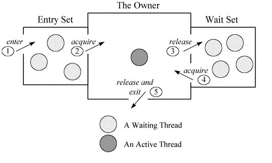
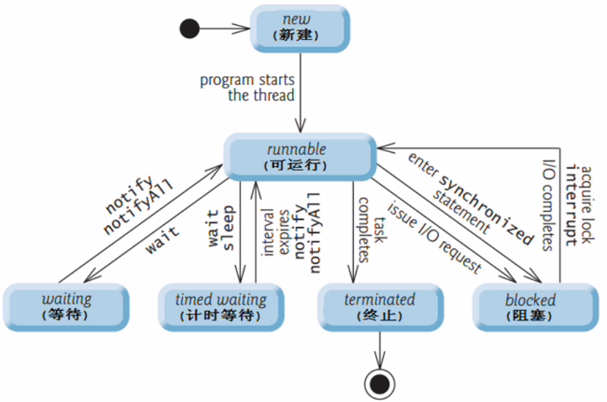
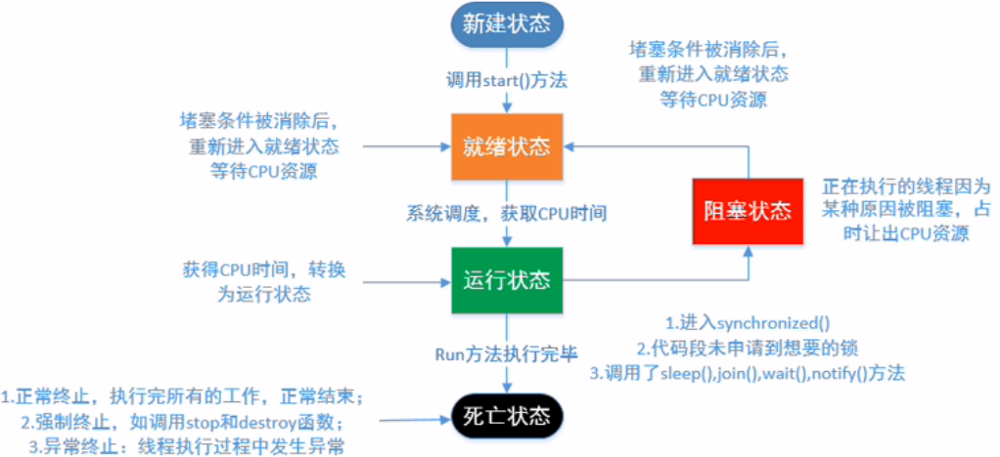
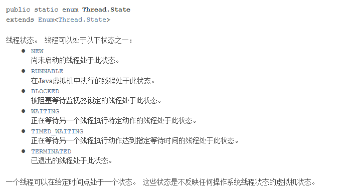

# Java基础-13-并发

synchronized 和lock

无论synchronized关键字加在方法上还是对象上，它取得的锁都是对象，而不是把一段代码或函数当作锁――而且非同步方法很可能还会被其他线程的对象访问。

每个对象只有一个锁（lock）与之相关联。

[https://www.jianshu.com/p/20abba522545](https://www.jianshu.com/p/20abba522545)

synchronized方法：每个synchronized 方法都必须获得调用该方法的类实例的锁方能执行，否则所属线程阻塞， 当一个线程访问object的一个synchronized同步方法时，其他线程对object中所有其它synchronized同步方法的的访问将被阻塞。 但是其他线程还是可以访问该实例对象的其他非synchronized方法

synchronized 修饰静态方法：静态方法属于类， 所以如果用synchronized修饰静态方法，那么它在所有类对象中都是同步的。

synchronized 代码块：又分为三种

* synchronized(this)类似于前面的synchronized修饰非静态方法，锁都在当前对象，只限制当前对象对该代码块的同步。-------------

* synchronized（className.class）类似于前面的synchronized修饰静态方法，锁在类而不在类对象，只要是className类对象访问该代码块都被要求同步。

* synchronized（Object obj）这时锁就是对象，谁拿到这个锁谁就可以运行它所控制的那段代码。----------这两个和锁对象是一样的，只是加在不同的位置，写法不一样但是结果都是对象上锁。

Sychronized和Lock

* synchronized是Java中的关键字，是内置的语言实现，而Lock是一个接口；

* synchronized在发生异常时，会自动释放线程占有的锁，因此不会导致死锁现象发生；而Lock在发生异常时，如果没有主动通过unLock()去释放锁，则很可能造成死锁现象，因此使用Lock时需要在finally块中释放锁；

* Lock可以让等待锁的线程响应中断，而synchronized却不行，使用synchronized时，等待的线程会一直等待下去，不能够响应中断；

* 通过Lock可以知道有没有成功获取锁，而synchronized却无法办到。

---

volatile关键字

[https://www.cnblogs.com/dolphin0520/p/3920373.html](https://www.cnblogs.com/dolphin0520/p/3920373.html)

一、缓存不一致性问题

CPU里面有高速缓存。如果一个变量在多个CPU中都存在缓存（一般在多线程编程时才会出现），那么就可能存在缓存不一致的问题。

解决缓存不一致性问题，通常来说有以下2种方法：

1）通过在总线加LOCK#锁的方式（效率低下）

2）通过缓存一致性协议

这2种方式都是硬件层面上提供的方式。

二、并发编程中的三个概念

1.原子性：即一个操作或者多个操作 要么全部执行并且执行的过程不会被任何因素打断，要么就都不执行。

2.可见性：当多个线程访问同一个变量时，一个线程修改了这个变量的值，其他线程能够立即看得到修改的值。

3.有序性：即程序执行的顺序按照代码的先后顺序执行。（处理器会对指令进行重排序， 指令重排序不会影响单个线程的执行，但是会影响到线程并发执行的正确性）

三、JMM（Java Memory Modle）Java内存模型

JMM是一组规则， JMM是围绕原子性，有序性、可见性展开的。

四、Java语言 本身对 原子性、可见性以及有序性提供的保证：

原子性：

在Java中，对基本数据类型的变量的读取和赋值操作是原子性操作， 如果要实现更大范围操作的原子性，可以通过synchronized和Lock来实现。由于synchronized和Lock能够保证任一时刻只有一个线程执行该代码块，那么自然就不存在原子性问题了，从而保证了原子性。

可见性：

Java提供了volatile关键字来保证可见性。当一个共享变量被volatile修饰时，它会保证修改的值会立即被更新到主存，当有其他线程需要读取时，它会去内存中读取新值。

另外，通过synchronized和Lock也能够保证可见性，synchronized和Lock能保证同一时刻只有一个线程获取锁然后执行同步代码，并且在释放锁之前会将对变量的修改刷新到主存当中。因此可以保证可见性。

有序性

在Java里面，可以通过volatile关键字来保证一定的“有序性”（具体原理在下一节讲述）。另外可以通过synchronized和Lock来保证有序性，很显然，synchronized和Lock保证每个时刻是有一个线程执行同步代码，相当于是让线程顺序执行同步代码，自然就保证了有序性。 

另外，Java内存模型具备一些先天的“有序性”，即不需要通过任何手段就能够得到保证的有序性，这个通常也称为 happens-before 原则。如果两个操作的执行次序无法从happens-before原则推导出来，那么它们就不能保证它们的有序性，虚拟机可以随意地对它们进行重排序。

详解volatile:（前面都是铺垫）

一旦一个共享变量（类的成员变量、类的静态成员变量）被volatile修饰之后，那么就具备了两层语义：

1）保证了不同线程对这个变量进行操作时的可见性，即一个线程修改了某个变量的值，这新值对其他线程来说是立即可见的。

2）禁止进行指令重排序。

volatile 不能保证原子性，能在一定程度上保证有序性。

原理和实现机制：“观察加入volatile关键字和没有加入volatile关键字时所生成的汇编代码发现，加入volatile关键字时，会多出一个lock前缀指令”lock前缀指令实际上相当于一个内存屏障（也成内存栅栏），内存屏障会提供3个功能：

1）它确保指令重排序时不会把其后面的指令排到内存屏障之前的位置，也不会把前面的指令排到内存屏障的后面；即在执行到内存屏障这句指令时，在它前面的操作已经全部完成；

2）它会强制将对缓存的修改操作立即写入主存；

3）如果是写操作，它会导致其他CPU中对应的缓存行无效。

volatile和synchronized

synchronized关键字是方式多个线程同时执行一段代码，这样会影响效率，volatile关键字在某些情况下性能会优于synchronized，但是它不能替代synchronized 因为volatile无法保证操作的原子性，使用volatile需要满足

1：对变量的写操作不依赖于当前值。

2：该变量没有包含在具有其他变量的不变式中。（要保证操作是原子性操作）

Java中使用volatile的例子 1：状态标记量 2：double check。

（单例模式涉及到double-check[https://www.iteye.com/topic/652440](https://www.iteye.com/topic/652440)）

## **

**

---

**死锁(deadlock)**

两个线程或两个以上线程都在等待对方执行完毕才能继续往下执行，从而都陷入无限期等待。

例如，如果线程1锁住了A，然后尝试对B进行加锁，同时线程2已经锁住了B，接着尝试对A进行加锁，这时死锁就发生了。

---

## 锁java.util.concurrent.locks.Lock和同步synchronized

lock 是java.util.concurrent.locks 包下的一个接口，它的主要实现是reentrantLock;

synchronized是Java中的关键字，是内置的语言实现，而Lock是一个接口。reentrantLock 才是实现

主要相同点：Lock能完成synchronized所实现的所有功能

主要不同点：Lock有比synchronized更精确的线程语义和更好的性能。synchronized会自动释放锁，而Lock一定要求程序员手工释放，并且必须在finally从句中释放

1。用法上的不同：

synchronized既可以加在方法上，也可以加载特定代码块上，lock需要显示地指定起始位置和终止位置。

synchronized是托管给JVM执行的，lock的锁定是通过代码实现的，它有比synchronized更精确的线程语义。

2.性能上的不同：

lock接口的实现类ReentrantLock，不仅具有和synchronized相同的并发性和内存语义，还多了超时的获取锁、定时锁、等候和中断锁等。

在竞争不是很激烈的情况下，synchronized的性能优于ReentrantLock，竞争激烈的情况下synchronized的性能会下降的非常快，而ReentrantLock则基本不变。

3.锁机制不同：

synchronized获取锁和释放锁的方式都是在块结构中，当获取多个锁时，必须以相反的顺序释放，并且是自动解锁。而Lock则需要开发人员手动释放，并且必须在finally中释放，否则会引起死锁。

我的理解：lock的使用更加灵活，使用得当会比是sychronized有更好的性能，但如果使不当，会有很多麻烦，比sychronized更加难用。简单来说，这些是供高级用户使用的高级工具。一般用来解决关键的性能瓶颈问题。通常还是首选sychronized，简单呀。

---

## synchronized的可重入实现

每个锁关联一个线程持有者和一个计数器。

当计数器为0时表示该锁没有被任何线程持有，那么任何线程都都可能获得该锁而调用相应方法。当一个线程请求成功后，JVM会记下持有锁的线程，并将计数器计为1。此时其他线程请求该锁，则必须等待。而该持有锁的线程如果再次请求这个锁，就可以再次拿到这个锁，同时计数器会递增。当线程退出一个synchronized方法/块时，计数器会递减，如果计数器为0则释放该锁。

---

乐观锁（CAS）和悲观锁

* synchronized是悲观锁，这种线程一旦得到锁，其他需要锁的线程就挂起的情况就是悲观锁。

* CAS操作的就是乐观锁，每次不加锁而是假设没有冲突而去完成某项操作，如果因为冲突失败就重试，直到成功为止。

Synchronized虽然确保了线程的安全，但是在性能上却不是最优的，Synchronized关键字会让没有得到锁资源的线程进入BLOCKED状态，而后在争夺到锁资源后恢复为RUNNABLE状态，这个过程中涉及到操作系统用户模式和内核模式的转换，代价比较高。

尽管Java1.6为Synchronized做了优化，增加了从偏向锁到轻量级锁再到重量级锁的过度，但是在最终转变为重量级锁之后，性能仍然较低。

CAS机制

CAS是英文单词Compare And Swap的缩写，翻译过来就是比较并替换。

CAS机制当中使用了3个基本操作数：内存地址V，旧的预期值A，要修改的新值B。

更新一个变量的时候，只有当变量的预期值A和内存地址V当中的实际值相同时，才会将内存地址V对应的值修改为B。

我的理解，当一个线程T要修改一个值的时候，它从内存中读到数据A，保存起来记为A1，然后它经过一番操作，在提交修改结果时，它把它之前读到的A1和内存中的A比较一下，如果A1==A那么就说明这段时间没人修改过A，也就是没有并发冲突，然后他就放心的提交修改，将A改为B；另一种情况，如果A1 != B说明在处理数据的这段时间内有人已经改过了A，那么就重新读取内存中的A给到A1，重复刚才的过程，直到成功，这一过程也叫做自旋。

从思想上来说，Synchronized属于悲观锁，悲观地认为程序中的并发情况严重，所以严防死守。CAS属于乐观锁，乐观地认为程序中的并发情况不那么严重，所以让线程不断去尝试更新。

CAS缺点

CAS虽然很高效的解决原子操作，但是CAS仍然存在三大问题。

1.  ABA问题。因为CAS需要在操作值的时候检查下值有没有发生变化，如果没有发生变化则更新，但是如果一个值原来是A，变成了B，又变成了A，那么使用CAS进行检查时会发现它的值没有发生变化，但是实际上却变化了。ABA问题的解决思路就是使用版本号。在变量前面追加上版本号，每次变量更新的时候把版本号加一，那么A－B－A 就会变成1A-2B－3A。

从Java1.5开始JDK的atomic包里提供了一个类AtomicStampedReference来解决ABA问题。

2. 循环时间长开销大。自旋CAS如果长时间不成功，会给CPU带来非常大的执行开销。如果JVM能支持处理器提供的pause指令那么效率会有一定的提升，pause指令有两个作用，第一它可以延迟流水线执行指令（de-pipeline）,使CPU不会消耗过多的执行资源，延迟的时间取决于具体实现的版本，在一些处理器上延迟时间是零。第二它可以避免在退出循环的时候因内存顺序冲突（memory order violation）而引起CPU流水线被清空（CPU pipeline flush），从而提高CPU的执行效率。

3. 只能保证一个共享变量的原子操作。当对一个共享变量执行操作时，我们可以使用循环CAS的方式来保证原子操作，但是对多个共享变量操作时，循环CAS就无法保证操作的原子性，这个时候就可以用锁，或者有一个取巧的办法，就是把多个共享变量合并成一个共享变量来操作。比如有两个共享变量i＝2,j=a，合并一下ij=2a，然后用CAS来操作ij。从Java1.5开始JDK提供了AtomicReference类来保证引用对象之间的原子性，你可以把多个变量放在一个对象里来进行CAS操作。

---

公平锁和非公平锁

Java.util.concurrent.lock 中的 Lock 框架是锁定的一个抽象，它允许把锁定的实现作为 Java 类，而不是作为语言的特性来实现。这就为 Lock 的多种实现留下了空间，各种实现可能有不同的调度算法、性能特性或者锁定语义。ReentrantLock 类实现了 Lock ，它拥有与 synchronized 相同的并发性和内存语义，但是添加了类似锁投票、定时锁等候和可中断锁等候的一些特性。此外，它还提供了在激烈争用情况下更佳的性能。

ReentrantLock的创建可以指定构造函数的boolean类型来得到公平锁或非公平锁

公平锁，就是很公平，在并发环境中，每个线程在获取锁时会先查看此锁维护的等待队列，如果为空，或者当前线程是等待队列的第一个，就占有锁，否则就会加入到等待队列中，以后会按照FIFO的规则从队列中取到自己

非公平锁比较粗鲁，上来就直接尝试占有锁，如果尝试失败，就再采用类似公平锁那种方式

公平保证了锁是非常健壮的锁。要确保公平所需要的记帐（bookkeeping）和同步，有很大的性能成本。意味着被争夺的公平锁要比不公平锁的吞吐率更低。 作为默认设置，应当把公平设置为 false 。即默认非公平锁。

reetrantlock的实现

简单来说，它有一个与锁相关的获取计数器，如果拥有锁的某个线程再次得到锁，那么获取计数器就加1，然后锁需要被释放两次才能获得真正释放。

---

监视器(Monitor)

在HotSpot虚拟机中，monitor采用ObjectMonitor实现。 每个线程都有两个ObjectMonitor对象列表，分别为free和used列表，如果当前free列表为空，线程将向全局global list请求分配ObjectMonitor。 ObjectMonitor对象中有两个队列：_WaitSet 和 _EntryList，用来保存ObjectWaiter对象列表；_owner指向获得ObjectMonitor对象的线程。

---

## 请你讲讲wait方法的底层原理

[http://www.jianshu.com/p/f4454164c017](http://www.jianshu.com/p/f4454164c017)

先说ObjectWaiter对象，是双向链表结构，保存了_thread（当前线程）以及当前的状态TState等数据， 每个等待锁的线程都会被封装成ObjectWaiter对象。

lock.wait()方法最终通过ObjectMonitor的void wait(jlong millis, bool interruptable, TRAPS);

实现：

1、将当前线程封装成ObjectWaiter对象node；

2、通过ObjectMonitor::AddWaiter方法将node添加到_WaitSet列表中；

3、通过ObjectMonitor::exit方法释放当前的ObjectMonitor对象，这样其它竞争线程就可以获取该ObjectMonitor对象。

4、最终底层的park方法会挂起线程。

---

CountDownLatch、CyclicBarrier和Semaphore

java 1.5中，提供了一些非常有用的辅助类来帮助我们进行并发编程，比如CountDownLatch，CyclicBarrier和Semaphore 。

1）CountDownLatch和CyclicBarrier都能够实现线程之间的等待，只不过它们侧重点不同：

CountDownLatch一般用于某个线程A等待若干个其他线程执行完任务之后，它才执行；而CyclicBarrier一般用于一组线程互相等待至某个状态，然后这一组线程再同时执行；另外，CountDownLatch是不能够重用的，而CyclicBarrier是可以重用的。

2）Semaphore其实和锁有点类似，它一般用于控制对某组资源的访问权限。

---

请简短说明一下你对AQS的理解。

AbstractQueuedSynchronizer（AQS）

AQS其实就是一个可以给我们实现锁的框架

内部实现的关键是：先进先出的队列、state状态

定义了内部类ConditionObject

拥有两种线程模式独占模式和共享模式。

在LOCK包中的相关锁(常用的有ReentrantLock、 ReadWriteLock)都是基于AQS来构建，一般我们叫AQS为同步器。

---

Java中的LongAdder和AtomicLong有什么区别

AtomicLong是作用是对长整形进行原子操作，显而易见，在java1.8中新加入了一个新的原子类LongAdder，该类也可以保证Long类型操作的原子性，相对于AtomicLong，LongAdder有着更高的性能和更好的表现，可以完全替代AtomicLong的来进行原子操作。

在32位操作系统中，64位的long 和 double 变量由于会被JVM当作两个分离的32位来进行操作，所以不具有原子性。而使用AtomicLong能让long的操作保持原子型。

唯一会制约AtomicLong高效的原因是高并发，高并发意味着CAS的失败几率更高， 重试次数更多，越多线程重试，CAS失败几率又越高，变成恶性循环，AtomicLong效率降低。

LongAdder确实用了很多心思减少并发量，并且，每一步都是在”没有更好的办法“的时候才会选择更大开销的操作，从而尽可能的用最最简单的办法去完成操作。

---

## 创建线程并启动有几种不同的方式？你喜欢哪一种？为什么？

1.继承Thread类 （真正意义上的线程类），是Runnable接口的实现。

2.实现Runnable接口，并重写里面的run方法

3.应用程序可以使用Executor框架来创建线程池。Executor框架是juc里提供的线程池的实现。

4.实现Callable接口通过FutureTask包装器来创建Thread线程

实现Runnable接口这种方式更受欢迎，因为这不需要继承Thread类。在应用设计中已经继承了别的对象的情况下，这需要多继承（而Java不支持多继承），只能实现接口。同时，线程池也是非常高效的，很容易实现和使用。 

①启动线程有如下三种方式：

一、继承Thread类创建线程类

（1）定义Thread类的子类，并重写该类的run方法，该run方法的方法体就代表了线程要完成的任务。因此把run()方法称为执行体。

（2）创建Thread子类的实例，即创建了线程对象。

（3）调用线程对象的start()方法来启动该线程。

代码：

|1

2

3

4

5

6

7

8

9

10

11

12

13

14

15

16

17

18

19

20

21

22

23

24

25
|package com.thread;

public class FirstThreadTest extends Thread{

    int i = 0;

    //重写run方法，run方法的方法体就是现场执行体

    public void run()

    {

        for(;i<100;i++){

            System.out.println(getName()+"  "+i);

        }

    }

    public static void main(String[] args)

    {

        for(int i = 0;i< 100;i++)

        {

            System.out.println(Thread.currentThread().getName()+"  : "+i);

            if(i==20)

            {

                new FirstThreadTest().start();

                new FirstThreadTest().start();

            }

        }

    }

}
|
|

                                         |

                                                                                                                                                                                                                                                                                                                                                                                                                                                                                                                                                                           |

上述代码中Thread.currentThread()方法返回当前正在执行的线程对象。GetName()方法返回调用该方法的线程的名字。

二、通过Runnable接口创建线程类

（1）定义runnable接口的实现类，并重写该接口的run()方法，该run()方法的方法体同样是该线程的线程执行体。

（2）创建 Runnable实现类的实例，并依此实例作为Thread的target来创建Thread对象，该Thread对象才是真正的线程对象。

（3）调用线程对象的start()方法来启动该线程。

代码：

|1

2

3

4

5

6

7

8

9

10

11

12

13

14

15

16

17

18

19

20

21

22

23

24

25

26

27

28

29
|package com.thread;

public class RunnableThreadTest implements Runnable

{

    private int i;

    public void run()

    {

        for(i = 0;i <100;i++)

        {

            System.out.println(Thread.currentThread().getName()+" "+i);

        }

    }

    public static void main(String[] args)

    {

        for(int i = 0;i < 100;i++)

        {

            System.out.println(Thread.currentThread().getName()+" "+i);

            if(i==20)

            {

                RunnableThreadTest rtt = new RunnableThreadTest();

                new Thread(rtt,"新线程1").start();

                new Thread(rtt,"新线程2").start();

            }

        }

    }

}
|

三、通过Callable和Future创建线程

（1）创建Callable接口的实现类，并实现call()方法，该call()方法将作为线程执行体，并且有返回值。

（2）创建Callable实现类的实例，使用FutureTask类来包装Callable对象，该FutureTask对象封装了该Callable对象的call()方法的返回值。

（3）使用FutureTask对象作为Thread对象的target创建并启动新线程。

（4）调用FutureTask对象的get()方法来获得子线程执行结束后的返回值

代码：

|1

2

3

4

5

6

7

8

9

10

11

12

13

14

15

16

17

18

19

20

21

22

23

24

25

26

27

28

29

30

31

32

33

34

35

36

37

38

39

40

41

42

43

44

45
|package com.thread;

import java.util.concurrent.Callable;

import java.util.concurrent.ExecutionException;

import java.util.concurrent.FutureTask;

public class CallableThreadTest implements Callable<Integer>

{

    public static void main(String[] args)

    {

        CallableThreadTest ctt = new CallableThreadTest();

        FutureTask<Integer> ft = new FutureTask<>(ctt);

        for(int i = 0;i < 100;i++)

        {

            System.out.println(Thread.currentThread().getName()+" 的循环变量i的值"+i);

            if(i==20)

            {

                new Thread(ft,"有返回值的线程").start();

            }

        }

        try

        {

            System.out.println("子线程的返回值："+ft.get());

        } catch (InterruptedException e)

        {

            e.printStackTrace();

        } catch (ExecutionException e)

        {

            e.printStackTrace();

        }

    }

    @Override

    public Integer call() throws Exception

    {

        int i = 0;

        for(;i<100;i++)

        {

            System.out.println(Thread.currentThread().getName()+" "+i);

        }

        return i;

    }

}
|

[https://www.cnblogs.com/wxw7blog/p/7727510.html](https://www.cnblogs.com/wxw7blog/p/7727510.html)

---

## 如何保证线程安全？

* 保证共享资源在同一时间只能由一个线程进行操作(原子性，有序性)。

* 将线程操作的结果及时刷新，保证其他线程可以立即获取到修改后的最新数据（可见性）。

---

## 线程从创建到死亡的状态及其联系

Thread类内部的枚举类：

1、新建状态（new）:

使用 new 创建一个线程，仅仅只是在堆中分配了内存空间，新建状态下，线程还没有调用 start()方法启动，只是存在一个线程对象而已。Thread t = new Thread();//这就是t线程的新建状态

2、可运行状态（runnable）：

新建状态调用 start() 方法，进入可运行状态。而这个又分成两种状态，ready 和 running，分别表示就绪状态和运行状态

（ready）就绪状态：线程对象调用了 start() 方法，等待 JVM 的调度，（此时该线程并没有运行）

（running）运行状态：线程对象获得 JVM 调度，如果存在多个 CPU，那么运行多个线程并行运行

　　注意：线程对象只能调用一次 start() 方法，否则报错：illegaThreadStateExecption

3、阻塞状态（blocked）:

正在运行的线程因为某种原因放弃CPU，暂时停止运行，就会进入阻塞状态。此时 JVM 不会给线程分配 CPU，直到线程重新进入就绪状态，才有机会转到运行状态。注意：阻塞状态只能先进入就绪状态，不能直接进入运行状态。

阻塞状态分为两种情况：

　　①、当线程 A 处于可运行状态中，试图获取同步锁时，却被 B 线程获取，此时 JVM 把当前 A 线程放入锁池中，A线程进入阻塞状态

　　②、当线程处于运行状态时，发出了 IO 请求，此时进入阻塞状态

4、等待状态（waiting）:

等待状态只能被其他线程唤醒，此时使用的是无参数的 wait() 方法

　　①、当线程处于运行状态时，调用了 wait() 方法，此时 JVM 把该线程放入等待池中

5、计时等待（timed waiting）:

调用了带参数的 wait（long time）或 sleep(long time) 方法

　　①、当线程处于运行状态时，调用了带参数 wait 方法，此时 JVM 把该线程放入等待池中

　　②、当前线程调用了 sleep(long time) 方法

6、终止状态（terminated）:

通常称为死亡状态，表示线程终止

　　①、正常终止，执行完 run() 方法，正常结束

　　②、强制终止，如调用 stop() 方法或 destory() 方法

　　③、异常终止，执行过程中发生异常

---

---

线程的方法

1、sleep(long millis)线程休眠：

1.指定等待时间。

2.在指定时间暂停执行进入阻塞

3.可以让任何优先级的线程有获得执行的机会

4.不释放锁标志。（如果有synchronized同步块，其他线程仍然不能访问共享数据）

2、wait()线程等待：

1. wait()方法是Object类的方法，不是Thread类的方法（notify(),notifyAll()）

2. 调用wati（），notify（），notifyAll（） 方法前必须先获取对象锁。只能在sychronized 语句块内使用。

3. 会释放“锁标志”。wait后会将该线程放入对象等待池中，等到notify（）方法调用后，从对象等待池中取出任意一个线程放入锁标志等待池中，在锁标志等待池中的线程可以竞争获取锁标志。若调用了notify（）则将对象等待池中的所有线程都移到所标志等待池中。

4. 如果是wait（long timeout ）则在延迟timeout时间后自动将其放回锁标志等待池中。

5. 如果用的是ReenTrantLock实现同步，应该先用ReenTrantLock。newCondition()获取一个Condition类对象，然后Condition的await() ,signal（）以及signal All（） 分别对应上述方法。

3、notify()/notifyAll()唤醒：唤醒wait的一个或所有的线程

此方法需和wait()成对使用，必须在同步代码块或同步方法中。

4、join()联合线程：

表示这个线程等待另一个线程完成后（死亡）才执行，join 方法被调用之后，线程对象处于阻塞状态。写在哪个线程中，哪个线程阻塞。这种也称为联合线程，就是说把当前线程和当前线程所在的线程联合成一个线程

5、yield()礼让线程：

表示当前线程对象提示调度器自己愿意让出 CPU 资源。

1. 不会释放锁标志，没有参数，使当前线程重新回到可执行状态。（有可能，刚yield（）完，他又恰好被执行了）

2. yield（） 只能使同优先级或者更高优先级线程得到执行机会。

sleep() 和 yield() 方法的区别：

1. sleep()方法给其他线程运行机会时不考虑线程的优先级，因此会给低优先级的线程以运行的机会；yield()方法只会给相同优先级或更高优先级的线程以运行的机会；

1. sleep()方法声明抛出InterruptedException，而yield()方法没有声明任何异常；

2. sleep()方法比yield()方法（跟操作系统CPU调度相关）具有更好的可移植性。

---

线程池

[https://www.cnblogs.com/dolphin0520/p/3932921.html](https://www.cnblogs.com/dolphin0520/p/3932921.html)

线程池使得线程可以复用。

     线程执行sleep()方法后转入阻塞（blocked）状态，而执行yield()方法后转入就绪（ready）状态；

在面向对象编程中，创建和销毁对象是很费时间的，因为创建一个对象要获取内存资源或者其它更多资源。在Java中更是如此，虚拟机将试图跟踪每一个对象，以便能够在对象销毁后进行垃圾回收。所以提高服务程序效率的一个手段就是尽可能减少创建和销毁对象的次数，特别是一些很耗资源的对象创建和销毁，这就是“池化资源”技术产生的原因。线程池顾名思义就是事先创建若干个可执行的线程放入一个池（容器）中，需要的时候从池中获取线程不用自行创建，使用完毕不需要销毁线程而是放回池中，从而减少创建和销毁线程对象的开销。

Java中的ThreadPoolExecutor类：

java.util.concurrent.ThreadPoolExecutor类是线程池中最核心的类。

ThreadPoolExecutor extends AbstractExecutorService 

AbstractExecutorService 实现了 ExecutorService 接口

ExecutorService接口继承自Executor接口

ThreadPoolExecutor继承自抽象类：AbstractExecutorSerivice ，它又实现了ExecutorService 接口，这个接口又继承自Executor。

二、深入剖析线程池实现原理

1.线程池状态

running： 当创建线程池后，初始时，线程池处于running状态。

shutdown：当调用了shutdown（）方法后，此时线程池不能够接受新的任务，它会等待所有任务执行完毕。

stop：如果调用了shutdownNow（）方法后，此时线程不能接新的任务，并且会去尝试终止正在执行的任务。

terminated：当线程池处于shutdown或stop状态时，并且所有工作线程已经销毁，任务缓存队列已经清空或执行结束后，线程池会被设置为terminated。

2.任务的执行

* 如果当前线程池中的线程数目小于corePoolSize，则每来一个任务，就会创建一个线程去执行这个任务；

* 如果当前线程池中的线程数目>=corePoolSize，则每来一个任务，会尝试将其添加到任务缓存队列当中，若添加成功，则该任务会等待空闲线程将其取出去执行；若添加失败（一般来说是任务缓存队列已满），则会尝试创建新的线程去执行这个任务；

* 如果当前线程池中的线程数目达到maximumPoolSize，则会采取任务拒绝策略进行处理；

* 如果线程池中的线程数量大于 corePoolSize时，如果某线程空闲时间超过keepAliveTime，线程将被终止，直至线程池中的线程数目不大于corePoolSize；如果允许为核心池中的线程设置存活时间，那么核心池中的线程空闲时间超过keepAliveTime，线程也会被终止。

3.线程池中的线程初始化

默认情况下，创建线程池之后，线程池中是没有线程的，需要提交任务之后才会创建线程。

　　在实际中如果需要线程池创建之后立即创建线程，可以通过以下两个方法办到：

* prestartCoreThread()：初始化一个核心线程；

* prestartAllCoreThreads()：初始化所有核心线程

初始化线程后会阻塞在等待任务队列中的任务的状态。

4.任务缓存队列及排队策略

在前面我们多次提到了任务缓存队列，即workQueue，它用来存放等待执行的任务。

　　workQueue的类型为BlockingQueue<Runnable>，通常可以取下面三种类型：

　　1）ArrayBlockingQueue：基于数组的先进先出队列，此队列创建时必须指定大小；

　　2）LinkedBlockingQueue：基于链表的先进先出队列，如果创建时没有指定此队列大小，则默认为Integer.MAX_VALUE；

　　3）synchronousQueue：这个队列比较特殊，它不会保存提交的任务，而是将直接新建一个线程来执行新来的任务。

5.任务拒绝策略

当线程池的任务缓存队列已满并且线程池中的线程数目达到maximumPoolSize，如果还有任务到来就会采取任务拒绝策略，通常有以下四种策略：

ThreadPoolExecutor.AbortPolicy:丢弃任务并抛出RejectedExecutionException异常。

ThreadPoolExecutor.DiscardPolicy：也是丢弃任务，但是不抛出异常。

ThreadPoolExecutor.DiscardOldestPolicy：丢弃队列最前面的任务，然后重新尝试执行任务（重复此过程）

ThreadPoolExecutor.CallerRunsPolicy：由调用线程处理该任务

6.线程池的关闭

* shutdown()：不会立即终止线程池，而是要等所有任务缓存队列中的任务都执行完后才终止，但再也不会接受新的任务

* shutdownNow()：立即终止线程池，并尝试打断正在执行的任务，并且清空任务缓存队列，返回尚未执行的任务

7.线程池容量的动态调整

ThreadPoolExecutor提供了动态调整线程池容量大小的方法：setCorePoolSize()和setMaximumPoolSize()，

* setCorePoolSize：设置核心池大小

* setMaximumPoolSize：设置线程池最大能创建的线程数目大小

　　当上述参数从小变大时，ThreadPoolExecutor进行线程赋值，还可能立即创建新的线程来执行任务。

三、例子

四、如何合理配置线程池的大小

一般需要根据任务的类型来配置线程池大小：

　　如果是CPU密集型任务，就需要尽量压榨CPU，参考值可以设为 NCPU+1

　　如果是IO密集型任务，参考值可以设置为2*NCPU

五、线程池的优点

第一：降低资源消耗。通过重复利用已创建的线程降低线程创建和销毁造成的消耗。

第二：提高响应速度。当任务到达时，任务可以不需要等到线程创建就能执行。

第三：提高线程的可管理性，线程是稀缺资源，如果无限制地创建，不仅会消耗系统资源，还会降低系统的稳定性，使用线程池可以进行统一分配、调优和监控。

六、线程池的种类

Java通过Executors提供四种线程池，分别为：

newCachedThreadPool创建一个可缓存线程池，如果线程池长度超过处理需要，可灵活回收空闲线程，若无可回收，则新建线程。

newFixedThreadPool 创建一个定长线程池，可控制线程最大并发数，超出的线程会在队列中等待。

newScheduledThreadPool 创建一个定长线程池，支持定时及周期性任务执行。

newSingleThreadExecutor 创建一个单线程化的线程池，它只会用唯一的工作线程来执行任务，保证所有任务按照指定顺序(FIFO, LIFO, 优先级)执行。

---

## 请使用内部类实现线程设计4个线程，其中两个线程每次对j增加1，另外两个线程对j每次减少1。

public class ThreadTest1{

    private int j;

    public static void main(String args[]){

        ThreadTest1 tt=new ThreadTest1();

        Inc inc=tt.new Inc();

        Dec dec=tt.new Dec();

        for(int i=0;i<2;i++){

            Thread t=new Thread(inc);

            t.start();

            t=new Thread(dec);

            t.start();

        }

}

private synchronized void inc(){

    j++;

    System.out.println(Thread.currentThread().getName()+"-inc:"+j);

}

private synchronized void dec(){

    j--;

    System.out.println(Thread.currentThread().getName()+"-dec:"+j);

}

class Inc implements Runnable{

    public void run(){

        for(int i=0;i<100;i++){

            inc();

        }

    }

}

class Dec implements Runnable{

    public void run(){

        for(int i=0;i<100;i++){

            dec();

        }

    }

}

}

[1Java-e-高级特性1-多线程](evernote:///view/23580777/s24/5181158e-8a66-4787-8335-2109ba5c5eed/5181158e-8a66-4787-8335-2109ba5c5eed/)
