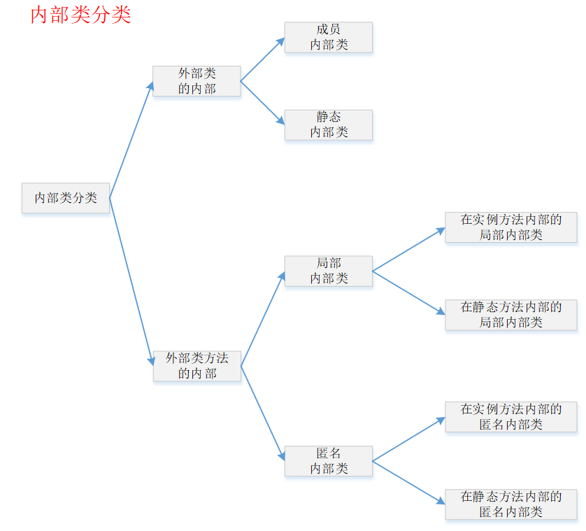

# Java基础-3-内部类

来源[https://www.cnblogs.com/dolphin0520/p/3811445.html](https://www.cnblogs.com/dolphin0520/p/3811445.html)

这一节的内容不如直接看博客，下面内容时对博客的部分复制。

一内部类基础

在Java中，可以将一个类定义在另一个类里面或者一个方法里面，这样的类称为内部类。

广泛意义上的内部类一般来说包括这四种：**成员内部类**、**静态内部类**、**局部内部类**、**匿名内部类**。

1.成员内部类：是最普通的内部类，它的定义为位于另一个类的内部。依附于外部类存在。

**内部类访问外部类成员**： 成员内部类可以无条件访问外部类的所有成员属性和成员方法（包括private成员和静态成员）。

**隐藏现象：**当成员内部类拥有和外部类同名的成员变量或者方法时，会发生隐藏现象，即在内部类里默认情况下访问的是成员内部类的成员。如果要访问外部类的同名成员，需要以下面的形式进行访问：

外部类.this.成员变量

外部类.this.成员方法

**外部类访问成员内部类的成员**。在外部类中如果要访问成员内部类的成员，必须先创建一个成员内部类的对象，再通过指向这个对象的引用来访问。成员内部类是依附外部类而存在的，也就是说，如果要创建成员内部类的对象，前提是必须存在一个外部类的对象。

访问修饰符：内部类可以拥有private访问权限、protected访问权限、public访问权限及default访问权限。如果成员内部类Inner用private修饰，则只能在外部类的内部访问，如果用public修饰，则任何地方都能访问；如果用protected修饰，则只能在同一个包下或者继承外部类的情况下访问；如果是默认访问权限，则只能在同一个包下访问。这一点和外部类有一点不一样，外部类只能被public和包访问两种权限修饰。我个人是这么理解的，由于成员内部类看起来像是外部类的一个成员，所以可以像类的成员一样拥有多种权限修饰。

2.局部内部类

　　局部内部类是定义在一个方法或者一个作用域里面的类，它和成员内部类的区别在于局部内部类的访问仅限于方法内或者该作用域内。局部内部类就像是方法里面的一个局部变量一样，是不能有public/protected/private以及static修饰符的.

3.匿名内部类：--------唯一无构造器的类

使用匿名内部类能够在 实现父类 或者接口中的方法 的情况下同时产生一个相应的对象。匿名内部类是唯一一种没有构造器的类。正因为其没有构造器，所以匿名内部类的使用范围非常有限，大部分匿名内部类用于接口回调。匿名内部类在编译的时候由系统自动起名为Outter$1.class。一般来说，匿名内部类用于继承其他类或是实现接口，并不需要增加额外的方法，只是对继承方法的实现或是重写。

4. 静态内部类：-------不需要依赖于外部类

静态内部类也是定义在另一个类里面的类，只不过在类的前面多了一个关键字static。静态内部类是不需要依赖于外部类的，这点和类的静态成员属性有点类似，并且它不能使用外部类的非static成员变量或者方法

---

深入理解内部类

1.为什么成员内部类可以无条件访问外部类的成员？-------因为编译器自动给内部类的构造器传递了一个参数是指向外部类的引用。

虽然我们在定义的内部类的构造器是无参构造器，编译器还是会默认添加一个参数，该参数的类型为指向外部类对象的一个引用，因此可以在成员内部类中随意访问外部类的成员。从这里也间接说明了成员内部类是依赖于外部类的，如果没有创建外部类的对象，则无法对Outter this&0引用进行初始化赋值，也就无法创建成员内部类的对象了。

2.为什么局部内部类和匿名内部类只能访问局部final变量？

因为：跟编译器有关，其结果就是内部类使用的外部变量只是外部变量的一个拷贝，所以如果它对这个变量进行了修改，则会造成数据不一致，所以Java限制了它只能访问final变量，不允许对其修改

3.静态内部类有特殊的地方吗？--------不持有指向外部类对象的引用

　　从前面可以知道，静态内部类是不依赖于外部类的，也就说可以在不创建外部类对象的情况下创建内部类的对象。另外，静态内部类是不持有指向外部类对象的引用的。

---

---

内部类的优点------内部类的存在使得Java的多继承机制变得更加完善

1.每个内部类都能独立的继承一个接口的实现，所以无论外部类是否已经继承了某个(接口的)实现，对于内部类都没有影响。内部类使得多继承的解决方案变得完整，

2.方便将存在一定逻辑关系的类组织在一起，又可以对外界隐藏。

3.方便编写事件驱动程序

4.方便编写线程代码

个人觉得第一点是最重要的原因之一，内部类的存在使得Java的多继承机制变得更加完善。

关于成员内部类的继承问题。一般来说，内部类是很少用来作为继承用的。但是当用来继承的话，要注意两点：

　　1）成员内部类的引用方式必须为 Outter.Inner.

　　2）构造器中必须有指向外部类对象的引用，并通过这个引用调用super()。
