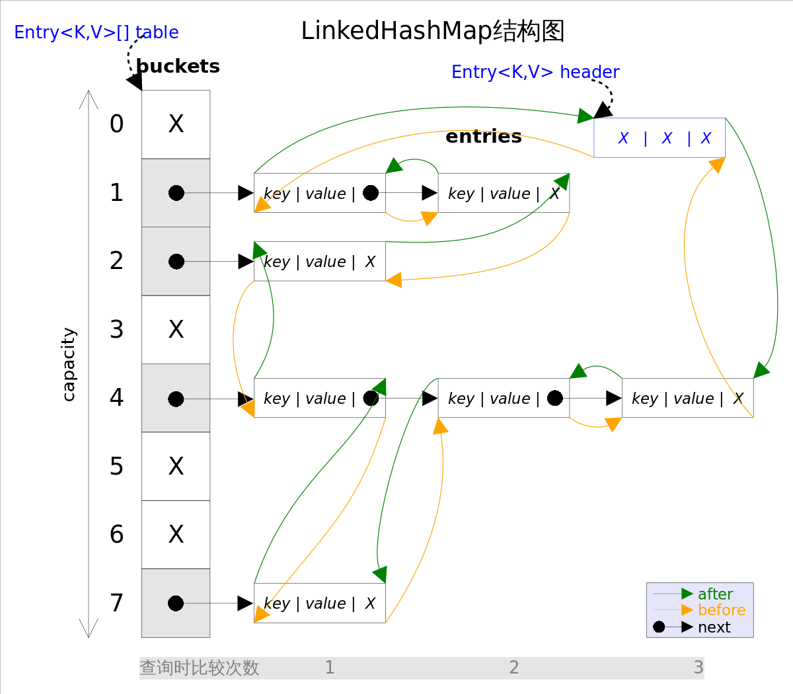

# Java基础-4-集合类

JDK1.8中对ConcurrenHashMap做的修改

https://www.jianshu.com/p/d10256f0ebea


接口java.util.Map;的四个实现类

HashMap/Hashtable /LinkedHashMap /TreeMap。

Map主要用于存储健值对，根据键得到值，因此不允许键重复(重复了覆盖了),但允许值重复。

Hashmap 是一个最常用的Map,它根据键的HashCode值存储数据,根据键可以直接获取它的值，具有很快的访问速度，遍历时，取得数据的顺序是完全随机的。HashMap最多只允许一条记录的键为Null;允许多条记录的值为 Null;HashMap不支持线程的同步，即任一时刻可以有多个线程同时写HashMap;可能会导致数据的不一致。如果需要同步，可以用Collections的synchronizedMap方法使HashMap具有同步的能力，或者使用ConcurrentHashMap。

Hashtable与 HashMap类似,它继承自Dictionary类，不同的是:它不允许记录的键或者值为空;它支持线程的同步，即任一时刻只有一个线程能写Hashtable,因此也导致了 Hashtable在写入时会比较慢。   LinkedHashMap 是HashMap的一个子类，保存了记录的插入顺序，在用Iterator遍历LinkedHashMap时，先得到的记录肯定是先插入的.也可以在构造时用带参数，按照应用次数排序。在遍历的时候会比HashMap慢，不过有种情况例外，当HashMap容量很大，实际数据较少时，遍历起来可能会比 LinkedHashMap慢，因为LinkedHashMap的遍历速度只和实际数据有关，和容量无关，而HashMap的遍历速度和他的容量有关。

TreeMap实现SortMap接口，能够把它保存的记录根据键排序,默认是按键值的升序排序，也可以指定排序的比较器，当用Iterator 遍历TreeMap时，得到的记录是排过序的。

一般情况下，我们用的最多的是HashMap,在Map 中插入、删除和定位元素，HashMap 是最好的选择。但如果您要按自然顺序或自定义顺序遍历键，那么TreeMap会更好。如果需要输出的顺序和输入的相同,那么用LinkedHashMap 可以实现,它还可以按读取顺序来排列

```java
/**
 * TQR 2020/3/7
 */
public class CollectionFrameWork {
    public static void main(String[] args) {
        HashMap<String,Integer> hashMap = new HashMap<>();
        Hashtable<String,Integer> hashtable = new Hashtable<>();
        LinkedHashMap<String,Integer> linkedHashMap = new LinkedHashMap<>();
        // 默认升序，改成降序。
        TreeMap<String,Integer> treeMap = new TreeMap<>(new Comparator<String>() {
            @Override
            public int compare(String o1, String o2) {
                return o2.compareTo(o1);
            }
        });
        for (int i = 5; i >0; i--) {
            hashMap.put("key"+i,i);
            linkedHashMap.put("key"+i,i);
            treeMap.put("key"+i,i);
        }
        Iterator it1 = hashMap.entrySet().iterator();
        Iterator it2 = linkedHashMap.entrySet().iterator();
        Iterator it3 = treeMap.entrySet().iterator();
        while(it1.hasNext()){
            Map.Entry entry = (Map.Entry) it1.next();
            System.out.println(entry.toString());
        }
        System.out.println("----------");
        while(it2.hasNext()){
            Map.Entry entry = (Map.Entry) it2.next();
            System.out.println(entry.toString());
        }
        System.out.println("----------");
        while(it3.hasNext()){
            Map.Entry entry = (Map.Entry) it3.next();
            System.out.println(entry.toString());
        }
    }
}
/*
key1=1
key2=2
key5=5
key3=3
key4=4
----------
key5=5
key4=4
key3=3
key2=2
key1=1
----------
key5=5
key4=4
key3=3
key2=2
key1=1
*/
```


---------------

set接口三个实现类

HashSet是使用哈希表（hash table）实现的，其中的元素是无序的。HashSet的add、remove、contains方法 的时间复杂度为常量O(1)。

TreeSet使用树形结构（算法书中的红黑树red-black tree）实现的。TreeSet中的元素是可排序的，但add、remove和contains方法的时间复杂度为O(log(n))。TreeSet还提供了first()、last()、headSet()、tailSet()等方法来操作排序后的集合。

LinkedHashSet介于HashSet和TreeSet之间。它基于一个由链表实现的哈希表，保留了元素插入顺序。LinkedHashSet中基本方法的时间复杂度为O(1)

## Java集合类框架的基本接口

Collection\Set\List\Iterator |||||Map

Collection接口:根接口，没有具体实现，被继承产生两个新的接口Set和List。

Java.util 包中的另一个接口是Map接口，

还有一个迭代器接口Iterator接口。里面主要包含三个方法:hasNext()   next()  remove();

遍历

在类集中提供了以下四种的常见输出方式：

1）Iterator：迭代输出，是使用最多的输出方式。

    Iterator it = arr.iterator();

    while(it.hasNext()){ object o =it.next(); ...}

2）ListIterator：是Iterator的子接口，专门用于输出List中的内容。

3）foreach输出：JDK1.5之后提供的新功能，可以输出数组或集合。

    foreach的形式： for（int　i：arr）{...}

4）for循环

for的形式：for（int i=0;i<arr.size();i++）{...}

---

---

## 三种接口存取元素的特点

* List以特定索引来存取元素，可以有重复元素。表示有先后顺序的集合。

存元素：多次调用add(Object)方法时，每次加入的对象按先来后到的顺序排序，也可以插队，即调用add(int index,Object)方法，就可以指定当前对象在集合中的存放位置。

取元素：方法1：Iterator接口取得所有，逐一遍历各个元素

        方法2：调用get(index i)来明确说明取第几个。

* Set不能存放重复元素（用对象的equals()方法来区分元素是否重复）。

存元素：add方法有一个boolean的返回值，当集合中没有某个元素，此时add方法可成功加入该元素时，则返回true；当集合含有与某个元素equals相等的元素时，此时add方法无法加入该元素，返回结果为false。

取元素：没法说取第几个，只能以Iterator接口取得所有的元素，再逐一遍历各个元素。

* Map保存键值对（key-value pair）映射，映射关系可以是一对一或多对一。

存放用put方法:put(obj key,obj value)，每次存储时，要存储一对key/value，不能存储重复的key，这个重复的规则也是按equals比较相等。

取元素：用get(Object key)方法根据key获得相应的value。

        也可以获得所有的key的集合，还可以获得所有的value的集合，

        还可以获得key和value组合成的Map.Entry对象的集合。

---

---

## 实现类比较

## HashMap和HashTable

一、现在Hashtable基本上已经被弃用了。而HashMap已经成为应用最为广泛的一种数据类型了。造成这样的原因一方面是因为Hashtable是线程安全的，效率比较低。

二、HashMap是继承自AbstractMap类，而HashTable是继承自Dictionary类（ Dictionary已经被废弃）。不过它们都实现了同时实现了map、Cloneable（可复制）、Serializable（可序列化）这三个接口

三、Hashtable既不支持Null key也不支持Null value。 HashMap中，null可以作为键，这样的键只有一个；可以有一个或多个键所对应的值为null。

四、Hashtable是线程安全的，它的每个方法中都加入了Synchronize方法。

HashMap不是线程安全的，在多线程并发的环境下，可能会产生死锁等问题。使用HashMap时就必须要自己增加同步处理，ConcurrentHashMap是线程安全的，它的效率比Hashtable要高。因为ConcurrentHashMap使用了分段锁，并不对整个数据进行锁定。

五、HashMap的Iterator是fail-fast迭代器。当有其它线程改变了HashMap的结构（增加，删除，修改元素），将会抛出ConcurrentModificationException。不过，通过Iterator的remove()方法移除元素则不会抛出ConcurrentModificationException异常。但这并不是一个一定发生的行为，要看JVM。JDK8之前的版本中，Hashtable是没有fast-fail机制的。在JDK8及以后的版本中 ，HashTable也是使用fast-fail的。

---

---

---

## ArrayList和LinkedList和vector

[https://blog.csdn.net/wangxing233/article/details/79452946](https://blog.csdn.net/wangxing233/article/details/79452946)

Arraylist：底层是基于动态数组，根据下表随机访问数组元素的效率高，向数组尾部添加元素的效率高；但是，删除数组中的数据以及向数组中间添加数据效率低，因为需要移动数组。

动态扩容： 默认是初始化一个容量为10的数组 每次扩容是1.5倍（old+old/2）[hashmap初始16 翻倍，vector初始是10，翻倍扩容]，如果初始化时一开始指定了容量，或者通过集合作为元素，则容量为指定的大小或参数集合的大小。Vector每次扩容容量是翻倍。当初次往里面加元素的时候才会真正分配内存。

Vector：也是使用数组方式存储数据，此数组元素数大于实际存储的数据以便增加和插入元素，允许直接按序号索引元素，插入元素要涉及数组元素移动等内存操作，索引数据快而插入数据慢，Vector中的方法添加了synchronized修饰，是线程安全的容器，但性能上较ArrayList差，已经是Java中的遗留容器。（Java早期的版本中提供的容器，除此之外，Hashtable、Dictionary、BitSet、Stack、Properties都是遗留容器），已经不推荐使用，

Linkedlist：基于链表的动态数组，数据添加删除效率高，只需要改变指针指向即可，但是访问数据的平均效率低，需要对链表进行遍历。


ArrayList和LinkedListed都是非线程安全的：如果遇到多个线程操作同一个容器的场景，则可以通过工具类Collections中的synchronizedList方法将其转换成线程安全的容器后再使用（这是对装潢模式的应用，将已有对象传入另一个类的构造器中创建新的对象来增强实现）。

LinkList和ArrayList的区别和用法：

当操作是在一列数据的后面添加数据而不是在前面或中间,并且需要随机地访问其中的元素时,使用ArrayList会提供比较好的性能；当你的操作是在一列数据的前面或中 间添加或删除数据,并且按照顺序访问其中的元素时,就应该使用LinkedList了。

---

---

---

ConcurrentHashMap和HashMap，包含JDK1.7和JDK1.8的对比：

[https://www.cnblogs.com/chengxiao/p/6059914.html](https://www.cnblogs.com/chengxiao/p/6059914.html)

[https://www.cnblogs.com/chengxiao/p/6842045.html](https://www.cnblogs.com/chengxiao/p/6842045.html)

## 关于HashMap

### 四种构造方法

1. 啥也不传
2. 初始大小和负载因子都传
3. 只传初始大小
4. 传进去一个hashmap。

https://www.jianshu.com/p/aa95e435421d

一、HashMap实现原理--------------为什么线程不安全

一、在多个线程同时进行put操作时，会有冲突，例如两个线程同时在某个链表上插入节点，会丢失更新，删除、添加、修改则会直接抛出ConcurrentModificationExection。

二、在HashMap扩容的时候，因为采用的头插法，有可能产生链表的循环，这个比较严重，因为会造成get操作的时候CPU空转。在JDK8以后，对这里做了改进，采用了尾插法，不会在产生链表循环，但是丢失修改这种并发冲突还是存在。

* HashMap的主干是Entry数组。Entry是HashMap的基本组成单元，每一个Entry包含一个key-value键值对。 HashMap采用了链地址法来解决哈希冲突，因此HashMap由数组+链表组成的。
* 如果定位到的数组位置不含链表（当前entry的next指向null）,那么对于查找，添加等操作很快，仅需一次寻址；如果定位到的数组包含链表，对于添加操作，其时间复杂度为O(n)，首先遍历链表，存在即覆盖，否则新增；对于查找操作来讲，仍需遍历链表，然后通过key对象的equals方法逐一比对查找。所以，性能考虑，HashMap中的链表出现越少，性能才会越好。
* HashMap的初始容量默认是16，负载因子默认0.75-----可以作为构造函数参数传入自定义的值，假设没有自定义，hashMap直到put内容的时候才实际分配地址。


最终存储位置的确定流程是这样的：


当发生哈希冲突并且size大于阈值的时候，需要进行数组扩容，扩容时，需要新建一个长度为之前数组2倍的新的数组，然后将当前的Entry数组中的元素全部传输过去，扩容后的新数组长度为之前的2倍，所以扩容相对来说是个耗资源的操作。

二、数组长度为什么一定是2的次幂

先说hashmap的过程，由key得到hashcode，由hash（hashcode）得到一个h ，由IndexFor(h)得索引，

```java
    static int indexFor(int h, int length) {
        return h & (length - 1);
    }
// 本来是取模就可以，但是那样效率低，位运算效率高，当容量一定是2^n时，h & (length - 1) == h % length。 
```

三、重写equals()需要重写hashCode()方法

1.hashCode 的作用：集合类（collection）中的set要保证元素不重复，因此需要来判断元素是否重复，主要用Object.equals方法，然而当一个set中元素很多的时候，多次调用equals方法效率低，因此采用了哈希表的原理（散列算法）将数据依据特定的算法定位到一个物理地址上。这样当set中添加一个新的元素时，先调用hashCode()方法，得到一个地址，如果这个地址上没有数据那么就直接存，如果有数据再调用equals方法。相同就不存了，不同则继续散列其他地址。这样一来实际调用equals方法的次数就少了。

2.equals() 和 hashCode() 的对应关系：

1.相等（或相同）的元素必须具有相等的散列码（hashCode)

2.hashCode 相等，equals（） 不一定相同。

3.equals（）相等，hashCode()一定相等。equals（）不相等，hashCode（）不一定相等不相等。

在Set中判断两个对象是否相等

1，看hashCode()是否相等，不相等，则这俩对象一定不相等，若相等-》

2，在看equals（） 是否相等，不相等？则这俩对象一定不相等，相等？这才能判定这两对象确实是相等。

结合上面所述，比较两个对象是否相同要用到这两个方法（equals为主，hashCode为提高效率）。

equals本来判断的是引用是否指向同一对象，（除了包装类型，已经重写过了），当重写了equeals()改变了语义，即有可能不指向同一对象我们也认为相同。

object的hashCode是通过本地方法计算出来的，也就是用C或C++实现的（与本地机器相关），直接返回对象的内存地址。

这时候如果不重写hashCode（） 就会不一致，可能本来按照我们的语义a和b是相等的，但是不是同一对象，我们的hashCode（）判断把它pass掉。

jdk1.8

使用一个Node数组来存储数据，但这个Node可能是链表结构，也可能是红黑树结构

如果插入的key的hashcode相同，那么这些key也会被定位到Node数组的同一个格子里。

如果同一个格子里的key不超过8个，使用链表结构存储。

如果超过了8个，那么会调用treeifyBin函数，将链表转换为红黑树

想要利用JDK1.8的好处，有一个限制：

key的对象，必须正确的实现了Compare接口

如果没有实现Compare接口，或者实现得不正确（比方说所有Compare方法都返回0）

扩容

定义初始容量大小（table数组的大小，缺省值为16），定义负载因子（缺省值为0.75）的形式。

HashMap使用的是懒加载，构造完HashMap对象后，只要不进行put 方法插入元素之前，HashMap并不会去初始化或者扩容table。和ArrayList 一样。

关于CurrentHashMap

一、CurrentHashMap实现原理

HashMap是**线程不安全**的，在并发环境下，可能会形成**环状链表**（扩容时可能造成，具体原因自行百度google或查看源码分析），导致get操作时，cpu空转，所以，在并发环境中使用HashMap是非常危险的。

HashMap线程不安全（ 可能会形成环状链表），HashTable在竞争激烈的并发场景中性能差，get/put所有相关操作都是synchronized的，相当于给整个哈希表加了一把大锁，多线程的时候，只要有一个线程访问或操作该对象，其他线程只能等待，相当于将所有操作串行化。


ConcurrentHashMap采用了非常精妙的"分段锁"策略，ConcurrentHashMap的主干是个Segment数组。 Segment继承了ReentrantLock，所以它就是一种可重入锁（ReentrantLock)。在ConcurrentHashMap，一个Segment就是一个子哈希表，Segment里维护了一个HashEntry数组，并发环境下，对于不同Segment的数据进行操作是不用考虑锁竞争的。 Segment类似于HashMap，一个Segment维护着一个HashEntry数组 HashEntry是目前我们提到的最小的逻辑处理单元了。一个ConcurrentHashMap维护一个Segment数组，一个Segment维护一个HashEntry数组。


---

---

TreeMap的底层实现-红黑树（弱的平衡二叉树）

[https://www.cnblogs.com/skywang12345/p/3310928.html](https://www.cnblogs.com/skywang12345/p/3310928.html)底层即红黑树

---

LinkedHashMap:

保存了记录的插入顺序。 在用Iteraor遍历LinkedHashMap时，先得到的记录肯定是先插入的，在遍历的时候会比HashMap慢，有HashMap的全部特性。

LinkedHashMap可以认为是HashMap+LinkedList，即它既使用HashMap操作数据结构，又使用LinkedList维护插入元素的先后顺序。



---

HashMap线程不安全的原因

在多个线程并发扩容时，会在执行transfer()方法转移键值对时， 多线程的参与有可能会造成前后节点之间相互引用，造成链表成环，导致程序在执行get操作时形成死循环。

---

## 请说说快速失败(fail-fast)和安全失败(fail-safe)的区别？

[https://www.cnblogs.com/shamo89/p/6685216.html](https://www.cnblogs.com/shamo89/p/6685216.html)

当多个线程对同一个集合进行操作的时候，某线程访问集合的过程中，该集合的内容被其他线程所改变(即其它线程通过add、remove、clear等方法，改变了modCount的值)；这时，就会抛出ConcurrentModificationException异常，产生fail-fast事件。

java.util包下面的所有的集合类都是快速失败的，而java.util.concurrent包下面的所有的类都是安全失败的。快速失败的迭代器会抛出ConcurrentModificationException异常，而安全失败的迭代器永远不会抛出这样的异常。

---

## 请说明Collection 和 Collections的区别。

Collection是集合类的上级接口，继承与他的接口主要有Set 和List.

Collections是针对集合类的一个帮助类，他提供一系列静态方法实现对各种集合的搜索、排序、线程安全化等操作。

---

## 请你说说Iterator和ListIterator的区别？

Iterator可以应用于所有的集合，Set、List和Map和这些集合的子类型。而ListIterator只能用于List及其子类型。

1. ListIterator有add()方法，可以向List中添加对象，而Iterator不能

2. ListIterator和Iterator都有hasNext()和next()方法，可以实现顺序向后遍历，但是ListIterator有hasPrevious()和previous()方法，可以实现逆向（顺序向前）遍历。Iterator就不可以。

3. ListIterator可以定位当前的索引位置，nextIndex()和previousIndex()可以实现。Iterator没有此功能。

4. 都可实现删除对象，但是ListIterator可以实现对象的修改，set()方法可以实现。Iierator仅能遍历，不能修改。

---

## 请简单说明一下什么是迭代器

Java集合框架的集合类，我们有时候称之为容器。容器的种类有很多种每种容器都有自己特有的数据结构。访问代码和集合本身是紧密耦合的，无法将访问逻辑从集合类和客户端代码中分离出来。所以为了使对容器内元素的操作更为简单，Java引入了迭代器模式

Iterator提供了统一遍历操作集合元素的统一接口, Collection接口实现Iterable接口,

每个集合都通过实现Iterable接口中iterator()方法返回Iterator接口的实例, 然后对集合的元素进行迭代操作.

有一点需要注意的是：在迭代元素的时候不能通过集合的方法删除元素, 否则会抛出ConcurrentModificationException 异常. 但是可以通过Iterator接口中的remove()方法进行删除.

for循环与迭代器的对比:

　　* 效率上各有各的优势:

　　　　> ArrayList对随机访问比较快，而for循环中使用的get()方法，采用的即是随机访问的方法，因此在ArrayList里for循环快。

　　　　> LinkedList则是顺序访问比较快，Iterator中的next()方法采用的是顺序访问方法，因此在LinkedList里使用Iterator较快。

　　　　> 主要还是要依据集合的数据结构不同的判断。

---

## 请解释为什么集合类没有实现Cloneable和Serializable接口？

[http://blademastercoder.github.io/2015/01/29/java-Serializable.html](http://blademastercoder.github.io/2015/01/29/java-Serializable.html)

克隆（cloning）或者序列化（serialization）的语义和含义是跟具体的实现相关的。因此应该由集合类的具体实现类来决定如何被克隆或者序列化

（1）什么是克隆？

克隆是把一个对象里面的属性值，复制给另一个对象。而不是对象引用的复制

（2）实现Serializable序列化的作用

1.将对象的状态保存在存储媒体中以便可以在以后重写创建出完全相同的副本

2.按值将对象从一个应用程序域发向另一个应用程序域

实现Serializable接口的作用就是可以把对象存到字节流，然后可以恢复。便于数据传输；

Java 序列化技术可以使你将一个对象的状态写入一个Byte 流里（系列化），并且可以从其它地方把该Byte 流里的数据读出来（反序列化）。

序列化的用途？

* 想把的内存中的对象状态保存到一个文件中或者数据库中时候

* 想把对象通过网络进行传播的时候

只要一个类实现Serializable接口，那么这个类就可以序列化了。

序列化只能保存对象的非静态成员交量，不能保存任何的成员方法和静态的成员变量，而且串行化保存的只是变量的值，对于变量的任何修饰符都不能保存。因为序列化保存的是对象的状态，静态变量属于类的状态，因此 序列化并不保存静态变量。

### transient关键字

如果实例中的变量用此关键字声明，当对象被反序列化时（从源文件读取字节序列进行重构），这样的实例变量值不会被持久化和恢复。

序列化中的继承问题

* 当一个父类实现序列化，子类自动实现序列化，不需要显式实现Serializable接口。

* 一个子类实现了 Serializable 接口，它的父类都没有实现 Serializable 接口，要想将父类对象也序列化，就需要让父类也实现Serializable

总结：序列化给我们提供了一种技术，用于保存对象的变量。以便于传输。

clone：

Cloneable是标记型的接口，它们内部都没有方法和属性，实现 Cloneable来表示该对象能被克隆，能使用Object.clone()方法。如果没有实现 Cloneable的类对象调用clone()就会抛出CloneNotSupportedException。

浅克隆（shallow clone），浅克隆是指拷贝对象时仅仅copy对象本身和对象中的基本变量，而不拷贝对象包含的引用指向的对象。

深克隆（deep clone），不仅copy对象本身，而且copy对象包含的引用指向的所有对象。

举例：对象X中包含对Y的引用，Y中包含对Z的引用。浅拷贝X得到X1，X1中依然包含对Y的引用，Y中依然包含对Z的引用。深拷贝则是对浅拷贝的递归，深拷贝X得到X1，X1中包含对Y1（Y的copy）的引用，Y1中包含对Z1（Z的copy）的引用。

要让对象可以被克隆，应具备以下2个条件：

* 让该类实现java.lang.Cloneable接口；
* 重写（Override）Object的clone()方法；

https://www.bbsmax.com/A/n2d96EA4zD/

---
