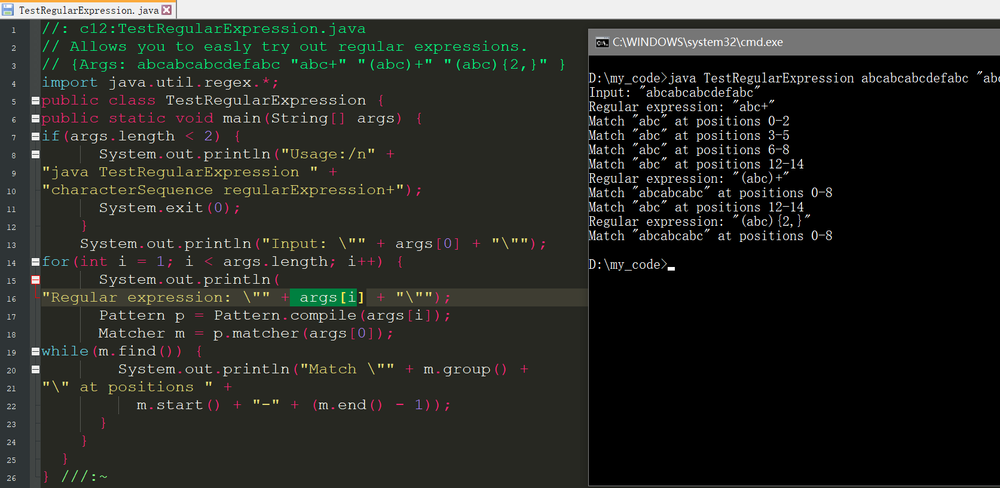

# Java基础-7-字符串和正则表达式

## String为什么不可变？

效率：（当不可变时，复制一个对象只用复制它的引用即可）

1. 字符串常量池的需要

字符串常量池(String pool, String intern pool, String保留池) 是Java堆内存中一个特殊的存储区域, 当创建一个String对象时,假如此字符串值已经存在于常量池中,则不会创建一个新的对象,而是引用已经存在的对象。 严格来说，这种常量池的思想,是一种优化手段.

2. 允许String对象缓存HashCode

Java中String对象的哈希码被频繁地使用, 比如在hashMap 等容器中。字符串不变性保证了hash码的唯一性,因此可以放心地进行缓存.这也是一种性能优化手段,意味着不必每次都去计算新的哈希码.

安全：

String被许多的Java类(库)用来当做参数,例如 网络连接地址URL,文件路径path,还有反射机制所需要的String参数等, 假若String不是固定不变的,将会引起各种安全隐患。

---

Java 正则表达式 

正则表达式及其用途。

Java 正则表达式--正则表达式是用来描述字符串的复杂构成规则的工具，用来进行字符串的匹配和处理的工具。具体用途包括：

1.找出字符串中匹配正则表达式的部分

2.校验是否符合正则表达式，如校验邮箱地址格式。

3.在目标字符串中匹配并替换。

Java中是如何支持正则表达式操作的？

一、java.util.regex.

Java从JDK1.4开始包含了一个支持正则表达式的包 java.util.regex. 它包含两个类，Pattern（模式类）和Matcher（匹配器类），Pattern类是用来表达和陈述所要搜索的模式的对象，Matcher类是真正影响搜索的对象。 还有一个例外类与之对应 PatternSyntaxException 当遇到不合法的搜索模式时，会抛出例外。

二、String类的支持

Java中的String类提供了支持正则表达式操作的方法，包括：matches()、replaceAll()、replaceFirst()、split()。find();

---

String /StringBuffer/StringBulider

String是字符串常量，StringBulider和StringBuffer是字符串变量。前者对象已经创建不可修改后者是直接对于对象本身操作的。

对于 str1="abc"， str2 ="def" ，str3=str1+str2;这样的操作：

 StringBuffer > String （大部分情况下）

例外： 在某些特别情况下， String 对象的字符串拼接其实是被 JVM 解释成了 StringBuffer 对象的拼接String S1 = “This is only a” + “ simple” + “ test”;

 StringBuffer Sb = new StringBuilder(“This is only a”).append(“ simple”).append(“ test”);

这种情况下String更快，这跟JVM的实现有关，S1 JVM直接认为是“This is only a simple test”.

线程安全性： StringBuffer中很多方法可以带有synchronized关键字，所以可以保证线程是安全的，StringBulider则没有。StringBuffer线程安全，StringBuilder线程不安全，底层实现上，StringBuffer其实就是比StringBuilder多了Synchronized修饰符。

总结：

String ：用于少量字符串操作的情况下

StringBuffer：用于多线程下在字符串缓冲区进行大量字符串操作。

StringBuilder ：用于单线程下在字符串缓冲区进行大量字符串操作。

StringBuilder和StringBuffer 如果可能首选StringBuilder。
