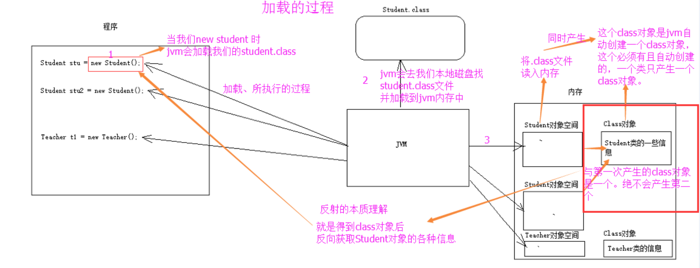

# Java基础-8-类型信息-反射

Java反射

[https://blog.csdn.net/sinat_38259539/article/details/71799078](https://blog.csdn.net/sinat_38259539/article/details/71799078)

反射就是把java类中的各种成分映射成一个个的Java对象

1. 加载的时候：JVM将class文件读入内存，并为之创建一个Class对象。

2. Class 类的实例表示正在运行的 Java 应用程序中的类和接口。也就是jvm中有多个实例的每个类都有该Class对象。（包括基本数据类型）一个类不管有多少实例，一个类只有一个Class对象。

3. Class 没有公共构造方法。Class 对象是在加载类时由 Java 虚拟机通过调用类加载器中的defineClass 方法自动构造的。也就是这不需要我们自己去处理创建，JVM已经帮我们创建好了。

类加载过程：



只要获取到该类的字节码文件对象。就可以使用Class类中的方法拆解一个类.Class这个类中常用的方法如：

forName(String className);

getField(String  name)

getMethod(String name, Class<?>... parameterTypes)

getConstructor(Class<?>... parameterTypes)

……等64个方法

获取Class对象有三种方法：

1. Object ——> getClass();

2. 任何数据类型（包括基本数据类型）都有一个“静态”的class属性

3. 通过Class类的静态方法：forName（String  className）(常用)

三种方式常用第三种，第一种对象有了就不需要反射了。第二种需要导入类的包，依赖太强。一般用第三种方式，一个字符串可以传入也可写在配置文件中等多种方法。


反射的作用

通过反射获取构造方法并使用

获取成员方法并调用

获取成员变量并调用

反射Main方法

通过反射运行配置文件

通过反射越过泛型检查

---

请你谈谈如何通过反射创建对象？

- 方法1：通过类对象调用newInstance()方法，例如：String.class.newInstance()

- 方法2：通过类对象的getConstructor()或getDeclaredConstructor()方法获得构造器（Constructor）对象并调用其newInstance()方法创建对象，例如：String.class.getConstructor(String.class).newInstance("Hello");

---

```java
package leetcode;

/**
 * TQR 2020/3/5
 */
public class TestRegex {

    public static void main(String[] args) {
        Student s = new Student();
        Class sClass1 = s.getClass();
        Class sClass2 = Student.class;
        Class sClass3 = null;
        try {
            sClass3 = Class.forName("leetcode.Student");
        } catch (ClassNotFoundException e) {
            e.printStackTrace();
        }
        System.out.println(sClass1 == sClass2);
        System.out.println(sClass2 == sClass3);

        try {
            assert sClass3 != null;
            Student s1= (Student) sClass3.newInstance();
            s1.func("hello world");
        } catch (InstantiationException e) {
            e.printStackTrace();
        } catch (IllegalAccessException e) {
            e.printStackTrace();
        }
    }
}
class Student{
    public Student(){
        System.out.println("构造方法执行");
    }
    public void func (String str){
        System.out.println("成员方法调用"+str);
    }
}
/*
构造方法执行
true
true
构造方法执行
成员方法调用hello world
*/
```

