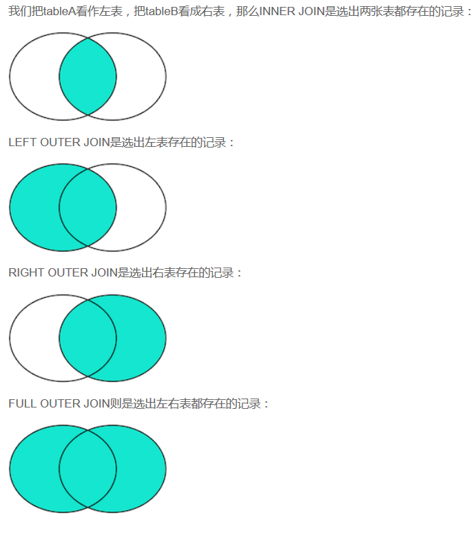

数据库-mysql

---

## 1.索引的实现：B+树－－－为啥选择了B+树？？

1. B+树是什么？

> B+树是一种平衡多路查找树。所有非叶子节点只保存索引，数据都保存在叶子节点中，叶子节点间有指针相连形成链表。专门为了磁盘或其它存储设备而设计的。

2. B+树的结构：

> 

3. 如此以来，在查找数据的时候可以不用将所有的数据都扫面一遍，提高查找效率。同时MySQL 将一个结点的大小设置成操作系统的一页，这样可以尽可能减少磁盘I/O。最终提高查找效率。第三B+树将所有叶子节点用指针相连使得更加方便对于数据库做全表扫描或者局部全表扫描。

4. 好处和缺点：

	----好处----

	> * 提高检索效率
	> * 降低I/O成本。
	> * 索引中的数据都是按照索引键键值进行排序后存放的，如果排序字段和索引键字段刚好一致可以省去排序。
	> * 分组操作也是需要先排序。如第三点。

	----坏处----

	>* 非聚集索引-----是完全独立于基础数据之外的一部分数据,如果有很多索引，将很耗空间。（聚集索引就是以主键为索引键表本身的存储结构）
	>* 索引需要维护，每次对表执行更新操作都需要额外更新索引。---且由于其B+树的数据结构，插入和删除节点可能引起树的结构的变化和重新调整。

## 2.索引的分类

### 1-存储上两大类：

物理上--------聚集索引和非聚集索引

逻辑上--------单列索引、复合索引-------------唯一索引、非唯一索引

1. 聚集索引-----所有查询最终都要用到聚集索引。----------有一种例外：覆盖索引。

	> 1. 数据行的物理顺序与索引列列值（一般是主键的那一列）的逻辑顺序相同，一个表中只能拥有一个聚集索引，MySQL默认在主键上创建聚集索引。它在插入删除的时候要移动数据。
	>
	> 2. 在以使用聚集索引查找时，也子节点上存放的直接就是表中的数据，可以直接查到数据。--非聚集索引不然。

2. 非聚集索引

	> 1. 该索引中索引的逻辑顺序与磁盘上行的物理存储顺序不同，一个表中可以拥有多个非聚集索引。
	>
	> 2. 非聚集索引和聚集索引同样是采用平衡树作为索引的数据结构。索引树结构中各节点的值来自于表中的索引字段， 假如给user表的name字段加上索引 ，  那么索引就是由name字段中的值构成，在数据改变时， DBMS需要一直维护索引结构的正确性。如果给表中多个字段加上索引 ，  那么就会出现多个独立的索引结构，每个索引（非聚集索引）互相之间不存在关联。
	> 3. 在使用非聚集索引的时候不能直接查到表中的数据，根据非聚集索引查到的是响应数据的主键，需要在根据主键在聚集索引上查一遍才能拿到值。

### 2-覆盖索引不需要再走聚集索引

>1. 覆盖索引：简单来讲就是“索引列”覆盖了要查询的列，（当然也覆盖了where字句的列，这时才会走索引）
>
>2. 原理：当为字段建立索引以后， 字段中的内容会被同步到索引之中， 如果为一个索引指定两个字段， 那么这个两个字段的内容都会被同步至索引之中。
>3. 只有BTree索引可以做覆盖索引。覆盖索引必须要存储索引的列，而哈希索引、空间索引和全文索引等都不存储索引列的值，所以MySQL只能使用B-Tree索引做覆盖索引

### 3-什么时候要创建索引---关于索引优化

1. 频繁作为查询条件的字段应该创建索引。---相反---不会出现在 WHERE 子句中的字段不该创建索引。

2. 唯一性太差的字段不适合单独创建索引（例如状态字段，可能全表就几个状态。---因为我们的目的是要通过所索引快速找到所要数据的主键，在状态字段上加索引显然不能达到目的）例如就三个状态，则一下返回全表3分之1的记录，跟没有索引一样，当然数据库执行引擎会做优化不会走这样的索引。

3. 更新非常频繁的字段不适合创建索引。

4. 在较小的字段上建索引比在大字段上建索引好，------------B+树每一页可以存储更多的索引值。比如int比text适合。

5. 避免空值---空值时的数据库进行查询优化很难，关键在与难以运算。

6. 复合索引优化---主要更具具体的场景具体分析，主要考虑几点：

	> 1. 多列索引比单列索引的查询效果好---多个过滤条件比单个条件的过滤效果好，能减少I/O次数。但是反过来多列索引更容易被变动，那么维护索引的代价升高和插入删除的效率降低。

### 4-对于多个单列索引

mysql一般只会使用其中一个，有的情况下会使用多个单列索引，执行INDEX_MERGE操作来优化，合并操作也是耗时操作。

### 5-前缀索引

例如我想在Text字段上建索引，只用text字段的前面一段作为索引值。

### 6-复合索引优化。

1. 复合索引有最左匹配原则，（A,B,C）----实际会创建（A），（A，B），（A，B，C）三个索引，（A，C）会走索引，B 不会，（B，C）也不会。原理：索引基于排序，先根据索引列排序，再将索引值划分为几个部分，复合索引就相当于先根据A排序，再根据B排序。
2. 对于排序的优化，假设建立索引时，指定了对于某个字段的索引的升序或者降序，那么对于查询语句，如果他的order by 和索引完全相同 和完全相反  ，则会走索引，否则不走索引。
3. like子句，第一个字符不能时通配符，如：like %车 或like  %车%  不使用索引，like 车%       使用索引。

### 7SQL 优化-----关于SQL优化略写了参考

https://blog.csdn.net/zhang6xin6yu/article/details/70035546

1. 使用不等于操作符(<>, !=)不会走索引，会做一次全表扫描，改成***\*select\**** * ***\*from\**** dept shere staff_num < 1000 or dept_id > 1000; 即可。

2. 使用函数，如果再索引列上使用了函数，则不会走索引，例如

	```sql
	    select * from staff where trunc(birthdate) = '01-MAY-82';  # 不走索引
	    select * from staff where birthdate < (to_date('01-MAY-82') + 0.9999);  # 走索引
	```

3. 比较不匹配的数据类型……

### 8.创建索引和删除

1. 建表时指定，`INDEX index_name (title(length))`

2. 建表后创建，`CREATE INDEX index_name ON table(column(length))`

3. 通过更改表创建 `ALTER TABLE table_name ADD INDEX index_name ON (column(length))`

删除索引：`DROP INDEX index_name ON table`

---

查看索引： show index from tablename；

查看SQL 语句对索引的使用情况：（查询SQL的查询执行计划QEP）在select语句前加上explain 即可。

----------

### B+树和B树的区别：

1. （中间节点是否存储记录)B+树中只有叶子节点会带有指向记录的指针，而B树则所有节点都带有，在内部节点出现的索引项不会再出现在叶子节点中。B树这样一来会使在节点大小相同时存储更少的索引，mySQL中通常将一个节点大小设置为一页来减少磁盘I/O。

2. （也子节点相连形成链表）B+树中所有叶子节点都是通过指针连接在一起，而B树不会。


---

## 1. Hash索引--和其他索引

哈希索引是基于哈希表来实现的，只有精确匹配所有的索引列才能生效。 也就是说假设有个hash索引 key (col1,col2) 那么每次只有 col1和col2两个字段都用才能够生效。因为生成hash索引的时候是根据一个hash函数对所有的索引列取hash值来实现的。

1. 第一步，计算出hash值，hash(张三) = 1287

2. 第二步，定位行号，比如key=1287 对应的行号为3

3. 第三步，找到指定行并且比较name列值是否为张三做个校验

---

2. 空间数据索引( R-Tree )----MyISAM 表支持空间索引，可以用作地理数据存储。和B-Tree 索引不同，这类索引无须前缀查询。空间索引会从所有唯独来索引数据。查询时，可以有效地使用任意维度来组合查询。

3. 全文索引-----全文索引是一种特殊类型的索引，它查找的是文本中的关键词，而不是直接比较索引中的值。全文索引和其他几类索引的匹配方式完全不一样。它有许多需要注意的细节，如停用词、词干和复数、布尔搜索等。

## 事务ACID特性：

1. 事务的原子性Atomicity：指事务内部的SQL操作要么全部成功，要么全部失败。
2. 事务的一致性Consistency：即事务执行的结果必须使数据库从一个一致性的状态转变到另一个一致性的状态。
3. 事务的隔离性Isolation：指一个事务内部的SQL操作及操作的数据库对象对并发的其它会话事务是隔离的。
4. 事务持久性Durability：指事务一旦提交，对数据库的改变是永久的。

事务的提交模式

提交数据有三种类型：显式提交、隐式提交及自动提交。下面分别说明这三种类型。

1、显式提交：用COMMIT命令直接完成的提交为显式提交。其格式为：SQL>COMMIT；

2、隐式提交：用SQL命令间接完成的提交为隐式提交。这些命令是：ALTER，AUDIT，COMMENT，CONNECT，CREATE，DISCONNECT，DROP，EXIT，GRANT，NOAUDIT，QUIT，REVOKE，RENAME。

3、自动提交：若把AUTOCOMMIT设置为ON，则在插入、修改、删除语句执行后，系统将自动进行提交，这就是自动提交。其格式为：SQL>SET AUTOCOMMIT ON；

## 隔离级别和并发冲突

1. 事务

	* 事务是有N步数据库操作序列组成对逻辑执行单元，这系列操作要么全部执行，要么全部放弃

2. 事务的特性ACID

	* 原子性（Atomicity) 事务是应用中不可再分的最小执行体
	* 一致性（Consistency） 事务执行的结果，必须使数据库从一个一致性状态变为另一个一致性状态
	* 隔离性（Isolation）各个事务的执行互不干扰，任何事务的内部操作对其他事务都是隔离的。
	* 持久性（Durability）事务一旦提交，对数据所作的任何改变都要记录到永久存储器中。

3. 隔离性很重要：

	1. 常见并发异常：

		1. 第一类丢失更新，第二类丢失更新

			> 第一类丢失更新: 某一个事务回滚，导致另外一个事务已经更新的数据丢失。Ar-Br-Bw-Bc-Aw-Aroll
			>
			> 第二类丢失更新：某一个事务提交导致另外一个事务已经更新的数据丢失。Ar-Br-Bw-Bc-Aw-Ac

		2. 脏读，不可重复读，幻读

			> 脏读： 一个事务读取了另一个事务未提交的数据 Ar-Aw-Br-Ac
			>
			> 不可重复读：对同一个数据前后读取的结果不一致。Ar-Br-Aw-Aw-Br
			>
			> 幻读：对同一个表前后查询的行数不一致。Bselect-Ainsert-Acommit-Bslect

	2. 常见隔离级别

		1. Read Uncommitted: 读未提交 --------------四种情况都可能发生
		  2. Read Committed： 读取已提交的数据-----解决了脏读和第一类丢失修改
		  3. Repeatable Read：可重复读-----------------解决了不可重复读和第二类丢失修改
		  4. Serizlizable：串行化----------------------------解决幻读。

	3. 实现机制

		1. 悲观锁
			* 共享锁（S锁） 事务A对某数据加了共享锁后，其他事务只能对该数据加共享锁，但不能加排他锁
			* 排他锁（X锁） 事务A对某数据加了排它锁之后，其他事务对该数据既不能加共享锁也不能加排它锁
		2. 乐观锁（自定义）
			* 版本号、时间戳
			* 在更新数据前，检查版本号是否繁盛变化。若变化则取消本次更新，否则就更新数据（版本号+1）

---------------------


### MySQL锁

范围：

表级锁：开销小、加锁快、发生锁冲突的概率高、并发度低、不会出现死锁。（myISAM默认表级锁）

行级锁：开销大、加锁慢、发生锁冲突的概率低、并发度高，会出现死锁。（InnoDB)

### 类型（InnoDB)

1. 共享锁（S）：行级锁，读取一行；---别人可以读

2. 排他锁（X）：行级锁，更新一行；

3. 意向共享锁（IS）：表级，准备加共享锁；----在加共享锁之前

4. 意向排他锁（IX）：表级，准备加排它锁；-----在加排它锁之前

5. 间隙锁（NK）：行级，使用范围条件时；

	对范围内不存在的记录加锁，一是为了防止幻读，二是为了满足回复和复制的需要。

|      |  IS  |  IX  |  S   |  X   |
| :--: | :--: | :--: | :--: | :--: |
|  IS  |  ✅   |  ✅   |  ✅   |  ⭕   |
|  IX  |  ✅   |  ✅   |  ⭕   |  ⭕   |
|  S   |  ✅   |  ⭕   |  ✅   |  ⭕   |
|  X   |  ⭕   |  ⭕   |  ⭕   |  ⭕   |

### 加锁

1. 增加行级锁之前，InnoDB会自动给表加意向锁；---自动加锁
2. 执行DML语句时，InnoDB会自动给数据加排他锁；---自动加锁
3. 执行DQL（数据库查询语言）语句时---手动加锁
	1. 共享锁（S）：SELECT……FROM……WHERE……LOCK IN SHARE MODE；
	2. 排他锁（X）：SELECT……FROM……WHERE……FOR UPDATE；
	3. 间隙锁（NK）：上述SQL采用范围条件时，InnoDB对不存在的记录自动增加间隙锁。

### 死锁

1. 场景
	1. 事务1：UPDATE  T SET ... WEHERE ID = 1; UPDATE T SET ... WHERE ID = 2;
	2. 事务2：UPDATE T SET ... WHERE ID = 2;  UPDATE T SET ... WHERE ID = 1;
2. 解决方案
	1. InnoDB 会自动检测死锁，使一个事务回滚，另一个事务继续；
	2. 设置超时等待参数 innodb_lock_wait_timeout;
3. 避免死锁
	1. 不同业务并发访问多个表时，应约定以相同的顺序来访问这些表；
	2. 以批量的方式处理书籍时，影视先对数据排序，保证线程按固定的顺序来处理数据。
	3. 在事务中，如果要更新记录，应直接申请足够级别的锁，即排他锁；

### 悲观锁（数据库）乐观锁（自定义）

1. 版本号机制
	1. UPDATE ... SET ..., VERSION=#(VERSION+1) WHERE ... AND VERSION = ${VERSION}
2. CAS算法（Compare and swap)
	1. 是一种无锁的算法，该算法设计3个操作数，（内存值V，旧值A，新值B），当V等于A时，采用原子方式用B更新V的值，该算法通常采用自旋操作，也叫自旋锁。他的缺点是：
		* ABA 问题：某线程将A改为B，再改回A，则CAS会被误认为A没被修改过。
		* 自旋锁采用循环的方式实现，若加锁时间长，则会给CPU带来巨大的开销。
		* CAS只能保证一个共享变量的原子操作

### 索引

1. B+Tree（InnoDB）
	* 数据分块存储，每一块称为一页；
	* 所有的值都是按顺序存储的，并且每一个叶子到根的距离相同；
	* 非叶节点存储数据的边界，也子节点存储指向数据行的指针；
	* 通过边界缩小数据的范围，从而避免全表扫描，加快了查找的速度。


--------

## 数据库乐观锁和悲观锁

悲观锁

悲观锁（Pessimistic Lock）假定会发生并发冲突，屏蔽一切可能违反数据完整性的操作。每次在拿数据的时候都会上锁

乐观锁

乐观锁（Optimistic Lock）乐观锁：假设不会发生并发冲突，不加锁，只在提交操作时检查是否违反数据完整性。用于读多写少的应用场景，可以提高吞吐量。

乐观锁一般来说有以下2种方式：----解决A-B-A问题

使用数据版本（Version）记录机制实现

这是乐观锁最常用的一种实现方式。即为数据增加一个版本标识，一般是通过为数据库表增加一个数字类型的 “version” 字段来实现。当读取数据时，将version字段的值一同读出，数据每更新一次，对此version值加一。当我们提交更新的时候，判断数据库表对应记录的当前版本信息与第一次取出来的version值进行比对，如果数据库表当前版本号与第一次取出来的version值相等，则予以更新，否则认为是过期数据。

使用时间戳（timestamp）。同样是在需要乐观锁控制的table中增加一个字段，名称无所谓，字段类型使用时间戳（timestamp）, 和上面的version类似，也是在更新提交的时候检查当前数据库中数据的时间戳和自己更新前取到的时间戳进行对比，如果一致则OK，否则就是版本冲突。

---

mysql的主从复制

[https://www.cnblogs.com/kylinlin/p/5258719.html](https://www.cnblogs.com/kylinlin/p/5258719.html)

---

---

Statement 和 PreparedStatement

1. 效率。 PreparedStatement是预编译的,对于批量处理可以大大提高效率. 也叫JDBC存储过程。 使用 Statement 对象。在对数据库只执行一次性存取的时侯，用 Statement 对象进行处理。PreparedStatement 对象的开销比Statement大，对于一次性操作并不会带来额外的好处。

2. 便捷和可读性。 带有不同参数的同一SQL语句被多次执行的时候，不必重复SQL语句的句法，而只需更改其中变量的值，便可重新执行SQL语句。 这样在随后的运行中可以节省时间并增加代码的可读性。

3. 安全性。传递给PreparedStatement对象的参数可以被强制进行类型转换，使开发人员可以确保在插入或查询数据时与底层的数据库格式匹配。 减少SQL的编译错误，减少SQL注射攻击的可能性。

---

SQL

条件查询：where子句 后面可以跟 条件表达式，与或非 and  or  not （not不常用，应为等价于<>）

投影查询：只查询某些列，select  列1 as 别名，列2 as 别名 from ……。

排序： SELECT id, name, gender, score FROM students ORDER BY score DESC, gender;先对score降序排列，相同在对gender升序。默认升序

分页查询： limit n条记录 offset  偏移量；（若偏移量等于3，则本次从4开始）

若最后一页只有1条记录，因此最终结果集按实际数量1显示。

LIMIT 3表示的意思是“最多3条记录”。OFFSET超过了查询的最大数量并不会报错，而是得到一个空的结果集。

OFFSET是可选的，如果只写LIMIT 15，那么相当于LIMIT 15 OFFSET 0。

在MySQL中，LIMIT 15 OFFSET 30还可以简写成LIMIT 30, 15。

使用LIMIT <M> OFFSET <N>分页时，随着N越来越大，查询效率也会越来越低。

聚合查询：SELECT COUNT(*) as numbers FROM students;  

如果聚合查询的WHERE条件没有匹配到任何行，COUNT()会返回0，而SUM()、AVG()、MAX()和MIN()会返回NULL

|SUM
     |计算某一列的合计值，该列必须为数值类型
|AVG
     |计算某一列的平均值，该列必须为数值类型
|MAX
     |计算某一列的最大值
|MIN
     |计算某一列的最小值
|group by
|按某一列或多列分组查询

分组 SELECT class_id, COUNT(*) num FROM students GROUP BY class_id;

请使用一条SELECT查询查出每个班级男生和女生的平均分：

select class_id, gender, avg(score)as avgscore from students group by gender,class_id;

多表查询： SELECT * FROM <表1> <表2>。 多表查询 又称笛卡尔查询， 结果集是目标表的行数乘积 。要使用表名.列名这样的方式来引用列和设置别名，这样就避免了结果集的列名重复问题。还允许给表设置一个别名，让我们在投影查询中引用起来稍微简洁一点：

连接查询：

INNER JOIN查询的写法是：

1. 先确定主表，仍然使用FROM <表1>的语法；

2. 再确定需要连接的表，使用INNER JOIN <表2>的语法；

3. 然后确定连接条件，使用ON <条件...>，这里的条件是s.class_id = c.id，表示students表的class_id列与classes表的id列相同的行需要连接；

4. 可选：加上WHERE子句、ORDER BY等子句。

使用别名不是必须的，但可以更好地简化查询语句。

INNER JOIN只返回同时存在于两张表的行数据， RIGHT OUTER JOIN返回右表都存在的行， LEFT OUTER JOIN则返回左表都存在的行。



关系数据库的基本操作就是增删改查，即CRUD：Create、Retrieve、Update、Delete。其中，对于查询，我们已经详细讲述了SELECT语句的详细用法。

而对于增、删、改，对应的SQL语句分别是：

* INSERT：插入新记录；

* UPDATE：更新已有记录；

* DELETE：删除已有记录。

INSERT ：

INSERT INTO students (class_id, name, gender, score) VALUES

  (1, '大宝', 'M', 87),

  (2, '二宝', 'M', 81);

字段顺序不必和数据库表的字段顺序一致，但值的顺序必须和字段顺序一致。

UPDATE:

UPDATE <表名> SET 字段1=值1, 字段2=值2, ... WHERE ...;

SET score=score+10就是给当前行的score字段的值加上了10。

如果WHERE条件没有匹配到任何记录，UPDATE语句不会报错，也不会有任何记录被更新。

DELETE

DELETE FROM <表名> WHERE ...;

WHERE条件没有匹配到任何记录，DELETE语句不会报错，也不会有任何记录被删除。

要查看一个表的结构，使用命令：mysql> DESC students;

命令查看创建表的SQL语句：SHOW CREATE TABLE students;

修改表就比较复杂。如果要给students表新增一列birth，使用：

ALTER TABLE students ADD COLUMN birth VARCHAR(10) NOT NULL;

要修改birth列，例如把列名改为birthday，类型改为VARCHAR(20)：

ALTER TABLE students CHANGE COLUMN birth birthday VARCHAR(20) NOT NULL;

要删除列，使用：

ALTER TABLE students DROP COLUMN birthday;

-----------

## Innodb 和 MyISM 的区别和选取

1、MyISAM：默认表类型，它是基于传统的ISAM类型，ISAM是Indexed Sequential Access Method (有索引的顺序访问方法)  的缩写，它是存储记录和文件的标准方法。不是事务安全的，而且不支持外键，如果执行大量的select  MyISAM比较适合。---------适合大量的查询和插入。

2、InnoDB：支持事务安全的引擎，支持外键、行锁是他的最大特点。如果有大量的update和insert，建议使用InnoDB，特别是针对多个并发和QPS较高的情况。----------适合大量更新和插入。

MyISAM强调性能执行速度比Innodb快，但是不支持事务，Innodb更关注并发安全，如果需要大量的读操作，并发冲突比较少，可以使用MyISAM，如果并发冲突比较多，需要更新update insert，Innodb比较合适。--主要和他们存储的方式不同