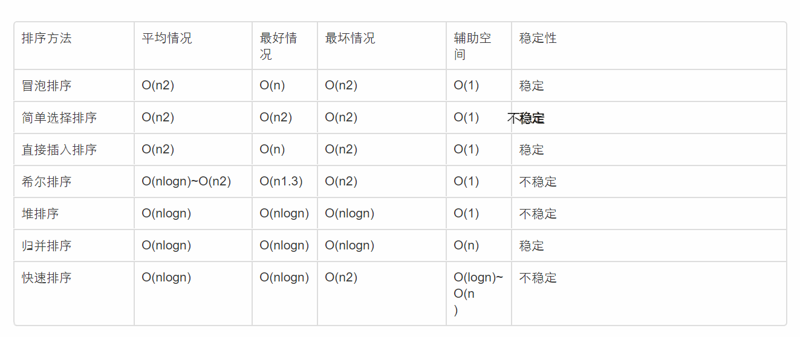
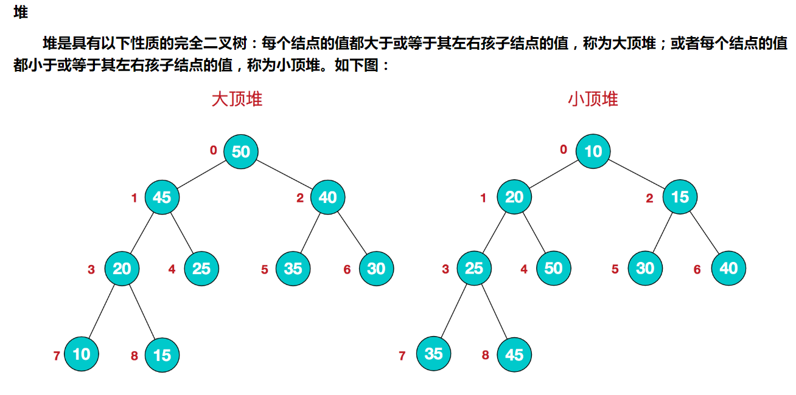
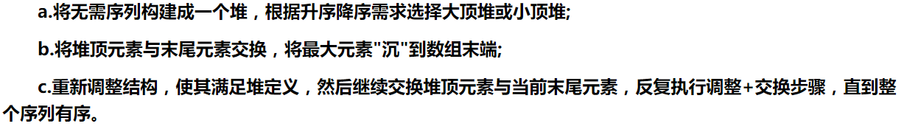
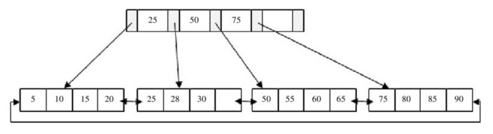
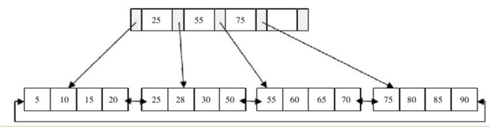
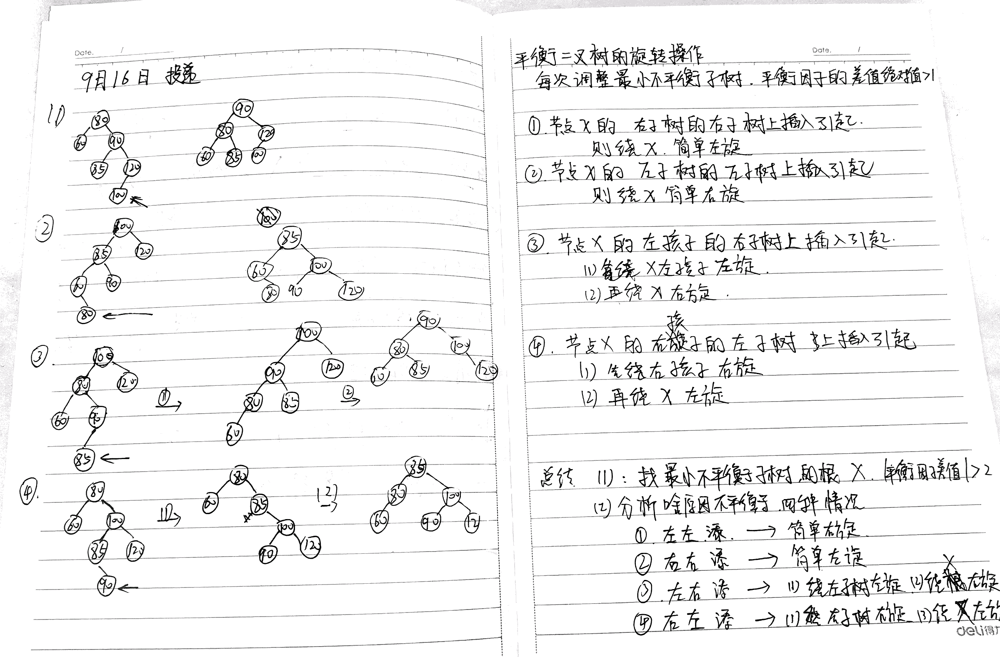
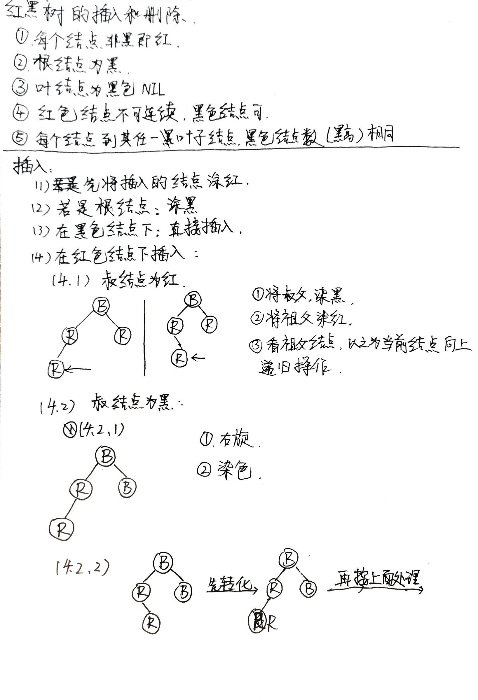
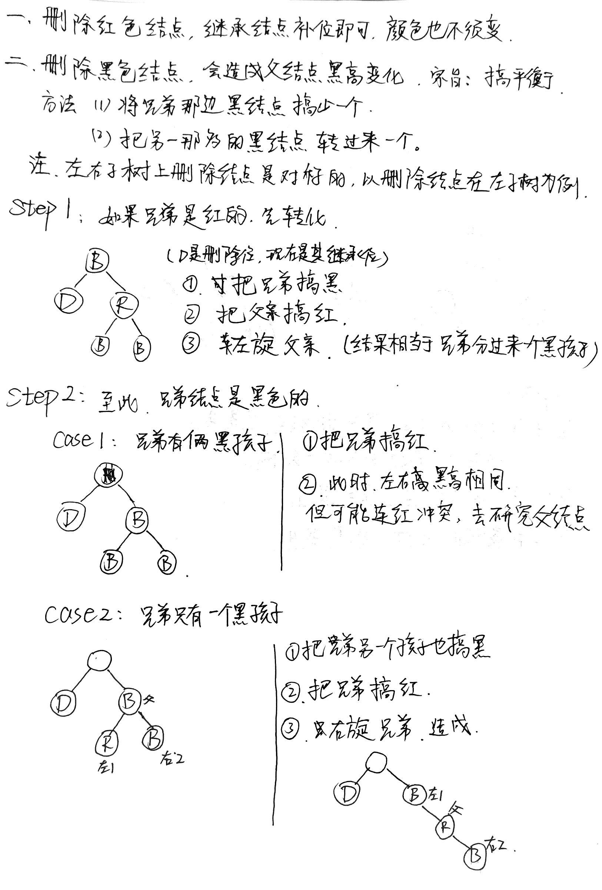
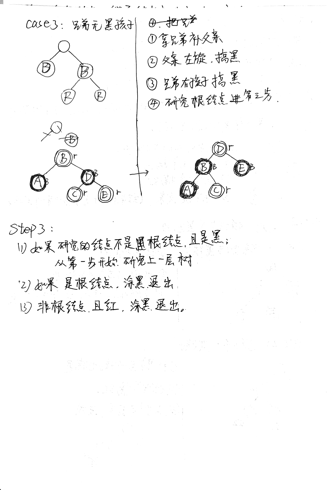

# 数据结构

哈希Hash---主要是hashMap,把集合类的操作搞熟练。

---

树：二叉树遍历-手撕代码，B+树，红黑树。

---

二叉树的各种扭曲遍历

---

反转链表，链表操作。

现在有一个单向链表，如何判断链表中是否出现了环

单链表有环，是指单链表中某个节点的next指针域指向的是链表中在它之前的某一个节点，这样在链表的尾部形成一个环形结构。

最常用方法：定义两个指针，同时从链表的头节点出发，一个指针一次走一步，另一个指针一次走两步。如果走得快的指针追上了走得慢的指针，那么链表就是出现了环形链表（有可能前面都是正常链表最后有个小环）；如果走得快的指针走到了链表的末尾（next指向 NULL）都没有追上第一个指针，那么链表就不是环形链表。

---

数组各种神仙操作，旋转数组。

---

队列 Java优先队列 PriorityQueue

优先级队列的定义

* 优先级队列是逻辑结构是小根堆，存储结构是动态数组（到达上限，容量自动加一）的集合类。这里是Java。

优先级队列的特点

* 优先级队列里的元素必须有优先级！！！优先级是前后排序的“规则”，也就是说插入队列的类必须实现内部比较器或拥有外部比较器（在构造函数中当参数）！！！！

* 优先级队列的拥有小根堆的所有特性。

* 优先级队列不是线程安全的。为什么？说不是就不是，没有同步，并发就有可能冲突。

* 优先级队列不允许使用null元素。

* 插入方法（offer()、poll()、remove() 、add() 方法）时间复杂度为O(log(n))；remove(Object) 和 contains(Object) 时间复杂度为O(n)；检索方法（peek、element 和 size）时间复杂度为常量。

* 优先级队列本身并非一个有序（从a[0]-a[n]全部升序）序列，只有当你把元素一个个取出的时候，这些取出的元素所排成的序列才是有序序列。原因很简单，优先级队列是一个小根堆，也就是只能保证根节点（a[0]）是最小的，其余元素的顺序不能保证（当然，其他元素必须遵守小根堆的特性），当我们取出元素（poll）时，我们只能取出根节点的元素，然后把堆的最后一个元素剪切到根节点（这种取出方式是底层算法规定的，充分利用了堆的特性），然后对所有剩余元素进行建堆，建堆之后根节点元素还是最小的（初始堆中的第二小）。由此特点，我们可以引出另外两个知识点：①优先级队列的迭代器遍历出来的数组是没有排序的，只是个小根堆。②如果我们想得到有序的堆，需要把堆先转为数组，然后arrays.sort(queue.toarray)，arrays.sort(queue.toarray，comparator对象)或者其他sort方法。

* 优先级队列（堆）中的插入就只能插到最后，也就是说添加和插入一个意思；删除也只能删第一个。

* 注：每个元素的优先级根据问题的要求而定。当从优先级队列中取出一个元素后，可能出现多个元素具有相同的优先权。在这种情况下，把这些具有相同优先权的元素视为一个先来先服务的队列，按他们的入队顺序进行先后处理。

常用方法：

添加（插入）：

public boolean add(E e)

查看（只返回根节点元素，不删除）：

public E peek()

取出（返回根节点元素，会删除源数据）：

public E poll()

删除（如果有多个相同元素，只会删除第一个）:

public boolean remove(Object o)

还有就是一些collection类通有的方法，不多说了

记住！！！所有会破坏堆的特性的方法（比如插入删除等）的源码里最后都会加一个建堆方法（siftUp(i, e)，也可以说交换方法，调整方法），使队列保持堆的特性

Java中优先队列的使用：

你可以丢给priority 任意的对象可以是自己的对象也可以是Integer等对对象，但是必须保证该对象是可排序的，要么就丢给它一个comparator比较器。这样以来，出队列的顺序就是排序后的顺序。

---

堆和栈

String str = new String("hello");

上面的语句中变量str放在栈上，用new创建出来的字符串对象放在堆上，而"hello"这个字面量放在静态区。

各司其职

栈内存用来存储局部变量和方法调用。

堆内存用来存储Java中的对象。无论是成员变量，局部变量，还是类变量，它们指向的对象都存储在堆内存中。

独有还是共享

栈内存归属于单个线程，每个线程都会有一个栈内存，其存储的变量只能在其所属线程中可见，即栈内存可以理解成线程的私有内存。

而堆内存中的对象对所有线程可见。堆内存中的对象可以被所有线程访问。

异常错误

如果栈内存没有可用的空间存储方法调用和局部变量，JVM会抛出java.lang.StackOverFlowError。

而如果是堆内存没有可用的空间存储生成的对象，JVM会抛出java.lang.OutOfMemoryError。

空间大小

栈的内存要远远小于堆内存，如果你使用递归的话，那么你的栈很快就会充满。如果递归没有及时跳出，很可能发生StackOverFlowError问题。

---

各种排序/各种查找/图论--克鲁斯卡尔/迪杰斯特拉 

查找算法：

顺序查找：

二分查找O(logn)：

斐波那契查找：和二分很相似，但不是二分而是每次把两边分成黄金分割。

插值查找：根据关键字在整个有序表中所处的位置，让mid值的变化更靠近关键字key，这样也就间接地减少了比较次数。对于表长较大，而关键字分布又比较均匀（12345.均匀，1，2，3，100，101，不均匀）的查找表来说，插值查找算法的平均性能比折半查找要好的多。反之，数组中如果分布非常不均匀，那么插值查找未必是很合适的选择。

树表查找：二叉查找树。2-3查找树，红黑树，B+树。

分块查找：先将要查找的数据分块，块与块之间的元素必须有序，但是块内元素不需有序，先找到块，在块内进行顺序查找。

哈希查找：hash表

解决哈希冲突的算法：

哈希函数有五种实现方式：

A. 直接定址法：取关键字的线性函数值作为哈希地址。

B. 数字分析法：取关键字的中的若干位作为哈希地址。

C. 平方取中法：取关键字平方后的中间几位作为哈希地址。

D. 折叠法：将关键字分割成位数相同的几部分（最后一部分可以不同），然后取这几部分的叠加和作为哈希地址。

E. 除留余数法：H(key) = key MOD p ，p<=m ，m为不大于哈希表的数。

F. 随机函数法

上述五中实现方式中最常用的是除留余数法，而通过哈希函数寻址的过程可能出现“冲突”------即若干个不同的key却对应相同的哈希地址。

解决哈希冲突有如下的方法：

1、开放定址法(线性探测，D(i)=(H(i)+d)MOD M。二次探测，伪随机探测)

公式为：fi(key) = (f(key)+di) MOD m (di=1,2,3,……,m-1)

2、链地址法

哈希map，

3、再散列（双重散列，多重散列）

有多个不同的Hash函数，当发生冲突时，使用第二个，第三个，….，等哈希函数

4、建立一个公共溢出区。

假设哈希函数的值域为[0,m-1],则设向量HashTable[0..m-1]为基本表，另外设立存储空间向量OverTable[0..v]用以存储发生冲突的记录。

一个线性探测再散列（开放定址法线性探测）的例子：

已知一个线性表（38，25，74，63，52，48），假定采用散列函数h（key) = key%7计算散列地址，并散列存储在散列表A【0....6】中，若采用线性探测方法解决冲突，则在该散列表上进行等概率成功查找的平均查找长度为（）//平均查找长度就是各数查找次数之和/6。

解题步骤：

线性表（38，25，74，63，52，48）

1：进行38这个数据处理 ：38%7 = 3，直接把38放在3这个位置1

[ 0][1][2][3][4][5][6]---->[0][1][2][38][4][5][6]

2:处理25 25%7=4，同样把25放在4就行 2

[0][1][2][38][25][5][6]

3:接下来是74 74%7=4，但是这时候4上已经放了25了。得进行线性探测。3

H(74) = 4;根据线性探测：D(i)=(H(i)+d)MOD M(M为散列表长度7)

d=1时候 D(1) = (4+1)%7=5散列表中5位置为空，所以可以把74放在位置5处。4

[0][1][2][38][25][74][6]

4:接下来是63 63%7=0直接把63放在0处 5

[63][1][2][38][25][74][6]

5:接下来是52 52%7=3但是位置3已经有38了冲突6

线性探测：D（1）=（3+1）%7=4 4上有25了 冲突7

D(2)=(3+2)%7=5 5上有74了 冲突 8

D(3) = (3+3)%7=6可以 把52放在6位置上9

[63][1][2][38][25][74][52]

6:接下来是48

48%7=6 6位置有52了冲突10

D（1）=（6+1）%7=0 0上有63了冲突11

D(2)=(6+2)%7=1 1上还木有。可以放12

最终结果：[63][48][2][38][25][74][52]

从表中可以看出2位置为空。冲突和比较一共进行了12次，有6个元素。长度为12/6=2.

---

image.png

---

排序算法：

简单排序算法：

1.冒泡排序：最好情况，原本就有序O（n）

在这种情况下需要加入一个标志，就是说假如第一趟没有需要交换的对象，那么后面都不用再继续比较了，就是一趟结束。

for(int i=length;i>0;i--){

    for(int j=0;j<i;j++){

        if(num[i]>num[i+1]) swap(num[i],num[j]);

    }

}

2.简单选择排序：好坏O（n^2),时间复杂度不变，不稳定

每一趟选择最大或者最小的记录放到队列头或队列尾。

3.直接插入排序：

从两个数开始，后面的依次往里面插入。稳定。因为插入过程是从后面往前面比较然后插入，所以最好情况下只需O（n）

---

6.归并排序：最好和最坏的时间复杂度是nlogn。辅助空间是n。稳定

7.快速排序：最好和平均情况下，时间复杂度是nlogn,最坏情况下退化成O（N^2).即当原本是降序有序，要排升序有序，就退化成了冒泡排序。不稳定。

4.希尔排序：缩小增量排序，是一种插入排序 希尔排序是把记录按下标的一定增量分组，对每组使用直接插入排序算法排序；随着增量逐渐减少，每组包含的关键词越来越多，当增量减至1时，整个文件恰被分成一组，算法便终止。  希尔排序中对于增量序列的选择十分重要，直接影响到希尔排序的性能。我们上面选择的增量序列{n/2,(n/2)/2...1}(希尔增量)，其最坏时间复杂度依然为O(n2)，一些经过优化的增量序列如Hibbard经过复杂证明可使得最坏时间复杂度为O(n3/2)。

5.堆排序： 堆排序是一种选择排序，它的最坏，最好，平均时间复杂度均为O(nlogn)，它也是不稳定排序。首先简单了解下堆结构。

---

B+树是为磁盘或其他直接存取辅助设备而设计的一种平衡查找树，在B+树中，所有记录节点都是按键值的大小顺序存放在同一层的叶节点中，各叶节点指针进行连接。

B+树的结构：

分为IndexPage 和LeafPage , 每一页有一个能存放最多M条记录。现假设M=3；

IndexPage 的结构是这样的：

每个节点node有下面的属性： 

1. n个关键字key[1],key[2], … ,key[n]，以非降序存放，使得key[1]≤key[2]≤…≤key[n]；

2. Node*类型的parent指针，指向该节点的父节点，插入删除时候，分裂节点时候用到

3. n个指向其孩子children[0],children[1], … , children[n]，的指针，叶子节点没有孩子。

4. 每个叶子节点有指向下一个节点的指针next，方便遍历整棵B+树。

5. 每个叶子节点具有相同的深度，即树的高度h。 每个节点所包含的关键字个数有上界和下界，但根节点很特殊。

6. 内部节点并不存储真正的信息，而是保存其叶子节点的最小值作为索引。 (处有争议以最大值作为索引，似乎也可行，不过很别扭)

插入和删除：

插入过程：先根据关键字找到所在的叶子节点，然后分为三种情况：

1、叶子节点未满：直接插入

2、叶子节点满了，看该叶子节点的上一层索引节点满了没，未满：先将要插入的值插入叶子节点，这时候叶子节点多一个值，去中间的值作为新的键值将该叶子节点分裂为两个节点，同时修改上一层索引节点。

3、叶子节点满了，上一层索引节点也满了，那么递归执行第2步，直到满足条件，根节点也可以修改。

因为每次分页操作可能会很麻烦，不到不得已，不分页，当该叶子节点满了，但是其左右兄弟节点还未满的时候，先执行的是旋转操作左图插入70：先插入，再转一下，把索引节点里的键值变换一下。

删除过程

B+树使用填充因子（fill factor）来控制树的删除变化，50%是填充因子可设的最小值。B+树的删除操作同样必须保证删除后叶节点中的记录依然排序。插入过程是看节点满不满，删除过程是看是否小于填充因子，填充因子最小的可设的值是50%;

1.当删除后叶子节点和索引节点都不小于50%，直接删

2.删完会造成叶子节点小于50%，则合并叶子节点，更新索引节点，删的恰好是索引节点的值，就那他旁边的值填充它的位置

3.删完后，索引节点和叶子节点都小于50%，从下往上合并。每次都是

删-》合并叶子-》合并索引

插-》分裂叶子-》更新

---

二叉查找树 叫BST

平衡二叉树 又叫ALV树，是一种自平衡的二叉查找树。

alv 的删除：

1.无左右子树：直接删除即可。

2.仅有左子树或右子树，在仅有的那个子树上进行：

3.有左右子树，在高度较高的子树上删除。

删除过程：将继承节点的值赋给当前结点，在子节点上递归。

---

红黑树： [https://juejin.im/entry/58371f13a22b9d006882902d](https://juejin.im/entry/58371f13a22b9d006882902d)

