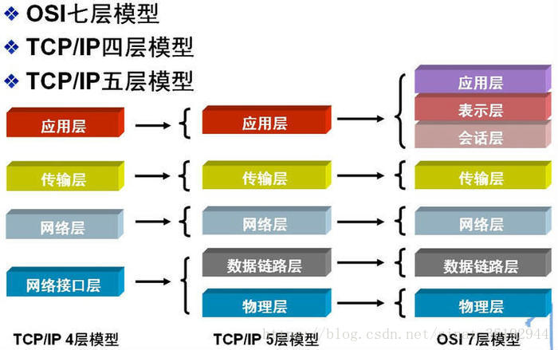
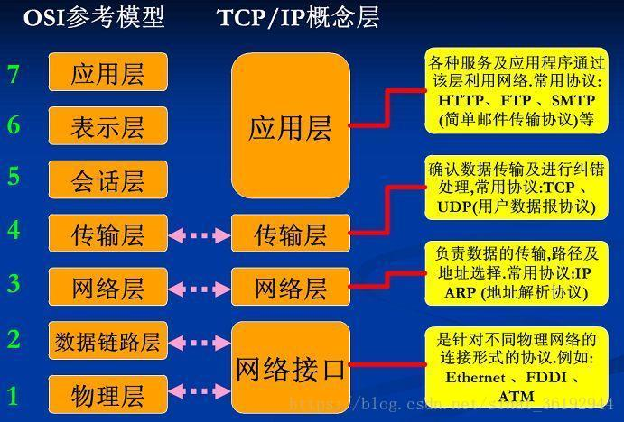
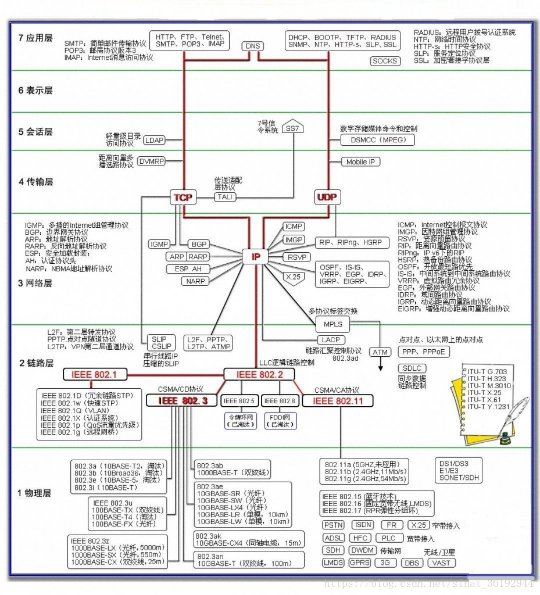
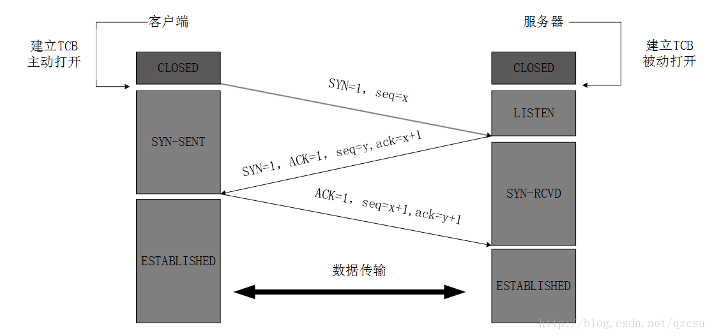
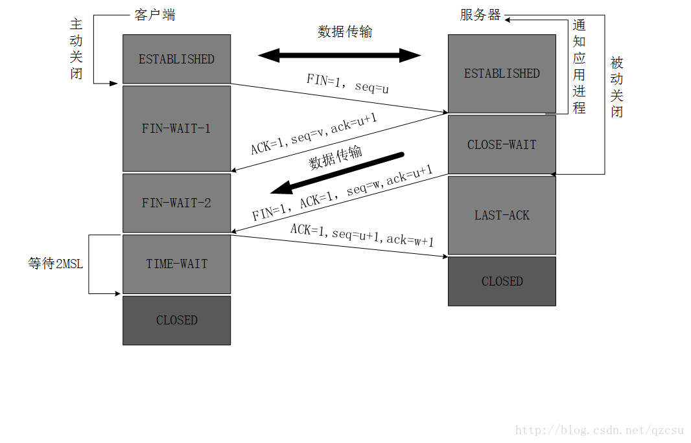
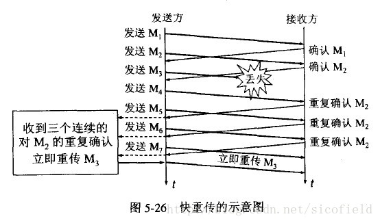

# 计算机网络

**计算机网络 **

---

**计算及网络分层模型**

协议数据单元PDU（Protocol Data Unit）是指对等层次之间传递的数据单位

物理层的 PDU是数据位（bit）

数据链路层的 PDU是数据帧（frame）

网络层的PDU是数据报（packet）

传输层的 PDU是数据段（segment）

其他更高层次的PDU是报文（message）

应用层: (典型设备:应用程序，如FTP，SMTP ，HTTP)message

DHCP(Dynamic Host Configuration Protocol)动态主机分配协议，使用 UDP 协议工作，主要有两个用途：给内部网络或网络服务供应商自动分配 IP 地址，给用户或者内部网络管理员作为对所有计算机作中央管理的手段。实现即插即用连网。

DNS （Domain Name System ）域名解析<端口号53>

FTP （File Transfer Protocol ）文件传输协议<端口号21>减少或消除不同操作系统下处理文件的不兼容性。

HTTP （Hypertext Transfer Protocol ）超文本传输协议 <端口号 80>， 面向事务的应用层协议。

POP3 (Post Office Protocol 3) 即邮局协议的第3 个版本，用于接受邮件。

SMTP （Simple Mail Transfer Protocol ）简单邮件传输协议 <端口号25> 用于发送邮件。

SSH （Secure Shell ）安全外壳协议

TELNET 远程登录协议 <端口号23>

传输层: (典型设备: 进程和端口) 数据单元：数据段 （Segment）

TCP （Transmission Control Protocol ）传输控制协议提供可靠的面向连接的服务，传输数据前须先建立连接，结束后释放。可靠的全双工信道。可靠、有序、无丢失、不重复。

UDP (User Datagram Protocol ）用户数据报协议发送数据前无需建立连接，不使用拥塞控制，不保证可靠交付，最大努力交付。

网络层: (典型设备:路由器，防火墙、多层交换机) 数据单元：数据包（Packet ）

IP (IPv4 · IPv6) (Internet Protocol) 网络之间互连的协议

ARP (Address Resolution Protocol) 即地址解析协议，实现通过IP 地址得 知其物理地址。

RARP (Reverse Address Resolution Protocol)反向地址转换协议允许局域 网的物理机器从网关服务器的 ARP 表或者缓存上请求其 IP地址。

ICMP (Internet Control Message Protocol ）Internet 控制报文协议。它是TCP/IP 协议族的一个子协议，用于在IP 主机、路由器之间传递控制消息。

ICMPv6 :

IGMP (Internet Group Management Protocol) Internet 组管理协议,是因特 网协议家族中的一个组播协议，用于 IP 主机向任一个直接相邻的路由器报 告他们的组成员情况。

RIP (Router information protocol) 路由信息协议是一种在网关与主机之间交换路由选择信息的标准。

OSPF (Open Shortest Path Firs)开放式最短路径优先,分布式链路状态协议。

BGP（Border Gateway Protocol ）边界网关协议，用来连接Internet 上独立系统的路由选择协议.采用路径向量路由选择协议。

数据链路层: (典型设备: 网卡，网桥，交换机) 数据单元：帧 （Frame）

ARQ（Automatic Repeat-reQuest ）自动重传请求协议，错误纠正协议之一，包括停止等待ARQ 协议和连续ARQ 协议，错误侦测、正面确认、逾时重传与负面确认继以重传等机制。

停止等待协议：

CSMA/CD(Carrrier Sense Multiple Access with Collision Detection)载波监听多点接入/碰撞检测协议。总线型网络，协议的实质是载波监听和碰撞检测。载波监听即发数据前先检测总线上是否有其他计算机在发送数据，如暂时不发数据，避免碰撞。碰撞检测为计算机边发送数据边检测信道上的信号电压大小。

PPP(Point-to-Ponit Protocol)点对点协议面向字节，由三部分组成：

一个将IP 数据报封装到串行链路的方法

一个用于建立、配置和测试数据链路连接的链路控制协议LCP

一套网络控制协议NCP

HDLC （High-Level Data Link Control ）高级数据链路控制同步网上传输数据、面向比特的数据链路层协议。

ATM （Asynchronous Transfer Mode ）异步传递方式，建立在电路交换和分组交换的基础上的一种面向连接的快速分组交换技术。 “异步”是指将ATM 信元“异步插入”到同步的 SDH 比特流中。如同步插入则用户在每帧中所占的时隙相对位置固定不变。“同步”是指网络中各链路上的比特流都是受同一非常精确的主时钟的控制。Wi-Fi 、WiMAX 、DTM 、令牌环、以太网、FDDI 、帧中继、 GPRS 、 EVDO 、HSPA 、L2TP 、ISDN

物理层:(典型设备：中继器，集线器) 数据单元：比特（Bit）

光纤、 同轴电缆、双绞线…

---

TCP协议三次握手四次挥手

在TCP层，有个FLAGS字段，这个字段有以下几个标识：SYN, FIN, ACK, PSH, RST, URG.

其中，对于我们日常的分析有用的就是前面的五个字段。

 它们的含义是：

SYN表示建立连接，

FIN表示关闭连接，

ACK表示响应，

PSH表示有 DATA数据传输，

RST表示连接重置。

套接字socket： IP地址+端口号。例如，若IP地址为192.3.4.16 而端口号为80，那么得到的套接字为192.3.4.16:80。

1. TCP服务器进程先创建传输控制块TCB，时刻准备接受客户进程的连接请求，此时服务器就进入了LISTEN（监听）状态；

2. TCP客户进程也是先创建传输控制块TCB，然后向服务器发出连接请求报文，这是报文首部中的同部位SYN=1，同时选择一个初始序列号 seq=x ，此时，TCP客户端进程进入了 SYN-SENT（同步已发送状态）状态。TCP规定，SYN报文段（SYN=1的报文段）不能携带数据，但需要消耗掉一个序号。

3. TCP服务器收到请求报文后，如果同意连接，则发出确认报文。确认报文中应该 ACK=1，SYN=1，确认号是ack=x+1，同时也要为自己初始化一个序列号 seq=y，此时，TCP服务器进程进入了SYN-RCVD（同步收到）状态。这个报文也不能携带数据，但是同样要消耗一个序号。

4. TCP客户进程收到确认后，还要向服务器给出确认。确认报文的ACK=1，ack=y+1，自己的序列号seq=x+1，此时，TCP连接建立，客户端进入ESTABLISHED（已建立连接）状态。TCP规定，ACK报文段可以携带数据，但是如果不携带数据则不消耗序号。

5. 当服务器收到客户端的确认后也进入ESTABLISHED状态，此后双方就可以开始通信了。

为什么TCP客户端最后还要发送一次确认？

主要防止已经失效的连接请求报文突然又传送到了服务器，从而产生错误。

如果使用的是两次握手建立连接，假设有这样一种场景，客户端发送了第一个请求连接并且没有丢失，只是因为在网络结点中滞留的时间太长了，由于TCP的客户端迟迟没有收到确认报文，以为服务器没有收到，此时重新向服务器发送这条报文，此后客户端和服务器经过两次握手完成连接，传输数据，然后关闭连接。此时此前滞留的那一次请求连接，网络通畅了到达了服务器，这个报文本该是失效的，但是，两次握手的机制将会让客户端和服务器再次建立连接，这将导致不必要的错误和资源的浪费。

如果采用的是三次握手，就算是那一次失效的报文传送过来了，服务端接受到了那条失效报文并且回复了确认报文，但是客户端不会再次发出确认。由于服务器收不到确认，就知道客户端并没有请求连接。

1. 客户端进程发出连接释放报文，并且停止发送数据。释放数据报文首部，FIN=1，其序列号为seq=u（等于前面已经传送过来的数据的最后一个字节的序号加1），此时，客户端进入FIN-WAIT-1（终止等待1）状态。 TCP规定，FIN报文段即使不携带数据，也要消耗一个序号。

2. 服务器收到连接释放报文，发出确认报文，ACK=1，ack=u+1，并且带上自己的序列号seq=v，此时，服务端就进入了CLOSE-WAIT（关闭等待）状态。TCP服务器通知高层的应用进程，客户端向服务器的方向就释放了，这时候处于半关闭状态，即客户端已经没有数据要发送了，但是服务器若发送数据，客户端依然要接受。这个状态还要持续一段时间，也就是整个CLOSE-WAIT状态持续的时间。

3. 客户端收到服务器的确认请求后，此时，客户端就进入FIN-WAIT-2（终止等待2）状态，等待服务器发送连接释放报文（在这之前还需要接受服务器发送的最后的数据）。

4. 服务器将最后的数据发送完毕后，就向客户端发送连接释放报文，FIN=1，ack=u+1，由于在半关闭状态，服务器很可能又发送了一些数据，假定此时的序列号为seq=w，此时，服务器就进入了LAST-ACK（最后确认）状态，等待客户端的确认。

5. 客户端收到服务器的连接释放报文后，必须发出确认，ACK=1，ack=w+1，而自己的序列号是seq=u+1，此时，客户端就进入了TIME-WAIT（时间等待）状态。注意此时TCP连接还没有释放，必须经过2∗MSL（最长报文段寿命）的时间后，当客户端撤销相应的TCB后，才进入CLOSED状态。

6. 服务器只要收到了客户端发出的确认，立即进入CLOSED状态。同样，撤销TCB后，就结束了这次的TCP连接。可以看到，服务器结束TCP连接的时间要比客户端早一些。

为什么客户端最后还要等待2MSL？

MSL（Maximum Segment Lifetime），TCP允许不同的实现可以设置不同的MSL值。

第一，保证客户端发送的最后一个ACK报文能够到达服务器，因为这个ACK报文可能丢失，站在服务器的角度看来，我已经发送了FIN+ACK报文请求断开了，客户端还没有给我回应，应该是我发送的请求断开报文它没有收到，于是服务器又会重新发送一次，而客户端就能在这个2MSL时间段内收到这个重传的报文，接着给出回应报文，并且会重启2MSL计时器。

第二，防止类似与“三次握手”中提到了的“已经失效的连接请求报文段”出现在本连接中。客户端发送完最后一个确认报文后，在这个2MSL时间中，就可以使本连接持续的时间内所产生的所有报文段都从网络中消失。这样新的连接中不会出现旧连接的请求报文。

为什么建立连接是三次握手，关闭连接确是四次挥手呢？

建立连接的时候， 服务器在LISTEN状态下，收到建立连接请求的SYN报文后，把ACK和SYN放在一个报文里发送给客户端。

而关闭连接时，服务器收到对方的FIN报文时，仅仅表示对方不再发送数据了但是还能接收数据，而自己也未必全部数据都发送给对方了，所以己方可以立即关闭，也可以发送一些数据给对方后，再发送FIN报文给对方来表示同意现在关闭连接，因此，己方ACK和FIN一般都会分开发送，从而导致多了一次。

如果已经建立了连接，但是客户端突然出现故障了怎么办？

TCP还设有一个保活计时器，显然，客户端如果出现故障，服务器不能一直等下去，白白浪费资源。服务器每收到一次客户端的请求后都会重新复位这个计时器，时间通常是设置为2小时，若两小时还没有收到客户端的任何数据，服务器就会发送一个探测报文段，以后每隔75秒发送一次。若一连发送10个探测报文仍然没反应，服务器就认为客户端出了故障，接着就关闭连接。

---

请说明一下http和https的区别

HTTPS在HTTP的基础上加入了SSL协议，SSL依靠证书来验证服务器的身份，依靠加密为浏览器和服务器之间建立安全通道。

过程：

1. 客户机发起Https连接请求，服务器将自己的CA证书发送给客户机，里面包含了自己的公钥，（这里通过CA证书，验证了是官方的服务器，没有被劫持）

2. 客户机产生一个会话密钥，然后用公钥加密发送给服务器。

3. 服务器用自己的私钥解密得到会话密钥。

4. 此时客户机和服务器获得了一个只有他俩才知道的会话密钥，开始通信。

优点：

1. 认证用户和服务器确保数据发送到正确的客户机和服务器。

2. 安全：防偷窥（加密）防窃取（证书）

3. HTTPS是现行架构下最安全的解决方案，虽然不是绝对安全，但它大幅增加了中间人攻击的成本。

缺点

（1）HTTPS协议握手阶段比较费时，会使页面的加载时间延长近50%，增加10%到20%的耗电；

（2）HTTPS连接缓存不如HTTP高效，会增加数据开销和功耗，甚至已有的安全措施也会因此而受到影响；

（3）SSL证书需要钱，功能越强大的证书费用越高，个人网站、小网站没有必要一般不会用。

（4）SSL证书通常需要绑定IP，不能在同一IP上绑定多个域名，IPv4资源不可能支撑这个消耗。

（5）HTTPS协议的加密范围也比较有限，在黑客攻击、拒绝服务攻击、服务器劫持等方面几乎起不到什么作用。最关键的，SSL证书的信用链体系并不安全，特别是在某些国家可以控制CA根证书的情况下，中间人攻击一样可行。

---

请讲一下浏览器从接收到一个URL，到最后展示出页面，经历了哪些过程。

1.DNS解析 

2.TCP连接 

3.发送HTTP请求 

4.服务器处理请求并返回HTTP报文 

  4.1负载均衡

  4.2应用服务器

  4.3数据库服务器

  4.4缓存服务器，redis，

  4.5消息队列

  4.6搜索

  4.7HTTP响应报文

5.浏览器解析渲染页面（先拿到的是html，对于js，css等再去下载，最后轩如按出来给用户）。

---

TCP拥塞控制

慢开始、拥塞避免、快恢复、快重传

慢开始：发送方维持一个叫做拥塞窗口cwnd（congestion window）的状态变量，（拥塞窗口可以理解为一次发送的数据量）由小到大逐渐增加拥塞窗口的大小。 乘法增长，一次扩大2倍。还需设置一个慢开始门限ssthresh状态变量。当cwnd<ssthresh时，使用慢开始算法。当cwnd>ssthresh时，改用拥塞避免算法。当cwnd=ssthresh时，慢开始与拥塞避免算法任意。

拥塞避免算法：让拥塞窗口缓慢增长，即每经过一个往返时间RTT就把发送方的拥塞窗口cwnd加1，而不是加倍。这样拥塞窗口按线性规律缓慢增长。在慢开始阶段和拥塞避免阶段，只要发送方判断网络出现拥塞，就把慢开始门限设置为出现拥塞时的发送窗口大小的一半。然后把拥塞窗口设置为1，执行快恢复。

快重传：要求接收方在收到一个失序的报文段后就立即发出重复确认（为的是使发送方及早知道有报文段没有到达对方）而不要等到自己发送数据时捎带确认。快重传算法规定，发送方只要一连收到三个重复确认就应当立即重传对方尚未收到的报文段，而不必继续等待设置的重传计时器时间到期。

快恢复算法：当发送方连续收到三个重复确认时，就执行“乘法减小”算法，把ssthresh门限值设置为出现拥塞时拥塞窗口的一半。将cwnd设置为ssthresh的大小，然后执行拥塞避免算法。

---

网络层

ARP协议和ARP攻击

ARP（Address Resolution Protocol）地址解析协议，目的是实现IP地址到MAC地址的转换。

而通过目标设备的IP地址查找目标设备的MAC地址就是ARP协议的基本功能。

ARP协议的工作过程

由于内部网络中主机的IP地址往往是动态分配的，因此，在主机中是有ARP缓存的，记录着本网络中IP地址与MAC地址的对应关系。那么，这个ARP缓存是怎么生成的呢？首先，当网络中的主机A需要向主机B发送信息时，会将包含目标IP地址的ARP请求广播到该网络中的所有主机上，网络中的其他主机在收到主机A的ARP请求后可以自主的发送ARP应答报文，应答中包含自己的IP和自己的MAC地址，主机B也会发送这样的应答报文给主机A。这样主机A就知道了主机B的MAC地址与IP地址了。

二 ARP攻击

ARP攻击的第一步就是ARP欺骗。

ARP欺骗

ARP的应答报文是可以伪造的。假设一个网络中有3台主机，分别为A、B和C。当主机A向网络中发送了ARP请求时，用于攻击的主机C可以假装是B，然后向主机A发送一个伪造的ARP应答报文，由于A并不会采取措施验证该报文真伪，而是直接存入自己的ARP缓存并在需要时使用，由此，C就成功的欺骗了A。那么来自主机B的正确的应答报文去哪了？如果A收到了来自B的正确的应答报文，更新了自己的ARP缓存，那么C的ARP欺骗不就失败了吗？确实会发生这种情况，但是如果C不断的向网络中的各台主机大量发送伪造的ARP应答报文，直到同时欺骗了A和B，C就成功的对主机A和B进行了ARP欺骗。接下来C就可以监听A和B之间的流量，伪造A和B的通信内容或者阻止A和B的通信。

为什么ARP攻击只能发生在局域网

ARP攻击之所以能够产生，是因为伪造了对ARP广播的应答，广播有一些特别，由于广播域的存在（一般一个局域网就是一个广播域），所以路由器在收到广播数据时拒绝向其它网络转发，路由器实际上起到了分离广播域，隔离广播数据的作用。综合上述分析可知，如果用于攻击的主机并不在目标网络中，就接收不到目标网络中ARP请求的广播，其伪造的ARP应答也无法到达目标网络。因此，ARP攻击只能发生在局域网（子网）内部。

ICMP协议

ICMP全名为(INTERNET CONTROL MESSAGE PROTOCOL)网络控制消息协议。

ICMP报文就像是IP报文的小弟，总顶着IP报文的名头出来混。因为ICMP报文是在IP报文内部的，如图：

它是TCP/IP协议族的一个子协议，用于在IP主机、路由器之间传递控制消息。

控制消息是指网络通不通、主机是否可达、路由是否可用等网络本身的消息。

这些控制消息虽然并不传输用户数据，但是对于用户数据的传递起着重要的作用。

---

---

---

DNS解析过程链接：

1、客户机发出查询请求，先在浏览器缓存中查找，再在本地计算机缓存查找，若没有找到，就会将请求发送给dns服务器

2、先发送给本地dns服务器，本地的就会在自己的区域里面查找，若找到，根据此记录进行解析。

3、本地服务器没有找到客户机查询的信息，就会将此请求发送到根域名dns服务器

4、根域名服务器解析客户机请求的根域部分，它把包含的下一级的dns服务器的地址返回到客户机的dns服务器地址

5、客户机的dns服务器根据返回的信息接着访问下一级的dns服务器

6、这样递归的方法一级一级接近查询的目标，最后在有目标域名的服务器上面得到相应的IP信息

7、客户机的本地的dns服务器会将查询结果返回给我们的客户机

8、客户机根据得到的ip信息访问目标主机，完成解析过程

浏览器缓存--》操作系统缓存--》本地域名服务器--》根域名服务器--》下一级DNS服务器

DNS：基于UDP和TCP

客户端向DNS服务器请求解析IP的时候用UDP，DNS服务器之间同步DNS信息的时候用TCP。
