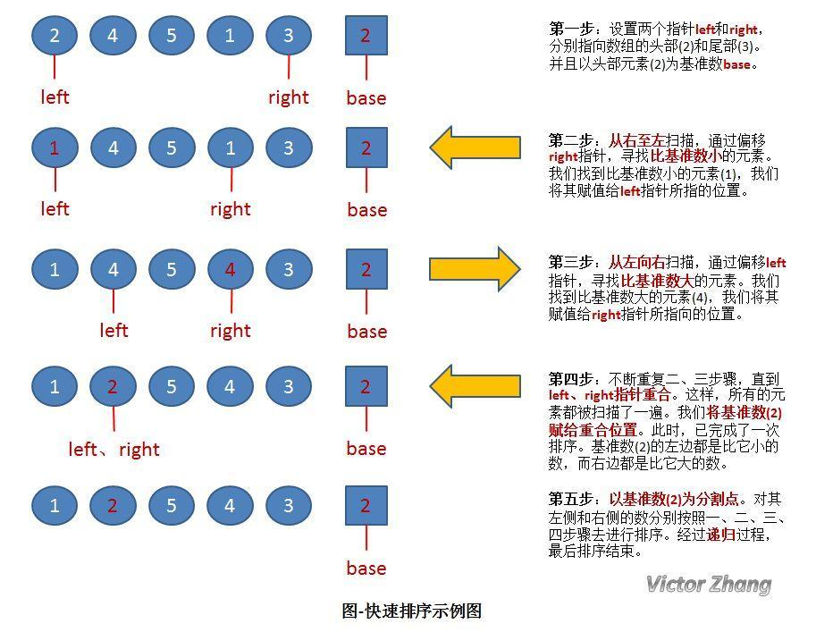

# 剑指offer第28题-数组中出现超过一半的数字

## 题目描述

数组中有一个数字出现的次数超过数组长度的一半，请找出这个数字。例如输入一个长度为9的数组{1,2,3,2,2,2,5,4,2}。由于数字2在数组中出现了5次，超过数组长度的一半，因此输出2。如果不存在则输出0。

---

此题太灵活了！！！！！！！

题解：

方法一：我认为最好的，因为最简单

数组排序，然后中间值肯定是要查找的值。 排序最小的时间复杂度（快速排序）O(NlogN)，加上遍历。

方法二：

使用散列表的方式，也就是统计每个数组出现的次数，输出出现次数大于数组长度的数字。

方法三：剑指offer推荐的

出现的次数超过数组长度的一半，表明这个数字出现的次数比其他数出现的次数的总和还多。

考虑每次删除两个不同的数，那么在剩下的数中，出现的次数仍然超过总数的一般，不断重复该过程，排除掉其他的数，最终找到那个出现次数超过一半的数字。这个方法的时间复杂度是O(N)，空间复杂度是O(1)。

换个思路，这个可以通过计数实现，而不是真正物理删除。在遍历数组的过程中，保存两个值，一个是数组中数字，一个是出现次数。当遍历到下一个数字时，如果这个数字跟之前保存的数字相同，则次数加1，如果不同，则次数减1。如果次数为0，则保存下一个数字并把次数设置为1，由于我们要找的数字出现的次数比其他所有数字出现的次数之和还要多，那么要找的数字肯定是最后一次把次数设为1时对应的数字。

方法四、改进的快排

前面提到，如果对一个数组进行排序，位于中间位置的那个数字肯定是所求的值。对数组排序的时间复杂度是O(nlog(n))，但是对于这道题目，还有更好的算法，能够在时间复杂度O(n)内求出。

借鉴快速排序算法，其中的Partition()方法是一个最重要的方法，该方法返回一个index，能够保证index位置的数是已排序完成的，在index左边的数都比index所在的数小，在index右边的数都比index所在的数大。那么本题就可以利用这样的思路来解。

* 通过Partition()返回index，如果index==mid，那么就表明找到了数组的中位数；如果index<mid，表明中位数在[index+1,end]之间；如果index>mid，表明中位数在[start,index-1]之间。知道最后求得index==mid循环结束。

附：快速排序：

