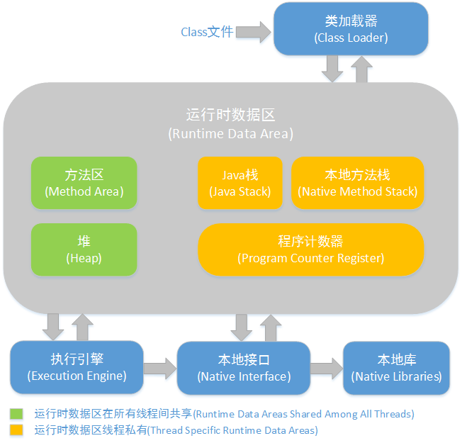

# JVM-第3部分-虚拟机执行子系统

第六章 类文件结构

6.1 无关性的基石：字节码+虚拟机  虚拟机主要解决平台无关，字节码则在保持java虚拟机的语言中立特性上有作用且字节码的语言描述能力强于java语法

6.2 class 类文件的结构

Class文件是一组以8位字节为基础单位的二进制流，各个数据项目严格按照顺序紧凑地排列在Class文件之中，中间没有添加任何分隔符，Class文件中存储的内容几乎全部是程序运行的必要数据。当遇到需要占用8位字节以上空间的数据项时，则会按照高位在前（高位字节在低地址位）的方式分割成若干个8位字节进行存储

6.2.1 魔数与Class文件的版本

Class文件的头4个字节称为魔数（Magic Number),唯一作用是确定这个文件是否为一个能被虚拟机接受的Class文件。使用魔数而不是扩展名来进行识别主要是基于安全方面的考虑，因为文件扩展名可以随意地改动。Class文件的魔数值为：0xCAFEBABE（16进制：咖啡宝贝）紧接着4个字节存储的是Class文件的版本号：第5和第6个字节是次版本号（Minor Version），第7和第8个字节是主版本号（Major Version）

6.2.2　常量池

紧接着主次版本号之后的是常量池入口，常量池可以理解为Class文件之中的资源仓库，它是Class文件结构中与其他项目关联最多的数据类型，也是占用Class文件空间最大的数据项目之一，同时它还是在Class文件中第一个出现的表类型数据项目。

常量池结构常量池中主要存放两大类常量:字面量（Literal）和符号引用（Symbolic References）。

字面量比较接近于Java语言层面的常量概念，如文本字符串、声明为final的常量值等。

符号引用则属于编译原理方面的概念，包括了下面三类常量：

类和接口的全限定名（Fully Qualified Name）

字段的名称和描述符（Descriptor）

方法的名称和描述符

在Class文件中不会保存各个方法、字段的最终内存布局信息，因此这些字段、方法的符号引用不经过运行期转换的话无法得到真正的内存入口地址，也就无法直接被虚拟机使用。当虚拟机运行时，需要从常量池获得对应的符号引用，再在类创建时或运行时解析、翻译到具体的内存地址之中。

6.2.3访问标志

在常量池结束之后，紧接着的两个字节代表访问标志（access_flags），这个标志用于识别一些类或者接口层次的访问信息，包括：这个Class是类还是接口；是否定义为public类型；是否定义为abstract类型；如果是类的话，是否被声明为final等。

……

……

……

……不想写了

---

6.3 字节码指令简介

Java虚拟机的指令由一个字节长度的、代表着某种特定操作含义的数字（称为操作码，Opcode）以及跟随其后的零至多个代表此操作所需参数（称为操作数，Operands）而构成。由于Java虚拟机采用面向操作数栈而不是寄存器的架构（这两种架构的区别和影响将在第8章中探讨），所以大多数的指令都不包含操作数，只有一个操作码。

字节码指令集，由于限制了Java虚拟机操作码的长度为一个字节（即0～255），这意味着指令集的操作码总数不可能超过256条；又由于Class文件格式放弃了编译后代码的操作数长度对齐，在某种程度上会导致解释执行字节码时损失一些性能。优势：放弃了操作数长度对齐，可以省略很多填充和间隔符号；用一个字节来代表操作码，也是为了尽可能获得短小精干的编译代码。这种追求尽可能小数据量、高传输效率的设计是由Java语言设计之初面向网络、智能家电的技术背景所决定的，并一直沿用至今。如果不考虑异常处理的话，那么Java虚拟机的解释器可以使用下面这个伪代码当做最基本的执行模型来理解，这个执行模型虽然很简单，但依然可以有效地工作：

do{

    自动计算PC寄存器的值加1；

    根据PC寄存器的指示位置，从字节码流中取出操作码；

    if（字节码存在操作数）从字节码流中取出操作数；

        执行操作码所定义的操作；

}while（字节码流长度＞0）

……

……

……不想写了

---

第七章 虚拟机类加载机制

7.1 类加载的时机

对类的主动引用会触发类的初始化，有且只有”5种场景:

1. 当虚拟机启动时，用户需要指定一个要执行的主类（包含main（）方法的那个类），虚拟机会先初始化这个主类。

2. 使用new关键字实例化对象的时候、读取或设置一个类的静态字段（被final修饰、已在编译期把结果放入常量池的静态字段除外）的时候，以及调用一个类的静态方法的时候。

3. 使用java.lang.reflect包的方法对类进行反射调用的时候，如果类没有进行过初始化，则需要先触发其初始化。

4. 当初始化一个类的时候，如果发现其父类还没有进行过初始化，则需要先触发其父类的初始化。

5. 当使用JDK 1.7的动态语言支持时，如果一个java.lang.invoke.MethodHandle实例最后的解析结果REF_getStatic、REF_putStatic、REF_invokeStatic的方法句柄，并且这个方法句柄所对应的类没有进行过初始化，则需要先触发其初始化。

有三种特殊情况：

1. 对于静态字段，只有直接定义这个字段的类才会被加载

/**

*被动使用类字段演示一：

*通过子类引用父类的静态字段，不会导致子类初始化

**/

public class SuperClass{

    static{

        System.out.println（"SuperClass init！"）；

    }

    public static int value=123；

}

public class SubClass extends SuperClass{

    static{

        System.out.println（"SubClass init！"）；

    }

}

public class NotInitialization{

    public static void main（String[]args）{

        System.out.println（SubClass.value）；

    }

}

上述代码运行之后，只会输出“SuperClass init！”，而不会输出“SubClass init！”。

   2.访问final修饰的，在编译阶段已通过常量传播优化放在常量池中了

/**

*被动使用类字段演示三：

*常量在编译阶段会存入调用类的常量池中，本质上并没有直接引用到定义常量的类，因此不会触发定义常量的类的初始化。

**/

public class ConstClass{

    static{

        System.out.println（"ConstClass init！"）；

    }

    public static final String HELLOWORLD="hello world"；

}

/**

*非主动使用类字段演示

**/

public class NotInitialization{

    public static void main（String[]args）{

        System.out.println（ConstClass.HELLOWORLD）；

    }

}

上述代码运行之后，也没有输出“ConstClass init！”

   3.new数组不会触发

/**

*被动使用类字段演示二：

*通过数组定义来引用类，不会触发此类的初始化

**/

public class NotInitialization{

    public static void main（String[]args）{

        SuperClass[]sca=new SuperClass[10]；

    }

}

为了节省版面，这段代码复用了代码清单7-1中的SuperClass，运行之后发现没有输出“SuperClassinit！”，

7.2 类加载过程

1-加载：在加载阶段，虚拟机需要完成以下3件事情：

1. 通过一个类的全限定名来获取定义此类的二进制字节流。

2. 将这个字节流所代表的静态存储结构转化为方法区的运行时数据结构。

3. 在内存中生成一个代表这个类的java.lang.Class对象，作为方法区这个类的各种数据的访问入口。

通过一个类的全限定名来获取定义此类的二进制字节流Java发展历程中，充满创造力的开发人员则在这个“舞台”上玩出了各种花样，许多举足轻重的Java技术都建立在这一基础之上，例如：

* 从ZIP包中读取，这很常见，最终成为日后JAR、EAR、WAR格式的基础。

* 从网络中获取，这种场景最典型的应用就是Applet。

* 运行时计算生成，这种场景使用得最多的就是动态代理技术，在java.lang.reflect.Proxy中，就是用了ProxyGenerator.generateProxyClass来为特定接口生成形式为“*$Proxy”的代理类的二进制字节流。

* 由其他文件生成，典型场景是JSP应用，即由JSP文件生成对应的Class类。

* 从数据库中读取，这种场景相对少见些，例如有些中间件服务器（如SAP Netweaver）可以选择把程序安装到数据库中来完成程序代码在集群间的分发。

* ……

对于数组类，数组类本身不通过类加载器创建，它是由Java虚拟机直接创建的。但数组类的元素类型最终是要靠类加载器去创建，一个数组类创建过程就遵循以下规则：

* 如果数组的组件类型（Component Type，指的是数组去掉一个维度的类型）是引用类型，那就递归采用本节中定义的加载过程去加载这个组件类型，数组C将在加载该组件类型的类加载器的类名称空间上被标识。

* 如果数组的组件类型不是引用类型（例如int[]数组），Java虚拟机将会把数组C标记为与引导类加载器关联。

* 数组类的可见性与它的组件类型的可见性一致，如果组件类型不是引用类型，那数组类的可见性将默认为public。

加载阶段完成后，虚拟机外部的二进制字节流就按照虚拟机所需的格式存储在方法区之中。然后在内存中实例化一个java.lang.Class类的对象（并没有明确规定是在Java堆中，对于HotSpot虚拟机而言，Class对象比较特殊，它虽然是对象，但是存放在方法区里面），这个对象将作为程序访问方法区中的这些类型数据的外部接口。

加载阶段与连接阶段的部分内容（如一部分字节码文件格式验证动作）是交叉进行的，加载阶段尚未完成，连接阶段可能已经开始，但这些夹在加载阶段之中进行的动作，仍然属于连接阶段的内容，这两个阶段的开始时间仍然保持着固定的先后顺序。

---

2-验证：

这一阶段的目的是为了确保Class文件的字节流中包含的信息符合当前虚拟机的要求，并且不会危害虚拟机自身的安全。大致上会完成下面4个阶段的检验动作：文件格式验证、元数据验证、字节码验证、符号引用验证。

1.文件格式验证

第一阶段要验证字节流是否符合Class文件格式的规范，这阶段的验证是基于二进制字节流进行的，只有通过了这个阶段的验证后，字节流才会进入内存的方法区中进行存储，所以后面的3个验证阶段全部是基于方法区的存储结构进行的，不会再直接操作字节流。并且能被当前版本的虚拟机处理。

这一阶段可能包括下面这些验证点：

* 是否以魔数0xCAFEBABE开头。

* 主、次版本号是否在当前虚拟机处理范围之内。

* 常量池的常量中是否有不被支持的常量类型（检查常量tag标志）。

* 指向常量的各种索引值中是否有指向不存在的常量或不符合类型的常量。

* CONSTANT_Utf8_info型的常量中是否有不符合UTF8编码的数据。

* Class文件中各个部分及文件本身是否有被删除的或附加的其他信息。

* ……远不止这些

2.元数据验证

第二阶段是对字节码描述的信息进行语义分析，以保证其描述的信息符合Java语言规范的要求，保证不存在不符合Java语言规范的元数据信息。

这个阶段可能包括的验证点如下：

* 这个类是否有父类（除了java.lang.Object之外，所有的类都应当有父类）。

* 这个类的父类是否继承了不允许被继承的类（被final修饰的类）。

* 如果这个类不是抽象类，是否实现了其父类或接口之中要求实现的所有方法。

* 类中的字段、方法是否与父类产生矛盾（例如覆盖了父类的final字段，或者出现不符合规则的方法重载，例如方法参数都一致，但返回值类型却不同等）。

* ……

3.字节码验证

主要目的是通过数据流和控制流分析，确定程序语义是合法的、符合逻辑的。这个阶段将对类的方法体进行校验分析，保证被校验类的方法在运行时不会做出危害虚拟机安全的事件。 如果一个类方法体的字节码没有通过字节码验证，那肯定是有问题的；但如果一个方法体通过了字节码验证，也不能说明其一定就是安全的。

例如：

* 保证任意时刻操作数栈的数据类型与指令代码序列都能配合工作，例如不会出现类似这样的情况：在操作栈放置了一个int类型的数据，使用时却按long类型来加载入本地变量表中。

* 保证跳转指令不会跳转到方法体以外的字节码指令上。

* 保证方法体中的类型转换是有效的，例如可以把一个子类对象赋值给父类数据类型，这是安全的，但是把父类对象赋值给子类数据类型，甚至把对象赋值给与它毫无继承关系、完全不相干的一个数据类型，则是危险和不合法的。

* …

**为了避免过多的时间消耗在字节码验证阶段，有一项优化，给方法体的Code属性的属性表中增加了一项名为“StackMapTable”的属性，将字节码验证的类型推导转变为类型检查从而节省一些时间**。

4.符号引用验证

发生在虚拟机将符号引用转化为直接引用的时候，这个转化动作将在连接的第三阶段——解析阶段中发生。符号引用验证可以看做是对类自身以外（常量池中的各种符号引用）的信息进行匹配性校验，符号引用验证的目的是确保解析动作能正常执行。

通常需要校验下列内容：

* 符号引用中通过字符串描述的全限定名是否能找到对应的类。

* 在指定类中是否存在符合方法的字段描述符以及简单名称所描述的方法和字段。

* 符号引用中的类、字段、方法的访问性（private、protected、public、default）是否可被当前类访问。

* ……

对于虚拟机的类加载机制来说，验证阶段是一个非常重要的、但不是一定必要（因为对程序运行期没有影响）的阶段。可以关闭大部分的类验证措施，以缩短虚拟机类加载的时间。

---

3-准备

准备阶段是正式为类变量分配内存并设置类变量初始值的阶段，这些变量所使用的内存都将在方法区中进行分配。这时候进行内存分配的仅包括类变量（被static修饰的变量）。初始值“通常情况”下是数据类型的零值。

假设一个类变量的定义为：public static int value=123；

那变量value在准备阶段过后的初始值为0而不是123，把value赋值为123的动作将在初始化阶段才会执行。相对的会有一些“特殊情况”：如果类字段的字段属性表中存在ConstantValue属性，那在准备阶段变量value就会被初始化为ConstantValue属性所指定的值，假设public static final int value=123；

在准备阶段虚拟机就会根据ConstantValue的设置将value赋值为123。

---

4-解析

将常量池内的符号引用替换为直接引用的过程

* 符号引用（Symbolic References）：以一组符号来描述所引用的目标，符号可以是任何形式的字面量，只要使用时能无歧义地定位到目标即可。与虚拟机实现的内存布局无关，引用的目标并不一定已经加载到内存中。

* 直接引用（Direct References）：可以是直接指向目标的指针、相对偏移量或是一个能间接定位到目标的句柄。和虚拟机实现的内存布局相关的，同一个符号引用在不同虚拟机实例翻译出来的直接引用一般不会相同。如果有了直接引用，那引用的目标必定已经在内存中存在。

解析动作主要针对类或接口、字段、类方法、接口方法、方法类型、方法句柄和调用点限定符7类

符号引用进行。下面将讲解前面4种引用的解析过程（具体解析过程略）

---

5-初始化

类加载过程的最后一步，对类变量赋予正确的值。所有的类变量初始化语句和静态初始化语句都被Java编译器收集在一起，放在一个特殊方法里。<clinit>() 方法。被Java虚拟机调用。

---

7.3类加载器

通过一个类的全限定名来获取描述此类的二进制字节流---实现-这个动作的代码模块称为“类加载器”。

类加载器却在类层次划分、OSGi、热部署、代码加密等领域大放异彩，成为了Java技术体系中一块重要的基石。

7.4.1　类与类加载器

类加载器虽然只用于实现类的加载动作，但它在Java程序中起到的作用却远远不限于类加载阶段。

对于任意一个类，都需要由加载它的类加载器和这个类本身一同确立其在Java虚拟机中的唯一性，每一

个类加载器，都拥有一个独立的类名称空间。即：比较两个类是否“相等”，只有在这两个类是由同一个类加载器加载的前提下才有意义，否则，即使这两个类来源于同一个Class文件，被同一个虚拟机加载，只要加载它们的类加载器不同，那这两个类就必定不相等。

7.4.2　双亲委派模型

从Java虚拟机的角度来讲，只存在两种不同的类加载器：一种是启动类加载器BootstrapClassLoader，这个类加载器使用C++语言实现，是虚拟机自身的一部分；另一种就是所有其他的类加载器，这些类加载器都由Java语言实现，独立于虚拟机外部，并且全都继承自抽象类java.lang.ClassLoader。

从Java开发人员的角度来看，类加载器还可以划分得更细致一些，绝大部分Java程序都会使用到以下3种系统提供的类加载器。

* 启动类加载器（Bootstrap ClassLoader）：负责将存放在＜JAVA_HOME＞\lib目录中的，或者被-Xbootclasspath参数所指定的路径中的，并且是虚拟机识别的（仅按照文件名识别，如rt.jar，名字不符合的类库即使放在lib目录中也不会被加载）类库加载到虚拟机内存中。启动类加载器无法被Java程序直接引用，用户在编写自定义类加载器时，如果需要把加载请求委派给引导类加载器，那直接使用null代替即可。

* 扩展类加载器（Extension ClassLoader）：sun.misc.Launcher $ExtClassLoader实现，它负责加载＜JAVA_HOME＞\lib\ext目录中的，或者被java.ext.dirs系统变量所指定的路径中的所有类库，开发者可以直接使用扩展类加载器。

* 应用程序类加载器（Application ClassLoader）：由sun.misc.Launcher $App-ClassLoader实现。由于这个类加载器是ClassLoader中的getSystemClassLoader（）方法的返回值，所以一般也称它为系统类加载器。它负责加载用户类路径（ClassPath）上所指定的类库，开发者可以直接使用这个类加载器，如果应用程序中没有自定义过自己的类加载器，一般情况下这个就是程序中默认的类加载器。

类加载器的双亲委派模型（Parents Delegation Model）指下图中展示的类加载器之间的这种层次关系。双亲委派模型要求除了顶层的启动类加载器外，其余的类加载器都应当有自己的父类加载器。这里类加载器之间的父子关系一般不会以继承（Inheritance）的关系来实现，而是都使用组合（Composition）关系来复用父加载器的代码。

双亲委派模型的工作过程：如果一个类加载器收到了类加载的请求，它首先不会自己去尝试加载这个类，而是把这个请求委派给父类加载器去完成，每一个层次的类加载器都是如此，因此所有的加载请求最终都应该传送到顶层的启动类加载器中，只有当父加载器反馈自己无法完成这个加载请求（它的搜索范围中没有找到所需的类）时，子加载器才会尝试自己去加载。

使用双亲委派模型来组织类加载器之间的关系，有一个显而易见的好处就是Java类随着它的类加载器一起具备了一种带有优先级的层次关系。例如类java.lang.Object，它存放在rt.jar之中，无论哪一个类加载器要加载这个类，最终都是委派给处于模型最顶端的启动类加载器进行加载，因此Object类在程序的各种类加载器环境中都是同一个类。

双亲委派模型对于保证Java程序的稳定运作很重要，但它的实现却非常简单，实现双亲委派的代码都集中在java.lang.ClassLoader的loadClass（）方法之中，如代码清单所示，逻辑清晰易懂：先检查是否已经被加载过，若没有加载则调用父加载器的loadClass（）方法，若父加载器为空则默认使用启动类加载器作为父加载器。如果父类加载失败，抛出ClassNotFoundException异常后，再调用自己的findClass（）方法进行加载。

protected synchronized Class＜?＞loadClass（String name,boolean resolve）throws ClassNotFoundException{

        //首先，检查请求的类是否已经被加载过了

        Class c=findLoadedClass（name）；

        if（c==null）{

        try{

        if（parent！=null）{

        c=parent.loadClass（name,false）；

        }else{

        c=findBootstrapClassOrNull（name）；

        }

        }catch（ClassNotFoundException e）{

        //如果父类加载器抛出ClassNotFoundException

        //说明父类加载器无法完成加载请求

        }if（c==null）{

//在父类加载器无法加载的时候

//再调用本身的findClass方法来进行类加载

        c=findClass（name）；

        }

        }

        if（resolve）{

        resolveClass（c）；

        }

        return c；

        }

7.4.3　破坏双亲委派模型

上文提到过双亲委派模型并不是一个强制性的约束模型，而是Java设计者推荐给开发者的类加载器实现方式。在Java的世界中大部分的类加载器都遵循这个模型，但也有例外。为了追求：代码热替换（HotSwap）、模块热部署（Hot Deployment）而出现的：OSGi 已经成为了业界“事实上”的Java模块化标准，而OSGi实现模块化热部署的关键则是它自定义的类加载器机制的实现。每一个程序模块（OSGi中称为Bundle）都有一个自己的类加载器，当需要更换一个Bundle时，就把Bundle连同类加载器一起换掉以实现代码的热替换。

---

第八章 虚拟机字节码执行引擎

每一个方法从调用开始至执行完成的过程，都对应着一个栈帧在虚拟机栈里面从入栈到出栈的过程。

每一个栈帧都包括了局部变量表、操作数栈、动态连接、方法返回地址和一些额外的附加信息。在编译程序代码的时候，栈帧中需要多大的局部变量表，多深的操作数栈都已经完全确定了，并且写入到方法表的Code属性之中，因此一个栈帧需要分配多少内存，不会受到程序运行期变量数据的影响，而仅仅取决于具体的虚拟机实现。典型的栈帧结构如图所示

* 局部变量表（Local Variable Table）一组变量值存储空间，用于存放方法参数和方法内部定义的局部变量。建立在线程的堆栈上，是线程私有的数据，不会引起数据安全问题，如果一个局部变量定义了但没有赋初始值是不能使用的，不要认为Java中任何情况下都存在诸如整型变量默认为0，布尔型变量默认为false等这样的默认值。

* 操作数栈（Operand Stack）也常称为操作栈，它是一个后入先出（Last In First Out,LIFO）栈。同局部变量表一样，操作数栈的最大深度也在编译的时候写入到Code属性的max_stacks数据项中。操作数栈的每一个元素可以是任意的Java数据类型，包括long和double。32位数据类型所占的栈容量为1，64位数据类型所占的栈容量为2。操作数栈的深度都不会超过在max_stacks数据项中设定的最大值。

* 动态连接每个栈帧都包含一个指向运行时常量池中该栈帧所属方法的引用，持有这个引用是为了支持方法调用过程中的动态连接（Dynamic Linking）

* 方法返回地址当一个方法开始执行后，只有两种方式可以退出这个方法。一种执行引擎遇到任意一个方法返回的字节码指令，这时候可能会有返回值传递给上层的方法调用者。另一种是在方法执行过程中遇到了异常，并且这个异常没有在方法体内得到处理。一个方法使用异常完成出口的方式退出是不会给它的上层调用者产生任何返回值的。无论采用何种退出方式，在方法退出之后，都需要返回到方法被调用的位置，程序才能继续执行，这就是方法返回地址

* 附加信息在实际开发中，一般会把动态连接、方法返回地址与其他附加信息全部归为一类，称为栈帧信息。

---------方法调用------------

方法调用并不等同于方法执行，方法调用阶段唯一的任务就是确定被调用方法的版本（即调用哪一个方法），暂时还不涉及方法内部的具体运行过程

解析：

在类加载的解析阶段，将其中的一部分符号引用转化为直接引用这类方法的调用称为解析（Resolution）主要包括静态方法和私有方法两大类，前者与类型直接关联，后者在外部不可被访问，这两种方法各自的特点决定了它们都不可能通过继承或别的方式重写其他版本，因此它们都适合在类加载阶段进行解析。

与之相对应的是，在Java虚拟机里面提供了5条方法调用字节码指令，分别如下。

1. invokestatic：调用静态方法。

2. invokespecial：调用实例构造器＜init＞方法、私有方法和父类方法。

3. invokevirtual：调用所有的虚方法。

4. invokeinterface：调用接口方法，会在运行时再确定一个实现此接口的对象。

5. invokedynamic：先在运行时动态解析出调用点限定符所引用的方法，然后再执行该方法，在此之前的4条调用指令，分派逻辑是固化在Java虚拟机内部的，而invokedynamic指令的分派逻辑是由用户所设定的引导方法决定的。

只要能被invokestatic和invokespecial指令调用的方法，都可以在解析阶段中确定唯一的调用版本，符

合这个条件的有静态方法、私有方法、实例构造器、父类方法4类，它们在类加载的时候就会把符号引用解析为该方法的直接引用。这些方法可以称为非虚方法，与之相反，其他方法称为虚方法（除去final方法，后文会提到）

final方法特例Java中的非虚方法除了使用invokestatic、invokespecial调用的方法之外还有一种，就是被final修饰的方法。虽然final方法是使用invokevirtual指令来调用的，但是由于它无法被覆盖，没有其他版本，所以也无须对方法接收者进行多态选择，又或者说多态选择的结果肯定是唯一的。在Java语言规范中明确说明了final方法是一种非虚方法。

解析调用一定是个静态的过程，在编译期间就完全确定，在类装载的解析阶段就会把涉及的符号引用全部转变为可确定的直接引用，不会延迟到运行期再去完成。

分派：

分派调用过程将会揭示多态性特征的一些最基本的体现，如“重载”和“重写”在Java虚拟机之中是如何实现的。静态分派：所有依赖静态类型来定位方法执行版本的分派动作称为静态分派。静态分派的典型应用是方法重载。虚拟机（准确地说是编译器）在重载时是通过参数的静态类型而不是实际类型作为判定依据的。静态分派发生在编译阶段，因此确定静态分派的动作实际上不是由虚拟机来执行的。另外，编译器虽然能确定出方法的重载版本，但在很多情况下这个重载版本并不是“唯一的”，往往只能确定一个“更加合适的”版本。---见249页关于茴香豆的茴有几种写法的研究。

解析与分派这两者之间的关系并不是二选一的排他关系，它们是在不同层次上去筛选、确定目标方法的过程。例如，前面说过，静态方法会在类加载期就进行解析，而静态方法显然也是可以拥有重载版本的，选择重载版本的过程也是通过静态分派完成的

动态分派我们把这种在运行期根据实际类型确定方法执行版本的分派过程称为动态分派的过程，它和多态性的另外一个重要体现——重写（Override）有着很密切的关联。

invokevirtual指令的运行时解析过程大致分为以下几个步骤：

1. 找到操作数栈顶的第一个元素所指向的对象的实际类型，记作C。

2. 如果在类型C中找到与常量中的描述符和简单名称都相符的方法，则进行访问权限校验，如果通过则返回这个方法的直接引用，查找过程结束；如果不通过，则返回java.lang.IllegalAccessError异常。

3. 否则，按照继承关系从下往上依次对C的各个父类进行第2步的搜索和验证过程。

4. 如果始终没有找到合适的方法，则抛出java.lang.AbstractMethodError异常。

由于invokevirtual指令执行的第一步就是在运行期确定接收者的实际类型，所以两次调用中的invokevirtual指令把常量池中的类方法符号引用解析到了不同的直接引用上，这个过程就是Java语言中方法重写的本质。

单分派和多分派

单分派是根据一个宗量对目标方法进行选择，多分派则是根据多于一个宗量对目标方法进行选择方法的接收者与方法的参数统称为方法的宗量，例子：

public class Dispatch{

    static class QQ{}

    static class_360{}

    public static class Father{

        public void hardChoice（QQ arg）{

            System.out.println（"father choose qq"）；

        }

        public void hardChoice（_360 arg）{

            System.out.println（"father choose 360"）；

        }

    }

    public static class Son extends Father{

        public void hardChoice（QQ arg）{

            System.out.println（"son choose qq"）；

        }

        public void hardChoice（_360 arg）{

            System.out.println（"son choose 360"）；

        }

    }

    public static void main（String[]args）{

        Father father=new Father（）；

        Father son=new Son（）；

        father.hardChoice（new_360（））；

        son.hardChoice（new QQ（））；

    }

}

编译阶段编译器的选择过程，也就是静态分派的过程。这时选择目标方法的依据有两点：一是静态类型是Father还是Son，二是方法参数是QQ还是360因为是根据两个宗量进行选择，所以**Java语言的静态分派属于多分派类型。**

动态分派的过程。唯一可以影响虚拟机选择的因素只有此方法的接受者的实际类型是Father还是Son。因为只有一个宗量作为选择依据，所以Java语言的动态分派属于单分派类型。

今天（直至还未发布的Java 1.8）的Java语言是一门静态多分派、动态单分派的语言。

---

动态分派的实现

由于动态分派是非常频繁的动作，而且动态分派的方法版本选择过程需要运行时在类的方法元数据中搜索合适的目标方法，因此在虚拟机的实际实现中基于性能的考虑，大部分实现都不会真正地进行如此频繁的搜索。面对这种情况，最常用的“稳定优化”手段就是为类在方法区中建立一个虚方法表（Vritual Method Table，也称为vtable，与此对应的，在invokeinterface执行时也会用到接口方法表——Inteface Method Table，简称itable），使用虚方法表索引来代替元数据查找以提高性能。我们先看看代码清单所对应的虚方法表结构示例，如图所示。

1. 虚方法表中存放着各个方法的实际入口地址。

2. 如果某个方法在子类中没有被重写，那子类的虚方法表里面的地址入口和父类相同方法的地址入口是一致的，都指向父类的实现入口。

3. 如果子类中重写了这个方法，子类方法表中的地址将会替换为指向子类实现版本的入口地址。图8-3中，Son重写了来自Father的全部方法，因此Son的方法表没有指向Father类型数据的箭头。但是Son和Father都没有重写来自Object的方法，所以它们的方法表中所有从Object继承来的方法都指向了Object的数据类型。

4. 为了程序实现上的方便，具有相同签名的方法，在父类、子类的虚方法表中都应当具有一样的索引序号，这样当类型变换时，仅需要变更查找的方法表，就可以从不同的虚方法表中按索引转换出所需的入口地址。

方法表一般在类加载的连接阶段进行初始化，准备了类的变量初始值后，虚拟机会把该类的方法表也初始化完毕。上文中笔者说方法表是分派调用的“稳定优化”手段，虚拟机除了使用方法表之外，在条件允许的情况下，还会使用内联缓存（Inline Cache）和基于“类型继承关系分析”（Class Hierarchy Analysis,CHA）

技术的守护内联（Guarded Inlining）两种非稳定的“激进优化”手段来获得更高的性能。

---

动态类型语言支持

动态类型语言：类型检查的主题过程在运行期而不是编译期，（相对的，在编译期进行类型检查的如C++和Java是静态类型语言）

运行时异常：通俗来说，运行时异常是指只要代码不运行到这一行就不会有问题。

变量无类型而变量值才有类型”这个特点是动态类型语言的一个重要特征。

-------此处略去--------关于invokedynamic-----------

---

基于栈的字节码解释执行引擎

当前主流的虚拟机中都包含了即时编译器，Class文件中的代码到底会被解释执行还是编译执行，成了只有虚拟机自己才能准确判断的事情

Java编译器输出的指令流，基本上是一种基于栈的指令集架构（Instruction SetArchitecture,ISA），指令流中的指令大部分都是零地址指令，它们依赖操作数栈进行工作。与之相对的另外一套常用的指令集架构是基于寄存器的指令集

基于栈的指令集主要的优点就是可移植，寄存器由硬件直接提供，程序直接依赖这些硬件寄存器则不可避免地要受到硬件的约束，栈架构指令集的主要缺点是执行速度相对来说会稍慢一些，虽然栈架构指令集的代码非常紧凑，但是完成相同功能所需的指令数量一般会比寄存器架构多，因为出栈、入栈操作本身就产生了相当多的指令数量。更重要的是，栈实现在内存之中，频繁的栈访问也就意味着频繁的内存访问，相对于处理器来说，内存始终是执行速度的瓶颈。尽管虚拟机可以采取栈顶缓存的手段，把最常用的操作映射到寄存器中避免直接内存访问，但这也只能是优化措施而不是解决本质问题的方法。由于指令数量和内存访问的原因，所以导致了栈架构指令集的执行速度会相对较慢。

---

第9章 类加载及执行子系统的案例与实战

类加载：tomcat，OSGi。

字节码：字节码生成技术与动态代理的实现，Retrotranslator:跨越JDK版本。

---

老笔记

Java类加载

[https://www.cnblogs.com/ityouknow/p/5603287.html](https://www.cnblogs.com/ityouknow/p/5603287.html)（主要参考）

[https://www.ibm.com/developerworks/cn/java/j-lo-classloader/index.html](https://www.ibm.com/developerworks/cn/java/j-lo-classloader/index.html)（IBM中国，似乎更详细）

Java 类加载 综述：

1.将类的.class 文件中的二进制数据读入到内存中，

2.将其放在 “方法区” 

3.在“堆区”创建一个java.lang.Class对象

4.堆区的Class对象封装了类在方法区内的数据结构，并提供了对于方法区内的数据结构的接口。

5.JVM规范允许在类加载器在预料某个类将要使用时就预先加载

6.但是如果预加载中遇到错误，并不报告错误，只有在首次主动使用该类时才报告错误，如果一直没有使用就不报了

---

类的生命周期

1加载 ---> 2验证 ---> 3准备---> 4解析 ---> 5初始化 （类加载五阶段）======= 使用 ---》卸载

1、2、3、5的发生顺序是确定的（只是开始顺序），解析 在某些特定情况下可以在初始化阶段之后开始，（为了支持Java的运行时动态绑定）。

1.加载过程

* 通过一个类的全限定名称来获取其定义的二进制字节流

* 将这个字节流所代表的静态存储结构转化为方法去的运行时数据结构

* 在Java堆中生成一个代表这个类的java.lang.Class对象，作为访问方法区中这些数据的入口。

2.验证：（确保被加载的类的正确性）（重要但非必需，如果所引用的类会被反复验证可一关闭验证来优化）

* 文件格式验证

* 元数据验证

* 字节码验证

* 符号引用验证

3.准备：为类的静态变量分配内存，并将其初始化为默认值

* 在方法区中为类变量分配内存

* 设置成数据类型的默认值（0，null，false等）

* 如果有ConstantValue属性的字段 即 final static ，则直接将其初始化为指定的值，且代码中必须要给这个值。

4.解析：把类中的符号引用转换为直接引用。

5.初始化：为类中静态变量赋予正确的值，由JVM负责。

JVM初始化的过程：

1.如果该类没有被加载和验证，则程序先加载并验证该类。

2.加入该类的直接父类还没有被初始化，则先初始化其直接父类。

3.加入类中有初始化语句，则系统一次执行这些初始化语句。

只有当对类的主动使用的时候才会导致类的初始化包括六种：

new实例，访问其静态成员，初始化其子类，反射，使用java.exe命令运行某个主类。

* new实例

* 访问某个类或接口的静态变量，

* 调用类的静态方法

* 反射

* 初始化某个类的子类，则其父类也会被初始化

* 直接使用Java.exe命令来运行某个主类。

类结束生命周期，在这几种情况下：

* 执行了System.exit()

* 程序正常执行结束

* 程序执行过程中遇到了异常或错误而异常终止

* 由于操作系统出现错误而导致Java虚拟机进程终止。

---

类加载器

从虚拟机的角度来看，类加载器分为 启动类加载器（用C++实现，是虚拟机自身的一部分）和所有其他的类加载器（由Java实现，独立于虚拟机之外，全部继承自抽象类java.lang.ClassLoader）这些类加载器都需要启动类加载器加载到内存中之后才能去加载其他的类。

从开发人员的角度来看类加载器分为：

* 启动类加载器(Bootstrap ClassLoader):加载JDK/jre/lib目录下的或者-Xbootclasspath参数指定的 能被虚拟机识别的类库，（如java.*）启动类加载器无法被Java程序直接引用。

* 扩展类加载器：（ExtClassLoader）开发者可以直接使用扩展类加载器，加载JDK/jre/lib/ext目录中的，或者java.ext.dirs系统变量指定的路径中的所有类库（如javax.*）

* 应用程序类加载器：(AppClassLoader)负责加载用户类路径（ClassPath）所指定的类，开发者可以直接使用该类加载器，如果应用程序中没有自定义过自己的类加载器，一般情况下这个就是默认的类加载器。

应用程序都是由这三种类加载器相互配合进行加载的

---

JVM类加载机制

1. 全盘负责：当一个类加载器负责加载某个Class时，该Class所依赖的和引用的其他Class也将由由该类加载器负责载入，除非显示使用另外一个类加载器来载入

2. 父类委托，先让父类加载器试图加载该类，只有在父类加载器无法加载该类时才尝试从自己的类路径中加载该类

3. 缓存机制，缓存机制将会保证所有加载过的Class都会被缓存，当程序中需要使用某个Class时，类加载器先从缓存区寻找该Class，只有缓存区不存在，系统才会读取该类对应的二进制数据，并将其转换成Class对象，存入缓存区。这就是为什么修改了Class后，必须重启JVM，程序的修改才会生效

---

类的加载

1. 命令行启动应用时候由JVM初始化加载

2. 通过Class.forName()方法加载

3. 通过ClassLoader.loadClass()方法动态加载

Class.forName()和ClassLoader.loadClass()区别

Class.forName()：将类的.class文件加载到jvm中之外，还会对类进行解释，执行类中的static块；

ClassLoader.loadClass()：只干一件事情，就是将.class文件加载到jvm中，不会执行static中的内容,只有在newInstance才会去执行static块。

Class.forName是一个静态方法，同样可以用来加载类。该方法有两种形式：Class.forName(String name, boolean initialize, ClassLoader loader)和 Class.forName(String className)。第一种形式的参数 name表示的是类的全名；initialize表示是否初始化类；loader表示加载时使用的类加载器。

Class.forName(name, initialize, loader)带参函数也可控制是否加载static块。并且只有调用了newInstance()方法采用调用构造函数，创建类的对象

---

双亲委派模型

如果一个类加载器收到了类加载的请求，它首先不会自己去尝试加载这个类，而是把请求委托给父加载器去完成，依次向上，因此，所有的类加载请求最终都应该被传递到顶层的启动类加载器中，只有当父加载器在它的搜索范围中没有找到所需的类时，即无法完成该加载，子加载器才会尝试自己去加载该类。

1、当AppClassLoader加载一个class时，它首先不会自己去尝试加载这个类，而是把类加载请求委派给父类加载器ExtClassLoader去完成。

2、当ExtClassLoader加载一个class时，它首先也不会自己去尝试加载这个类，而是把类加载请求委派给BootStrapClassLoader去完成。

3、如果BootStrapClassLoader加载失败（例如在$JAVA_HOME/jre/lib里未查找到该class），会使用ExtClassLoader来尝试加载；

4、若ExtClassLoader也加载失败，则会使用AppClassLoader来加载，如果AppClassLoader也加载失败，则会报出异常ClassNotFoundException。

双亲委派模型意义：

·是为了防止内存中出现多份同样的字节码

·保证Java程序安全稳定的运行。（ Java 虚拟机是如何判定两个 Java 类是相同的。Java 虚拟机不仅要看类的全名是否相同，还要看加载此类的类加载器是否一样。只有两者都相同的情况，才认为两个类是相同的。即便是同样的字节代码，被不同的类加载器加载之后所得到的类，也是不同的。）

自定义类加载器

特殊情概况下我们要自定义类加载器，例如通过网络传输过来的Java类字节码进行了加密处理，需要进行解码处理。

自定义类加载器一般都是继承自ClassLoader类，只需要重写findClass方法。核心在于对字节码文件的获取。最好不要重写loadClass方法，容易破坏双亲委派模型

---

Java虚拟机 JVM 

是一个可以执行Java字节码的虚拟机进程。它知道硬件平台的指令特征。

---

二、Java是如何实现线程的

[https://blog.csdn.net/OOC_ZC/article/details/86149636](https://blog.csdn.net/OOC_ZC/article/details/86149636)

Java中每个已经执行了 start() 且还未结束的 java.lang.Thread 类的实例就代表了一个线程。Thread 类的所有关键方法都是声明为Native的，在Java API中，一个Native方法往往意味着这个方法没有使用或者无法使用平台无关的手段来实现（也可能为了执行效率）。

线程的实现----三种方式：

1.内核线程

* 程序一般不会直接使用内核线程，而是使用内核线程的一种高级接口---轻量级进程（Light Weight Process---LWP)，也就是通常意义上所讲的线程。

* 轻量级进程和内核线程 1：1 ，称为一对一线程模型（优点：每个轻量级进程独立，阻塞互不影响。缺点：线程操作需要进行系统调用，需要在用户态和和心态来回切换，代价高）

* 内核线程-（KLT-kernel-level Thread）有操作系统支持的线程，由内核操纵调度器（Scheduler） 来对线程进行调度

* 

*

2.用户线程

* 建立在用户空间的线程库，系统内核不能感知线程存在的实现

* 线程操作在用户态中完成，快速，可支持大量线程。

* 操作系统进程和用户线程1：N 称为一对多线程模型。

* 

3.用户线程+轻量级进程：多对多线程模型

Java 线程的实现

虚拟机规范中并没有限定。操作系统支持怎样的模型很大程度上决定了Java虚拟机的线程映射方式

对于Sun JDK 来说，Windows版和Linux版都是使用一对一线程模型。

Java线程调度 使用的是抢占式调度

线程调度有分为  抢占式调度和协同式调度，协同式调度线程执行时间由线程本身控制，抢占式调度每个线程有系统来分配执行时间。

---

三、Java内存结构、内存模型

内存结构：

堆区:存放对象实例，堆分为：新生代和老年代，新生代又可以分为 Eden空间、From Survivor空间、ToSurvivor空间等。当不能完成实例分配且无法再扩展时，将会抛出OutOfMemoryError异常。

方法区：存储已被虚拟机加载的类的信息、常量、静态变量、即时编译器编译后的代码等数据。无法满足内存分配时，OutOfMemoryError异常。

程序计数器（Program Counter Register）作用是，当前线程所执行的字节码的行号指示器。如过正在执行的是Native方法，这个计数器的值为空（Undefined）（唯一没有任何Out ofMemory Error情况的区域）

JVM栈（JVM Stacks）线程私有，与线程的生命周期相同。描述Java方法执行的内存模型，每个方法执行的时候，会同时创建一个栈帧，用于存储局部变量表、操作栈、动态连接、方法出口等信息。

局部变量表存放了编译期可知的各种基本数据类型、对象引用类型、和returnAddress类型。此区，若线程请求的栈深度大于虚拟机所允许的深度，则：StackOverflowError；当前大部分虚拟机栈都可以动态扩展，当扩展时无法申请到足够内存时会抛出OutOfMemoryError异常。

本地方法栈（Native Method Stacks）与虚拟机栈的作用类似，但是是为服务Native方法服务。

内存模型

Java内存模型 （JMM）是为了控制Java线程之间的通信，JMM决定了线程对共享变量的写入何时对另一个线程可见。它定义了线程本地内存（本地内存是JMM的一个抽象概念，并不真实存在）和主内存之间的抽象关系

线程通信

JMM通过控制主内存和每个线程的本地内存之间的交互来为Java程序员提供可见性保证。

堆中的内存分配

新生代，一般占堆的１／３，会频繁触发 MinorGC，这里又分为Eden区、ServivorFrom、ServivorTo三个区。

Eden区：Java新对象的出生地，当Eden区内存不够，触发MinorGC，如果新创建的对象内存占用很大，则直接分配到老年代）

ServivorTo：保留了一次MinorGC过程中的幸存者。

ServivorFrom：上一次GC的幸存者，作为这一次GC的被扫描者。

MinorGC的过程：MinorGC采用复制算法。首先，把Eden和ServivorFrom区域中存活的对象复制到ServicorTo区域（如果有对象的年龄以及达到了老年的标准，则赋值到老年代区），同时把这些对象的年龄+1（如果ServicorTo不够位置了就放到老年区）；然后，清空Eden和ServicorFrom中的对象；最后，ServicorTo和ServicorFrom互换，原ServicorTo成为下一次GC时的ServicorFrom区。

老年代

这里是MajorＧＣ　一般都是先进行了一次MinorGC，使得有新生代对象晋身为老年代，导致空间不够用，触发。采用标记－清除算法，耗时较长，会产生内存碎片，需要合并或标记。

永生代

存放Class和Meta（元数据）的信息。JDK８中被移除，由“元数据区”取代。
