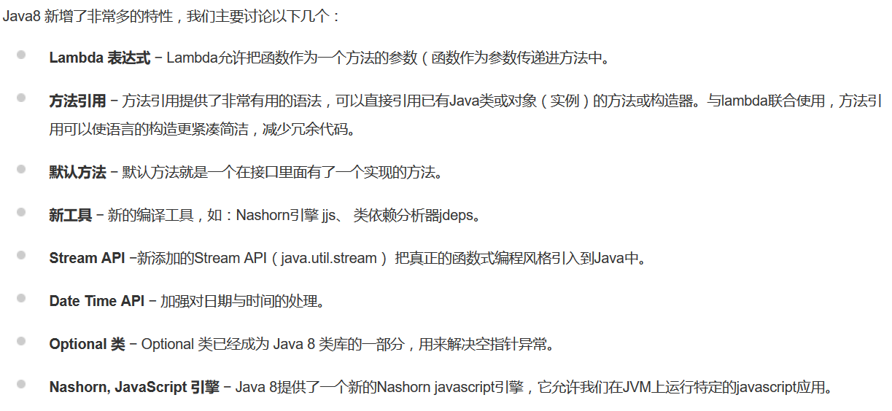

# java基础知识

## JDK和JRE
1. JRE -- _java_ runtime environment
JRE指java运行环境。光有JVM还不能完成class的执行，因为在解释class的时候,JVM需要调用解释所需要的类库lib。
在JDK的安装目录里你可以找到jre目录，里面有两个文件夹bin和lib,在这里可以认为bin里的就是jvm，lib中则是jvm工作所需要的类库，而jvm和 lib和起来就称为jre。所以，在你写完java程序编译成.class之后，你可以把这个.class文件和jre一起打包发给朋友，这样你的朋友就可以运行你写程序了。（jre里有运行.class的java.exe）
2. JDK -- java development kit
JDK是java开发工具包.安装目录下面有六个文件夹,一个src类库源码压缩包和其他几个声明文件。其中，真正在运行java时起作用的是以下四个文件夹：bin、include、lib、jre。现在我们可以看出这样一个关系，JDK包含JRE，而JRE包含JVM。bin: 最主要的是编译器(javac.exe)include:java和JVM交互用的头文件lib：类库jre:java运行环境（注意：这里的bin、lib文件夹和jre里的bin、lib是不同的）总的来说JDK是用于java程序的开发,而jre则是只能运行class而没有编译的功能。
eclipse、idea等其他IDE有自己的编译器而不是用JDK bin目录中自带的，所以在安装时他们只要求选中jre路径就ok。

## Comparable和Comparator接口的作用以及它们的区别。
Comparable:表示可被排序的，实现了这个接口，这个类的对象就会自动拥有了可被排序的能力。这个排序被称为类的自然顺序。 这个类的对象的列表可以被Collections.sort和Arrays.sort来执行排序。同时这个类的实例具备作为sorted map的key和sorted set的元素的资格。
```
public interface Comparable<T> {
   public int compareTo(T o);
}
```
该接口只有一个抽象方法compareTo，这个方法主要就是为了定义我们的类所要排序的方式。compareTo方法用于比较当前元素a与指定元素b，结果为int值，如果a > b，int>0；如果a=b，int=0；如果a<b，int<0。
Comparator:中文译为比较器，它可以作为一个参数传递到Collections.sort和Arrays.sort方法来指定某个类对象的排序方式。同时它也能为sorted set和sorted map指定排序方式。 推荐实现的比较器类同时实现java.io.Serializable接口，以拥有序列化能力，因为它可能会被用作序列化的数据结构（TreeSet、TreeMap）的排序方法。

比较：

Comparable可以看做是内部比较器，Comparator可以看做是外部比较器。一个类可以通过实现Comparable接口来自带有序性，也可以通过额外指定Comparator来附加有序性。使用实现Comparable只需要实现compareTo方法，实现Comparator需要实现compare方法，同时一般要保证和equals方法的比较结果一致。Comparator与Comparable同时存在的情况下，前者优先级高

---

Java和JavaScript的比较

1. 面向对象和基于对象。Java是一种真正的面向对象语言，即使是开发简单的程序也必须设计对象。javaScript是一种脚本语言，是一种基于对象和事件驱动的语言，它本身提供了非常丰富的内部对象供设计人员使用。

2. 解释和编译。Java的源代码在执行前要经过编译，编译成字节码，然后解释执行。JavaScript是一种解释性的编程语言，不需要经过编译，直接解释执行（一般由浏览器）。目前的浏览器都采用了JIT（即时编译）技术来提升JavaScript的运行效率

3. 强类型变量和弱类型变量。Java采用强类型变量检查，即所有的变量在编译之前必须做声明；JavaScript中变量是弱类型的，甚至在使用变量前可以不做声明，JavaScript的解释器在运行时检查推断其数据类型。

4. 用途不同。Java被广泛应用于pc端，手机端，互联网，数据中心等等，而JavaScript则主要用于嵌入文本到HTML页面，读写HTML元素，控制cookies等。

---

**Array和ArrayList**

1.大小长度

Array大小是固定的，ArrayList的大小是动态变化的。

ArrayList可以看成长度可以自动扩充的Array；

2.包含的内容

Array可以包含基本类型和对象类型，ArrayList只能包含对象类型。

3.操作方法

对数组的一些基本操作，像排序、搜索与比较等是很常见的。因此在Java中提供了Arrays类协助这几个操作：sort(),binarySearch(),equals(),fill(),asList().

////Integer[] a = {1,2,3,4};List list = Arrays.asList(a); 这里的数组不能是基本数据类型。

这里的list并不是Java.util.ArrayList;

ArrayList提供了更多的方法和特性，比如：addAll()，removeAll()，iterator() ，indxOf（）等等。

当确定长度、数据类型一致的时候用array，其他时候用ArrayList。

---

值传递和引用传递

值传递（pass by value）是指在调用函数时将实际参数复制一份传递到函数中，这样在函数中如果对参数进行修改，将不会影响到实际参数。

引用传递（pass by reference）是指在调用函数时将实际参数的地址直接传递到函数中，那么在函数中对参数所进行的修改，将影响到实际参数。

一般认为,java内的传递都是值传递。只不过当参数是引用类型的变量时，虽然还是复制一份传给形参，但是恰巧这个引用类型变量本身就是地址，所以产生的效果和引用传递的效果一样，但是从执行机制上来讲还是按值传递。

---

Lambda表达式

Lambda表达式的本质只是一个"语法糖",由编译器推断并帮我们转换包装为常规的代码,因此可以使用更少的代码来实现同样的功能。是JavaSE8的一个重要特性允许通过表达式来代替功能接口。

优点：1. 简洁。2. 容易并行计算。3. 可能代表未来的编程趋势。

缺点：1. 若不用并行计算，很多时候计算速度没有比传统的 for 循环快。（并行计算有时需要预热才显示出效率优势）2. 不容易调试。3. 可读性较差。

---

Java SE 8的新特性。



---

大O符号

用来描述一个函数数量级的渐近上界。 它在分析算法复杂性的方面非常有用， 描述了当数据结构里面的元素增加的时候，算法的规模或者是性能在最坏的场景下有多么好。

---

==和equals

1. 对于==，如果作用于基本数据类型的变量，则直接比较其存储的 “值”是否相等；如果作用于引用类型的变量，则比较的是所指向的对象的地址

2. 对于equals方法，注意：equals方法不能作用于基本数据类型的变量如果没有对equals方法进行重写，则比较的是引用类型的变量所指向的对象的地址；诸如String、Date、Ingeger、Double等类对equals方法进行了重写的话，比较的是所指向的对象的内容。

---

final

在Java中，final关键字可以用来修饰类、方法和变量（包括成员变量和局部变量）。

final修饰类：表明这个类不能被继承，（表明该类永远不希望被变动）final类中的成员方法会被隐式的指定为final方法，final类中的成员变量可以根据需要指定为final

final修饰方法：把方法锁定，不能重写，以防任何继承类修改它的含义，只有在明确禁止覆盖时才使用final方法

final 和private ：类中所有private方法都隐式地指定为是final的。由于无法取用也就无法覆盖他，可以对private方法加final关键字段并没有什么额外意义。

final修饰变量： 

对于一个final变量，如果是基本数据类型的变量，则其数值一旦在初始化之后便不能更改；如果是引用类型的变量，则在对其初始化之后便不能再让其指向另一个对象（但是该对象里的内容可变）。

---

static关键字

static方法就是没有this的方法。（其他方法，有一个this引用指向调用方法的哪个对象）在static方法内部不能调用非静态方法，反过来是可以的。而且可以在没有创建任何对象的前提下，仅仅通过类本身来调用static方法。这实际上正是static方法的主要用途。方便在没有创建对象的情况下来进行调用（方法/变量）。

（1）static方法

static方法一般称作静态方法，由于静态方法不依赖于任何对象就可以进行访问

（2）static变量

static变量也称作静态变量，静态变量被所有的对象所共享，在内存中只有一个副本，它当且仅当在类初次加载时会被初始化。而非静态变量是对象所拥有的，在创建对象的时候被初始化，存在多个副本，各个对象拥有的副本互不影响。static成员变量的初始化顺序按照定义的顺序进行初始化。

（3）static代码块

static关键字还有一个比较关键的作用就是 用来形成静态代码块以优化程序性能。static块可以置于类中的任何地方，类中可以有多个static块。在类初次被加载的时候，会按照static块的顺序来执行每个static块，并且只会执行一次。执行时机先于构造方法类加载的时候，需要那个类去加载哪个类，类加载过程中按照静态块的顺序执行静态块。生成对象的时候先初始化父类的成员变量，然后调用父类的构造方法，然后初始化自己的成员变量，然后调用自己的构造方法。存储位置static变量存储在方法区的静态常量池中

---

访问控制符

* private(当前类访问权限)：使用private访问控制符来修饰的成员（包括成员变量、方法和构造器等）只能在当前类的内部被访问。用于修饰成员变量最合适，可以把成员变量隐藏在该类的内部。

* default(包（package）访问权限)：类里的一个成员（包括成员变量、方法和构造器等）或者一个外部类不使用任何访问控制修饰，就称它为包访问权限的，default访问控制的成员或外部类可以被相同包下的其他类访问。

* protected（子类访问权限）： 使用protected修饰的成员（包括成员变量、方法和构造器等），既可以被同一个包中的其他类访问，也可以被不同包中的子类访问。在通常情况下，如果使用protected来修饰一个方法，通常是希望其子类来重写这个方法。

* public（公共访问权限）：这是一个最宽松的访问控制级别，public修饰的一个成员（包括成员变量、方法和构造器等）或者一个外部类，可以被所有类访问，不管是否处于同一个包中，是否具有父子继承关系。

---

java 构造方法：

作用：对类进行初始化。 如果没有定议任何构造方法的形式，编译器会为你取一个不带任何参数的构造函数，在导出类的构造方法中可以自动插入对基类无参构造方法的调用。没有返回值（与返回值为空void不同）

如果父类只有有参数的构造方法，那么必须显示调用，不然编译报错。

子类初始化的时候默认回去调用父类的无参构造方法，如果父类没有无参构造方法，需要在子类构造方法中显示地手动调用，如果没调用会出错。

---

位操作符

按位与&，按位或|，按位取反~，按位异或^（不同为1） 

<<X有符号左移操作符，向左移动X位，在低位补0，对于正数来说，相当于乘2操作，负数不太一样。

>>X有符号右移，整数在高位补0，负数在高位补1.

>>>无符号右移，不管正负高位补0.

原码，反码，补码 

正数的原码，反码，补码都一样，负数的反码是对除了符号位（最高位）对原码取反，补码是对反码+1

-5的原码是        1000 0000 0000 0101

求出反码的是      1111 1111 1111 1010

求出补码是         1111 1111 1111 1011

---

Object类的方法及其简要说明

equals(Object obj) --------指示某个其他对象是否与此对象“相等”。

hashCode()返回该对象的哈希码值。

toString()返回该对象的字符串表示。

getClass()返回一个对象的运行时类。

protected clone() -------创建并返回此对象的一个副本。

protected finalize()------当垃圾回收器确定不存在对该对象的更多引用时，由对象的垃圾回收器调用此方法。（此方法在Java 9中已弃用，最终被证明机制存在问题）

notify()唤醒在此对象监视器上等待的单个线程。

notifyAll()唤醒在此对象监视器上等待的所有线程。

wait()导致当前的线程等待，直到其他线程调用此对象的 notify() 方法或 notifyAll() 方法。

wait(long timeout)导致当前的线程等待，直到其他线程调用此对象的 notify() 方法或 notifyAll() 方法，或者超过指定的时间量。

wait(long timeout, int nanos) 导致当前的线程等待，直到其他线程调用此对象的 notify() 方法或 notifyAll() 方法，或者其他某个线程中断当前线程，或者已超过某个实际时间量。

---

Java自动拆装箱-int和integer的区别 

自动拆装箱

自动装箱就是Java自动将原始类型值转换成对应的对象，比如将int的变量转换成Integer对象，这个过程叫做装箱，反之将Integer对象转换成int类型值，这个过程叫做拆箱。

为什么需要自动拆装箱

主要是用于java集合类中，集合类只能放对象类型，不能放基本类型。因此需要将整数自动装箱成对象,否则不能调用方法。

integer和int

1. integer是int的包装类，int是Java的一种基本数据类型。

2. integer变量必须实例化后才能使用，而int变量不需要

3. integer实际是对象的引用，当new一个integer时，实际上是生成一个指针指向此对象；而int则是直接存储数据值。

4. integer的默认值是null，int的默认值是0；

integer变量和int变量比较

1. 两个通过new生成的integer变量不相等，因为new生成的是两个对象，它们是对不同对象的引用。

2. new Integer（）生成的变量和非new生成的变量比较时，结果为false。非new生成的integer变量指向的是Java常量池中的对象，而new Integer（）生成的变量指向堆中新建的对象，两者在内存中的位置不同

3. 两个非new生成的integer对象，进行比较时，如果两个变量的值在区间-128到127之间，一个byte；则比较结果为true，若不在此区间，结果为false。这是因为在编译 Integer i = 100 ;时，会翻译成为Integer i = Integer.valueOf(100)；而对integer类型的valueOf又有一些特殊规定， java对于-128到127之间的数，会进行缓存，Integer i = 127时，会将127进行缓存，下次再写Integer j = 127时，就会直接从缓存中取，就不会new了

4. integer和int变量比较时，只要两个变量的值相等就true，因为这里存在Java的自动拆箱和装箱，当integer和int比较时，integer自动拆箱成int，即变成两个int在比较。

---

基本数据类型

 byte、short、boolean、char、int、float、double、long。

byte:8 short:16 int:32 long:64 float32 double64 char:16
