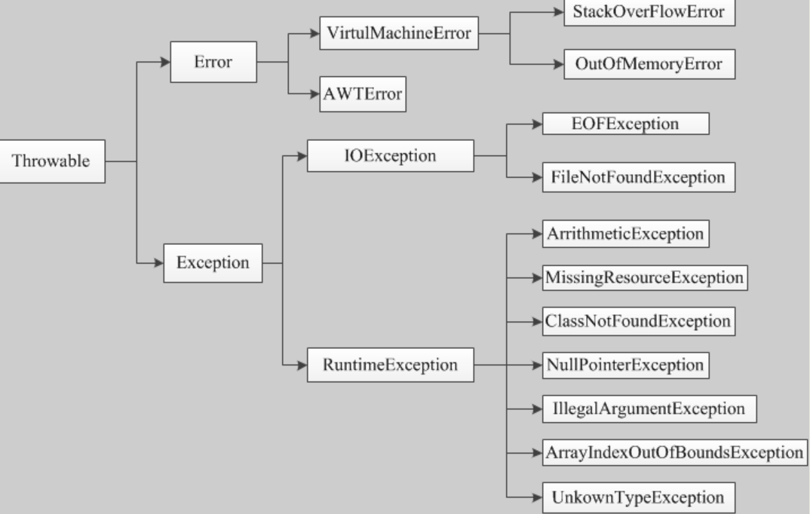
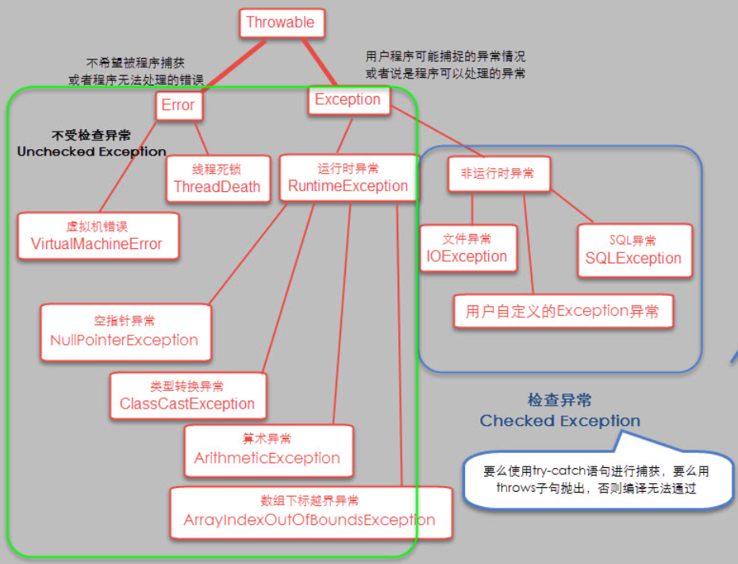
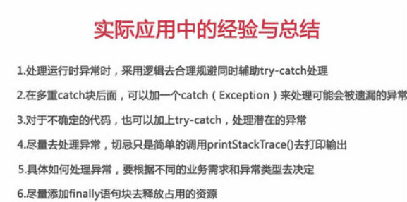

# Java基础-6-异常处理

Java异常处理

[https://www.cnblogs.com/Qian123/p/5715402.html](https://www.cnblogs.com/Qian123/p/5715402.html)

Java通过面向对象的方法进行异常处理，把各种不同的异常进行分类，并提供了良好的接口。在Java中，每个异常都是一个对象，它是Throwable类或其子类的实例。当一个方法出现异常后便抛出一个异常对象，该对象中包含有异常信息，调用这个对象的方法可以捕获到这个异常并可以对其进行处理。

Java异常处理涉及到五个关键字，分别是：try、catch、finally、throw、throws。下面将骤一介绍，通过认识这五个关键字，掌握基本异常处理知识。

• try        -- 用于监听。将要被监听的代码(可能抛出异常的代码)放在try语句块之内，当try语句块内发生异常时，异常就被抛出。try语句可以嵌套，每当遇到一个try语句，异常的结构就被放入异常栈中，直到所有的try语句都完成。如果下一级的try语句没有对某种异常进行处理，异常栈就会执行出栈操作，直到遇到有处理这种异常的try语句或者最终将异常抛给JVM。

• catch   -- 用于捕获异常。catch用来捕获try语句块中发生的异常。

• finally  -- finally语句块总是会被执行。它主要用于回收在try块里打开的物力资源(如数据库连接、网络连接和磁盘文件)。只有finally块，执行完成之后，才会回来执行try或者catch块中的return或者throw语句，如果finally中使用了return或者throw等终止方法的语句，则就不会跳回执行，直接停止。

• throw   -- 用于抛出异常。

　• throws -- 用在方法签名中，用于声明该方法可能抛出的异常。

---

---

运行时异常与受检异常异同

异常表示程序运行过程中可能出现的非正常状态，

运行时异常表示虚拟机的通常操作中可能遇到的异常，是一种常见运行错误，只要程序设计得没有问题通常就不会发生。

受检异常跟程序运行的上下文环境有关，即使程序设计无误，仍然可能因使用的问题而引发。Java编译器要求方法必须声明抛出可能发生的受检异常，但是并不要求必须声明抛出未被捕获的运行时异常。

异常使用原则：异常和继承一样，是面向对象程序设计中经常被滥用的东西，在Effective Java中对异常的使用给出了以下指导原则： 

- 不要将异常处理用于正常的控制流（设计良好的API不应该强迫它的调用者为了正常的控制流而使用异常） 

- 对可以恢复的情况使用受检异常，对编程错误使用运行时异常 

- 避免不必要的使用受检异常（可以通过一些状态检测手段来避免异常的发生） 

- 优先使用标准的异常 

- 每个方法抛出的异常都要有文档 

- 保持异常的原子性 

- 不要在catch中忽略掉捕获到的异常

---

列出一些你常见的运行时异常？

- ArithmeticException（算术异常）

- IndexOutOfBoundsException （下标越界异常）  

- NullPointerException （空指针异常）

- ClassCastException （类转换异常） 

- IllegalArgumentException （非法参数异常） 

- SecurityException （安全异常）

---

异常链

异常链顾名思义就是将异常发生的原因一个传一个串起来，即把底层的异常信息传给上层，这样逐层抛出。 异常链的实际应用很少，发生异常时候逐层上抛不是个好注意， 上层拿到这些异常又能奈之何？而且异常逐层上抛会消耗大量资源， 因为要保存一个完整的异常链信息.

