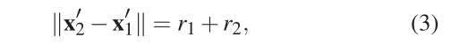

# 使用基于速度的人群碰撞避免模拟

1.摘要：

---

基于假说：

个体试图通过提前稍微其运动来避免碰撞。

优点：

实现起来相对容易且速度快，可以实时模拟成千上万个个体。

引言：

过去的几年中已经提出的方法中 开始引入 速度障碍，将角色的轨迹线性外推，用于解决在不久的将来会发生的碰撞，但是这种方法生成的动作会有振荡在密集环境下的表现无法令人信服。

贡献：

我们的方法，每个角色都预测未来的冲突，并试图通过稍微调整其方向和速度来提前解决冲突。

---

2.与我们的研究相关的之前的工作

---

已经提出了很多模型 包括：1.将全局导航和局部导航统一到同一个框架中。2.将全局导航从局部碰撞避免中分离出来。

我们的关注点是：虚拟个体的局部交互。

Reactive steering ：（反应性的改变方向）个体调整它先前计算出的动作来适应沿途发现的动态的和静态的障碍。

Collision prediction：（碰撞预测）假设每个个体都保持一个常量速度，通过对它们的速度线性外推来预测未来的运动从而在不久的将来检测和避免碰撞。

Velocity Obstacle ( VO )（速度障碍）指对于一个实体，在某一时刻所有会和另外一个以一定速度运动的实体碰撞的 速度集合

RVO 互反速度障碍  启发式搜索无碰撞速度并最小化与角色期望速度的偏差。

Fast Velocity Obstacle ( FVO ) 比vo的反应速度快。

Optimal Reciprocal Collision Avoidance ( ORCA ) 最有碰撞避免

Example-based approaches：（基于实例的方法）从真实人群行为的数据库中学习，优点是真实，缺点是受限于数据库，和实时的模拟开销太大。

与之前的研究相比：

与vo的方法相似，我们引入了速度空间，降低了可容许速度集，与FVO（也降低了可容许速度域）我们使用了基于真人的观察行为，使行为更可信。为了确定最优解速度，我们使用了代价函数，也考虑了执行某种动作所需要的能量 与pettre 等人的方法有一定相似之处，但是关注点不同 我们：预计碰撞时间和期望速度的偏差，它们：最小预测距离对参与者加速度的影响。他们主要解决 成对交互，我们：实时解决多个个体的冲突。

---

3.分析实验交互数据，提出一些与行人在现实生活中的交互的关键概念

---

Personal space ：个人空间---------伴随一个人的可移动的范围，大小和形状随运动速度和人群密度变化

Locamotion and energy expenditure：运动和能量消耗---------人类喜欢节能运动，是完成一个步骤所需的能量最小。

Interactions and the principle of least effort.互动和最小努力。起源于心里学领域，给定不同的行为可能性，人们会选择需要最小努力的行为。

---

4.我们的局部碰撞避免模型

---

问题形式化

通过三个连续步骤来解决同其他代理的交互。

步骤一、检索冲突代理集

用vi的期望速度推断自身未来位置，用观察到的其他人的速度推断别人未来的速度，得到一个会发生碰撞的不等式，

求解这个不等时，得到一个时间的集合，t的范围，如果t大于等于0，表示会发生碰撞，这个集合可能会很大，将这个集合升序排序，选前N个，现实情况下N一般为5；表示前五个即将与之碰撞的人，（通常情况下人能考虑的只有这么多）。

步骤二、确定容许的方向和速度集合。

步骤三、选择最优解速度。

根据前两步的结果我们算出一个可行的避免速度集，FAV，这是关于速度大小和方向的连续集合，我们缩小这个集合。然后得到Vcand 候选速度集，然后选择新的速度，要使 能量消耗最小，使碰撞风险最小、使与期望速度偏差最小。

选择完速度后，在每个更新周期内每个代理的运动

如果代理还受到动态约束，我们可以再加约束每次更新中我们还更新了代理的方向，能量系统不允许突然地改变方向，确保了平滑的避碰动作。新的方向

4.2 解决危险的碰撞

正常情况下都能提前避免碰撞，但是当人群密集的时候还是有可能发生碰撞，当aj 开始侵犯ai的个人空间时，这时候并不意味着，两者真的要碰撞，这时候舍弃能量原则，公式15变为

4.3避免静态障碍物

障碍物被建模为轴对称的框，然后使用与前述方法类似的方法来解决冲突。将障碍物和代理人统一来考虑。

---

5.通过实验来评估我们的方法

---

实验结果

---

6.一些结论和未来研究计划

---

--------------------------------翻译性阅读-------------------

总结：

**主要解决的问题是**-------虚拟角色的碰撞避免，提出了一种新的模型，基于速度。

**前人存在的问题**——--仿真结果与现实相去甚远，模拟出的运动有震荡行为（突然停下或突然大幅转向）。尤其在人群密集环境

**该模型的优越之处**--------------我们的模型视觉上更加令人信服。

**基于假说**：----------------个体试图通过提前调整其运动速度的大小和方向来解决碰撞。

**结果**：----------在多种复杂的模拟中表现优秀。

目前的相关工作：---------很多模型，有全局导航和本地导航统一的，有分离的，【反应性导航】-》【碰撞预测】-》【VO速度障碍】-》【RVO互反速度障碍】{保证两个虚拟个体的无振荡行为}-》【FVO快速速度障碍】····还有基于人群实例的方法。

**我们做的工作和别人到底哪里不同呢？？**----狡辩-------本质上和VO方法类似，但是我们降低了可容许速度集；FVO也降低了速度集呀？但是我们是基于真实世界观察行为来降低的（即提前采取动作）；在确定最优解速度时，我们用了类似别人的代价函数；我们的模型和Pettre等人的模型有相似之处，但是我们的关注点不同，我们关注预计碰撞时间和期望速度 的偏差（预计碰撞时间对它们期望速度的偏离）。他们主要研究成对交互，我们在解决多人交互时表现更好。

研究过程

关键概念：个人空间、节能运动-能量消耗最小、最小努力原则（在不同的行为中选择的时候）

形式化定义；

1.开始时间是能看到彼此ts，结束时间是距离最小

2.线性估计位置

3.确定是否会碰撞

4.碰撞时间（表示成所能考虑到的最大的时间范围的比例最大的时间取4.2s）

5.方向背离程度

6.与最佳速度的背离度

7.与期望速度的背离度

8.碰撞避免位置条件

9.求解得冲突集（第一步）

10.选择时间最小的N个冲突（即即将发生）

11.算最大可允许背离角度

12.得可容许方向域：

13.可调速度域

14.可容许的避免碰撞速度域；

这一步获得的速度域是连续的，无穷的，我们将其离散化。

15.求解新的速度

16.新的位置

17.新的方向角

18.当人群过于密集，还是会发生碰撞，调整速度计算方法，舍弃能量消耗

实验结果：

结论和未来的工作

1、个体和静止障碍物的避免要改进，

2、个人的一些期望参数要调整

3、交互过程中期望速度应该能变化

4、改进实验使用的动画技术。
