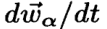
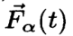

# 社会力模型

摘要：

1.加速度

2.与其他行人和边界保持一定距离的条件

3.建模吸引效果的项

结果方程是非线性耦合的 朗之万 方程（朗之万方程：描述了由于布朗运动，粒子在流体中做无规则运动）

计算机模拟表明，适合于描述在“自我组织”下，的人群效应。

---

II.简介：

近年来行人行为很热门，咋回事呢？因为：（1995年）

1.人群行为模型 与气体和液体 有相似之处。

2.模型中的所有量值，如速度、位置可测量，可与经验数据比较。

3.已经存在大量数据材料，流量测量和视频。

4.行人模型可以为设计和规划车站、购物中心等提供有价值工具。

1970，Henderson 用Navier-Stokes 测量行人流量，他的方法基于  现象流体运动学。

1990，Helbing 基于此方法和行人气体动力学（Boltzmann-like）改进，这个模型和气体动力学和流体动力学紧密相关

再近，车辆交通的“微观”方法引起人们注意。

我们  社会力模型。（微观模型）（第一次提出在注释2-21，对于“微观”、“细观”、“宏观”的详细论述注释【22】）

---

II.社会力概念

在相对简单的情况下，如果一个人将自己的行为局限于一个行为概率范围内，就可实现。（【3，23，24】）

另一种方法，Lewin提出，行为变化可以被所谓“社会力”导航。接下来检查这种方式是都用来描述行人行为

用期望速度随时间的变化= 来表示“社会力”，α代表行人。这种“力”只是描述具体行动动机的一个量。我们可以说一个人的行为就像是物体受到了外力的影响。这种想法已经被数学地建立起来【26】

---

社会力模型的公式化：
