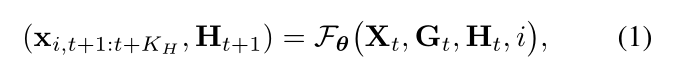
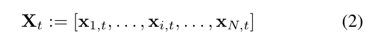
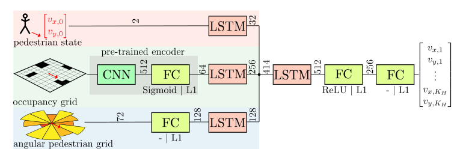
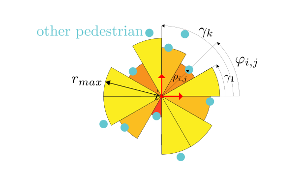
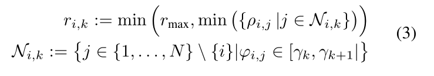
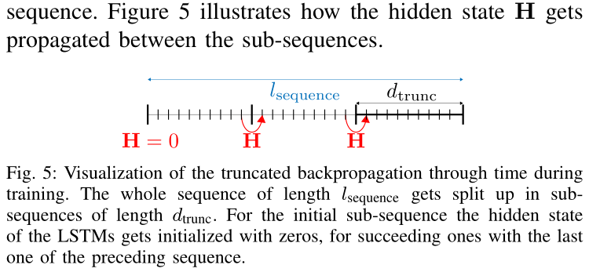
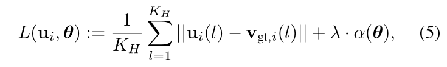

# A Data-driven Model for Interaction-aware Pedestrian Motion Prediction in Object Cluttered Environments

·摘要

本文提出一种在散落着很多静态障碍物的环境中，基于数据驱动的，交互感知的　行人动作预测的方法。在这样的与人类共享的环境中导航时，机器人需要有周围行人动作的精准预测。人类导航行为主要受到周围行人和静止障碍物的的影响。本文介绍一种基于长短时记忆神经网络ＬＳＴＭ的新模型，它能够从演示数据中学习人类动作行为。据我们所知，这是第一个使用了LSTMs的方法，结合了静态障碍物和周围行人来进行轨迹预测。作为模型的一部分，引入一种新方法，在极坐标系中基于一维网格对周围行人编码。通过与最先进的方法比较，我们评估了交互感知运动预测的好处，和合并考虑静态障碍物的附加价值，在真实和仿真两个数据集上。结果表明我们的方法比其他方法在计算上更加高效，在运动中考虑静态障碍物显著提高了预测精度，特别是在凌乱的环境中。

·简介

  在机器人导航领域，在静态的和已知的环境中的导航已经有做过了大量的研究工作，然而，当把机器人从静态的，受控的环境中带出来，放到一个动态的，有着各种各样运动模式的agent的环境中时，就会有很多没有解决的挑战。为了将机器人以一种顺滑的方式整合到和其它agent共享的环境中，（在许多情况下这些agent是行人）其他agent的行为需要被很好的理解，这样才能精确的预测他们将来的动作。人类可以依赖“常识”和经验来解读其他agent的行为，但是机器人仅限于预定义的人类行为和交互模型。独立于机器人平台，从小型服务机器人到自动驾驶汽车，对于其他agent动作的高精度的预测对于高效和安全的动作规划是至关重要的。

        影响行人运动的主要因素是行人、环境和目的地位置之间的相互作用。通过考虑行人之间的相互作用，可以显著提高运动模型的精度[1]-[5]。 结果表明，在运动规划应用中，将交互感知的运动模型用于动态agent预测，可以使机器人对人类agent[2]具有更强的可预测性，因此也更符合“社会顺应性”[6]。特别是对于杂乱的环境，模拟行人在接近静止障碍物时的反应也很重要

现有的方法至少受到以下缺点之一的限制:(i)将agent轨迹信息抽象为内部表示的特征函数是手工制作的，因此只能捕获简单的交互。(ii)由于这些方法在所有代理[1]-[3]之间使用成对交互，导致与代理数量呈二次复杂度，因此实时计算只适用于少量代理，因此无法扩展到密集的人群中。(iii)忽略静态障碍物[1]、[4]、[5]和(iv)假设知道有一组潜在目的地[1]、[3]、[5]。

        在这项工作中，我们克服了上述限制，提出了一种数据驱动的方法为行人的交互和运动建模，基于递归神经网络(RNN)。我们将行人预测问题作为序列建模任务，[7]。在RNNs研究领域，尤其是LSTMs在过去五年里表现出了出色的性能。==LSTM是一种特殊类型的RNN== 为此，我们提出了一种新的模型结构，它融合了每个行人的三种信息通道。行人的速度，行人周围静态障碍物的信息以及周围行人的信息。给了这些输入，这个行人将来的运动以一种receding horizon的方式预测出来。与其他通过重复使用[4]、[5]模型提供的1步预测进行正向模拟的方法相比，我们已经对整个预测层进行了预测，因此不需要进行向前模拟。在机器人平台上部署所提出的模型的一种可能性是预测周围行人的轨迹，并根据所预测的轨迹为机器人规划一条无碰撞路径。

利用所提出的体系结构，可以从演示数据中学习输入的抽象特征表示，而不是手工制作它们。通过使用固定大小的基于网格的输入格式，对于不同数量的周围代理，模型的评估时间是恒定的。这极大地提高了对更多代理的可伸缩性。

**本文的主要贡献是引入了一种新的基于LSTM神经网络的行人轨迹预测模型体系结构，该模型没有(i)-(iv)的缺点。另一个主要的贡献是编码周围行人信息的方式，用了一个特殊的一维的表示，它将大量信息和低维度结合**。我们与最先进的方法进行了广泛的评估和比较，基于模拟的和真实的数据集，这里我们使用了一个著名的公共可用的（行人在公共区域的运动）数据集。我们假设通过both考虑了行人的交互和静态障碍物，最先进的方法可以被超越。

II overview of the related work。相关工作的概述

        第一个对行人交互建模的方法是Helbing等人提出的社会力量模型。他们的模型基于一个势场，或者更具体地说，吸引力建模了目标驱动的行为，和排斥力来建模 静态障碍物避免和各种agents 之间的交互。不久之后，Helbing 改进了这个模型应用于车辆交互和动态交通。类似地，Treuille等人使用连续体动力学来模拟自然移动的人群。当使用一组良好的参数时，可以避免运动中的振荡，是一种可靠的仿真模型。然而，如果不知道所有代理的目标，它们就不能应用于运动预测。

另一种已知的预测完整agent交互作用的方法是互反速度由van den Berg等人提出的障碍物(RVO)方法。RVO方法的主要优点是它的计算高效和保证了无碰撞路径，这不仅适用于预测，而且也适用于动作规划应用。RVO背后的思想是，基于一个假设：其他的agent 以匀速运动 或 在所有的agent之间的有一个联合避碰努力。由此来计算出一组联合的无碰撞速度。最初的方法由阿隆索-莫拉等人将[17]扩展到非完整平台。然而，通过设计，RVO方法需要知道所有agent的目标速度，只是一个确定性模型。

   当谈到基于学习的交互建模方法，各种技巧已经被分析，Trautman等人将所谓的“机器人冻结”问题形式化，并指出为什么交互建模对机器人导航是一个重要因素。他们提出了一个模型基于interacting Gussian Process （交互高斯过程，）一个Interaction potential 相互结合了多重轨迹，每一个都有GP自己描述。为了在人群运动规划中考虑多模态行为，在[18]中引入了混合模型。Ｖｅｍｕｌａ等人提出了另一种基于学习的交互模型，其中GP模型是用来预测未来ａｇｅｎｔ的速度和目的地。这些预测是基于一个基于网格的世界表示做出的，这个世界收集了有关行为人周围行人位置和方向的信息。但是，需要事先了解目的地，并且不考虑静态障碍。

利用最大熵逆强化学习(IRL)对交互行人进行建模已经做了大量的工作。 Kuderer, Kretzschmar等人引入了连续状态空间联合集的最大熵概率分布，同样受到Ziebart等人的启发。[20]和Henry等人的[21]。该模型基于一组手工制作的特征函数，捕捉行人的交互和避碰行为。在我们之前的工作[2]中，我们将该方法扩展到一个交互感知的运动规划器，并展示了该方法在实际实验中的适用性。由于所提出的最大熵IRL模型在训练过程中依赖于抽样方法进行期望值计算，因此训练时间是一个常见的缺点。Wulfmeier等人[22]提出了一种基于深度最大熵IRL的方法，该方法可以从演示数据中学习环境的可遍历性映射。不需要手工制作的功能，但是动态障碍——比如其他行人——没有被明确地考虑进去。Chen等人提出了另一种解决社会性感知运动规划的方法。他们使用深层强化学习(RL)学习运动规划策略，而不是使用模仿学习[24]的人或其他专家演示。此外，他们展示了如何将社会规范引入模型，而不是学习它们。

Alahi等人[4]介绍了Social-LSTM框架，它们为每个代理使用一个LSTM神经网络，并将其他代理的信息汇集到一个基于网格的结构中，以捕获多个代理之间的交互。引入了两个版本:一个版本中只有代理位置被放入（pooled），另一个版本中包含了临近代理的LSTM模型的完全隐藏状态也被放入（pooled）。Fernando等人提出了另一种基于注意力技术的LSTM交互模型。然而，可以特别处理的代理的数量是在模型的体系结构中编码的。两种基于LSTM神经网络的避障方法都只考虑了动态因素，而没有考虑静态避障。这限制了预测模型的性能，特别是有许多障碍物的受限空间。

　　　关于序列预测，RNN模型包括ＬＳＴＭｓ　和GRU模型，在过去十年的各种应用中成功地显示了它们的性能，它们被用来预测视频帧、识别语音[9]或用于文本翻译[10]此外，Graves等人的[28]表明RNN模型可以用于序列生成，这也是我们的目标应用。

III 具体的问题和我们的解决方法。

A．问题形式化

  当与其他代理和/或静态障碍一起在混乱的环境中导航时，人类表现出一种出色的能力，能够“读懂”他人的意图、感知环境并从中提取相关信息。最终，我们希望机器人能以一种符合社会规范的方式很好地融入环境，这样它们就能安全导航，不会被困住或干扰其他交通参与者——而且是在与人类类似的水平上。为了达到这种程度的自主，机器人需要有准确的模型来预测环境的演变，包括其他的ａｇｅｎｔ。通过考虑其他智能体的运动预测，可以为机器人规划安全的路径。其他人的运动预测越准确，机器人的可预测性就越好，因为每一步的重新规划的努力可以最小化[2]。

本文研究了如何从记录的行人运动和交互模型中寻找出一种良好的行人运动和交互模型，以便在运动规划应用中对行人进行预测，我们希望找到这样的模型

（１）的左侧是输出，包括ａｇｅｎｔ　ｉ　的将来状态，ｘi，t+１：ｔ＋ｋｈ，

（２）是当前状态元组。包括与pedestrian　i相关的N个pedestrian　，（由一个确定的距离决定）

Ｇｔ是静态障碍物的信息，Ｈｔ是隐藏的状态，随时间传播，每步更新。

概括：即输入当前相关的多个pedestrian　的状态，输入当前静态障碍物的状态，和隐藏状态，　输出pedestrian　I的预测状态，和预测隐藏状态。

　　由于在实际应用中不能假设其他行人的目的地是已知的，所以我们的模型不能依赖于一组预定义的目标位置，而只能根据感知到的数据预测行人未来的运动。只有时刻ｔ的当前信息，包括静态障碍物和其他ａｇｅｎｔｓ，联通隐藏状态Ｈｔ被用来预测将来的轨迹。重要的，为了对更大范围的情形有适用性，需要避免过度对特定环境的过度拟合。

B。运动和交互模型。

　　　　行人轨迹预测可以被看作序列建模任务，为了对agent状态、静态障碍物和动态障碍物(即pedes- trians)之间随时间变化的复杂关系进行建模，我们采用了LSTM神经网络[8]，该神经网络近年来在序列建模和预测任务中已经成功地表现出了良好的性能。

利用该模型，我们想要预测第i个行人未来的运动，在下文中我们将其称为查询代理。如果需要对所有行人进行路径预测，则必须为每个行人评估该模型一次。通过这样做，所有N个行人的预测问题的时间复杂度为O(N)。

在我们的模型中，为了预测查询代理的未来行为，将三个信息通道作为输入，并由一个联合LSTM进行融合，如图2所示。

 　　　　第一个输入，状态，是查询代理在其本地笛卡尔坐标系(vx, vy)中的速度。由于所有输入都以查询代理的位置为中心，并与它的朝向方向对齐，所以所提供的模型不需要位置或朝向信息，由于行人是完整的个体，他们的速度与他们的方向不同，因此，需要同时考虑vx和vy。假定pedestrian　跟踪器能够提供周围agent的位置和速度。

第二个输入是一个二维占用网格，编码查询代理附近静态障碍物的信息。作为模型输入，我们不使用完整的占用网格G t，而是使用它的局部提取，该提取以查询代理的位置为中心，并与当前朝向对齐，当部署在移动机器人上时，通常可以根据测距仪数据获得这样的占用网格。对于这项工作，假定已经提供了。

第三，还有关于查询代理周围的其他代理的信息，这些信息编码在一个特殊的混合网格中。为了能够很好地捕捉到其他行人的动态，需要一个高分辨率的网格，大大增加了维度。因此我们引入了一种新的方式编码其他ａｇｅｎｔｓ的信息，用角度行人网格，

ｋ是均匀角单元格的个数。

ｒi仅仅是Ｘｔ的函数。

与标准二维网格相比，该方法的分辨率更高，APG只对输入的维数产生线性影响，但仍然能够捕捉到径向距离变化以一种连续分辨率的方式，而不是离散网格单元，此外，周围行人角度位置变化的可观测性随其距离查询代理的距离的增加而变得更加精确。（意识是说，越近越重要，越精确，远了重要性下降，精确度降低）APG表示的一个缺点是，只能捕获每个角锥中最近的周围行人，但是我们假设这些行人是影响查询代理决策的最大因素。在占用网格的情况下，APG是以pedestrian的位置为中心，和pedestrian的朝向对齐。

　　　　这三个输入在融合到一个普通的LSTM层之前分别被处理。与使用两个连续的LSTM块相比，使用三个独立通道的体系结构在培训方面更有效。考虑到普通LSTM单元的输出，两个FC层解释了未来的速度。模型的输出是一系列长度为kh的未来速度对(vx, vy)。通过一次预测多个未来步骤，不需要对模型进行向前模拟和重新评估，提高了部署过程中的计算效率。通过对查询代理位置的速度　进行Euler forward　integration，可以得到查询代理的预测路径。

　　　　１） CNN的提前训练：由于从占用网格中提取相关特征(图2中的灰框)大部分独立于整个LSTM模型的其余部分，我们建议使用一个卷积式自动编码器(AE)对CNN进行预训练，其灵感来自于[29]和[30]，如下图4。　这样，整体训练时间可以大大减少，因为CNN和FC编码直接受到影响，而不仅仅是通过基于总损耗的反向传播。

　　　　在编码部分，２D的占位网格减少成为自动编码器的潜在空间，从图2可以看出，这个CNN编码阶段被合并到完整的LSTM神经网络结构中。AE（自动编码器）的第二部分是解码阶段，这里潜在空间必须被解码成２D空间的占用网格的表示形式。CNN编码和解码之间共享权重参数，训练误差被定义为：（４），也就是encoded-decoded输出(ｇｏｕｔ)和原始输入网格(gｉｎ)之间的平方误差,在那里ｉ和ｊ定义网格沿x轴和y轴的索引。dx和dy表示沿坐标轴的网格尺寸。通过对占用网格的特征处理进行预处理，可以保证潜在空间由有意义的特征，因为原始网格需要从潜在空间重构。

　　　　２）模型训练　监督学习训练的实施是以行人的轨迹演示数据作为真实数据，对动作和交互模型进行监督训练。使用训练数据对模型进行端到端的训练，同时保持编码器的ＣＮＮ权值（训练前得到）不变，编码器的FC权值是用训练前获得的值初始化的，然后用网络的其余部分进行优化。

　　　　利用时间反向传播对具有LSMT单元的完整网络进行训练。由于演示轨迹长度不同，且需要避免梯度消失／梯度爆炸的问题，因此需要将截断深度固定在ｄｔｒｕｎｃ，利用演示轨迹长度dｔｒｕｎｃ的子序列进行训练。对于后续的子序列，LSTMs的隐藏状态用前一个序列的最终状态初始化。在没有前面的子序列的情况下，LSTMs的隐藏状态用零初始化。因此，来自前一个子序列的信息可以被转发到下一个子序列，但是优化(BPTT)只影响当前子序列中的样本。

模型的端到端训练的损失函数定义如下：

其中u i = [u i (t+1)，…，u i (t+H)]为预测层模型的预测速度，v gt,i为同一层模型的地面真值速度(来自演示数据)。α(θ)介绍了正则化项和正则化因子λ。实现的正则化方法可以在图2和图4中找到。

　　　３）预测过程中的模型查询:对于部署，在每个步骤中，都将当前输入提供给网络，并可以对其进行评估。与标准的前向神经网络的唯一区别是，在每次查询后都必须返回LSTMs的隐藏状态。因此，当检测到一个新的行人时，将使用零初始化隐藏状态，而在后面的步骤中，将使用前一步的隐藏状态。

IV 实验结果

　　本节的实验评估了交互感知运动模型的附加价值，以及将静态障碍物知识纳入预测的新能力。

作为静态障碍物占用网格的参数，我们使用6m×6m网格，每个单元的分辨率为0.1m，得到60×60个单元的尺寸。对于APG，我们使用的最大距离(r max)为6m和72 (K)角单元，这导致角度分辨率为5◦。

　　　A。Date　assessment　数据评估

　　　我们使用模拟的，和公开可用的真实数据集来训练和评估这个模型。仿真的数据是基于著名的社会力模型在各种环境中生成的。模拟环境的大小和静态障碍物的设置不同，从一个空走廊到一个像图6(左)的环境。在每个环境中，多达20名行人在随机变化的目标位置之间导航时，同时被模拟。一旦到达目标位置，为每个行人采样一个新的目标位置，同时确保他们没有与静止障碍物碰撞。像【１２】种建议的那样，我们给社会力量模型的力，添加高斯噪声（σ＝０.３），这直接影响了pedestrians的加速度。这个模拟并没有明确的解释步行行人的群体行为。

　Ｂ．Evaluation and performance metrics评估和性能指标

　　为了评估我们的模型的性能，我们将其与三种著名的运动预测方法进行了比较。恒定速度和恒定加速度是任何运动预测方法的基线。这些模型简单的假设每个ａｇｅｎｔ分别以当前的速度或加速度继续工作。除此之外，我们使用了社会力量模型和一个不知道静态网格的LSTM模型　来进行比较。对于模拟数据的评估，我们假设社会力量模型显著优于所有其他用于比较的方法，因为数据是基于相同的模型生成的。唯一的区别是附加噪声，在加速度上。

　　不知道静态网格的LSTM模型类似于最近在【４】中提出的o-LSTM模型，由于原始实现不可公开使用，所以我们使用自己版本的O-LSTM方法进行比较。我们还使用APG编码行人信息，而不是只知道每个单元格的行人数量的离散网格。然而这比标准的２Ｄ网格包含更详细的信息。在下面，我们介绍的模型将称为LSTM模型，不知道静态障碍物的模型称为LSTM- noＧrid。

为了定量地评价所有模型的性能，我们使用预测误差，即预测值与地面真值之间的欧氏距离随时间的变化。我们分析了3s时间段的预测误差，这需要10个预测步骤，采样时间为300 ms。此外，我们通过对多个例子的预测轨迹进行可视化检查，对模拟数据和真实数据进行定性评估。

Ｃ．Simulation results仿真结果

　　　由于真实世界的数据往往包含跟踪误差，或者行人站立或者来回走动，我们将根据模拟数据开始我们的评估。仿真结果与噪声对行人加速度的影响是一致的，可以很好地分析该模型能否学习行人的运动策略。此外，与实际数据采集相比，在不同的环境中生成新的数据集相当容易。

仿真测试的模型在两种不同的环境下进行训练:首先，在10个行人在走廊两侧随机目标位置之间穿行的空走廊环境中进行预训练。有了这个数据集，可以学习与其他行人的纯交互。第二，培训的主要部分是在图6(左)所示的环境中进行的，包括20个行人。结果表明，在简单环境下的预训练和在选择环境下的继续训练加快了模型的整体训练时间。廊道数据集包含不到一个小时的数据，而主数据集包含大约五个小时的行人导航。总的培训时间大概是3h对一个Nvidia GeForce GTX 980 Ti GPU 1和要求

300　000个培训步骤。评估实在测试数据集上进行的，测试数据集使用的环境（静态障碍物的排列）与用于训练的环境不同。这样就可以分析学习的运动和交互模型的泛化能力。

　　　图７展示了两个快照是模型预测的轨迹和地面真实路径的对比。　左图展示了两个pedestrians共同躲避对方，虽然agent的当前速度(箭头)还没有显示出任何躲避措施，但是LSTM模型已经预测agent 4和agent 7都将向左转弯以避免潜在的碰撞。从图中还可以看出，所预测的避碰机动与地面真实数据的避碰机动相似，表明该模型能够在不同场景间传递知识。

　　　右图展示的情况是未来行人的轨迹明显收到静态障碍物的影响，虽然agent 8附近没有行人，但是我们的模型预测该agent由于前方有静止障碍物，几乎会停止。预计Agent 7会避开另一侧相同的静止障碍物，Agent 3则需要急转弯，以免与Agent 7发生碰撞。由于模型的LSTM单元提供内部内存，它可以跟踪代理的过去动作。内部记忆特别有用，因为没有目标知识，预测只依赖于过去和现在的观察。与左侧图像中的两个agent共享避碰努力相比，右侧图像中的agent 0和agent 6不共享避碰努力。Agent 6需要执行回避机动，因为静态障碍物是阻止Agent 0向左移动。此外，预测的定性表现可以在相关的视频提交2中进行评估。

仿真数据集中预测误差的定量分析如图8上半部分和表I所示。正如所料，社会力量模型的预测误差明显小于其他所有方法，这是因为该模型也用于数据生成。此外，社会力量模型对所有的目的地都有一个很好的了解，这个元素在LSTM模型中并不需要。图8中的预测误差仅来自社会力模型中的加速度噪声。基线预测方法明显差于LSTM模型，因为没有关于环境的知识可以包含在预测中。比较两种LSTM模型在同一数据集上训练的结果，可以看出，在模型的输入中添加静态障碍物显著提高了模型的预测能力。这支持了我们最初的假设。特别是在较长的预测范围内，仅基于行人-行人交互作用(LSTM- nogrid)的模型与同时使用静态障碍物和行人的模型之间的差异更加明显。

由于模型的输入是用网格编码的，因此每个代理的评估复杂度是恒定的。这还会导致模型的几乎常数(取决于计算机上运行的其他进程)和可预测的查询时间。在这个例子中，需要一直预测20个行人，所有代理的平均评估时间是51毫秒，在标准笔记本电脑上使用Intel　i7-4810MQ CPU，2.80GHz。这使得每个行人的平均预测时间为2.6ms。

Ｄ．真实世界的结果

　　　　我们使用一个公共可用的行人跟踪数据集以实际数据评估我们的模型。因为真实世界的数据集比模拟生成的小得多，它还可以很好的现实模型处理这些信息的能力，以及模型过度拟合的可能性。在训练过程中，我们使用预训练模型(针对仿真数据进行训练)，并使用真实数据集对其进行训练。

数据集记录在两个不同的位置，就静态对象而言，这两个位置都非常稀疏。对于仿真结果，我们将使用一个环境进行训练，而另一个环境只用于测试。真实世界的训练如图６所示。数据集还包含关于行人运动的组结构的信息。如果行人靠得很近，他们就被登记为一组。我们还将这些信息引入到社会力量模型中，如[34]所述。由于SF模型要求每个代理都有目的地，所以我们总是为它提供完整的观察轨迹端点作为代理的目标。

图8和表I给出了测试环境中预测误差的定量分析。如所料，匀速/加速度模型只能作为运动预测的下界。社会力量模型的性能在很大程度上受到现实数据中大量噪声的影响，这些噪声对短期预测有显著影响。其他模型的预测误差随视界的增大而明显增大，而社会力的预测误差只随时间的推移而缓慢增大，这是由agent对目标的了解引起的。

　　　　因为在这两个环境中（真实世界的训练和测试）几乎没有任何对象阻塞pedestrians的步行区域，如图６.右。LSTM和LSTM－noGrid　模型（带有和不带有静态障碍）在这个环境中表现得几乎相等。但是，特别是对于长期预测，LSTM模型感知静态障碍物的预测误差仍然小于不感知静态障碍物的预测误差。

　　　　与社会力量模型相比，预测误差可以显著降低，尽管前者拥有更多的可用信息，即每个行人的目标。此外，真实数据的预测误差与模拟数据的预测误差在同一范围内。这也表明LSTM模型可以学习处理有噪声的输入数据，并在真实环境中提供可靠的交互感知预测。

对真实世界环境中的预测进行定性评估如图1所示。虽然代理72和73径直走向静态障碍物，模型能够预测他们将穿过开着的缝隙(实际上是一扇门)。这沿着地面真实轨迹行进。在相关的视频提交中提供了更多关于实际环境中导航性能的示例。

v.讨论和总结。

＝＝＝＝＝＝＝＝＝＝＝＝＝＝＝＝＝＝＝＝＝＝＝＝＝＝＝＝＝＝＝＝＝＝＝＝＝＝

 　　本文提出了一种新的行人动力学模型及其相互作用的建模方法。 该模型体系结构基于LSTM神经网络，该神经网络由演示数据训练而成。据我们所知，我们提出了第一种　能够预测行人与行人的互动，同时避免静态障碍　的方法　使用神经网络模型。此外，我们还介绍了一种处理动态对象的新方法——角状行人网格(APG)，它对周围行人的信息进行编码。此外，我们还介绍了一种处理动态对象的新方法——角状行人网格(APG)，它对周围行人的信息进行编码。这一点相当重要，尤其当人群密度增加时。所提出的模型不需要每个行人都有一个已知的目的地，也不需要一组预定义的候选目的地，这使得它很好地适用于许多实际应用程序。

　　　　交互感知和静态感知模型的性能被在　模拟的和真实世界的数据上进行评估。我们的实验表明，考虑静态障碍物，特别是当环境变得更加杂乱时，模型的预测精度可以显著提高。

在只有很少静态障碍的环境中(如我们评估的真实数据)，我们提出的模型仍然明显优于我们用于比较的其他最先进的方法。其中包括社会力量模型(social forces model)和（不考虑静态障碍物的）交互感知LSTM模型(interaction-aware LSTM model)。

为了进一步评估我们的方法在不同场景下的性能，还需要额外的真实世界数据以适应杂乱的环境。由于该模型能够做出准确可靠的预测，即使对于大量行人，其计算效率也很高，非常适合集成到移动平台中，用于实时运动规划应用，这将在未来的工作中实现。
