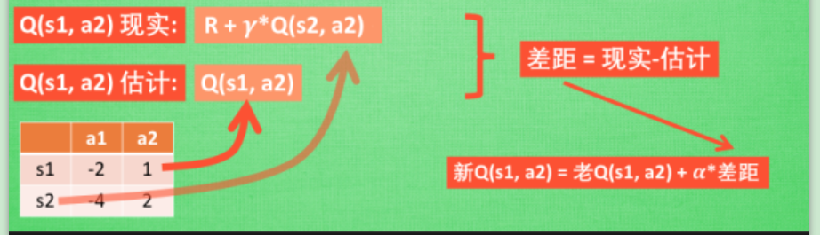
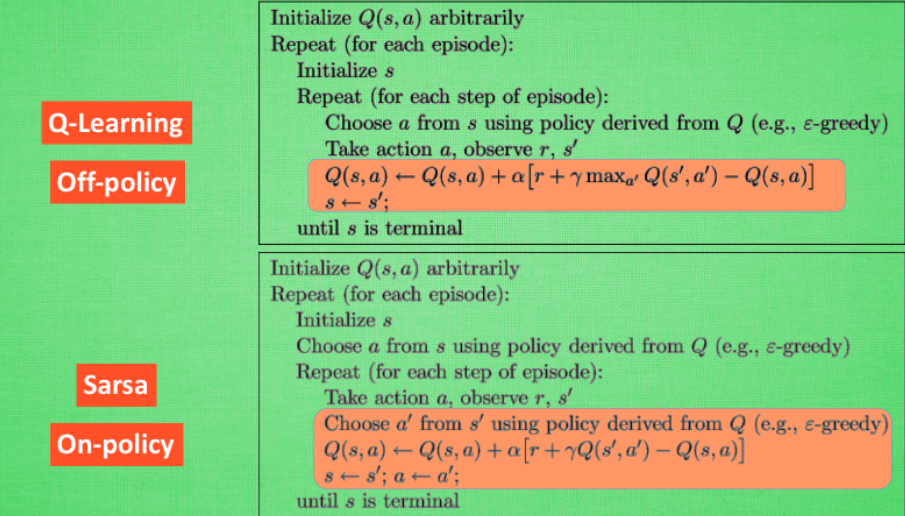
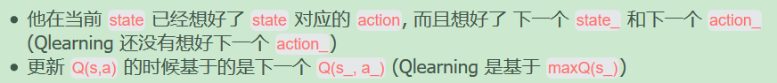
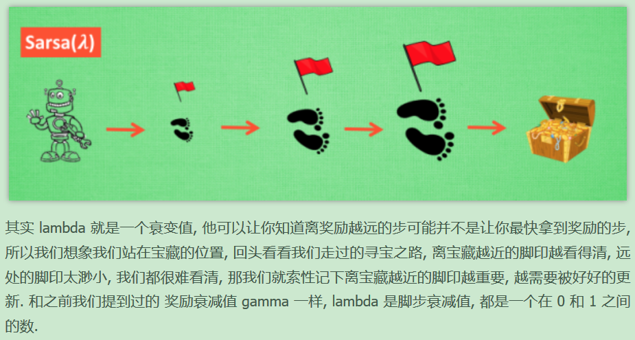
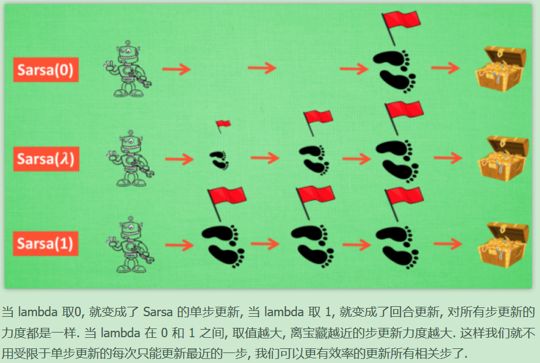

# E4-强化学习-2-Sarsa

`强化学习`

Sarsa和Q Learning类似。

sarsa 算法更新

最大的不同之处，Sarsa是说到做到型，所以也叫他on-policy在线学习，而Q learning是说到单不一定做到，也叫Off-policy，离线学习。因为有了maxQ,Q-learning也是一个特别勇敢的算法。他每次都会选择最近的通往成功的道路，不管有多危险。

可以说Sarsa是一种比较保守胆小的算法，而Q-learning是一种贪婪的，大胆的算法。

---

sarsa思维决策

---

sarsa （λ）

---

每走一步就更新一次自己的行为准则叫做srasa（0），每走多步才更新一次就叫做Sarsa（n）

Sarsa-lambda 是基于 Sarsa 方法的升级版, 他能更有效率地学习到怎么样获得好的 reward. 如果说 Sarsa 和 Qlearning 都是每次获取到 reward, 只更新获取到 reward 的前一步. 那 Sarsa-lambda 就是更新获取到 reward 的前 lambda 步. lambda 是在 [0, 1] 之间取值,

如果 lambda = 0, Sarsa-lambda 就是 Sarsa, 只更新获取到 reward 前经历的最后一步.如果 lambda = 1, Sarsa-lambda 更新的是 获取到 reward 前所有经历的步.
