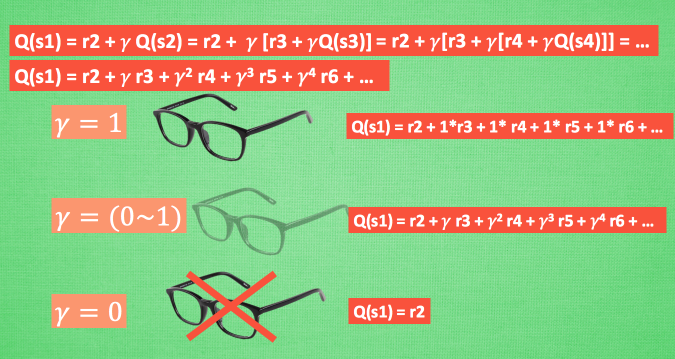

# Q-Learning

## Q-Learning 决策

有一张Q表：包含状态S和行为a和q值，表示状态s下采取a行为获得q值

## Q-Learning更新

---

每当到达一个状态时，更新来的路上的Q值

首先在S1 根据Q表的值采取了一个动作Q（S1，a），假设为S2。

计算Q现实 == Max：Q（S2，a）*衰减值（γ）+R（在S2获得的奖励）即下一步的最大值乘以衰减值，加上在S2获得的奖励值R。

Q估计就是Q（S1，a）。

两个值得差值乘以学习效率α加上Q（S1，a）得到新的Q(S1,a) 的值。

当这一更新完成后才开始S2的决策。

```
Initialize Q arbitrarily // 随机初始化Q表
Repeat (for each episode): // 每一次游戏，从开始到结束是一个episode
    Initialize S // S为初始位置的状态
    Repeat (for each step of episode):
        Choose a from s using policy derived from Q(ε-greedy) //根据当前Q和位置S，使用一种策略，得到动作A，这个策略可以是ε-greedy等
        Take action a, observe r // 做了动作A，到达新的位置S'，并获得奖励R，奖励可以是1，50或者-1000
        Q(S,A) ← Q(S,A) + α*[R + γ*maxQ(S',a)-Q(s,a)] //在Q中更新S
        S ← S'
    until S is terminal //即到游戏结束为止
```


#### γ值的含意

---



gamma = 1 时, 在 s1 看到的 Q 是未来没有任何衰变的奖励, 能清清楚楚地看到之后所有步的全部价值, 但是当 gamma =0, 只能摸到眼前的 reward, 同样也就只在乎最近的大奖励, 如果 gamma 从 0 变到 1, 对远处的价值看得越清楚, 所以机器人渐渐变得有远见。

---

小例子 tabular Q learning 表格式Q learning

---

Q-Learning算法更新

---

大多数RL是由reward导向的，所以定义reward是RL中比较重要的一点。
