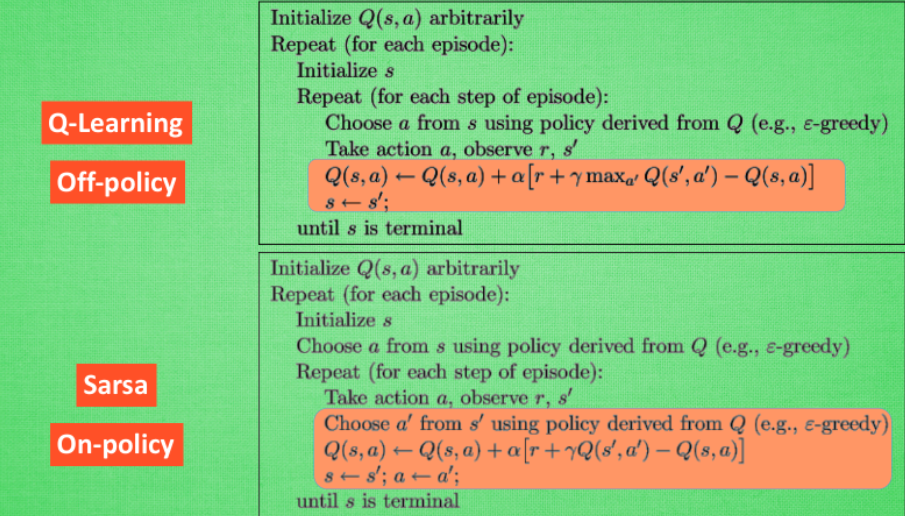
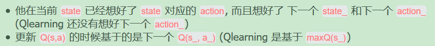
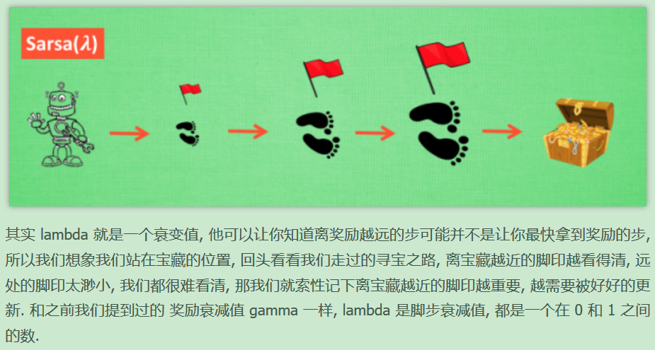
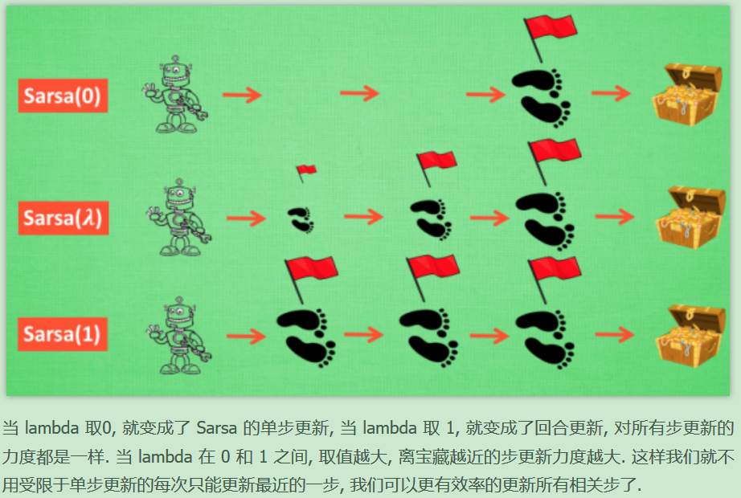

# E4-强化学习-2-Sarsa

# E4-强化学习入门笔记-简介

## 什么是强化学习？

强化学习是一类算法，**让计算机实现从无到有的的学习过程**。包括几个概念有：

**虚拟老师**--给行为打分，强化学习具有分数导向性。

对比监督学习（监督学习：已经有了数据和数据对应的正确的标签）RL（**强化学习从没有数据和标签开始**）

### 算法分类：

* 通过价值选行为：Q Learning、Sarsa、Deep Q Network 

* 直接选行为：Policy Gradients

* 想象环境并从中学习：Model based RL

## 强化学习方法汇总

1. 根据强化学习的方法是否理解所处的环境，分为model-free和model-based

	* Model-free RL 方法有很多，像Q learning,Sarsa,Policy Gradients都是从环境中得到反馈然后从中学习

	* Model-based RL 比前述多了一道程序，为真实世界建模，多了一个虚拟环境，在虚拟环境中还是Model-free方式。

2. 基于概率和基于价值

	* 基于概率是强化学习中最直接的一种，分析所处环境，输出下一步要采取动作的概率，根据概率采取行动。Policy Gardients对于选取连续的动作基于概率的方法有优势。

	* 基于价值会输出下一步所有动作的价值，根据最高的价值选择动作。Q leaning，Sarsa

	* 两种方法的结合 Actor-Critic Actor会基于概率做出动作，Critic会对做出的动作给出动作的价值。从而加速学习过程

3. 回合更新和单步更新
	* 回合结束更新
	* 每一步都更新。

4. 在线学习和离线学习

	* 在线学习：本人在场，边玩边学习。Sarsa，优化Sarsa lambda
* 离线学习：可以选择自己玩也可以选择看着别人玩。也可以白天玩，晚上学。Q leaning Deep-Q-Network。

# Q-Learning

## Q-Learning 决策

有一张Q表：包含状态S和行为a和q值，表示状态s下采取a行为获得q值

## Q-Learning更新

---

每当到达一个状态时，更新来的路上的Q值

首先在S1 根据Q表的值采取了一个动作Q（S1，a），假设为S2。

计算Q现实 == Max：Q（S2，a）*衰减值（γ）+R（在S2获得的奖励）即下一步的最大值乘以衰减值，加上在S2获得的奖励值R。

Q估计就是Q（S1，a）。

两个值得差值乘以学习效率α加上Q（S1，a）得到新的Q(S1,a) 的值。

当这一更新完成后才开始S2的决策。

```
Initialize Q arbitrarily // 随机初始化Q表
Repeat (for each episode): // 每一次游戏，从开始到结束是一个episode
    Initialize S // S为初始位置的状态
    Repeat (for each step of episode):
        Choose a from s using policy derived from Q(ε-greedy) //根据当前Q和位置S，使用一种策略，得到动作A，这个策略可以是ε-greedy等
        Take action a, observe r // 做了动作A，到达新的位置S'，并获得奖励R，奖励可以是1，50或者-1000
        Q(S,A) ← Q(S,A) + α*[R + γ*maxQ(S',a)-Q(s,a)] //在Q中更新S
        S ← S'
    until S is terminal //即到游戏结束为止
```


#### γ值的含意

---


gamma = 1 时, 在 s1 看到的 Q 是未来没有任何衰变的奖励, 能清清楚楚地看到之后所有步的全部价值, 但是当 gamma =0, 只能摸到眼前的 reward, 同样也就只在乎最近的大奖励, 如果 gamma 从 0 变到 1, 对远处的价值看得越清楚, 所以机器人渐渐变得有远见。

---

小例子 tabular Q learning 表格式Q learning

---

Q-Learning算法更新

---

大多数RL是由reward导向的，所以定义reward是RL中比较重要的一点。

Sarsa和Q Learning类似。


sarsa 算法更新



最大的不同之处，Sarsa是说到做到型，所以也叫他on-policy在线学习，而Q learning是说到单不一定做到，也叫Off-policy，离线学习。因为有了maxQ,Q-learning也是一个特别勇敢的算法。他每次都会选择最近的通往成功的道路，不管有多危险。



可以说Sarsa是一种比较保守胆小的算法，而Q-learning是一种贪婪的，大胆的算法。

---

sarsa思维决策

---

sarsa （λ）

---

每走一步就更新一次自己的行为准则叫做srasa（0），每走多步才更新一次就叫做Sarsa（n）





Sarsa-lambda 是基于 Sarsa 方法的升级版, 他能更有效率地学习到怎么样获得好的 reward. 如果说 Sarsa 和 Qlearning 都是每次获取到 reward, 只更新获取到 reward 的前一步. 那 Sarsa-lambda 就是更新获取到 reward 的前 lambda 步. lambda 是在 [0, 1] 之间取值,

如果 lambda = 0, Sarsa-lambda 就是 Sarsa, 只更新获取到 reward 前经历的最后一步.如果 lambda = 1, Sarsa-lambda 更新的是 获取到 reward 前所有经历的步.

# E4-强化学习-3-Deep Q Network

`强化学习`

Deep Q Network 是一种融合了神经网络和Q Learning的方法。

---

传统的表格形式的强化学习有这样一个瓶颈. 当问题太复杂, 状态很多 ，如果全用表格来存储它们, 我们的计算机内存不够, 而且每次搜索对应的状态也是一件很耗时的事.

利用神经网络生成Q值，再用Q learning 的原则，

---

DQN两大利器

---

Experience replay 和 Fixed Q-targets.

有了这两种提升手段, DQN 才能在一些游戏中超越人类.

DQN算法更新（Tensorflow）

---


也就是个 Q learning 主框架上加了些装饰.

这些装饰包括:

* 记忆库 (用于重复学习)

* 神经网络计算 Q 值

* 暂时冻结 q_target 参数 (切断相关性)

---

DQN神经网络（Tensorflow）

---

TensorFlow™是一个基于数据流编程（dataflow programming）的符号数学系统，被广泛应用于各类机器学习（machine learning）算法的编程实现，其前身是谷歌的神经网络算法库DistBelief

使用Tensorflow搭建神经网络。

推荐搭建两个神经网络， target_net 用于预测 q_target 值, 他不会及时更新参数. eval_net 用于预测 q_eval, 这个神经网络拥有最新的神经网络参数. 不过这两个神经网络结构是完全一样的, 只是里面的参数不一样.

---

DQN思维决策（Tensorflow）

---

DQN 的精髓部分之一: 记录下所有经历过的步, 这些步可以进行反复的学习, 所以是一种 off-policy 方法

---

OpenAI gym环境库（选学教程）

---

手动编环境是一件很耗时间的事情, 所以如果有能力使用别人已经编好的环境, 可以节约我们很多时间. OpenAI gym 就是这样一个模块, 他提供了我们很多优秀的模拟环境.

---

Duble DQN （Tensorflow）（选学教程）

---

DQN 基于 Q-learning, Q-Learning 中有 Qmax, Qmax 会导致 Q现实 当中的过估计 (overestimate). 而 Double DQN 就是用来解决过估计的.

我们知道 DQN 的神经网络部分可以看成一个 最新的神经网络 + 老神经网络, 他们有相同的结构, 但内部的参数更新却有时差

---

Prioritized Experience Replay (DQN) (Tensorflow)（选学教程）

---

---

Dueling DQN（Tensor flow）（选学教程）

---

# E4-强化学习-4-Policy Gradients

`强化学习`

Policy Gradients(梯度原则)

---

Policy Gradients 直接输出动作的最大好处就是, 它能在一个连续区间内挑选动作

Policy Gradients 算法更新（Tensorflow）

---

Policy gradient 是 RL 中另外一个大家族, 他不像 Value-based 方法 (Q learning, Sarsa), 但他也要接受环境信息 (observation), 不同的是他要输出不是 action 的 value, 而是具体的那一个 action, 这样 policy gradient 就跳过了 value 这个阶段. 而且个人认为 Policy gradient 最大的一个优势是: 输出的这个 action 可以是一个连续的值, 之前我们说到的 value-based 方法输出的都是不连续的值, 然后再选择值最大的 action. 而 policy gradient 可以在一个连续分布上选取 action.

Policy Gradients 思维决策（Tensorflow）

---

# E4-强化学习-5-Actor Critic

`强化学习`

Actor Critic 演员评判家。他合并了以值为基础（Q learning）和以动作概率为基础（比如 Policy Gradients-梯度原则）两类强化学习算法。

---

原来 Actor-Critic 的 Actor 的前生是Policy Gradients, 这能让它毫不费力地在连续动作中选取合适的动作, Actor Critic 中的 Critic 的前生是 Q-learning 或者其他的 以值为基础的学习法 , 能进行单步更新, 而传统的 Policy Gradients 则是回合更新, 这降低了学习效率.

总结：Actor 前身 Policy Gradients 吸取了它可以在连续动作总选取何时动作的优点。

Critic的前身Q-learning等，吸取了他单步更新的优点。

Actor Critic（Tensor flow）

---

结合了 Policy Gradient (Actor) 和 Function Approximation (Critic) 的方法. Actor 基于概率选行为, Critic 基于 Actor 的行为评判行为的得分, Actor 根据 Critic 的评分修改选行为的概率.

Deep Deterministic Policy Gradient（DDPG）（Tensorflow）

---

它吸收了 [Actor-Critic](https://morvanzhou.github.io/tutorials/machine-learning/ML-intro/4-08-AC/) 让 [Policy gradient](https://morvanzhou.github.io/tutorials/machine-learning/ML-intro/4-07-PG/) 单步更新的精华, 而且还吸收让计算机学会玩游戏的 [DQN](https://morvanzhou.github.io/tutorials/machine-learning/ML-intro/4-06-DQN/) 的精华, 合并成了一种新算法, 叫做 Deep Deterministic Policy Gradient

一句话概括 DDPG: Google DeepMind 提出的一种使用 Actor Critic 结构, 但是输出的不是行为的概率, 而是具体的行为, 用于连续动作 (continuous action) 的预测. DDPG 结合了之前获得成功的 DQN 结构, 提高了 Actor Critic 的稳定性和收敛性.

Asynchronous Advantage Actor-Critic （A3C）

---

一种有效利用计算资源, 并且能提升训练效用的算法, Asynchronous Advantage Actor-Critic, 简称 A3C.

如果使用 A3C 的方法, 我们可以给他们安排去不同的核, 并行运算. 实验结果就是, 这样的计算方式往往比传统的方式快上好多倍

Asynchronous Advantage Actor-Critic（A3C）（Tensorflow）

---

一句话概括 A3C: Google DeepMind 提出的一种解决 Actor-Critic 不收敛问题的算法. 它会创建多个并行的环境, 让多个拥有副结构的 agent 同时在这些并行环境上更新主结构中的参数. 并行中的 agent 们互不干扰, 而主结构的参数更新受到副结构提交更新的不连续性干扰, 所以更新的相关性被降低, 收敛性提高.

A3C 的算法实际上就是将 Actor-Critic 放在了多个线程中进行同步训练. 可以想象成几个人同时在玩一样的游戏, 而他们玩游戏的经验都会同步上传到一个中央大脑. 然后他们又从中央大脑中获取最新的玩游戏方法.

Distributed Proximal Policy Optimization（ 分布式近端策略优化）（DPPO）（Tensor flow）

---

一句话概括 PPO: OpenAI 提出的一种解决 Policy Gradient 不好确定 Learning rate (或者 Step size) 的问题. 因为如果 step size 过大, 学出来的 Policy 会一直乱动, 不会收敛, 但如果 Step Size 太小, 对于完成训练, 我们会等到绝望. PPO 利用 New Policy 和 Old Policy 的比例, 限制了 New Policy 的更新幅度, 让 Policy Gradient 对稍微大点的 Step size 不那么敏感.

PPO 是基于 Actor-Critic 算法

