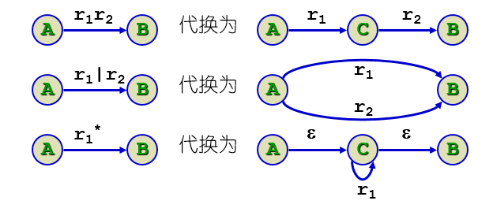
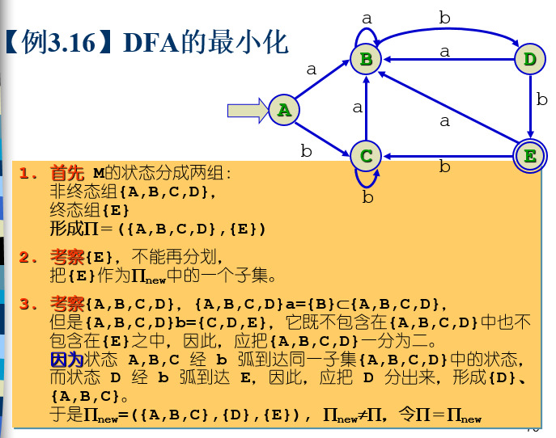
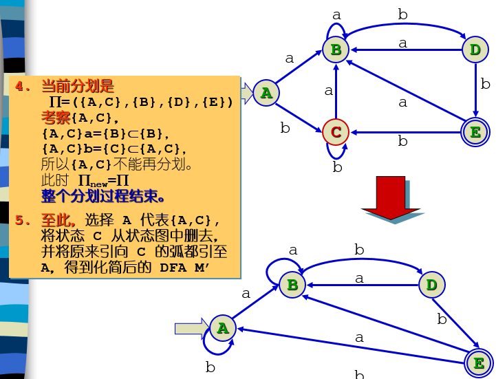
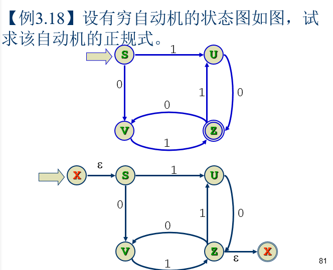
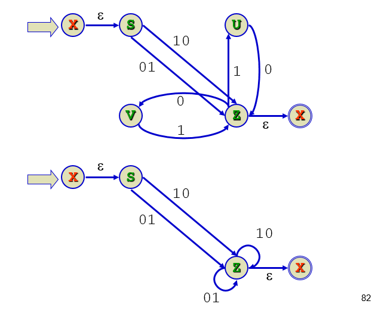
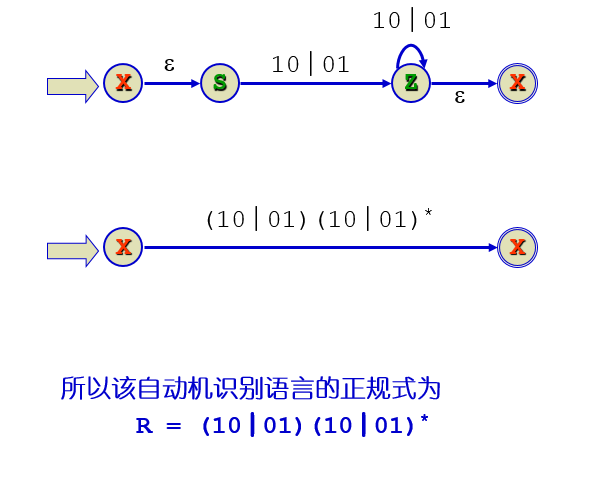
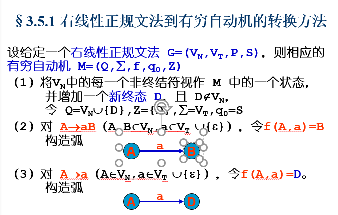
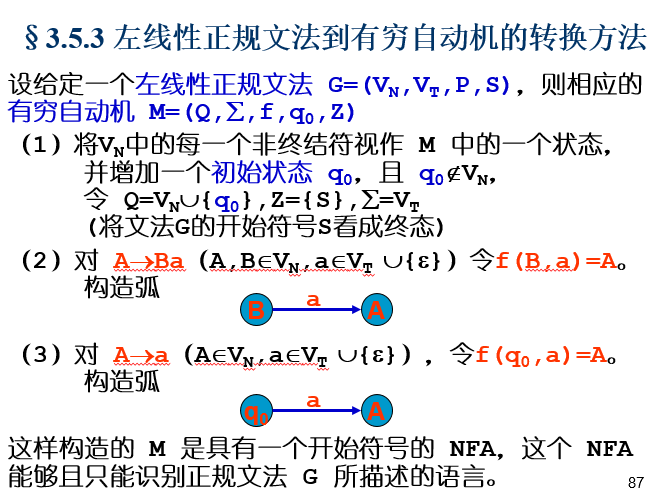
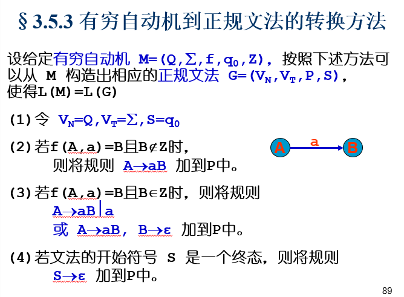
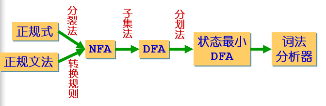

# E1---编译原理----ppt03

### 3.1词法分析程序的功能

词法分析的任务是：从左至右逐个字符地对源程序进行扫描，产生一个个的单词符号，把作为字符串的源程序改造成为单词符号串的中间程序。通常把词法分析程序设计为语法分析程序的子程序。当语法分析程序需要一个单词符号时，就向词法分析程序发出“取下一个单词符号”的调用命令，词法分析程序从输入字符串中，识别出一个具有独立意义的单词符号，并传给语法程序。

### 3.2单词符号及输出单词的形式

单词符号是一个程序语言的基本语法符号。称作token（记号）

词法分析器输出单词符号表示成二元式（单词种别，单词符号的属性值）

词法分析器作为一个独立的子程序的好处：

1. 它比语法分析简单的多，这样可以使得整个编译程序结构更简单、清晰、条理化 

2. 把词法分析器安排成独立的一遍，把整个源程序翻译成一连串的单词符号（二元式）存放于文件中。

3. 把词法分析器安排成一个子程序，当语法分析器需要一个单词符号时就调用这个子程序

### 3.3语言单词符号的两种定义方式

1. 正规文法（正则文法）（左线性文法、右线性文法）

2. 正规式（正则表达式）

正规文法到正规式的转换

1. 将正规文法中的每个非终结符表示成关于它的正规式方程，获得一个联立方程组。(=替代->；+替代|)

2. 建立方程组后，应该先用性质，及各种律。

3. 依照求解规则：

若 x = ax | b(或x = ax+b)，则解为x = a*b

若 x = xa | b(或x = xa+b)，则解为x = ba*

以及正规式的分配率、交换率和结合率求关于文法开始符号的正规式方程组的解。

这个解是关于文法开始符号 S 的一个正规式。

正规式到正规文法的转换

1. 令一个文法开始符号，将等号变为->

2. 若有 A->ab， a 和 b 都是正规式 规则转换成 A->aB 和 B->b两规则，其中 B 是新增的非终结符；//即不能有两个非终结符并列。

3. 将形如 A->a*b 的规则进一步转换成 A->aA | b；

4. 不断利用规则2、3进行转换。

### 3.4正规式和有穷自动机

自动机是具有离散输入与输出的一种抽象数学模型。分为“确定的”和“非确定的”DFA和NFA，两者都能准确识别正规集。

**DFA**

是一个五元式：M=（Q，∑，f，S，Z）

Q 是一个有限状态集，

∑ 是一个有穷字母表

f 是一个单值映射

S 是唯一的初态

Z 是一个终态集（可空）

状态转换矩阵、状态转换图（终态双圈圈）

在DFA M 的状态转换图上，若存在一条从初态到终态的通路，切这条通路商的所有弧的标记符连接成的字等于β，则称β可为DFA M识别，若M的初态同时又是终态，则ε可被M所识别。

**NFA**

与DFA的区别在于：

f是一个多值映射

S是一个非空初态集。

对于NFA同一符号串β可以由多条路来识别。

存在问题：

1.只有尝试了全部可能的路径，才能确定一个输入序列不被接受，路径条数随着路径长度的增长成指数增长。

2.识别过程中需要进行大量的回溯，时间复杂度与输入序列成指数级增长，且算法复杂。

DFA是NFA的特例。

利用有穷自动机构造词法分析器：

1.从单词描述中构造出NFA

2.将NFA转化为DFA

3.化简为状态最少化的DFA；

4.对DFA的每一个状态构造一个程序段将其转化为识别单词的词法分析程序。

**由正规表达式构造NFA**

1.引进初始节点X和终止节Y

2.分裂和添加新的节点。新节点采用不同的名字。

NFA确定化为DFA的方法

1先写出初始状态集，输入字母

2.状态集中的每个字符都走一遍输入字母，在并集。

3.把新出现的状态写到状态列。

4.重复2、3

（最终含有Y的都是终态用双全圈表示）

DFA的化简

删掉多余状态：多余状态是指从开始状态出发，任何输入串也不能到达的状态。

合并等价状态：等价状态是指：从t出发能够读出α停止于终态

从s出发也能读出α停止于终态；反之也成立。s与t等价。

**有穷自动机到正规式的转换**

3.5正规文法与有穷自动机

3.6词法分析程序的编写方法

