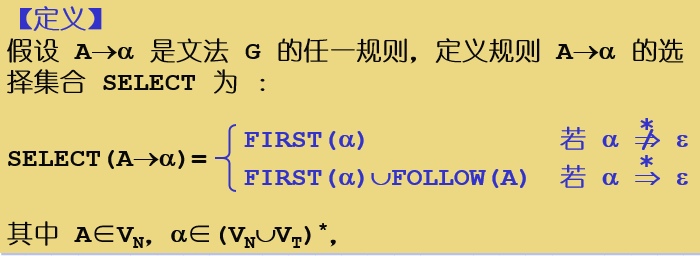
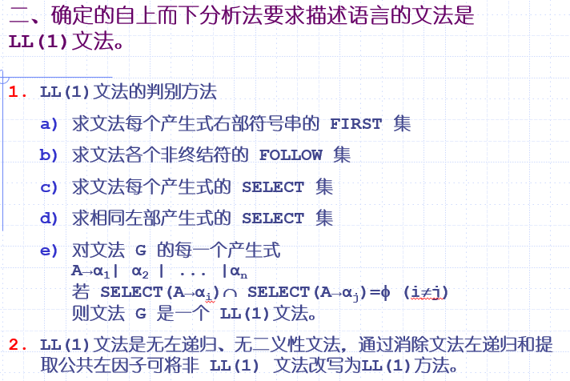

# E1---编译原理----ppt04

`编译原理`

4.1 语法分析程序的功能

按找语法分析树的建立方法，可以把语法分析方法分成两类：

自上而下分析法：从文法开始符出发，通过推导过程试探产生与输入串匹配的句子

自下而上分析法：从输入串出发，通过归约过程，试探规约到闻法的开始符。

不论是哪一种方法，语法分析器都是自左向右地扫描输入字符串。

4.2 自上而下分析面临的问题

4.2.1 非确定的自上而下分析法的思想

    从开始符号出发，为输入串寻找一个最左推导。

4.2.2 自上而下分析的前提条件

    （1）文法无左递归

    （2）任意非终结符的所有候选首符集两两不相交。

    （3）非终结符的候选式有ε时，所有在文法的某个句型中出现在该非终极符后面的终极符与其任何候选式的首符都不同时，才允许使用e产生式。

4.3 LL(1)分析法

4.3.1左递归的消除

**（1）消除直接左递归（规则左递归）**

P->Pa|b  改写

P->bP'

P'->aP'|ε

（2）消除间接左递归（文法左递归）应该不会考吧

4.3.2回溯的消除---要求描述语言的文法是LL（1）文法。

（1）FIRST集

（2）FOLLOW集

（3）SELECT集

（4）LL(1)文法的定义

判断一个文法是否是LL(1)

4.3.3 LL（1）分析条件

非LL（1）文法改写成LL（1）文法

对于某些非LL（1） 文法是可行的，通过提取公共左因子，引入新的非终结符。

4.4 递归下降分析分析法

按

4.5 预测分析法与预测分析程序

预测分析表的构造

**First集构造**

1.如果X是终结符，First（X）={X}

2.如果X是非终结符

    2.1 如果有X->a，a是终结符，那么a∈First（X）

    2.2 如果有X->ε，则ε∈First（X）

    2.3 如果有X->Y1Y2……，First（X）=First（X）∪First（Y1）；如果Y1->ε;继续往后First（X）=First（X）∪First（Y2）；3，4，5……往后同理。如果Y都能推导出ε，

那么ε应该加入X的first集中。

**Follow集的构造**

1.如果X是文法的开始符号，将‘#’置于Follow（X）中

2.如果有规则A-> αBβ，Follow（B）=Follow（B）∪[First（β）-ε]

3.若有规则 A→αB，或规则 A→αBβ 且β=>ε，即ε∈FIRST(β),则把 FOLLOW(A) 加至 FOLLOW(B)中。

构造文法的预测分析表：

1.判断是否为LL（1）文法

2.计算每个非终结符First和Follow集。

2、构造分析表 M[A，a]

(1)对文法 G 的每个规则 A→α，执行第(2)步和第(3)步；

(2)对每个终极符 a∈FIRST(α), 则置 M[A,a]=A→α；

(3)若ε∈FIRST(α）,对每个 b∈FOLLOW(A), 则置 M[A, b]＝A→α；

(4)把所有无定义的 M[A,a] 标上“出错标志”(表中用空格表示)。
