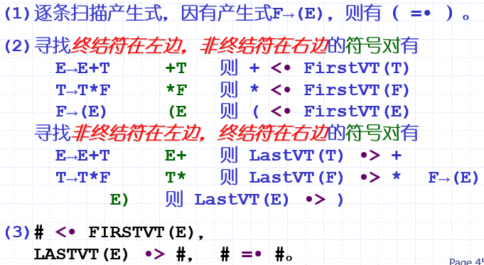

# E1---编译原理----ppt05

`编译原理`

5.1 自下而上分析法的一般原理

1.将输入符号按从左到右顺序依次移入文法符号的栈中，便移入边分析

2.当栈顶符号串形成某条规则右部是就进行一次归约，即用该规则左部非终结符替换相应规则右部符号串。

3.重复这一过程直到整个输入串分析完毕。

4.若最终栈中剩下句子右界符“#”和文法开始符号，则所分析的输入符号串是文法正确的句子。否则就不是正确的句子。

5.2 算符优先分析法

5.2.1 方法概述

算符优先分析法：先确定运算符（终结符）之间的优先关系和结合性质，借助这种关系确定举行的可归约串，并进行归约。

算符……是自下而上的规约过程，但可归约串未必是句柄，因此不是一种规范规约。

5.2.2 算符优先文法的定义

算符文法：它的任一规则的右部都不含两个相邻的非终结符

两个终结符号之间的优先关系：

1）a=.b  P→…ab… 或 P→aQb…

2）a<.b  P→…aR…  R =+> b…  或 R =+> Qb…

3）a.>b  P→…Rb… R=+> …a 或 R =+> …aQ；

算符优先文法的定义

设有一个不含ε-规则的算符文法 G，如果任何终结符对(a，b)至多只满足下述关系之一：

a =· b， a ·> b， a <· b；

则称 G 是一个算符优先文法，也称 OPG 文法。

**

**

5.2.3 算符优先关系表的构造

1、为每一个非终结符A构造FirstVT（A）和LastVT（A）

构造FirstVT（A） 

1.找A->a……；

2.找A->Ba……；

3.找A->B……；把FirstVT（B）加进去。

构造LastVT（A）

1.找 A→...a 

2.找P→...aB

3.找 A→...B，把LastVT（B）并进去。

2、构造给文法的算符优先关系表：

5.2.4 算符优先分析算法的设计

素短语：它至少含有一个终结符，并且除它自身之外不再含有任何更小的素短语。

最左素短语是指处于句型最左边的那个素短语，是算符有先分析算法的可归约串。

5.2.5 优先函数的构造

5.2.6 算符优先分析法的局限性

·书写限制大，一般语言无法满足。

·很难处理--，++这样的运算符，

·很难避免把错误的句子得到归约。

5.3 LR分析法

* 5.3.1 LR分析器的工作原理和过程

action表

goto表，遇见s移进。遇见r归约，

归约操作过程：

1.弹出符号，变为非终结符T

2.弹出相应数目状态，

3.goto（最右状态，T）进状态栈。

* 5.3.2 LR（0）分析法

LR文法：对于一个文法，如果能构造一张LR分析表，使得它的每个入口均是唯一确定的，则把这个文法称为LR文法。如果能用一个每一步顶多向前检查k个输入符号的LR分析器进行分析，则把这个文法称为LR（K）文法。

一些非LR结构：1.二义性文法不是LR（K）

如果有S→iCtS∣iCtSeS，在某时刻（…iCtS，e…#）有归约/移进冲突。

活前缀：

这种前缀不包含句柄之后的任何符号。

·在右边添一些终结符号后就可以使他称为一个规范句型。

·规范句型中句柄右部不包含任何非终结符

·LR分析过程中，栈里的文法符号自底向上应该构成活前缀，如果输入串没有错误，那么，输入串剩下的部分接在这个活前缀之后，一定构成一个规范句型。对句柄的识别变成对规范句型活前缀的识别。

活前缀的形式定义

生式

文法的拓广

对原文法的开始符号添加产生式S'->S，目的是为了对某些右部含有开始符号的文法，在规约过程中是否已经规约到文法的最初开始符，还是在文法右部出现的开始符。而拓广文法的开始符S'只在左部出现。这样确保了不会混淆。

LR（0）项目：我们把文法G中右部添加一个圆点的产生式称为文法G的一个LR（0）项目。一个规则可对应的项目个数是它的余部符号长度加1。

3.构造识别活前缀的NFA。（男上加男）

·写出拓广文法所有规则的所有项目，对它们编号，即为NFA的状态

形如：A→α·aβ

　　　B→γ· 移进-归约冲突。

形如：A→β·

　　　B→γ·归约-归约冲突。

文法G的LR（0）项目集 规范族的每个项目不包含任何冲突项目，（移进-规约冲突、归约-归约冲突）则称文法G是LR（0）文法。

需要重看

5.3.3 SLR（1）分析法

---

5.3.4 LR（1)分析法

5.3.5 LALR（1）分析法

5.3.6 LR 分析法对二义性文法的应用

5.4 语法分析器的自动产生工具YACC

呀
