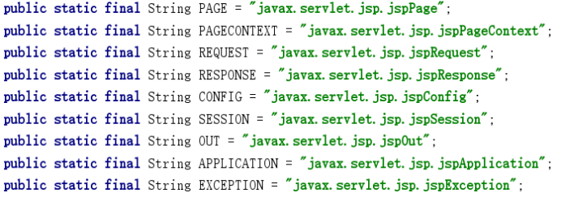
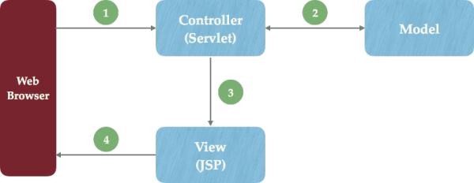

# java-f-JavaWeb1基础和原理

* 请问JAVA应用服务器都有那些？（主要深入tomcat）

目前比较流行的有两大开源的 webserver/servlet容器Tomcat 和 Jetty。

听说过Jetty和Tomcat相比有它的优势，相对于Tomcat更加轻量级，也有很好的可扩展性。。

Tomcat对于企业级需求Tomcat更好。

---

* JSP有内置对象---以及这些对象的作用分别是什么？

一. 四大域对象

1. PageContext ：页面范围的数据

2. ServletRequest：请求范围的数据

3. HttpSession：会话范围的数据

4. ServletContext：应用范围的数据JSP中一共预先定义了9个这样的对象，分别为：request、response、

session、application、out、pagecontext、config、page、exception。

jsp运行原理:

每个jsp页面在第一被访问时，WEB容器都会把该jsp页面翻译成一个_jspServlet(实际上是一个servlet)，然后按照servlet的调用方式进行调用，在调用的过程中，会传递或创建九大web内置对象。

1、request对象

request 对象是 javax.servlet.httpServletRequest类型的对象。 该对象代表了客户端的请求信息，主要用于接受通过HTTP协议传送到服务器的数据。（包括头信息、系统信息、请求方式以及请求参数等）。request对象的作用域为一次请求。

主要方法：

1. getAttribute(String name);返回指定属性的值

2. setAttribute(String key,Object obj);设置属性的值

3. getAttributeNames();返回所有可用属性名的枚举

4. getParameterNames();返回可用参数名中的枚举

5. getParameterValues();返回包含参数name的所有值得数组

6. setCharacterEncoding();设置字符编码格式

7. getCharacterEncoding();返回字符编码格式

8. getContentType();返回请求体的MIME类型

9. getInputStream();返回请求中的二进制流

10. getProtocol();返回请求用的协议类型及版本号

11. getServerPort();返回服务器接受此请求所用的端口号

2、response对象

response 代表的是对客户端的响应，主要是将JSP容器处理过的对象传回到客户端。response对象也具有作用域，它只在JSP页面内有效。

主要方法：

1. getCharacterEncoding();返回响应用的是何种字符编码

2. getOutputStream();返回响应的一个二进制输出流

3. getWriter();返回一个向客户端输出字符的对象

4. setContentType(String type);设置响应的MIME类型

5. sendRedirect(String location);重定向客户端请求

3、session对象

session 对象是由服务器自动创建的与用户请求相关的对象。服务器为每个用户都生成一个session对象，用于保存该用户的信息，跟踪用户的操作状态。session对象内部使用Map类来保存数据，因此保存数据的格式为 “Key/value”。 session对象的value可以是复杂的对象类型，而不仅仅局限于字符串类型。

主要方法：

1. setAttribute(String name,Object obj);设置属性的值

2. getAttribute(String name);返回属性值

3. getAttributeNames;返回可用参数名中的枚举

4. getCreationTime();返回session创建时间

5. getId();返回session创建的唯一ID号

6. getLastAccessedTime();返回此session里客户端最近一次请求时间

7. getMaxInactiveInterval();返回两次请求间隔多长时间此session被取消(ms)

8. getValueNames();返回一个包含此session中所有可用属性的数组

9. invalidate();取消session，使得session不可用

4、application对象

application 对象可将信息保存在服务器中，直到服务器关闭，否则application对象中保存的信息会在整个应用中都有效。与session对象相比，application对象生命周期更长，类似于系统的“全局变量”。

主要方法：

1. getAttribute(String name);返回属性值

2. setAttribute(String name,Object obj);设置属性值

3. getAttributeNames();返回所有可用属性名的枚举

4. removeAttribute(String name);删除属性名及对应的属性值

5. getRealPath(String path);返回虚拟路径的真实路径

6. getContext(String s)返回指定webApplication的application对象

7. getMimeType(Stirg file);返回指定文件的MIME类型

8. getResource(String path);返回指定资源(文件及目录)的URL路径

9. getResourceAsStream(String path);返回指定资源的输入流

10. getRequestDispatcher(String s);返回指定资源的requestDispathcer对象

11. getServlets();返回所有servlet的枚举

12. getServlet(String name);返回指定名的servlet

13. getServletNames();返回所有servlet名的枚举

session,application,request的区别:

一个项目中session尽量少用几个,因为过多的session会影响程序的执行效率.它主要用于保存登录信息(用户信息,权限,资源)即频繁使用的信息.

application: 用于多个浏览器之间共享数据,多个用户共享该对象,可以做计数器.它的用法与session完全一样.

数据范围:application(服务器关闭时失效)>session(浏览器关闭时失效)>request(只能用于两个跳转页面之间)

5、out 对象

out 对象用于在Web浏览器内输出信息，并且管理应用服务器上的输出缓冲区。在使用 out 对象输出数据时，可以对数据缓冲区进行操作，及时清除缓冲区中的残余数据，为其他的输出让出缓冲空间。待数据输出完毕后，要及时关闭输出流。

主要方法：

1. write(T val);输出

2. clear();清空out缓冲区

3. flush();强制刷新

4. clear();关闭输出流

6、pageContext 对象

pageContext 对象的作用是取得任何范围的参数，通过它可以获取 JSP页面的out、request、reponse、session、application 等对象。pageContext对象的创建和初始化都是由容器来完成的，在JSP页面中可以直接使用 pageContext对象。

主要方法：

1. getException();

2. getPage();

3. getSession();

4. getRequest();

5. getResponse();

6. getServletConfig();

7. getServletContext();

8. getException();

9. setAttribute(String name,Object attribute);设置属性及属性值

10. getAttribute(String name);在指定范围内获取设置的属性值

11. removeAttribute(String name);删除属性

12. getAttributeScopt(String name);返回某属性的作用范围

13. forward(String relativeUrlPath);使当前页面重定向到另一页面

14. include(String relativeUrlPath);在当前位置引入另一文件

15. release();释放pageContext所占用的资源

7、config 对象

config 对象的主要作用是取得服务器的配置信息。通过 pageConext对象的 getServletConfig() 方法可以获取一个config对象。当一个Servlet 初始化时，容器把某些信息通过 config对象传递给这个 Servlet。 开发者可以在web.xml 文件中为应用程序环境中的Servlet程序和JSP页面提供初始化参数。

8、page 对象

page 对象代表JSP本身，只有在JSP页面内才是合法的。 page隐含对象本质上包含当前 Servlet接口引用的变量，类似于Java编程中的 this 指针。是一个java.lang.Object类的实例

9、exception 对象

exception 对象的作用是显示异常信息，只有在包含 isErrorPage="true" 的页面中才可以被使用，在一般的JSP页面中使用该对象将无法编译JSP文件。excepation对象和Java的所有对象一样，都具有系统提供的继承结构。exception 对象几乎定义了所有异常情况。在Java程序中，可以使用try/catch关键字来处理异常情况； 如果在JSP页面中出现没有捕获到的异常，就会生成 exception 对象，并把 exception 对象传送到在page指令中设定的错误页面中，然后在错误页面中处理相应的 exception 对象。

主要方法：

getMessage();返回描述异常的消息

---

* 对象的getAttribute作用范围（由小到大）

pageContext：作用整个页面，跳转后，则失效

request：作用当次请求，转发有效，重定向无效，刷新则无效

session：作用当次登录

application：作用整个页面

---

* 请说明一下jsp有哪些动作? 这些动作的作用又分别是什么?

[https://blog.csdn.net/u010897406/article/details/49618413](https://blog.csdn.net/u010897406/article/details/49618413)

jsp九对象、七大动作、三指令

JSP动作中的通用属性

所有Action元素有两个常用属性: id 属性和 scope 属性。

Id属性唯一标识Action元素。我们可以使用id来引用JSP页面中的动作。

Scope属性标识Action元素的生命周期。 scope 属性有四个可能的值:

* page

* request

* session

* application

一:include 动态包含(分别编译): 将文件插入JSP页面。语法如下所示:

用jsp:include动作实现

<jsp: include page="included.jsp" flush="true" />

它总是会检查所含文件中的变化，适合用于包含动态页面，并且可以带参数。flush属性: 用true ，表示页面可刷新。默认为false;

二:useBean动作(jsp页面使用javaBean的第二种方式):

<jsp:useBean id="对象名" class="包名.类名" scope="作用范围(request/page/application/session)"/>

作用域默认为page(本页面有效).

三:getProperty动作(name为useBean动作中的id).

从对象中取出属性值：<jsp:getProperty name="javaBean对象" property="javaBean对象属性名" />

四:setProperty动作(name为useBean动作中的id):

为对象设置属性值：<jsp:setProperty name="javaBean对象" property="javaBean对象属性名" value="值"/>

为对象设置属性值:<jsp:setProperty property="javaBean对象属性名" name="javaBean对象" param="username"/>

(param="username" 相当于 value=<%=request.getParameter("username")%>)

五:param动作(传递参数)):

到达跳转页面可以通过 request.getParameter(“参数名”)方式取出参数值

<jsp:include page="转向页面的url" >

           <jsp:param   name="参数名1" value="参数值1">

           <jsp:param   name="参数名2" value="参数值2">

           ...........

</jsp:include>

或:

<jsp:forward page="转向页面的url" >

           <jsp:param   name="参数名1" value="参数值1">

           <jsp:param   name="参数名2" value="参数值2">

           ...........

</jsp:forward>

六:forward动作:

跳转页面:

<jsp:forward page="login.jsp" />

七:plugin动作:<jsp:plugin>:

用于指定在客户端运行的插件

---

* JSP三大指令

一:page指令:

1.指定页面编码.例:

<%@ page language="java" contentType="text/html;charset=gbk" pageEncoding="gbk" %>

2.导入包,例:

<%@ page import="java.util.*,java.text.*" %>.

二:include 指令

静态包含(统一编译):

<%@ include file="included.jsp"%>

三：taglib

Taglib 指令是定义一个标签库以及其自定义标签的前缀。

<%@ taglib uri="" prefix="c"%>

---

* Jsp中的静态包含与动态包含

动态include(<jsp: include page="included.jsp"/>)

静态include(<%@ include file="included.jsp"%>)

1. 静态include的结果是把其他jsp引入当前jsp,两者合为一体,可以达到数据的共享即可以说是统一编译的,而

动态include的结构是两者独立的,直到输出时才合并即为分别编译的.

2.动态include的jsp文件独立性很强,是一个单独的jsp文件,需要使用的对象,页面设置,都由自己创建,而静态include纯粹是把代码写在外面的一种共享方法,所有的变量都是可以和include它的主文件共享,两者高度紧密结合,不能 有变量同名的冲突.而页面设置也可以借用主文件的.

3.动态包含总是检查被包含页面的变化,静态包含不一定检查被包含页面的变化.

4.动态包含可带参数,静态包含不能带参数.如

<jsp: include page="included.jsp">

放入参数

</jsp:include>

---

* 请简要说明一下JSP和Servlet有哪些相同点和不同点？另外他们之间的联系又是什么呢？

1、不同之处

Servlet在Java代码中通过HttpServletResponse对象动态输出HTML内容

JSP在静态HTML内容中嵌入Java代码，Java代码被动态执行后生成HTML内容

2、各自的特点

Servlet能够很好地组织业务逻辑代码，但是在Java源文件中通过字符串拼接的方式生成动态HTML内容会导致代码维护困难、可读性差

JSP虽然规避了Servlet在生成HTML内容方面的劣势，但是在HTML中混入大量、复杂的业务逻辑同样也是不可取的

3、联系

jsp经编译后就变成了Servlet。JSP是Servlet技术的扩展，本质上就是Servlet的简易方式。JVM只能识别java的类，不能识别JSP的代码,Web容器将JSP的代码编译成JVM能够识别的java类。

4、通过MVC双剑合璧

1. Web浏览器发送HTTP请求到服务端，被Controller(Servlet)获取并进行处理（例如参数解析、请求转发）

2. Controller(Servlet)调用核心业务逻辑——Model部分，获得结果

3. Controller(Servlet)将逻辑处理结果交给View（JSP），动态输出HTML内容

4. 动态生成的HTML内容返回到浏览器显示

---

* 请谈谈，转发和重定向 之间的区别？

请求转发：客户浏览器发送http请求----> web服务器接受此请求----> 调用内部的一个方法在容器内部完成请求处理和转发动作----> 将目标资源发送给客户;在这里，转发的路径必须是同一个web容器下的url，其不能转向到其他的web路径上去，中间传递的是自己的容器内的request。 在客户浏览器路径栏显示的仍然是其第一次访问的路径，也就是说客户是感觉不到服务器做了转发的。转发行为是浏览器只做了一次访问请求。

重定向过程：客户浏览器发送http请求----> web服务器接受后发送302状态码响应及对应新的location给客户浏览器----> 客户浏览器发现是302响应，则自动再发送一个新的http请求，请求url是新的location地址------> 服务器根据此请求寻找资源并发送给客户。在这里 location可以重定向到任意URL，既然是浏览器重新发出了请求，则就没有什么request传递的概念了。在客户浏览器路径栏显示的是其重定向的路径，客户可以观察到地址的变化的。重定向行为是浏览器做了至少两次的访问请求的。

主要区别：请求转发是服务器行为，重定向是客户端行为。

详细区别：

1.地址栏显示：

forword 显示原来地址，redirect显示新的地址。

2.数据共享：

请求转发调用者和被调用者之间共享相同的request对象和response对象。重定向的调用者和被调用者属于两个独立访问请求和响应过程，forword转发页面和转发到的页面可以共享request里面的数据，redirect不能共享数据

3.运用：

forword一般用于用户登录时，根据角色转发到相应模块。redirect一般用于用户注销登录，返回主页面和跳转到其他的网站等。

3.用法：

转发只能将请求转发给同一个web应用中的组件。重定向可以重定向到任一绝对url。重定向跳转后必须加上return，不然虽然页面跳转了，但是还是会执行后面的语句。转发是跳转之后下面的代码就不会执行了。

4.效率：forword高于redirect。

---

* 说说你对get和post请求，并且说说它们之间的区别？

1、GET请求会向数据库发索取数据的请求，从而来获取信息，该请求就像数据库的select操作一样，只是用来查询一下数据，不会修改、增加数据，不会影响资源的内容，即该请求不会产生副作用。无论进行多少次操作，结果都是一样的。

2、与GET不同的是，PUT请求是向服务器端发送数据的，从而改变信息，该请求就像数据库的update操作一样，用来修改数据的内容，但是不会增加数据的种类等，也就是说无论进行多少次PUT操作，其结果并没有不同。

3、POST请求同PUT请求类似，都是向服务器端发送数据的，但是该请求会改变数据的种类等资源，就像数据库的insert操作一样，会创建新的内容。几乎目前所有的提交操作都是用POST请求的。

4、DELETE请求顾名思义，就是用来删除某一个资源的，该请求就像数据库的delete操作。就像前面所讲的一样，既然PUT和POST操作都是向服务器端发送数据的，那么两者有什么区别呢。。。POST主要作用在一个集合资源之上的（url），而PUT主要作用在一个具体资源之上的（url/xxx），通俗一下讲就是，如URL可以在客户端确定，那么可使用PUT，否则用POST。

基础标准答案：

GET在浏览器回退时是无害的，而POST会再次提交请求。

GET产生的URL地址可以被Bookmark，而POST不可以。

GET请求会被浏览器主动cache，而POST不会，除非手动设置。

GET请求只能进行url编码，而POST支持多种编码方式。

GET请求参数会被完整保留在浏览器历史记录里，而POST中的参数不会被保留。

GET请求在URL中传送的参数是有长度限制的，而POST么有。

对参数的数据类型，GET只接受ASCII字符，而POST没有限制。

GET比POST更不安全，因为参数直接暴露在URL上，所以不能用来传递敏感信息。

GET参数通过URL传递，POST放在Request body中。

进阶内容

GET产生一个TCP数据包；POST产生两个TCP数据包。对于GET方式的请求，浏览器会把http header和data一并发送出去，服务器响应200（返回数据）；而对于POST，浏览器先发送header，服务器响应100 continue，浏览器再发送data，服务器响应200 ok（返回数据）

看起来GET比POST更有效，但是还需谨慎。为什么？

1. GET与POST都有自己的语义，不能随便混用。

2. 据研究，在网络环境好的情况下，发一次包的时间和发两次包的时间差别基本可以无视。而在网络环境差的情况下，两次包的TCP在验证数据包完整性上，有非常大的优点。

3. 并不是所有浏览器都会在POST中发送两次包，Firefox就只发送一次。

---

//请你解释一下，什么是Web Service？

---

请简要说明一下四种会话跟踪技术分别是什么？

1.Cookie:

Cookie它是存储在客户端或者客户端浏览器上的文本文件,很容易就可以查看到。所以,不能使用Cookie存储敏感数据,比如银行卡密码，不能使用Cookie来做必要的功能。（用户可能不同意使用Cookie）

Cookie不能存储中文

使用URL编码来间接存储中文

username = URLEncoder.encode(username)

//解码

name = URLDecoder.decode(name)

2.Session

Session:会话，用户使用浏览器,进行一系列的访问,这一个过程就是一个会话，也就是说,多个请求共享一个会话。会话在第一次访问的时候就被创建，HttpSession:默认有效时间是30分钟。

使用代码设置session的失效时间session.setMaxInactiveInterval(100);

使用配置文件设置session的失效时间

<session-config>

<session-timeout>200</session-timeout>

</session-config>

让session立刻失效session.invalidate();

注意:

当使用代码和配置文件同时配置session的失效时间的时候，以小的时间为准[注意,他们的单位都是分钟]。

Session实现的机制:

它是基于Cookie，当用户第一次访问的时候,会自动生成一个Cookie,用来记录当前Session的ID值。

这个Cookie的key是JSESSIONID value就是Session 的ID值，当Cookie被阻止,应该强制把JSESSIONID传过去,使用URL重写

<a href=<%=response.encodeURL("ViewAllUserServlet")%>>查看所有用户强制传送JSESSIONID</a>

3.Hidden

隐藏表单域：<input type="hidden">，非常适合需要大量数据存储的会话应用。

4.url 重写

URL 重写:URL 可以在后面附加参数，和服务器的请求一起发送，这些参数为名字/值对。 

为了防止用户禁用cookie，可以使用URL重写技术来实现会话跟踪！

url重写原理：当服务器程序调用request.getSession();代码时，其会先看request.getCookies()方法中有没有名为JSESSIONID的cookie带过来，如果没有，就看URL有没有被重写(即附带JSESSIONID)，如果有，则从服务器中找key为JSESSIONID的session对象，如果都没有，则创建一个新的session。如果用户禁用了cookie，则只能通过URL重写方式实现会话跟踪！

---

请你说说，cookie 和 session 的区别？

cookie 和session 的区别：

1、cookie数据存放在客户的浏览器上，session数据放在服务器上。

2、cookie不是很安全，别人可以分析存放在本地的COOKIE并进行COOKIE欺骗

   考虑到安全应当使用session。

3、session会在一定时间内保存在服务器上。当访问增多，会比较占用你服务器的性能

   考虑到减轻服务器性能方面，应当使用COOKIE。

4、单个cookie保存的数据不能超过4K，很多浏览器都限制一个站点最多保存20个cookie。

5、所以个人建议：

   将登陆信息等重要信息存放为SESSION

   其他信息如果需要保留，可以放在COOKIE中

---

Javaweb过滤器（Javaweb）、监听器、拦截器

[https://www.cnblogs.com/ZWOLF/p/10604253.html](https://www.cnblogs.com/ZWOLF/p/10604253.html)

过滤器<filter>：就是过滤掉一些信息，例如过滤掉一些非法的地址请求，不是从登录界面跳转过来的都过滤掉。

拦截器：是AOP的一种实现： 在运行时，动态地将代码切入到类的指定方法、指定位置上的编程思想就是面向切面的编程。

监听器： 监听器是一个专门用于对其他对象身上发生的事件或状态改变进行监听和相应处理的对象，当被监视的对象发生情况时，立即采取相应的行动。

---

表达式语言（EL）的隐式对象以及该对象的作用

EL表达式的11个隐式对象

   1. param 包含所有的参数的Map可以获取参数返回String

   2. paramValues 包含所有参数的Map,可以获取参数的数组返回String[]

头信息

   3. header 包含所有的头信息的Map。可以获取头信息返回String

   4. headerValues 包含所有的头信息的Map。可以获取头信息数组返回String[]

Cookie

   5. cookie包含所有cookie的Map,key为Cookie的name属性值

初始化参数

   6. iniParam 包含所有的初始化参数的Map，可以获取初始化的参数.

作用域

   7. pageScope 包含page作用域内的Map.

   8. requestScope 包含request作用域内的Map

   9. sessionScope 包含session作用域内的Map

  10. applicationScope 包含application作用域内的Map

  11. pageContext 包含页面内的变量的Map，包含request，response，page，application，config等所有的隐藏对象

---

---

请问在什么情况下回使用assert？

在软件开发中，assertion是一种经典的调试、测试方式。 从理论上来说，通过assertion方式可以证明程序的正确性，但是这是一项相当复杂的工作，目前还没有太多的实践意义。 在实现中，assertion就是在程序中的一条语句，它对一个boolean表达式进行检查，一个正确程序必须保证这个boolean表达式的值为true；如果该值为false，说明程序已经处于不正确的状态下，系统将给出警告并且退出。一般来说，assertion用于保证程序最基本、关键的正确性。assertion检查通常在开发和测试时开启。为了提高性能，在软件发布后，assertion检查通常是关闭的。

使用示例：两种语法：

1.assert expression1;

2.assert expression1: expression2;

package solution;

/**

* @author TQR

* 2019年8月26日

*/

import java.util.Scanner;

public class Solution_AplusBandC{

    public static void main(String []args){

        Scanner sc = new Scanner(System.in);

        int N = sc.nextInt();

        int k=1;

        while(k<=N){

            //System.out.println("k : "+k);

            long a = sc.nextLong();

            long b = sc.nextLong();

            long c = sc.nextLong();

            System.out.println("Case #"+k+": "+(a+b>c));

            k++;

            assert k<0:"k is"+k;

        }

        sc.close();

    }

}

3

2 3 2

Case #1: true

Exception in thread "main" java.lang.AssertionError: k is2

      at  solution.Solution_AplusBandC.main(Solution_AplusBandC.java:24)

在eclipse中开启essert选项， Assert 1.Run -> Run Configurations -> Arguments -> VM arguments文本框中加上断言开启的标志:-enableassertions 或者-ea 。

Assersion的继承问题：可以认为Assersion不具备继承功能，如果在父类中有Assersion ，子类中也有Assersion ，他们的Assersion可以分别开启。不相影响

使用：可以用来检查控制流、检查不变量等等。

---

请说明一下web.xml文件中可以配置哪些内容？

web.xml 并不是Web的必要文件，没有web.xml网站仍然可以正常工作，但是当网站功能复杂起来后，web.xml有很大用处，

标签元素：有：

1.指定欢迎页：

<welcome-file-list>

    <welcome-file>index.jsp</welcome-file>

    <welcome-file>index1.jsp</welcome-file>

</welcome-file-list>

2.命名与定制URL

<servlet>

    <servlet-name>servlet1</servlet-name>

    <servlet-class>net.test.TestServlet</servlet-class>

</servlet>

<servlet-mapping>

    <servlet-name>servlet1</servlet-name>

    <url-pattern>*.do</url-pattern>

</servlet-mapping>

        url-pattern的意思是所有的.do文件都会经过TestServlet处理。

3.定制初始化参数：

<servlet>

    <servlet-name>servlet1</servlet-name>

    <servlet-class>net.test.TestServlet</servlet-class>

    <init-param>

          <param-name>userName</param-name>

          <param-value>Tommy</param-value>

    </init-param>

    <init-param>

          <param-name>E-mail</param-name>

          <param-value>Tommy@163.com</param-value>

    </init-param>

</servlet>

经过上面的配置，在servlet中能够调用getServletConfig().getInitParameter("param1")获得参数名对应的值。

//上下文参数：声明应用范围内的初始化参数。  

<context-param>  

    <param-name>ContextParameter</para-name>  

    <param-value>test</param-value>  

    <description>It is a test parameter.</description>  

</context-param>  

//在servlet里面可以通过getServletContext().getInitParameter("context/param")

得到  

4.指定错误处理页面，可以通过“异常类型”或“错误码”来指定错误处理页面。

<error-page>

    <error-code>404</error-code>

    <location>/error404.jsp</location>

</error-page>

-----------------------------

<error-page>

    <exception-type>java.lang.Exception<exception-type>

    <location>/exception.jsp<location>

</error-page>

<error-page>  

      <exception-type>java.lang.NullException</exception-type>  

      <location>/error.jsp</location>  

</error-page>

5.设置过滤器：比如设置一个编码过滤器，过滤所有资源

<filter>

    <filter-name>XXXCharaSetFilter</filter-name>

    <filter-class>net.test.CharSetFilter</filter-class>

</filter>

<filter-mapping>

    <filter-name>XXXCharaSetFilter</filter-name>

    <url-pattern>/*</url-pattern>

</filter-mapping>

6.设置监听器：

web.xml中的<listener></listener>有什么用? 没别的用处!就是配置监听类的~，它能捕捉到服务器的启动和停止! 在启动和停止触发里面的方法做相应的操作! 它必须在web.xml 中配置才能使用! web.xml 中listener元素不是只能有一个，有多个时按顺序执行。

        如何在web.xml向listener中传参数 ？

<listener>

     <listener-class>监听器类的完整路径</listener-class>

</listener>

         监听器中不能够写初始化参数; 可通过另个的途径达到初始化参数的效果: 1.写一个properties文件,在文件里写好初始化参数值, 2.在监听器中可以通得到properties文件中的值(写在静态块中)。

7.设置会话（Session）过期时间，其中时间以分钟为单位

<session-config>

     <session-timeout>60</session-timeout>

</session-config>

等等……

---

J2EE中常用的名词解释

web 容器：给处于其中的应用程序组件（JSP，SERVLET）提供一个环境，使JSP,SERVLET直接和容器中的环境变量接接口互，不必关注其它系统问题。主要有WEB服务器来实现。例如：TOMCAT,WEBLOGIC,WEBSPHERE等。该容器提供的接口严格遵守J2EE规范中的WEBAPPLICATION 标准。我们把遵守以上标准的WEB服务器就叫做J2EE中的WEB容器。

Web container：实现J2EE体系结构中Web组件协议的容器。这个协议规定了一个Web组件运行时的环境，包括安全，一致性，生命周期管理，事务，配置和其它的服务。一个提供和JSP和J2EE平台APIs界面相同服务的容器。一个Web container 由Web服务器或者J2EE服务器提供。

EJB容器：Enterprise java bean 容器。更具有行业领域特色。他提供给运行在其中的组件EJB各种管理功能。只要满足J2EE规范的EJB放入该容器，马上就会被容器进行高效率的管理。并且可以通过现成的接口来获得系统级别的服务。例如邮件服务、事务管理。一个实现了J2EE体系结构中EJB组件规范的容器。这个规范指定了一个Enterprise bean的运行时环境，包括安全，一致性，生命周期，事务，配置，和其他的服务。

JNDI：（Java Naming & Directory Interface）JAVA命名目录服务。主要提供的功能是：提供一个目录系统，让其它各地的应用程序在其上面留下自己的索引，从而满足快速查找和定位分布式应用程序的功能。

JMS：（Java Message Service）JAVA消息服务。主要实现各个应用程序之间的通讯。包括点对点和广播。

JTA：（Java Transaction API）JAVA事务服务。提供各种分布式事务服务。应用程序只需调用其提供的接口即可。

JAF：（Java Action FrameWork）JAVA安全认证框架。提供一些安全控制方面的框架。让开发者通过各种部署和自定义实现自己的个性安全控制策略。

RMI/IIOP: （Remote Method Invocation /internet对象请求中介协议）他们主要用于通过远程调用服务。例如，远程有一台计算机上运行一个程序，它提供股票分析服务，我们可以在本地计算机上实现对其直接调用。当然这是要通过一定的规范才能在异构的系统之间进行通信。RMI是JAVA特有的。RMI-IIOP出现以前，只有RMI和 CORBA两种选择来进行分布式程序设计。RMI-IIOP综合了RMI和CORBA的优点，克服了他们的缺点，使得程序员能更方便的编写分布式程序设计，实现分布式计算。首先，RMI-IIOP综合了RMI的简单性和CORBA的多语言性（兼容性），其次RMI-IIOP克服了RMI只能用于Java 的缺点和CORBA的复杂性。

---

如何设置请求的编码以及响应内容的类型？

请求：通过请求对象（ServletRequest）的setCharacterEncoding(String)方法可以设置请求的编码

响应：通过响应对象（ServletResponse）的setContentType(String)方法可以设置响应内容的类型

---

BS与CS 

C/S架构的优缺点：

*优点：

1.安全：客户端是独立开发的，可以进行更多的安全设计

2.性能可能更快：客户端需要安装在本地的，不需要每次运行时安装和加载

*缺点：

1.开发成本较高:因为需要客户端和服务器两套程序，开发成本增加。遇到不同操作系统需要分别开发客户端

2.维护成本较高：客户端不需要用户安装，因此用户可以选择不升级，增加维护成本。

B/S架构的优缺点：

*优点：

1.开发成本低：因为B/S架构具备通用性，所以开发成本较低。

2.维护成本低：客户端不需要进行升级，只需要更新后台代码即可实现所有客户端的更新。多用WEB网页进行开发，增、删功能也只需要修改网页即可完成。

*缺点：

1.耗流量，每次都要加载全部的内容（不过有缓存可以降低流量损耗）

2.难以实现安全控制：因为没有独立设计客户端，所以客户端难以实现安全控制（HTTPS、控件）。

3.特殊的操作难以实现（删本地文件）：所以所有的杀毒软件都是C/S架构的。

B/S架构更多的时候是使用了HTTP协议、而C/S架构更多的时候使用的WinSocket协议（TCP、UDP）

---

请谈一谈，网站在架构上应当考虑哪些问题？

分层：

分层。将系统横向切分成若干个层面，每个层面只承担单一职责，下层为上层提供基础设施和服务，上层调用下层。

大型网站的软件系统使用分层的理念一般分为：

持久层（提供数据存储和访问服务）

业务层（处理业务逻辑，系统中最核心的部分）

表示层（系统交互、视图展示）。

分割：

分割是对软件的纵向切分。将不同功能和服务分割开，形成高内聚低耦合的功能模块（单元）。

有助于开发和维护，有助于分布式部署。

分布式：

网站的静态资源（JavaScript、CSS、图片等）可以采用独立分布式部署，并采用独立的域名，以减轻应用服务器的负载，也使浏览器加载资源更快。

数据存取的分布式，传统的商业级关系型数据库产品基本上都支持分布式部署，而新生的NoSQL产品几乎都是分布式的。

网站后台的业务处理也要使用分布式技术，例如查询索引的构建、数据分析等，这些业务计算规模庞大，可以使用Hadoop以及MapReduce分布式计算框架来处理。

集群：集群使得更多的服务器提供相同的服务，以更好的提供对并发的支持。

缓存：缓存是空间换时间的技术。缓存是网站优化的第一定律。

异步：异步是实现软件实体之间解耦合的一种重要手段。

异步架构是典型的生产者消费者模式，二者之间没有直接的调用关系，只要保持数据结构不变，彼此功能实现可以随意变化而不互相影响，这对网站的扩展非常有利。

使用异步处理还可以提高系统可用性，加快网站的响应速度（用Ajax加载数据就是一种异步技术），同时还可以起到削峰作用（应对瞬时高并发）。

能推迟处理的都要推迟处理"是网站优化的第二定律，而异步是践行网站优化第二定律的重要手段。

冗余：各种服务器都要提供相应的冗余服务器以便在某台或某些服务器宕机时还能保证网站可以正常工作，同时也提供了灾难恢复的可能性。冗余是网站高可用性的重要保证。

请问如何在链接里不输入项目名称的情况下启动项目？

在Tomcat配置虚拟目录，在tomcat的conf目录下的server.xml的<Host>节点添加如下代码：

<!-- This is the virtual directory -->

<Context path="/web_virtual_directory" docBase="f:\web_virtual_directory" />

//------------------------------

http://localhost:8080/web_virtual_directory/

path="/web_virtual_directory"：表示web应用的虚拟路径

docBase="f:\web_virtual_directory"：表示该web应用的实际路径

---

Servlet接口中的方法？servlet生命周期

Servlet接口定义了5个方法，其中前三个方法与Servlet生命周期相关：

public void init (ServletConfig config) 

public void service (ServletRequest req, ServletResponse resp) 

public void destory()

public String getServletInfo()

bpuclic ServletConfig getServletConfig()

Web服务器与客户端交互时Servlet的工作过程

1.客户端对Web服务器发出请求

2.web服务器接收到请求后将其发送给servlet

3.servlet容器为其产生一个实例对象并调用ServletAPI中相应的方法对客户端http请求进行处理，然后将处理的响应结果返回给web服务器。

4.web服务器将从servlet实例对象中收到的响应结果发送回客户端。

Servlet 生命周期：

Servlet运行在Servlet容器中，其生命周期有容器来管理。生命周期包含了四个阶段：

1.加载和实例化

Servlet容器负责加载和实例化Servlet。

当Servlet容器启动时，或者在容器检测到需要这个Servlet来响应第一个请求时，创建Servlet实例。

当Servlet容器启动后，它必须要知道所需的Servlet类在什么位置，Servlet容器可以从本地文件系统、远程文件系统或者其他的网络服务中通过类加载器加载Servlet类，成功加载后，容器创建Servlet的实例。

因为容器是通过Java的反射API来创建Servlet实例，调用的是Servlet的默认构造方法（即不带参数的构造方法），所以我们在编写Servlet类的时候，不应该提供带参数的构造方法。

2.初始化

在Servlet实例化之后，容器调用Servlet的init()方法初始化这个对象。

初始化的目的是为了让Servlet对象在处理客户端请求前完成一些初始化的工作，如建立数据库的连接，获取配置信息等。对于每一个Servlet实例，init()方法只被调用一次。在初始化期间，Servlet实例可以使用容器为它准备的ServletConfig对象从Web应用程序的配置信息（在web.xml中配置）中获取初始化的参数信息。在初始化期间，如果发生错误，Servlet实例可以抛出ServletException异常或者UnavailableException异常来通知容器。

I.如何配置Servlet的初始化参数？

 在web.xml中该Servlet的定义标记中，比如：

  <servlet>

         <servlet-name>TimeServlet</servlet-name>

         <servlet-class>com.allanlxf.servlet.basic.TimeServlet</servlet-class>

<init-param>

            <param-name>user</param-name>

            <param-value>username</param-value>

       </init-param>

       <init-param>

           <param-name>blog</param-name>

           <param-value>http://。。。</param-value>

       </init-param>

    </servlet>

配置了两个初始化参数user和blog它们的值分别为username和http://。。。， 这样以后要修改用户名和博客的地址不需要修改Servlet代码，只需修改配置文件即可。

II.如何读取Servlet的初始化参数？

ServletConfig中定义了如下的方法用来读取初始化参数的信息：

public String getInitParameter(String name)

          参数：初始化参数的名称。

          返回：初始化参数的值，如果没有配置，返回null。

III.init(ServletConfig)方法执行次数

     在Servlet的生命周期中，该方法执行一次。

IV.init(ServletConfig)方法与线程

     该方法执行在单线程的环境下，因此开发者不用考虑线程安全的问题。

V.init(ServletConfig)方法与异常

该方法在执行过程中可以抛出ServletException来通知Web服务器Servlet实例初始化失败。一旦ServletException抛出，Web服务器不会将客户端请求交给该Servlet实例来处理，而是报告初始化失败异常信息给客户端，该Servlet实例将被从内存中销毁。如果在来新的请求，Web服务器会创建新的Servlet实例，并执行新实例的初始化操作

3.请求处理

Servlet容器调用Servlet的service()方法对请求进行处理。要注意的是，在service()方法调用之前，init()方法必须成功执行。

在service()方法中，Servlet实例通过ServletRequest对象得到客户端的相关信息和请求信息，在对请求进行处理后，调用ServletResponse对象的方法设置响应信息。在service()方法执行期间，如果发生错误，Servlet实例可以抛出ServletException异常或者UnavailableException异常。

如果UnavailableException异常指示了该实例永久不可用，Servlet容器将调用实例的destroy()方法，释放该实例。此后对该实例的任何请求，都将收到容器发送的HTTP 404（请求的资源不可用）响应。如果UnavailableException异常指示了该实例暂时不可用，那么在暂时不可用的时间段内，对该实例的任何请求，都将收到容器发送的HTTP 503（服务器暂时忙，不能处理请求）响应。

I. service()方法的职责

service()方法为Servlet的核心方法，客户端的业务逻辑应该在该方法内执行，典型的服务方法的开发流程为：解析客户端请求-〉执行业务逻辑-〉输出响应页面到客户端

II.service()方法与线程

为了提高效率，Servlet规范要求一个Servlet实例必须能够同时服务于多个客户端请求，即service()方法运行在多线程的环境下，Servlet开发者必须保证该方法的线程安全性。

III.service()方法与异常

service()方法在执行的过程中可以抛出ServletException和IOException。其中ServletException可以在处理客户端请求的过程中抛出，比如请求的资源不可用、数据库不可用等。一旦该异常抛出，容器必须回收请求对象，并报告客户端该异常信息。IOException表示输入输出的错误，编程者不必关心该异常，直接由容器报告给客户端即可。

编程注意事项说明：

1) 当Server Thread线程执行Servlet实例的init()方法时，所有的Client Service Thread线程都不能执行该实例的service()方法，更没有线程能够执行该实例的destroy()方法，因此Servlet的init()方法是工作在单线程的环境下，开发者不必考虑任何线程安全的问题。

2) 当服务器接收到来自客户端的多个请求时，服务器会在单独的Client Service Thread线程中执行Servlet实例的service()方法服务于每个客户端。此时会有多个线程同时执行同一个Servlet实例的service()方法，因此必须考虑线程安全的问题。

3) 请大家注意，虽然service()方法运行在多线程的环境下，并不一定要同步该方法。而是要看这个方法在执行过程中访问的资源类型及对资源的访问方式。分析如下：

     i. 如果service()方法没有访问Servlet的成员变量也没有访问全局的资源比如静态变量、文件、数据库连接等，而是只使用了当前线程自己的资源，比如非指向全局资源的临时变量、request和response对象等。该方法本身就是线程安全的，不必进行任何的同步控制。

      ii. 如果service()方法访问了Servlet的成员变量，但是对该变量的操作是只读操作，该方法本身就是线程安全的，不必进行任何的同步控制。

      iii. 如果service()方法访问了Servlet的成员变量，并且对该变量的操作既有读又有写，通常需要加上同步控制语句。

      iv. 如果service()方法访问了全局的静态变量，如果同一时刻系统中也可能有其它线程访问该静态变量，如果既有读也有写的操作，通常需要加上同步控制语句。

      v. 如果service()方法访问了全局的资源，比如文件、数据库连接等，通常需要加上同步控制语句。

4.服务终止

当容器检测到一个Servlet实例应该从服务中被移除的时候或者容器关闭时，容器就会调用Servlet实例的destroy()方法。在destroy()方法调用之后，容器会释放这个Servlet实例，该实例随后会被Java的垃圾收集器所回收。

如果再次需要这个Servlet处理请求，Servlet容器会创建一个新的Servlet实例。在整个Servlet的生命周期过程中，创建Servlet实例、调用实例的init()和destroy()方法都只进行一次，当初始化完成后，Servlet容器会将该实例保存在内存中，通过调用它的service()方法，为接收到的请求服务。

---

使用Servlet如何获取用户提交的查询参数以及表单数据？

可以通过请求对象（HttpServletRequest）的getParameter()方法通过参数名获得参数值。

如果有包含多个值的参数（例如复选框），可以通过请求对象的getParameterValues()方法获得。

也可以通过请求对象的getParameterMap()获得一个参数名和参数值的映射（Map）。

---

服务器收到用户提交的表单数据，调用什么方法

HTML的<form>元素有一个method属性，用来指定提交表单的方式，其值可以是get或post。

我们自定义的Servlet一般情况下会重写doGet()或doPost()两个方法之一或全部，如果是GET请求就调用doGet()方法，如果是POST请求就调用doPost()方法。

我们自定义的Servlet通常继承自HttpServlet，HttpServlet继承自GenericServlet并重写了其中的service()方法，这个方法是Servlet接口中定义的。HttpServlet重写的service()方法会先获取用户请求的方法，然后根据请求方法调用doGet()、doPost()、doPut()、doDelete()等方法。

---

MVC的各个部分都有哪些技术？如何实现?

MVC 是Model－View－Controller的简写。

Model 代表的是应用的业务逻辑（通过JavaBean，EJB组件实现），实现系统中的业务逻辑。

View 是应用的表示面，用于与用户的交互（由JSP页面产生）

Controller是提供应用的处理过程控制（一般是一个Servlet）是model与view之间沟通的桥梁，可以分派用户的请求并选择恰当的视图以用于显示，同时它也可以解释用户的输入并将它们映射为模型层可执行的操作。

通过这种设计模型把应用逻辑，处理过程和显示逻辑分成不同的组件实现。这些组件可以进行交互和重用。

---

请问如何在基于Java的Web项目中实现文件上传和下载？

Servlet 3

package

com.jackfrued.servlet;

import java.io.IOException;

import javax.servlet.ServletException;

import javax.servlet.annotation.MultipartConfig;

import javax.servlet.annotation.WebServlet;

import javax.servlet.http.HttpServlet;

import javax.servlet.http.HttpServletRequest;

import javax.servlet.http.HttpServletResponse;

import javax.servlet.http.Part;

@WebServlet("/UploadServlet")

@MultipartConfig

public class UploadServlet extends HttpServlet {

     private static final long serialVersionUID = 1L;

     protected void doPost(HttpServletRequest request,HttpServletResponse response) throws ServletException, IOException {

// 可以用request.getPart()方法获得名为photo的上传附件

         // 也可以用request.getParts()获得所有上传附件（多文件上传）

         // 然后通过循环分别处理每一个上传的文件

         Part part = request.getPart("photo");

         if (part != null && part.getSubmittedFileName().length() > 0) {

 // 用ServletContext对象的getRealPath()方法获得上传文件夹的绝对路径

             String savePath = request.getServletContext().getRealPath("/upload");

// Servlet3.1规范中可以用Part对象的getSubmittedFileName()方法获得上传的文件名

             // 更好的做法是为上传的文件进行重命名（避免同名文件的相互覆盖）

part.write(savePath + "/" + part.getSubmittedFileName());

request.setAttribute("hint", "Upload Successfully!");

         } else {

             request.setAttribute("hint","Upload failed!");

         }

// 跳转回到上传页面

         request.getRequestDispatcher("index.jsp").forward(request, response);

     }

}

---

---

---

---

Servlet 3中的异步处理

在Servlet 3中引入了一项新的技术可以让Servlet异步处理请求。可以帮助应用节省容器中的线程，适合执行时间长而且用户需要得到结果的任务。如果用户不需要得到结果则直接将一个Runnable对象交给Executor并立即返回即可。

因为如果一个任务处理时间相当长，那么Servlet或Filter会一直占用请求处理线程直到任务结束，随着并发的增加，容器将会有线程超出的风险，很多的请求堆积起来后续的请求可能会遭遇拒绝服务。

import java.io.IOException;

import javax.servlet.AsyncContext;

import javax.servlet.ServletException;

import javax.servlet.annotation.WebServlet;

import javax.servlet.http.HttpServlet;

import javax.servlet.http.HttpServletRequest;

import javax.servlet.http.HttpServletResponse;

@WebServlet(urlPatterns = {"/async"}, asyncSupported = true)

public class AsyncServlet extends HttpServlet {

     private static final long serialVersionUID = 1L;

     @Override

     public void doGet(HttpServletRequest req,HttpServletResponse resp) throws ServletException, IOException {

// 开启Tomcat异步Servlet支持

         req.setAttribute("org.apache.catalina.ASYNC_SUPPORTED", true);

         final AsyncContext ctx = req.startAsync();  // 启动异步处理的上下文

// ctx.setTimeout(30000);

         ctx.start(new Runnable() {

             @Override

             public void run() {

// 在此处添加异步处理的代码

[ctx.complete();](http://ctx.complete();/)

             }

         });

     }

}

---

Servlet和CGI

Servlet与CGI的区别在于Servlet处于服务器进程中，它通过多线程方式运行其service()方法，一个实例可以服务于多个请求，并且其实例一般不会销毁，而CGI对每个请求都产生新的进程，服务完成后就销毁，所以效率上低于Servlet。

---

---

谈一下，什么是DAO模式？

    DAO（Data Access Object）顾名思义是一个为数据库或其他持久化机制提供了抽象接口的对象，在不暴露底层持久化方案实现细节的前提下提供了各种数据访问操作。

    在实际的开发中，应该将所有对数据源的访问操作进行抽象化后封装在一个公共API中。用程序设计语言来说，就是建立一个接口，接口中定义了此应用程序中将会用到的所有事务方法。在这个应用程序中，当需要和数据源进行交互的时候则使用这个接口，并且编写一个单独的类来实现这个接口，在逻辑上该类对应一个特定的数据存储。

    DAO模式实际上包含了两个模式，一是Data Accessor（数据访问器），二是Data Object（数据对象），前者要解决如何访问数据的问题，而后者要解决的是如何用对象封装数据。

---

使用标签库有什么好处？如何自定义JSP标签？

使用标签库的好处包括以下几个方面：

1. - 分离JSP页面的内容和逻辑，简化了Web开发；

2. - 开发者可以创建自定义标签来封装业务逻辑和显示逻辑；

3. - 标签具有很好的可移植性、可维护性和可重用性；

4. - 避免了对Scriptlet（小脚本）的使用（很多公司的项目开发都不允许在JSP中书写小脚本）

自定义JSP标签包括以下几个步骤：

1. -编写一个Java类实现实现Tag/BodyTag/IterationTag接口（开发中通常不直接实现这些接口而是继承TagSupport/BodyTagSupport/SimpleTagSupport类，这是对缺省适配模式的应用），重写doStartTag()、doEndTag()等方法，定义标签要完成的功能：

2. - 编写扩展名为tld的标签描述文件对自定义标签进行部署，tld文件通常放在WEB-INF文件夹下或其子目录中

3. - 在JSP页面中使用taglib指令引用该标签库

例子

步骤1 - 标签类源代码TimeTag.java：

package com.jackfrued.tags;

import java.io.IOException;

import java.text.SimpleDateFormat;

import java.util.Date;

import javax.servlet.jsp.JspException;

import javax.servlet.jsp.JspWriter;

import javax.servlet.jsp.tagext.TagSupport;

public class TimeTag extends TagSupport {

    private static final long serialVersionUID = 1L;

    private String format = "yyyy-MM-dd hh:mm:ss";

    private String foreColor = "black";

    private String backColor = "white";

    public int doStartTag() throws JspException {

         SimpleDateFormat sdf = new SimpleDateFormat(format);

         JspWriter writer = pageContext.getOut();

         StringBuilder sb = new StringBuilder();

         sb.append(String.format("%s",

             foreColor, backColor, sdf.format(new Date())));

         try {

           writer.print(sb.toString());

         } catch(IOException e) {

           e.printStackTrace();

         }

         return SKIP_BODY;

      }

    public void setFormat(String format) {

        this.format = format;

    }

    public void setForeColor(String foreColor) {

        this.foreColor = foreColor;

    }

    public void setBackColor(String backColor) {

        this.backColor = backColor;

    }

}

步骤2 - 编写标签库描述文件my.tld：

<?xml version="1.0" encoding="UTF-8" ?>

<taglib xmlns="[http://java.sun.com/xml/ns/j2ee](http://java.sun.com/xml/ns/j2ee)"

    xmlns:xsi="[http://www.w3.org/2001/XMLSchema-instance](http://www.w3.org/2001/XMLSchema-instance)"

    xsi:schemaLocation="[http://java.sun.com/xml/ns/j2ee](http://java.sun.com/xml/ns/j2ee)

[http://java.sun.com/xml/ns/j2ee/web-jsptaglibrary_2_0.xsd](http://java.sun.com/xml/ns/j2ee/web-jsptaglibrary_2_0.xsd)"

    version="2.0">

    <description>定义标签库</description>

    <tlib-version>1.0</tlib-version>

    <short-name>MyTag</short-name>

    <tag>

        <name>time</name>

        <tag-class>com.jackfrued.tags.TimeTag</tag-class>

        <body-content>empty</body-content>

        <attribute>

            <name>format</name>

            <required>false</required>

        </attribute>

        <attribute>

            <name>foreColor</name>

        </attribute>

        <attribute>

            <name>backColor</name>

        </attribute>

    </tag>

</taglib>

步骤3 - 在JSP页面中使用自定义标签：

<%@ page pageEncoding="UTF-8"%>

<%@ taglib prefix="my" uri="/WEB-INF/tld/my.tld" %>

<%

String path = request.getContextPath();

String basePath = request.getScheme() + "://" + request.getServerName() + ":" + request.getServerPort() + path + "/";

%>

<!DOCTYPE html>

<html>

  <head>

    <base href="<%=basePath%>">

    <title>首页</title>

    

  </head>

  <body>

    <my:time format="yyyy-MM-dd" backColor="blue" foreColor="yellow"/>

  </body>

</html>

---

请说说你做过的项目中，使用过哪些JSTL标签？

项目中主要使用了JSTL的核心标签库，包括<c:if>、<c:choose>、<c: when>、<c: otherwise>、<c:forEach>等，主要用于构造循环和分支结构以控制显示逻辑。

JSTL标签库提供了核心标签、格式化标签、SQL 标签、XML 标签、JSTL 函数。五类标签库，实际开发中建议只使用核心标签库（core），而且最好只使用分支和循环标签并辅以表达式语言（EL），这样才能真正做到数据显示和业务逻辑的分离，这才是最佳实践。

引用核心标签库：

<%@ taglib prefix="c" uri="[http://java.sun.com/jsp/jstl/core](http://java.sun.com/jsp/jstl/core)" %>

分支标签<c:if> 

<c:choose>、 本身只当做<c:when>和<c:otherwise>的父标签 

<c: when>、 <c:choose>的子标签，用来判断条件是否成立

<c: otherwise>、 <c:choose>的子标签，接在<c:when>标签后，当<c:when>标签判断为false时被执行
