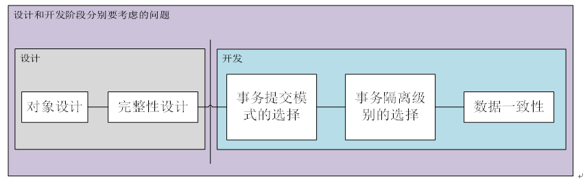

# 数据库-mysql

# MySQL 索引 #

---

1.索引的实现：B+树－－－为啥选择了B+树？？

（1）B树的性质

1、根结点的儿子数为[2, M]；

2、任意非叶子结点的儿子数为[M/2, M]；

3、非叶子结点的关键字：K[1], K[2], …, K[M-1]；且K[i] < K[i+1]；

4、非叶子结点的指针：P[1], P[2], …, P[M]；其中P[1]指向关键字小于K[1]的子树，P[M]指向关键字大于K[M-1]的子树，其它P[i]指向关键字属于(K[i-     1], K[i])的子树；

5、所有叶子结点位于同一层；

（2）B+树的性质(下面提到的都是和B树不相同的性质)

1、非叶子节点的子树指针与关键字个数相同；

2、非叶子节点的子树指针p[i],指向关键字值属于[k[i],k[i+1]]的子树.(B树是开区间,也就是说B树不允许关键字重复,B+树允许重复)；

3、**为所有叶子节点增加一个链指针；**

4、**所有关键字都在叶子节点出现(稠密索引). (且链表中的关键字恰好是有序的)；**

5、**非叶子节点相当于是叶子节点的索引(稀疏索引),叶子节点相当于是存储(关键字)数据的数据层；**

6、更适合于文件系统；

1. MySQL选择B+树，（和avl，R-B Tree相比较）主要为了减少磁盘IO，因为cpu的速度远大于IO速度，磁盘IO是性能瓶颈。数据库系统的设计者巧妙利用了磁盘预读原理，将一个节点的大小设为等于一个页，这样每个节点只需要一次I/O就可以完全载入。为了达到这个目的，在实际实现B-Tree还需要使用如下技巧：每次新建节点时，直接申请一个页的空间，这样就保证一个节点物理上也存储在一个页里，加之计算机存储分配都是按页对齐的，就实现了一个node只需一次I/O。

2. 相对于B数而言，B+树的存储密度更大，因为内部节点没有指向关键字的指针，能存储更多的索引，当把同一内部节点的关键字们放在同一盘块中，一次也能读入更多数据，

3. 相较于B树，更适合范围查询，因为，B+树的关键字都存在叶子结点，方便遍历，而对于B树想要遍历，需要类似中序遍历的方法，效率低。

总结：B树相对与平衡二叉树，解决了IO性能问题，减少了IO次数，但是没有解决遍历效率低下的问题，B+树解决了，而数据库中范围查询（扫库遍历）非常常见，因此最终选择了B+树

---

B-Tree索引

对于InnoDb 存储引擎的B-tree索引，会按一下步骤通过索引找到行数据

* 如果使用了聚簇索引(主键)，则叶子节点上就包含行数据，可直接返回

* 如果使用了非聚簇索引(普通索引),则在叶子节点存了主键，再根据主键查询一次上面 的聚簇索引，最后返回数据

对于MyISAM 存储引擎的B-tree索引，会按一下步骤通过索引找到行数据

* 在MyISAM 的索引树的叶子节点上除了索引值之外即没存储主键，也没存储行数据，而是存了指向行数据的指针，根据这个指针在从表文件查询数据。

---

Hash索引

哈希索引是基于哈希表来实现的，只有精确匹配所有的索引列才能生效。 也就是说假设有个hash索引 key (col1,col2) 那么每次只有 col1和col2两个字段都用才能够生效。因为生成hash索引的时候是根据一个hash函数对所有的索引列取hash值来实现的。

1. 第一步，计算出hash值，hash(张三) = 1287

2. 第二步，定位行号，比如key=1287 对应的行号为3

3. 第三步，找到指定行并且比较name列值是否为张三做个校验

---

应用层面常见索引：

主键索引：一张表只能有一个主键索引，（通常以表id设置为主键索引） primary key(`uid`)

唯一索引： 创建唯一索引的目的不是为了提高访问速度，而只是为了避免数据出现重复。唯一索引可以有多个但索引列的值必须唯一，索引列的值允许有空值。如果能确定某个数据列将只包含彼此各不相同的值，在为这个数据列创建索引的时候就应该使用关键字UNIQUE： unique key(`name`)

单列索引：以某一个字段为索引 ： key(`name`)

联合索引：以两个或两个以上字段组成索引，使用时要注意最左匹配原则 key(`name`,`uid`)

---

创建和删除索引的方法：

1.建表时指定，如上面的几个，

2.建表后创建，

2.1creat Index on 表名，列名。 普通索引或UNIQUE索引。

2.2 ALTER TABLE用来创建普通索引、UNIQUE索引或PRIMARY KEY索引。

3. 可利用ALTER TABLE或DROP INDEX语句来删除索引。

---

查看索引： show index from tablename；  show keys from tablename;

查看SQL 语句对索引的使用情况：（查询SQL的查询执行计划QEP）在select语句前加上explain 即可。

---

---

数据库开发

从开发者的角度来看主要是从事务的角度来进行开发。事务要满足ACID特性，对于事务的原子性，需要关注的是事务的提交模式；事务的隔离性，需要考虑的是数据库隔离级别的选择；对于事务的持久性，主要是由数据库的事务日志来保证的，与开发者无关；事务的一致性由数据库（涉及事务的原子性）、设计人员（涉及完整性约束）和开发人员（SQL程序的正确性）来保证，对于开发者，要关注的是数据完整性和业务逻辑约束的编码。其中事务的一致性状态与用户开发相关的就是数据一致性。

　　综上所述，在开发阶段，数据库开发人员要考虑的问题主要包括数据库提交模式的选择，数据库隔离级别的选择和数据一致性的保证。

正确的事务要求必须具有ACID特性：（由数据库、设计人员和开发人员来保证）

1、事务的原子性Atomicity：指事务内部的SQL操作要么全部成功，要么全部失败。原子性是由事务日志保证的。开发人员需要关注事务的开始、事务的结束和事务的提交模式

    2、事务的一致性Consistency：事务的一致性指的是在一个事务执行之前和执行之后数据库 都必须处于一致性状态。即事务执行的结果必须使数据库从一个一致性的状态转变到另一个一致性的状态。事务的一致性是由数据库（原子性）、设计人员（完整性约束）和开发人员（SQL程序）来保证的。

  3、事务的隔离性Isolation：指该会话事务内部的SLQ操作及操作的数据库对象对并发的其它会话事务是隔离的。事务的隔离级别是由数据库提供的  隐式锁、多版本。使用哪类隔离级别是由开发人员来选择的。

4、事务持久性Durability：指事务一旦提交，对数据库的改变是永久的。持久性是由事务日志保证的，与开发人员无关。

事务的提交模式

提交数据有三种类型：显式提交、隐式提交及自动提交。下面分别说明这三种类型。

1、显式提交：用COMMIT命令直接完成的提交为显式提交。其格式为：SQL>COMMIT；

2、隐式提交：用SQL命令间接完成的提交为隐式提交。这些命令是：ALTER，AUDIT，COMMENT，CONNECT，CREATE，DISCONNECT，DROP，EXIT，GRANT，NOAUDIT，QUIT，REVOKE，RENAME。

3、自动提交：若把AUTOCOMMIT设置为ON，则在插入、修改、删除语句执行后，系统将自动进行提交，这就是自动提交。其格式为：SQL>SET AUTOCOMMIT ON；

脏读、不可重复读、幻读（读的不一致性）丢失修改（写的不一致性）

脏读：一个事务读取另一个事务尚未提交的数据

不可重复读：一个事务两次读到的数据不一样，因为在事务执行期间有另一个事务对数据进行了修改。

幻读：一个事务两次读取的记录数不一样，因为在事务执行期间，另一个事务对表进行了插入删除。

不可重复读和幻读有点类似，不可重复读主要是修改，幻读主要涉及的是插入删除表中的记录。

丢失修改：在一个事务A执行期间，另一个事务B读取并写入数据，然后前一个事务A提交后将事务B的提交覆盖，称作丢失修改。

隔离级别

Oracle默认隔离级别是RC　

MySQL默认的隔离级别是RR　Repeatable　read。

多用户并发控制

多用户并发控制总原则：在不发生并发冲突(或解决并发冲突)的前提下，尽量减少阻塞，尽量避免死锁，加大系统的并发性。 

解决并发冲突的措施包括两个方面，在服务器端解决并发冲突有事务的隔离级别、锁（隐式锁、显式锁）和多版本三个方面。在客户端解决并发冲突的方法是记录原始行。

数据库乐观锁和悲观锁

悲观锁

悲观锁（Pessimistic Lock），顾名思义，就是很悲观，每次去拿数据的时候都认为别人会修改，所以每次在拿数据的时候都会上锁，这样别人想拿这个数据就会block直到它拿到锁。悲观锁：假定会发生并发冲突，屏蔽一切可能违反数据完整性的操作。

Java synchronized 就属于悲观锁的一种实现，每次线程要修改数据时都先获得锁，保证同一时刻只有一个线程能操作数据，其他线程则会被block。

乐观锁

乐观锁（Optimistic Lock），顾名思义，就是很乐观，每次去拿数据的时候都认为别人不会修改，所以不会上锁，但是在提交更新的时候会判断一下在此期间别人有没有去更新这个数据。乐观锁适用于读多写少的应用场景，这样可以提高吞吐量。乐观锁：假设不会发生并发冲突，只在提交操作时检查是否违反数据完整性。

乐观锁一般来说有以下2种方式：

使用数据版本（Version）记录机制实现，这是乐观锁最常用的一种实现方式。何谓数据版本？即为数据增加一个版本标识，一般是通过为数据库表增加一个数字类型的 “version” 字段来实现。当读取数据时，将version字段的值一同读出，数据每更新一次，对此version值加一。当我们提交更新的时候，判断数据库表对应记录的当前版本信息与第一次取出来的version值进行比对，如果数据库表当前版本号与第一次取出来的version值相等，则予以更新，否则认为是过期数据。

使用时间戳（timestamp）。乐观锁定的第二种实现方式和第一种差不多，同样是在需要乐观锁控制的table中增加一个字段，名称无所谓，字段类型使用时间戳（timestamp）, 和上面的version类似，也是在更新提交的时候检查当前数据库中数据的时间戳和自己更新前取到的时间戳进行对比，如果一致则OK，否则就是版本冲突。

---

mysql的主从复制

[https://www.cnblogs.com/kylinlin/p/5258719.html](https://www.cnblogs.com/kylinlin/p/5258719.html)

---

---

Statement 和 PreparedStatement

1. 效率。 PreparedStatement是预编译的,对于批量处理可以大大提高效率. 也叫JDBC存储过程。 使用 Statement 对象。在对数据库只执行一次性存取的时侯，用 Statement 对象进行处理。PreparedStatement 对象的开销比Statement大，对于一次性操作并不会带来额外的好处。

2. 便捷和可读性。 带有不同参数的同一SQL语句被多次执行的时候，不必重复SQL语句的句法，而只需更改其中变量的值，便可重新执行SQL语句。 这样在随后的运行中可以节省时间并增加代码的可读性。

3. 安全性。传递给PreparedStatement对象的参数可以被强制进行类型转换，使开发人员可以确保在插入或查询数据时与底层的数据库格式匹配。 减少SQL的编译错误，减少SQL注射攻击的可能性。

---

XML 

略……

---

UML

略……

---

场景题

---

数据库索引

主流的RDBMS都是把平衡树--B+树当做数据表默认的索引数据结构的。

索引能让数据库查询速度上升，使写入速度下降，

因为平衡树这个结构必须一直维持在一个正确的状态， 增删改数据都会改变平衡树各节点中的索引数据内容，破坏树结构， 因此，在每次数据改变时， DBMS必须去重新梳理树（索引）的结构以确保它的正确，这会带来不小的性能开销，也就是为什么索引会给查询以外的操作带来副作用的原因。

主键上自动有聚集索引，除此之外，非聚集索引， 也就是我们平时经常提起和使用的常规索引。

非聚集索引和聚集索引一样，同样是采用平衡树作为索引的数据结构。索引树结构中各节点的值来自于表中的索引字段，假如给user表的name字段加上索引，那么索引就是由name字段中的值构成，在数据改变时， DBMS需要一直维护索引结构的正确性。如果给表中多个字段加上索引 ， 那么就会出现多个独立的索引结构，每个索引（非聚集索引）互相之间不存在关联。每次给字段建一个新索引， 字段中的数据就会被复制一份出来， 用于生成索引。 因此， 给表添加索引，会增加表的体积， 占用磁盘存储空间。

非聚集索引和聚集索引的区别在于， 通过聚集索引可以查到需要查找的数据， 而通过非聚集索引可以查到记录对应的主键值 ， 再使用主键的值通过聚集索引查找到需要的数据，如下图  不管以任何方式查询表， 最终都会利用主键通过聚集索引来定位到数据， 聚集索引（主键）是通往真实数据所在的唯一路径。

---

#####数据库索引#####

索引数据类型的选择：

(1)越小的数据类型通常更好：越小的数据类型通常在磁盘、内存和CPU缓存中都需要更少的空间，处理起来更快。

(2)简单的数据类型更好：整型数据比起字符，处理开销更小，因为字符串的比较更复杂。在MySQL中，应该用内置的日期和时间数据类型，而不是用字符串来存储时间；以及用整型数据类型存储IP地址。

(3)尽量避免NULL：应该指定列为NOT NULL，除非你想存储NULL。在MySQL中，含有空值的列很难进行查询优化，因为它们使得索引、索引的统计信息以及比较运算更加复杂。你应该用0、一个特殊的值或者一个空串代替空值。

选择标识符

(1) 整型：通常是作为标识符的最好选择，因为可以更快的处理，而且可以设置为AUTO_INCREMENT。

(2) 字符串：尽量避免使用字符串作为标识符，它们消耗更好的空间，处理起来也较慢。而且，通常来说，字符串都是随机的，所以它们在索引中的位置也是随机的，这会导致页面分裂、随机访问磁盘，聚簇索引分裂（对于使用聚簇索引的存储引擎）。

对多列进行索引(组合索引)，列的顺序非常重要

MySQL仅能对索引最左边的前缀进行有效的查找。例如：假设存在组合索引c1c2，查询语句select * from t1 where c1=1 and c2=2能够使用该索引。查询语句select * from t1 where c1=1也能够使用该索引。但是，查询语句select * from t1 where c2=2不能够使用该索引，因为没有组合索引的引导列，即，要想使用c2列进行查找，必需出现c1等于某值。

聚簇索引

聚簇索引保证关键字的值相近的元组存储的物理位置也相同。且一个表只能有一个聚簇索引 只有solidDB和InnoDB支持聚簇索引。

---

SQL

条件查询：where子句 后面可以跟 条件表达式，与或非 and  or  not （not不常用，应为等价于<>）

投影查询：只查询某些列，select  列1 as 别名，列2 as 别名 from ……。

排序： SELECT id, name, gender, score FROM students ORDER BY score DESC, gender;先对score降序排列，相同在对gender升序。默认升序

分页查询： limit n条记录 offset  偏移量；（若偏移量等于3，则本次从4开始）

若最后一页只有1条记录，因此最终结果集按实际数量1显示。

LIMIT 3表示的意思是“最多3条记录”。OFFSET超过了查询的最大数量并不会报错，而是得到一个空的结果集。

OFFSET是可选的，如果只写LIMIT 15，那么相当于LIMIT 15 OFFSET 0。

在MySQL中，LIMIT 15 OFFSET 30还可以简写成LIMIT 30, 15。

使用LIMIT <M> OFFSET <N>分页时，随着N越来越大，查询效率也会越来越低。

聚合查询：SELECT COUNT(*) as numbers FROM students;  

如果聚合查询的WHERE条件没有匹配到任何行，COUNT()会返回0，而SUM()、AVG()、MAX()和MIN()会返回NULL

|SUM
     |计算某一列的合计值，该列必须为数值类型
|
|AVG
     |计算某一列的平均值，该列必须为数值类型
|
|MAX
     |计算某一列的最大值
                    |
|MIN
     |计算某一列的最小值
                    |
|group by
|按某一列或多列分组查询
                |

分组 SELECT class_id, COUNT(*) num FROM students GROUP BY class_id;

请使用一条SELECT查询查出每个班级男生和女生的平均分：

select class_id, gender, avg(score)as avgscore from students group by gender,class_id;

多表查询： SELECT * FROM <表1> <表2>。 多表查询 又称笛卡尔查询， 结果集是目标表的行数乘积 。要使用表名.列名这样的方式来引用列和设置别名，这样就避免了结果集的列名重复问题。还允许给表设置一个别名，让我们在投影查询中引用起来稍微简洁一点：

连接查询：

INNER JOIN查询的写法是：

1. 先确定主表，仍然使用FROM <表1>的语法；

2. 再确定需要连接的表，使用INNER JOIN <表2>的语法；

3. 然后确定连接条件，使用ON <条件...>，这里的条件是s.class_id = c.id，表示students表的class_id列与classes表的id列相同的行需要连接；

4. 可选：加上WHERE子句、ORDER BY等子句。

使用别名不是必须的，但可以更好地简化查询语句。

INNER JOIN只返回同时存在于两张表的行数据， RIGHT OUTER JOIN返回右表都存在的行， LEFT OUTER JOIN则返回左表都存在的行。

关系数据库的基本操作就是增删改查，即CRUD：Create、Retrieve、Update、Delete。其中，对于查询，我们已经详细讲述了SELECT语句的详细用法。

而对于增、删、改，对应的SQL语句分别是：

* INSERT：插入新记录；

* UPDATE：更新已有记录；

* DELETE：删除已有记录。

INSERT ：

INSERT INTO students (class_id, name, gender, score) VALUES

  (1, '大宝', 'M', 87),

  (2, '二宝', 'M', 81);

字段顺序不必和数据库表的字段顺序一致，但值的顺序必须和字段顺序一致。

UPDATE:

UPDATE <表名> SET 字段1=值1, 字段2=值2, ... WHERE ...;

SET score=score+10就是给当前行的score字段的值加上了10。

如果WHERE条件没有匹配到任何记录，UPDATE语句不会报错，也不会有任何记录被更新。

DELETE

DELETE FROM <表名> WHERE ...;

WHERE条件没有匹配到任何记录，DELETE语句不会报错，也不会有任何记录被删除。

要查看一个表的结构，使用命令：mysql> DESC students;

命令查看创建表的SQL语句：SHOW CREATE TABLE students;

修改表就比较复杂。如果要给students表新增一列birth，使用：

ALTER TABLE students ADD COLUMN birth VARCHAR(10) NOT NULL;

要修改birth列，例如把列名改为birthday，类型改为VARCHAR(20)：

ALTER TABLE students CHANGE COLUMN birth birthday VARCHAR(20) NOT NULL;

要删除列，使用：

ALTER TABLE students DROP COLUMN birthday;

---

实用sql

插入或替换

如果我们希望插入一条新记录（INSERT），但如果记录已经存在，就先删除原记录，再插入新记录。此时，可以使用REPLACE语句，这样就不必先查询，再决定是否先删除再插入：

REPLACE INTO students (id, class_id, name, gender, score) VALUES (1, 1, '小明', 'F', 99);

若id=1的记录不存在，REPLACE语句将插入新记录，否则，当前id=1的记录将被删除，然后再插入新记录。

插入或更新

如果我们希望插入一条新记录（INSERT），但如果记录已经存在，就更新该记录，此时，可以使用INSERT INTO ... ON DUPLICATE KEY UPDATE ...语句：

INSERT INTO students (id, class_id, name, gender, score) VALUES (1, 1, '小明', 'F', 99) ON DUPLICATE KEY UPDATE name='小明', gender='F', score=99;

若id=1的记录不存在，INSERT语句将插入新记录，否则，当前id=1的记录将被更新，更新的字段由UPDATE指定。

插入或忽略

如果我们希望插入一条新记录（INSERT），但如果记录已经存在，就啥事也不干直接忽略，此时，可以使用INSERT IGNORE INTO ...语句：

INSERT IGNORE INTO students (id, class_id, name, gender, score) VALUES (1, 1, '小明', 'F', 99);

若id=1的记录不存在，INSERT语句将插入新记录，否则，不执行任何操作。

快照

如果想要对一个表进行快照，即复制一份当前表的数据到一个新表，可以结合CREATE TABLE和SELECT：

-- 对class_id=1的记录进行快照，并存储为新表students_of_class1:

CREATE TABLE students_of_class1 SELECT * FROM students WHERE class_id=1;

新创建的表结构和SELECT使用的表结构完全一致。

写入查询结果集

如果查询结果集需要写入到表中，可以结合INSERT和SELECT，将SELECT语句的结果集直接插入到指定表中。例如，创建一个统计成绩的表statistics，记录各班的平均成绩：

CREATE TABLE statistics (

id BIGINT NOT NULL AUTO_INCREMENT,

class_id BIGINT NOT NULL,

average DOUBLE NOT NULL,

PRIMARY KEY (id)

);

然后，我们就可以用一条语句写入各班的平均成绩：

INSERT INTO statistics (class_id, average) SELECT class_id, AVG(score) FROM students GROUP BY class_id;
